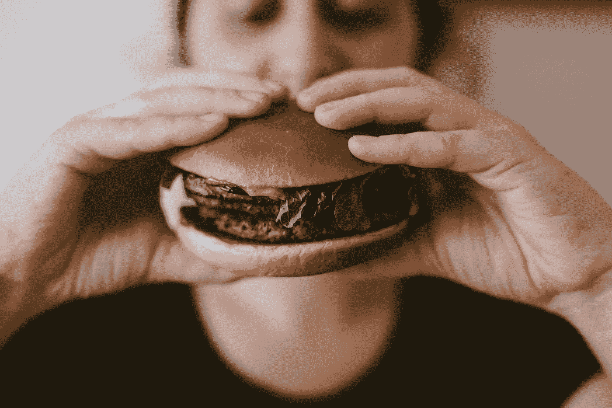
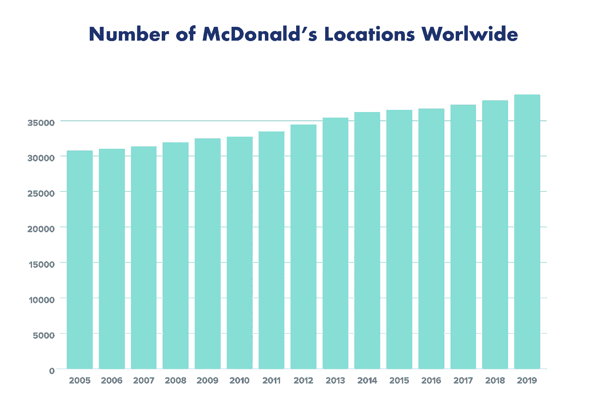

# 这就是为什么你在冰岛找不到麦当劳

> 原文：<https://medium.datadriveninvestor.com/this-is-why-you-cant-find-mcdonald-s-in-iceland-1429b8105863?source=collection_archive---------1----------------------->

## 昂贵的洋葱是部分原因。

Photo by [Szabo Viktor](https://unsplash.com/@vmxhu?utm_source=medium&utm_medium=referral) on [Unsplash](https://unsplash.com?utm_source=medium&utm_medium=referral)

冰岛是一个富有戏剧性的国家，有维京人的遗产、富裕的经济和生动的风景。 [*《权力的游戏》中的*](https://gameofthrones.fandom.com/wiki/Gregor_Clegane) 山就诞生在这里，在冰岛峡湾、火山、间歇泉、温泉、熔岩地、大块冰川之间。

人们比美国人平均富裕 17%,拥有现代世界的所有福利。但是你[在岛上找不到一家麦当劳](https://grapevine.is/mag/articles/2019/03/06/broken-chains-the-struggles-of-foreign-fast-food-in-iceland/)。

冰岛人不介意快餐，因为他们每隔一天就出去吃一次。但麦当劳就是想不通如何在峡湾、火山、温泉中生存。

# 麦当劳

这家快餐连锁店在全球拥有超过 38000 家餐厅，每天为 6900 万人提供服务。麦当劳是世界上最知名的餐厅品牌。巨无霸、快乐套餐和特制长薯条是快餐业的标志。

麦当劳是欧洲的一种文化现象。在你的城市里，拥有金色拱门不仅仅意味着巨无霸和招牌薯条。莫斯科第一家麦当劳的入口处自豪地展示着开业当天的照片。这家餐馆是全球化的象征。短语[*mcdonaldisation*](http://vefir.hi.is/icelandicidentityincrisis/files/2013/11/Iceland-Rejected-by-McDonalds-Desire-and-Anxieties-in-a-Global-Crisis.pdf)*也在流传*。**

*那是 1990 年，5000 名俄罗斯人涌入尝试美国快餐的味道，排起了一英里长的队伍。等待时间是六个小时。东德跟随同样的脚步。冰岛也不例外。第一家麦当劳于 1993 年在类似的场景中打开了 T2 的旋转门。人们利用假期排队等候，点汉堡和薯条。*

* [## 您的企业今天需要虚拟现实营销的 3 个原因|数据驱动的投资者

### 新冠肺炎是并将继续是一个前所未有的全球性事件，将医疗保健系统和全球经济带到…

www.datadriveninvestor.com](https://www.datadriveninvestor.com/2020/04/09/3-reasons-why-your-business-needs-vr-marketing-today/) 

今天，麦当劳不再是全球化和自由的象征。特许经营只是另一家餐馆，对它所服务的社区来说没有什么特别的。食物质量很成问题，新的[一代不赞成在特许经营店用餐。千禧一代不喜欢它。](https://www.google.com/url?sa=t&rct=j&q=&esrc=s&source=web&cd=&ved=2ahUKEwi1kMea777qAhWKa8AKHVUQDCwQFjABegQIAxAB&url=https%3A%2F%2Fmorningconsult.com%2F2017%2F11%2F20%2Fmcdonalds-community-impact-millennials-arent-loving%2F&usg=AOvVaw2WP2lG6K_KiZoVHqzgEH3a)

麦当劳正试图摆脱油腻堵塞动脉的垃圾餐馆的形象，经常不得不证明他们真的在卖真正的食物。人们并不完全相信牛肉馅饼和鸡块来自真正的肉。

健康益处有待讨论，但这不是麦当劳离开冰岛的主要原因。

Chart by [Author](https://medium.com/@ToniKoraza)* 

# *麦基兰德*

*冰岛是地球上一个特殊的地方[有 30 万居民](https://www.google.com/url?sa=t&rct=j&q=&esrc=s&source=web&cd=&ved=2ahUKEwit0qCE8L7qAhVOe8AKHXeLCi4QFjAMegQIAxAB&url=https%3A%2F%2Fen.wikipedia.org%2Fwiki%2FIceland&usg=AOvVaw0c9Tpb_yXANCxNwBfpErUk)，白色的夜晚，极地的灯光，以及不同的全球影响力。不仅没有**麦当劳**，也没有星巴克，没有赌场，没有军队。*

*然而，生活质量、物质财富和总体[幸福指数](https://www.google.com/url?sa=t&rct=j&q=&esrc=s&source=web&cd=&ved=2ahUKEwju9Lyf8L7qAhXUh1wKHfCdCS0QFjABegQIChAE&url=https%3A%2F%2Fwww.theglobaleconomy.com%2FIceland%2Fhappiness%2F&usg=AOvVaw14ney7VG_8wH_UedqdThaL)都是世界上最高的。冰岛的失业率低于 4 %( T7 ),如果你玩过瘟疫游戏(T8 ),你会发现即使是流行病也很难破坏这个岛屿。*

*麦当劳于 1993 年首次亮相，几乎每一份当地报纸都刊登了一篇关于这个全球品牌的报道。15 年后，麦当劳再也无法控制价格了。*

*2008 年的金融危机对冰岛的打击尤为严重。这个国家经历了外国企业和国际银行的大量流失。一半的固定收入一夜之间化为乌有。*

*地缘政治形势使得冰岛对任何需要进口产品的企业都极为不利。麦当劳在洋葱等简单原料上苦苦挣扎，2 磅的袋子价格几乎和昂贵的麦芽威士忌一样。*

*最后的决定围绕着巨无霸的价格。冰岛人仍然喜欢特许经营，但没有人愿意为快餐支付过高的价格。巨无霸的价格达到 6.36 美元，成为 2009 年[最贵的巨无霸。今天，瑞士以 6.82 美元的巨无霸占据了宝座。](https://www.google.com/url?sa=t&rct=j&q=&esrc=s&source=web&cd=&ved=2ahUKEwjLuI6B8r7qAhXPasAKHZG_By8QFjAAegQIAhAB&url=https%3A%2F%2Fwww.theguardian.com%2Fworld%2F2009%2Foct%2F27%2Fmcdonalds-to-quit-iceland&usg=AOvVaw2xIpfz1vuc_dYRj7RnT944)*

*没钱的人和没洋葱的麦当劳得出结论，做生意不再是一个选择。麦当劳发出了撤退，特许经营在同一年关闭。12 年后的今天，麦当劳甚至不打算回去。*

*11 年后，冰岛出售的最后一个麦当劳芝士汉堡仍然存活并保存着。如果你去过冰岛南部，你可以用它自拍。*

*曾经供应招牌薯条和巨无霸的商店现在被称为[地铁](https://www.metroborgari.is/)。这个品牌正在抄袭麦当劳的名气，你仍然需要花很多钱去那里吃汉堡。*

*Last McDonald’s Cheeseburger in Iceland 11 years later*

# *综述*

*冰岛是最奇特的旅游目的地之一，每年吸引数十亿美元。麦当劳已经离开了这个国家，没有回来的计划。但是你仍然可以享受各种快餐选择。*

*达美乐、赛百味、肯德基在冰岛蒸蒸日上，即使价格能让你眩晕。普通的快餐比纽约、伦敦或北京要贵。*

***访问专家视图—** [**订阅 DDI 英特尔**](https://datadriveninvestor.com/ddi-intel)*