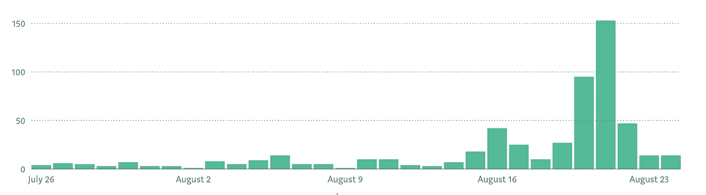

# 这就是为什么你作为一个新作家想要媒体发行

> 原文：<https://medium.datadriveninvestor.com/this-is-why-you-want-medium-distribution-as-a-new-writer-fd2e316c42b3?source=collection_archive---------18----------------------->

## 以及为什么一致的文章写作是至关重要的

A graph of my stats on Medium when one of my articles got distributed.

在此之前，我甚至没有意识到分发是 Medium 的一个功能。我只是认为最受欢迎或最受欢迎的文章会上升到顶部。虽然受欢迎程度肯定是一个因素，因为文章被分享得越来越多，但这只是如何让自己作为一个新作家在媒体上受到关注的一小部分。

我开始越来越坚持在 medium 上写作，来表达我的想法，创作对其他人有用的内容。我并没有打算一定要创建一个博客，但它已经改变并成型为我现在想要提炼的东西，并为我的读者提供价值。

所以，我想向你们展示我个人在分发一篇文章时的经历。

## 让我们从头开始

8 月 16 日，我很久以来第一次发表了一篇文章。

我收到了很多请求，询问我在 UX 训练营的经历，以及我在 T2 是如何找到工作的。我决定不写电子书，而是在媒体上写个人文章，让想看的人更容易理解和阅读。

 [## 在家工作如何提高我的工作效率|数据驱动型投资者

### 在家工作确实激发了我最大的潜能，让我更有效率。因为在家工作给了我…

www.datadriveninvestor.com](https://www.datadriveninvestor.com/2020/07/29/how-working-from-home-increased-my-productivity/) 

在我写第一篇文章的前几天，你可以从下面的图表中看到，虽然我没有获得零浏览量，但我的流量很少。我没有营销我的文章，也没有在社交媒体上分享它们。

A graph of my stats on Medium when one of my articles got distributed.

当我在 8 月 16 日完成了我的第一篇文章并发表后，我的博客访问量明显上升，在接下来的 3 天里浏览量逐渐减少。作为背景，这篇文章没有分发，但被一个出版物接受。

**第一个收获:**你发布新文章的日子有更高的浏览量。

**第二个收获:**提交给高流量出版物的文章会获得更高的浏览量。

## 发行与出版相比如何

8 月 19 日，我提交了我的第二篇文章，并发表到 UX 集体。这篇文章被分为两类:UX 和设计。

A graph of my stats on Medium when one of my articles got distributed

我的观点暴涨。

我发表的唯一一篇文章在一天内获得了近 50 次浏览，而一篇**分发的文章在高峰时一天内获得了 150 次以上的浏览，平均 3 天大约 300 次浏览。**

如果没有分发，我会收到相同数量的视图吗？我不得不做更多的测试，但是我的假设是这些视图中有很大一部分与分布在两个类别标签上直接相关。

此外，由于流量的增加，我的作品在社交媒体上被分享得更多了，阅读时间增加了，并获得了更多的关注者，否则我不会在他们面前获得这些关注者。

**第三点:**分发可以对谁看到你的作品产生很大影响，从而间接增加关注者和阅读时间。

## 如何获得分发

据我所知，没有分配的公式。

关键是写出有价值的内容，媒体的管理者认为应该在他们的平台上分享。

我要说的是，如果你倾听你的观众的反馈，并写下满足他们需求的内容，你的内容对一群人来说将是有价值的。你制作的对人们有益的内容越多，你就越有可能像病毒一样传播。

感谢阅读。

别忘了[关注我](https://medium.com/@adamjklein92)获取更多文章和内容！

**访问专家视图—** [**订阅 DDI 英特尔**](https://datadriveninvestor.com/ddi-intel)