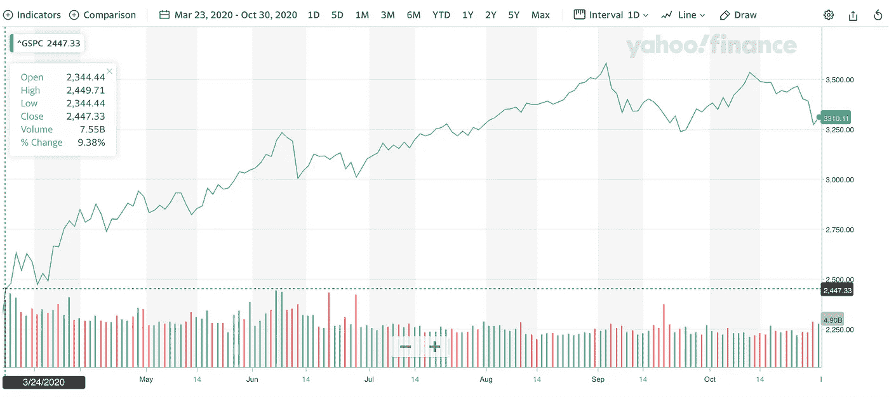
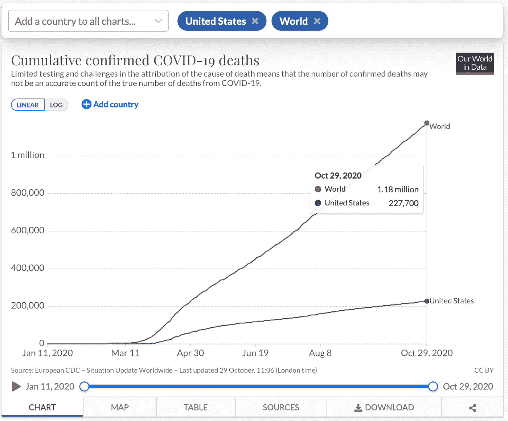

# 这个市场被操纵了

> 原文：<https://medium.datadriveninvestor.com/this-markets-being-manipulated-8c5c0d8db7f4?source=collection_archive---------1----------------------->

## 展示了这场持续 7 个月的疯狂反弹背后的原因

S&P500 stock index since March 23, 2020\. The author is using this website image under the fair use doctrine.

# **1。** **人们和经济正在死于冠状病毒，但市场却在上涨……**

如上图所示，自今年 3 月下旬以来，股市一直在上涨。

好消息，对吧？

所以总统希望每个人都知道:

 [## 道琼斯指数上涨 250 点，特朗普吹捧股票是“所有股票中最大的领先指标”

### 在科技股引领的午间反弹引发总统的推特狂欢后，周一股市小幅收高

www.forbes.com](https://www.forbes.com/sites/jonathanponciano/2020/10/12/tech-stocks-rise-earnings-season/?sh=309616ad25d3) 

但是总统和顺从的股票市场希望你忽略一些事情。

美国冠状病毒每天的新病例像股票市场一样加速增长，打破记录，领先世界:

Coronavirus daily new cases since March, 2020\. The author is using this website image under the fair use doctrine.

尽管病例和死亡人数激增，但总统对冠状病毒无所作为。结果，经济遭受了巨大的打击。这意味着企业收益大幅下降。和正常运作的市场交易中的股票市场，根据公司的收益和未来的预期收益对公司进行估值。

只要冠状病毒没有受到基于科学的健康政策的积极控制，如口罩要求和隔离检疫协议，这些收益将保持低迷。

由于本届政府没有采取任何基于科学的疫情控制措施，股市不应该接近这些高位。应该比我们现在的水平至少低 50%。

# **2。这里没什么可看的——看别处，看别处！…**

回想一下，今年 2 月和 3 月，由于冠状病毒疫情的爆发，市场出现暴跌。特朗普专注于基于科学的病毒控制吗？

不。特朗普继续忽视科学和病毒。相反，他对市场的暴跌感到愤怒，并一意孤行地操纵股市——并尽一切努力让它上涨:

 [## 特朗普对鲍威尔感到愤怒，希望美联储采取更多措施阻止股票下跌:报道

### 随着美国股市暴跌，唐纳德·特朗普总统本周再次攻击美联储董事长杰罗姆·鲍威尔

www.marketwatch.com](https://www.marketwatch.com/story/trump-furious-with-powell-wants-fed-to-do-more-to-arrest-stock-market-decline-report-2020-03-12)  [## 据报道，特朗普对股市因冠状病毒担忧而暴跌感到愤怒

### 美国消费者新闻与商业频道 2020 年 2 月 26 日皮帕·斯蒂文斯据报道，唐纳德·川普总统对股票暴跌感到愤怒，认为…

www.msn.com](https://www.msn.com/en-us/money/markets/trump-reportedly-furious-about-stock-market-plunging-on-coronavirus-fears/ar-BB10o1pg)  [## 当冠状病毒导致股市暴跌时，特朗普崩溃了

### 星期一早上，股票市场急剧下跌，预示着自…以来最大的经济冲击

www.gq.com](https://www.gq.com/story/coronavirus-stock-market) 

特朗普欢迎俄罗斯人和普京干涉他的选举。共和党参议院驳回众议院的弹劾，只是给这个罪犯壮胆，他甚至正确地表示，他可以站在时代广场中央开枪打人，他不会失去他的支持者。共和党参议院证实是他的哈巴狗。

 [## 唐纳德·特朗普可以“开枪打人而不失去选民”——CNN 政治

### 唐纳德·特朗普周六吹嘘说，即使他开枪打人，对他总统竞选的支持也不会下降

www.cnn.com](https://www.cnn.com/2016/01/23/politics/donald-trump-shoot-somebody-support/index.html) 

特朗普已经明确表示，他会做任何事情，不管是否违法，来窃取选举。按照他那爬行动物般的小脑袋的说法，衡量他表现的主要标准是股票市场。而不是美国人民的健康或随之而来的经济健康。股票市场。

股票市场是这位总统关于当选的理念，而且奇怪的是，是他的男子气概的象征。所以，当他看到市场的大幅下跌时，他疯狂地呼吁他的市场伟哥。

支撑低迷的旧市场的最佳方法是什么？你向市场注入大量现金。当你向市场增加现金时，你就降低了利率……这是量化宽松政策(QE ),由老布什发起，由奥巴马延续，目的是支持疲软的经济——但是宽松的 QE 货币的一个意想不到的后果是资产(包括股票)价格膨胀。

股价上涨是因为当你向经济中增加现金时，利率(货币的价格)会下降。当利率下降时，人们寻找其他地方赚取回报，自然的地方是股票市场和其他资产，除了现金以外的任何东西。

但是这位总统并没有试图拯救经济。一个充斥着每天不得不工作谋生的笨蛋的经济。他不关心普通人。不。这位总统迫切希望股市攀升，并向右转。因此，本届政府的任何利率放松都与资产通胀有关。不是关于经济和人民。

谁控制货币供应和利率？美联储。这是执行老布什和奥巴马 QE 政策的机构。谁掌管着美联储？杰罗姆·鲍威尔。谁任命杰罗姆·鲍威尔为美联储主席？我们非常明智地选出的总统“我可以在时代广场上开枪打人”。

有证据表明利率会降低吗？看看这个——银行间同业拆借利率:

US inter-bank lending rate since January, 2019\. The author is using this website image under the fair use doctrine.

注意到就在股票市场持续上涨的时候利率急剧下降了吗？

利率是美联储向市场注入资金的次级效应——有证据表明货币供应大幅增加吗？

M1 includes funds that are readily accessible for spending. The author is using this website image under the fair use doctrine.

M2 includes a broader set of financial assets held principally by households. The author is using this website image under the fair use doctrine.

注意到 2008-2009 年房地产衰退期间货币供应的微小增加了吗——以及一年左右之后的那次？这些是 QE 向市场注入大量现金，试图恢复人们的就业和经济的大规模回应。还记得共和党人对 QE 和充斥市场的现金发出的不满吗？你看到注入经济的现金有多少了吗？还有一些人为此制造的噪音？

现在看看特朗普和他的美联储哈巴狗杰罗姆·鲍威尔(Jerome Powell)在 2020 年向经济注入的现金量。看到那个拿着现金的年轻人了吗？这就是所谓的操纵。

因此，现在我们知道，本届政府通过增加货币供应，人为地抬高了股市，从而降低了利率，迫使市场参与者从现金投资转向股市。

在任何其他宇宙中，在任何其他现实中，市场操纵都是一种犯罪，犯罪者正在坐牢。

# **3。** **在川普调整股市的同时，还发生了什么……**

我们的人口不到世界人口的 5%,却有世界上近 20%的死亡和病例:

Total Coronavirus deaths in U.S. compared world as of October 2020\. The author is using this website image under the fair use doctrine.

在下一个图表中，用灰色竖线标记的是两次衰退，以及网络公司和房地产市场的崩溃。你会看到每一次失业都在飙升。房地产崩盘是美国自 20 世纪 30 年代大萧条以来经历的最痛苦的失业灾难。在那些认为房价永远不会下跌的人群的智慧所导致的崩溃中，有什么是撑杆跳高的呢？今天的失业是由疫情造成的，而由我们群众的智慧选出的总统的无能加剧了失业。

Civilian unemployment rate, 20-year chart. The author is using this website image under the fair use doctrine.

人群至少模糊地意识到了经济的增长，因为当经济衰退时，市场也会衰退(因为近期的未来回报会随着经济衰退)。当失业率像上图一样飙升时，你认为以国内生产总值衡量的经济会发生什么——主要是由像你我这样每天购买卫生纸、麦片和汽油的人驱动的。你猜对了——它就像一个镜像:

US GDP growth rate 25-year chart. The author is using this website image under the fair use doctrine.

但是股票投资者要求他们投资的公司增加收益。今年企业收益表现如何？

Five-year chart of corporate earnings. The author is using this website image under the fair use doctrine.

看到右边的悬崖了吗？显然，群众是不明智的。但他们也不傻。当他们意识到收入将持续下降时，他们会意识到自己是唯一的受害者。他们最终会放弃的。

股票市场将会崩溃。

请注意，这个市场正在被特朗普操纵，他的错觉是，市场现在应该上涨，这样他就可以连任，他已经尽其所能地膨胀市场。股票不应该接近这些水平。预先警告，小心谨慎。

祝你好运。

# 4.谢谢你…

感谢阅读，请分享。如果你喜欢这个，请看看这些:

 [## 暴风雨(或大动荡、激烈辩论)前的平静

### 对我们所处的政治和社会混乱局面的思考

medium.com](https://medium.com/science-and-philosophy/the-calm-before-the-storm-dbc49151aaa)  [## 杀死或使我们更强大的贷款

### 对贷款的恐惧的反思，以及被那些欠你一两三英镑……肉的人追赶

medium.com](https://medium.com/datadriveninvestor/loans-that-kill-or-make-us-stronger-5ec371b7799e)  [## 这个市场是 F@#&*d！！！出口在哪里？？？

### 对市场和投资更冷静、更全面的思考

medium.com](https://medium.com/datadriveninvestor/this-market-is-f-d-wheres-the-exit-46c551e1b935)  [## 这个市场要完蛋了！！！我现在应该投资吗？

### 对市场和投资的思考

medium.com](https://medium.com/datadriveninvestor/this-markets-gonna-die-should-i-invest-now-9084614439c0)