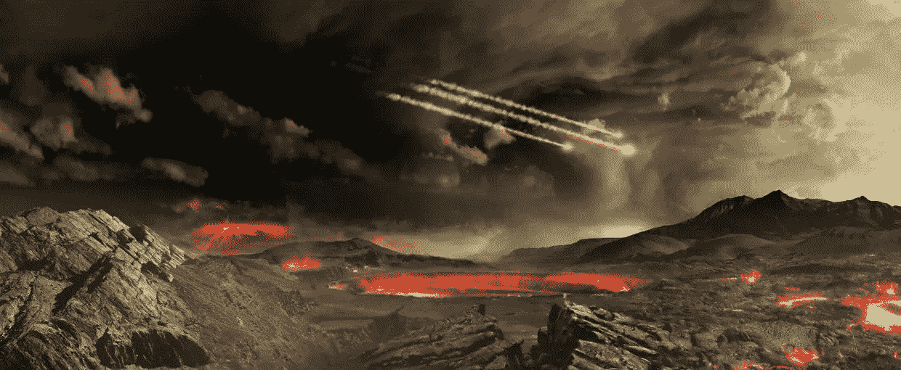
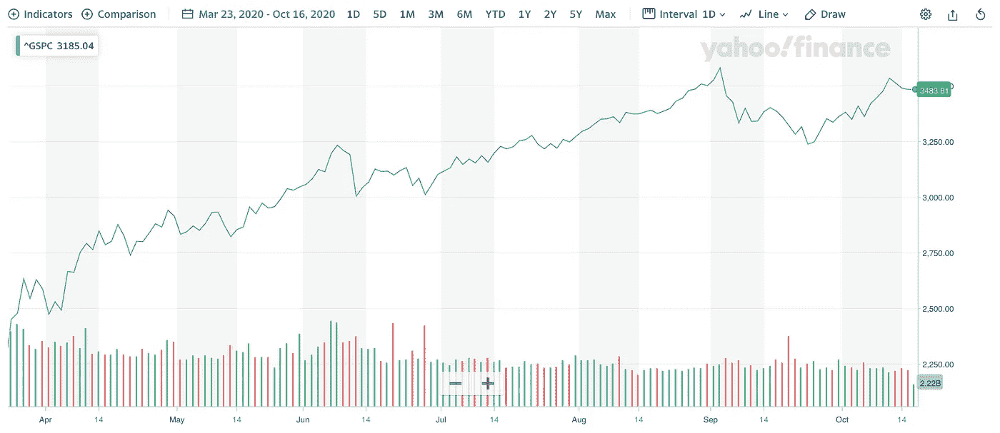
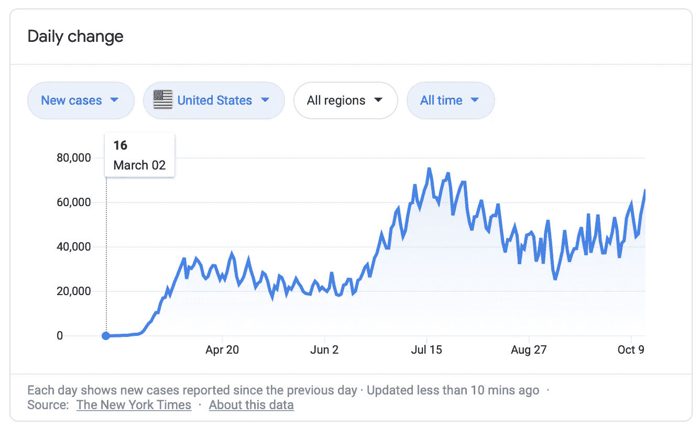
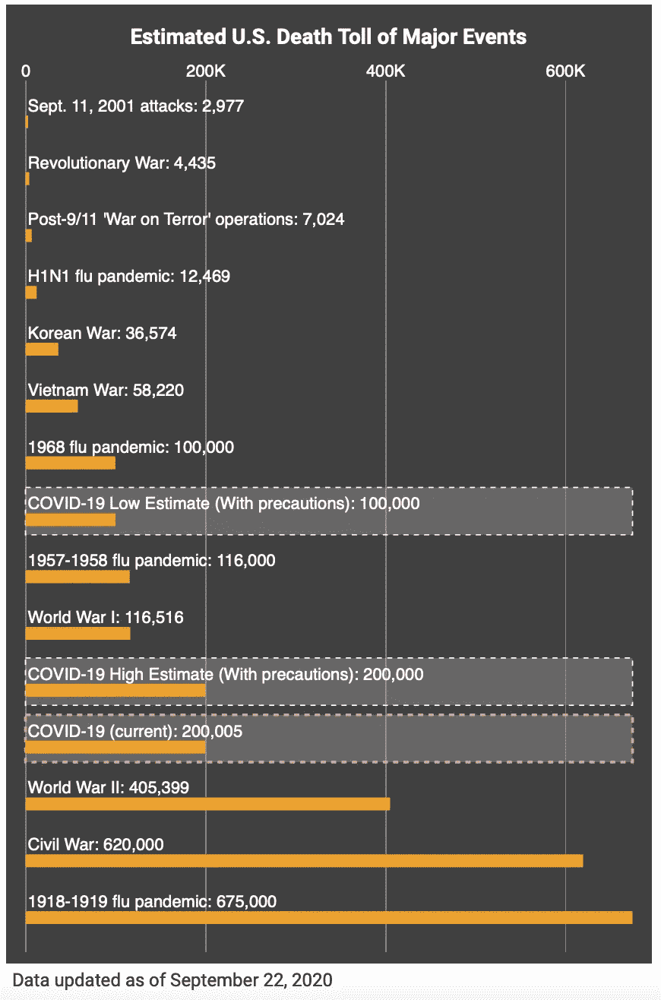
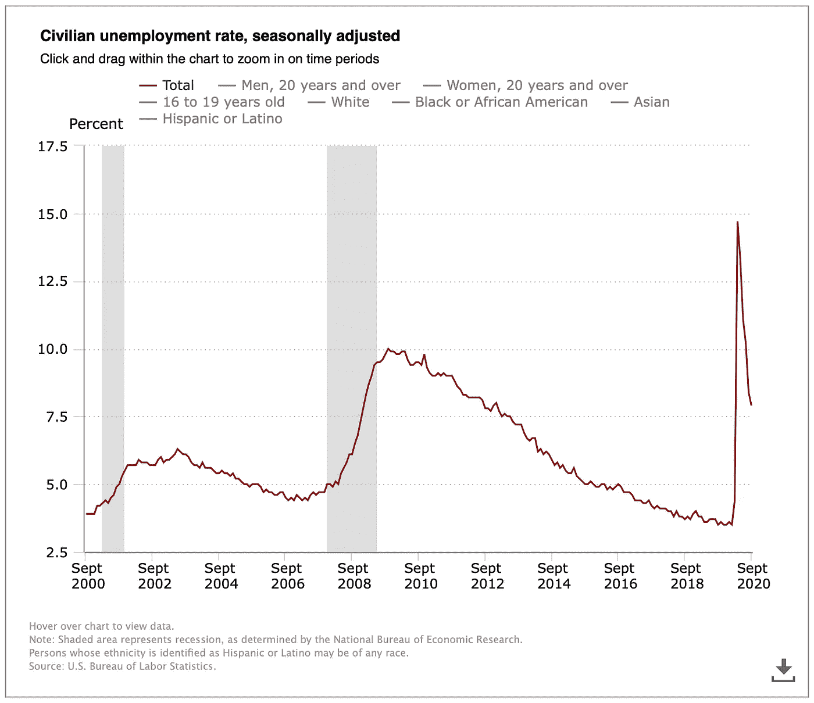
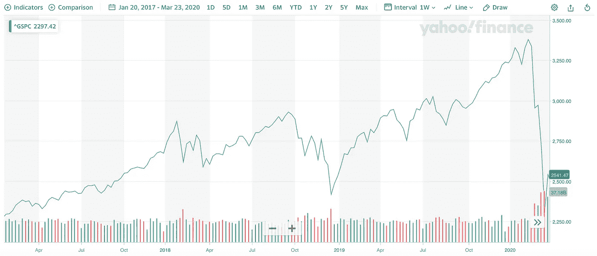
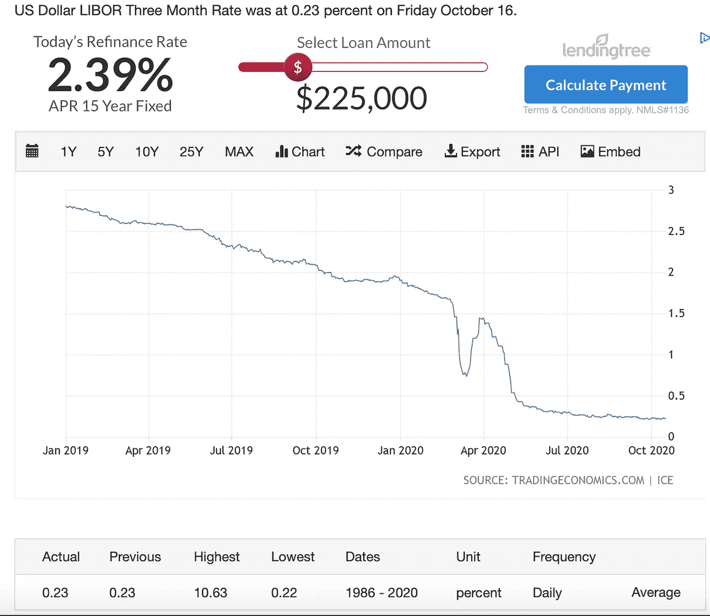
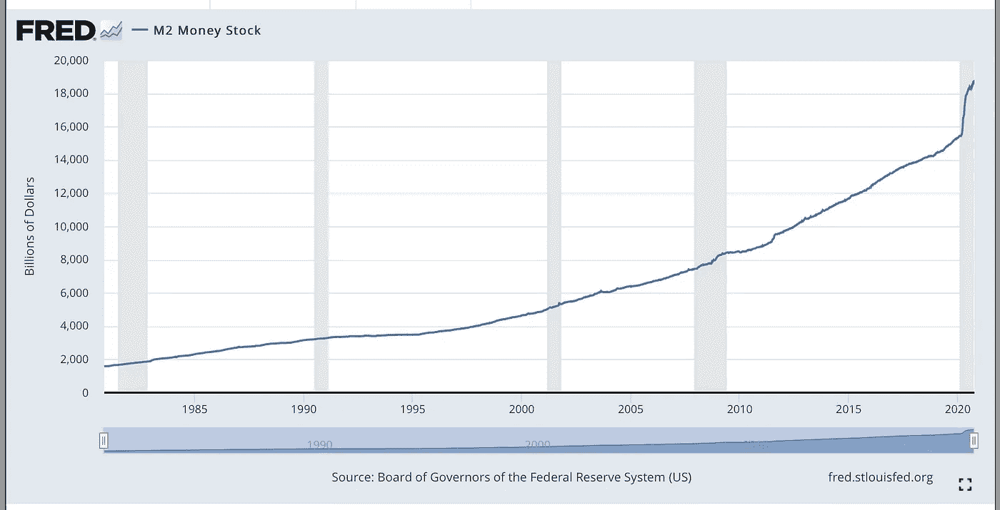
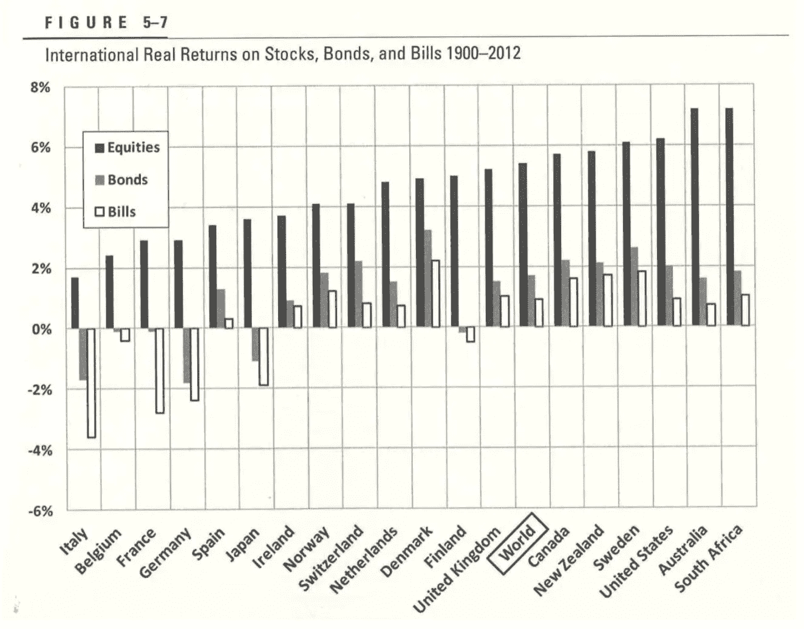
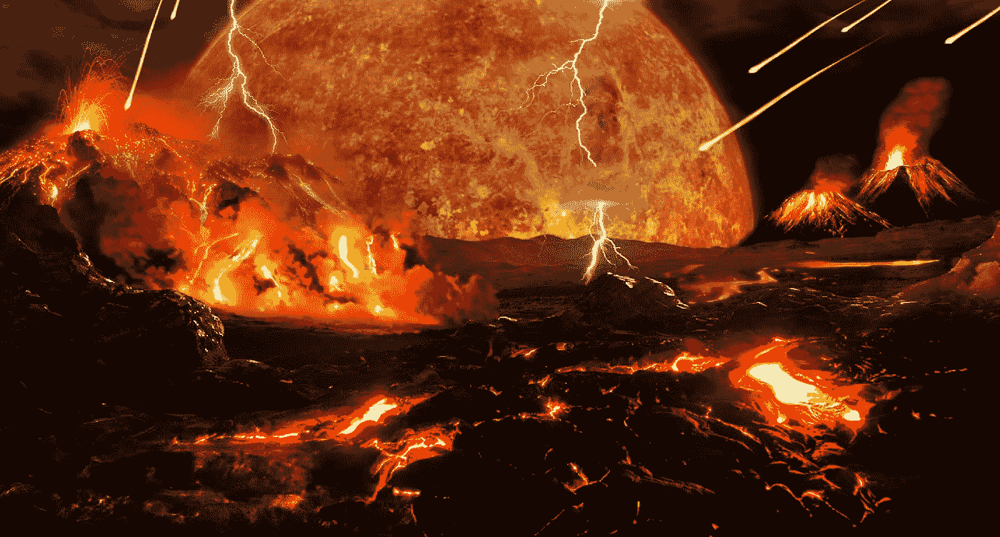

# 这个市场要完蛋了！！！我现在应该投资吗？

> 原文：<https://medium.datadriveninvestor.com/this-markets-gonna-die-should-i-invest-now-9084614439c0?source=collection_archive---------0----------------------->

## 对市场和投资的思考

A view of the stock market sometime in the near future. Credit: NASA/Goddard Image Lab

# **1。** **群众的智慧……**

以下是今年 3 月 23 日以来的 S&P500 股指走势图:

S&P500 stock index since March 23, 2020\. The author is using this website image under the fair use doctrine.

有人觉得这有意义吗？股票市场是大众的智慧，对吧？就像 2001 年网络公司“谁需要商业计划或客户”的崩溃是明智的？像 2008 年房市“房价永远不会下跌”的崩盘是明智之举吗？就像在 2016 年选举总统“我可以站在时代广场中央向某人开枪”一样，这算不算智慧？

杜德斯…**人群**喜欢被分开，尽可能远离概念和现实，即使在一个句子里，即使不舒服不符合语法，也可以截然相反，来自单词:**智慧**。就像那样。这两个词不能互相兼容。

当人群哄抬美国市场的股票价格时，美国冠状病毒每日新增病例也像股票市场本身一样加速增长:

Coronavirus daily new cases since March, 2020\. The author is using this website image under the fair use doctrine.

大众的“传统智慧”断言股票市场重视未来的回报…哦，真的吗？你看到冠状病毒病例数量上升了吗？现在是 2020 年秋天。每年的这个时候还会发生什么？流感。在我所能想到的任何数学模型中，流感加冠状病毒加起来都不会带来一个光明而多产的未来。群众的智慧我的@$$。原谅我的拉丁语。

这还只是个案。当尼禄皇帝演奏小提琴时，我的意思是当总统摆弄他的小拇指，并实施最弱和最无效的“政策”来应对自 1919 年西班牙流感以来最致命的传染物时，我们现在因冠状病毒失去的美国平民比第一次世界大战期间失去的美国士兵还要多！！！

Total Coronavirus deaths compared to major events as of September, 2020\. The author is using this website image under the fair use doctrine.

虽然人们的智慧可能会被原谅，因为他们不太理解一种无形的、不死的 RNA 包的后果，也就是所谓的冠状病毒(新型冠状病毒对你们这些受过高等教育的科学呆子来说)，但失业没有什么奇怪的想象或不可见的。

在下一张图中，用灰色竖线标出的是我前面提到的两次衰退和市场崩溃——网络泡沫和房地产崩溃。你会看到每一次失业都在飙升。当时，房地产崩盘是美国自 20 世纪 30 年代大萧条以来经历的最痛苦的失业状况。那些认为房价永远不会下跌的人的智慧导致了房地产市场的崩溃，在这一过程中，什么事情发生了飞跃？今天的失业是由疫情造成的，而由我们群众的智慧选出的总统的无能加剧了失业。

Civilian unemployment rate, 20-year chart. The author is using this website image under the fair use doctrine.

人群至少模糊地意识到了经济的增长，因为当经济衰退时，市场也会衰退(因为近期的未来回报会随着经济衰退)。当失业率像上图一样飙升时，你认为以国内生产总值衡量的经济会发生什么——主要是由像你我这样每天购买卫生纸、麦片和汽油的人驱动的。你猜对了——它就像一个镜像:

US GDP growth rate 25-year chart. The author is using this website image under the fair use doctrine.

# **2。** **预测……**

所以。你认为股票市场会发生什么？

它会被拆除的。它应该被拆除。它会死得很惨，他们会发明一个新词来形容它死得有多惨。相比之下，衰退完全是令人愉快的。抑郁一词还不足以形容灾难。死神太仁慈了。毁灭是如此被过度使用，以至于失去了任何极端的意义。股票市场会崩溃的。

至于这可能看起来如何，一个很好的例子，至少是这个市场的小调整:

S&P500 stock index from January 20, 2017 to March 23, 2020\. The author is using this website image under the fair use doctrine.

图表右边的悬崖是市场在过去的二月和三月的反应。当冠状病毒第一次成为公众意识中的模糊现实时，这是正确的反应。市场经历了有史以来最大、最快、最深的下跌。

那么，后来发生了什么？

这个故事最上面的图表是发生了什么。有史以来最快的，无法解释的从市场崩溃中恢复的速度。这有什么意义吗？

可敬的、稳重的、成熟的、精心打扮的市场分析师太不愿意被视为涉足阴谋论的狂热分子，就像这位总统的支持者所吃和呼吸的那些阴谋。

但我没有名誉可言。有阴谋论的人就像烤肉酱鸡肉麦乐鸡。我读了所有关于圣殿骑士，光明会，51 区外星人，和幽州的书。我深受教育。

任何一个思维清晰、不带偏见的人都会看到，市场是由这届政府支撑的，这届政府已经明确表示，股市比美国人民更重要。股票市场是这位总统关于当选的理念，是他男子气概的象征。所以，当他看到市场大幅下跌时，他呼吁他的市场伟哥。

 [## 这些名字和数字是怎么回事？风投投资你的 5 种主要方式|数据驱动…

### 一个风险投资者正在投资你——好消息。但随后你会在他们的投资工具中看到一连串的名字和数字…

www.datadriveninvestor.com](https://www.datadriveninvestor.com/2020/10/04/what-is-with-all-these-names-and-numbers-5-major-ways-in-which-a-vc-invests-in-you/) 

支撑低迷的旧市场的最佳方法是什么？你向市场注入大量现金。当你向市场增加现金时，你就降低了利率……这是量化宽松政策(QE ),由老布什发起，由奥巴马延续，目的是支持疲软的经济——但是宽松的 QE 货币的一个意想不到的后果是资产(包括股票)价格膨胀。

股价上涨是因为当你向经济中增加现金时，利率(货币的价格)会下降。当利率下降时，人们寻找其他地方赚取回报，自然的地方是股票市场和其他资产，除了现金以外的任何东西。

但是这位总统并没有试图拯救经济。一个充斥着每天不得不工作谋生的笨蛋的经济。他不关心普通人。不。这位总统迫切希望股市攀升，并向右转。因此，本届政府的任何利率放松都与资产通胀有关。不是关于经济和人民。

谁控制货币供应和利率？美联储。这是执行老布什和奥巴马 QE 政策的机构。谁掌管着美联储？杰罗姆·鲍威尔。谁任命杰罗姆·鲍威尔为美联储主席？我们非常明智地选出的总统“我可以在时代广场上开枪打人”。

有证据表明利率会降低吗？看看这个——银行间同业拆借利率:

US inter-bank lending rate since January, 2019\. The author is using this website image under the fair use doctrine.

注意到就在股票市场持续上涨的时候利率急剧下降了吗？

利率是美联储向市场注入资金的次级效应——有证据表明货币供应大幅增加吗？看看下面两张图表:

M1 includes funds that are readily accessible for spending. The author is using this website image under the fair use doctrine.

M2 includes a broader set of financial assets held principally by households. The author is using this website image under the fair use doctrine.

看到 2020 年货币供应量几乎垂直的阶跃变化了吗，向右？

因此，现在我们知道，本届政府通过增加货币供应，人为地抬高了股市，从而降低了利率，迫使市场参与者从现金投资转向股市。

但是股票投资者要求他们投资的公司增加收益。今年企业收益表现如何？

Five-year chart of corporate earnings. The author is using this website image under the fair use doctrine.

看到右边的悬崖了吗？显然，群众是不明智的。但他们也不傻。当他们意识到收入将持续下降时，他们会意识到自己是唯一的受害者。他们最终会放弃的。

股票市场将会崩溃。

# **3。** **怎么办，怎么办……**

希望你们都意识到这些是我个人对市场、经济和相关话题的思考、观点和狂言。你们每个人都必须决定什么是对的，什么是有意义的，以及做什么。

我个人是一个长期买入并持有的投资者。这意味着，数据显示，随着时间的推移，多样化的股票投资组合无疑胜过每一个单一的资产类别。让我开始思考和检查数据的书是杰里米·西格尔的老本《股票的长期投资》，我想现在已经是第五版了。值得你花时间。

在之前的流行病、衰退、萧条、世界大战、小战争、好总统、坏总统期间，随着时间的推移，广泛分散的股票投资组合一直是最好的资产类别。句号。

不是房产，不是黄金，不是债券，不是艺术品，不是豪车……一个多样化的股票投资组合。实际上很无聊。

Stock returns compared to bonds and bills. The author is using this website image under the fair use doctrine.

但是无聊意味着一个有耐心有良心的投资者实际上是比聪明的投资者更好的投资者。聪明的投资者总是陷入困境，因为他们认为他们可以智胜市场。他们知道我在这篇文章中大声说的话——群众是不明智的。但是聪明人犯的错误是相信他们仍然可以战胜市场。在这里，聪明的人也缺乏智慧。

明智的做法是查看数据(去看看西格尔的书)。根据数据，确定最佳行动方案。

理解市场的几个属性很重要。

1.市场不可预测。市场是由人创造的，很多人，他们各自做决定。有时他们表现得像一群暴徒，都朝着一个共同的方向前进。有时他们的行为就像一幅完全随机的杰森·布拉克的画。

2.短期来看，市场往往是错误的。价格是受欢迎程度的反映，而不是知识。然而，愚蠢是有限度的。一些机制，比如做空一只过热的股票，或者反过来买入不公平的多头股票。但总的来说，短期价格只是大众情绪的反映，除此之外别无其他。短期不到十年。

3.长期来看，一只股票的趋势将会趋同，并接近一家公司的真实价值。长期是几十年。

4.最重要的是，做出好的投资决策所需的信息从根本上来说是缺乏的。大多数关键信息都被锁在公司内部，只由公司发布法规要求的信息。因此，我们没有人做出真正明智的决定，我们对一家公司的任何争论都像苍蝇在马粪上嗡嗡作响！争论的焦点，马本身，在那边飞奔而去，而我们这些苍蝇在公司披露的一堆垃圾上嗡嗡作响，因为它必须定期这样做。

由于市场是不可预测的，明智的投资者意识到试图把握市场时机是没有意义的。说我们处于市场顶部或底部。这是毁灭和痛苦的必经之路，住在纸箱里吃冷猫粮。

因为从短期来看，市场经常是错误的，而且他们错误的时间会比你的投资组合持续的时间更长，所以聪明的投资者会忽略市场和嘈杂的人群。

由于长期来看，市场将向真实价值靠拢，明智的投资者认识到，在市场中的总时间是总回报背后的真正力量。

因此，耐心(不急于致富)和独立(无视人群)是一个好投资者的两个关键品质(不一定聪明)。

尽管我确信这位总统是个骗子，正在干预市场，但我今天不会做出投资决定。我正在做出未来几十年的投资决定，而这个时候，这位总统将谢天谢地地被埋葬和尘封。当然，这个时刻对我们很多人来说都很糟糕。但这一切都会过去。我们生活在世界上最伟大的国家，这不是因为这位总统，也不是因为选举他的民众的智慧差(或者没有投票给一个不完美的候选人——结果导致 20 多万人死于冠状病毒)。

Another duuudely vision of the coming stock market collapse. Wikimedia Commons.

为了应对病毒或这位总统，我没有卖出我的一份股票。

尽管这位总统处于恐怖统治之下，我还是买了 TSLA 和 AMZN 的股票，尽管我从一开始就相信他会导致经济崩溃和燃烧(正如我们所看到的)。

我在这里写了关于 TSLA 的文章，展示了他们是如何在经济陷入困境的情况下呈指数级增长的，并与急剧下滑的汽车行业形成对比:

 [## 特斯拉的平流层发射继续进行

### 回顾历史数据，展望 2020 年第 3 季度收益电话会议

medium.com](https://medium.com/datadriveninvestor/teslas-stratospheric-launch-continues-b0d242497cf2) 

总有像 TSLA 和 AMZN 这样的大公司会在经济衰退和其他灾难中表现出色。当你找到好公司时，无论当前形势如何，都要投资。

不管怎样，这大概就是我的方法。

祝你们每一个人好运和智慧。

感谢您的阅读，并请分享！另外，如果你喜欢这个，请看看我最近关于贷款的思考——你会更喜欢的！

 [## 杀死或使我们更强大的贷款

### 对贷款的恐惧的反思，以及被那些欠你一两三英镑……肉的人追赶

medium.com](https://medium.com/datadriveninvestor/loans-that-kill-or-make-us-stronger-5ec371b7799e)  [## 你害怕市场吗？乔布斯？经济？

### 既然我们已经选出了一个成年人，我们还能期待什么呢…

medium.com](https://medium.com/datadriveninvestor/are-you-scared-about-the-market-jobs-economy-1c662c1f3fa4) 

## 访问专家视图— [订阅 DDI 英特尔](https://datadriveninvestor.com/ddi-intel)