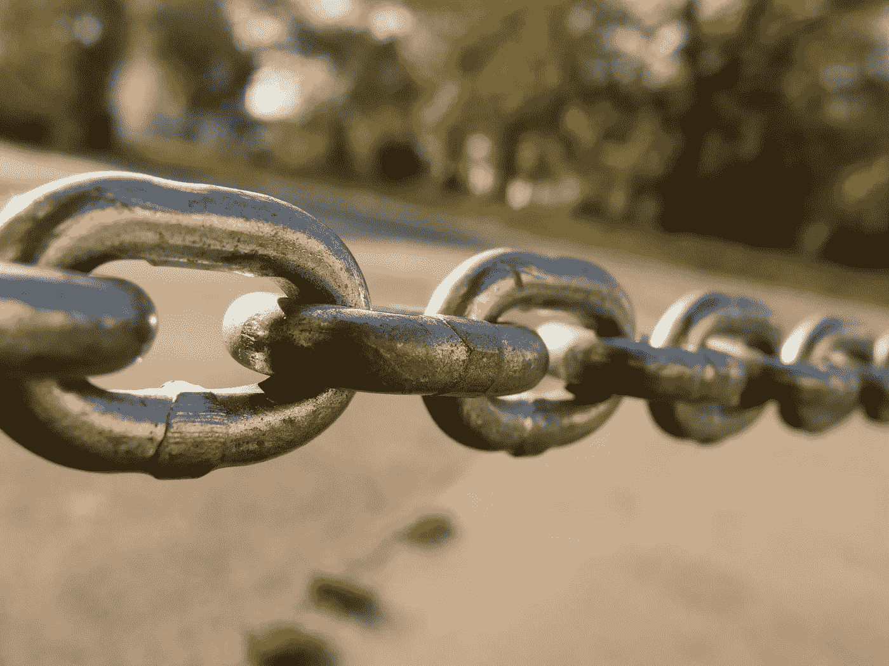
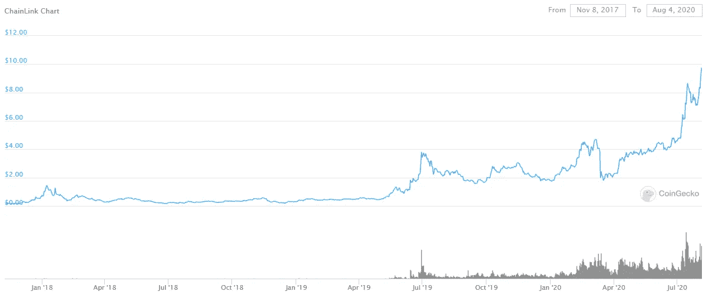
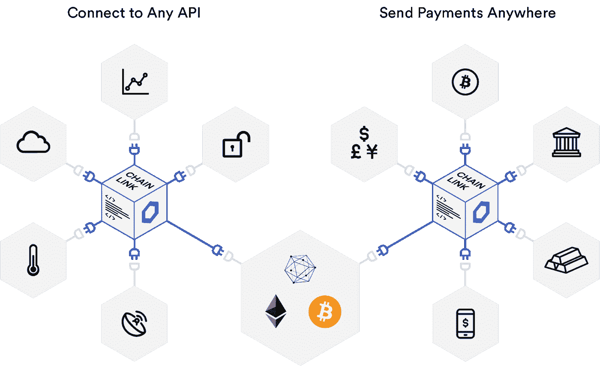

# 这项新技术正在联合区块链领域

> 原文：<https://medium.datadriveninvestor.com/this-new-technology-is-uniting-the-blockchain-field-e30180d21729?source=collection_archive---------5----------------------->

一个分散的 oracle 网络，将真实世界的数据与加密货币联系起来，并有望获得超过 5，000%的市场收益。

Photo from [Shri Ram Chain Industry](https://shri-ram-chain-industry.ueniweb.com/)

加密货币的发展变化无常是出了名的。这些分散化货币替代品的诞生常常可以被比作科幻小说。比特币本身最初是由笔名[中本聪](https://en.wikipedia.org/wiki/Satoshi_Nakamoto#:~:text=Satoshi%20Nakamoto%20is%20the%20name,devised%20the%20first%20blockchain%20database.)发布的，直到今天，这个笔名仍然笼罩在神秘的阴影中，以至于不清楚“他”是代表一个个人还是一群黑客。

更糟糕的是，目前领先的加密货币比特币的市场价值仍然不稳定，这主要是因为超过 90%的使用都是投机性的[。以太坊试图通过引入智能合约的概念做得更好，这是一种执行和记录远远超出股票市场的合法交易的分散方式。以太坊也推出了自己的货币来资助这些智能合约，称为以太。这是截至 2020 年 6 月的 5500 多种加密货币中的两种，而且这一数字预计还会继续增长。](https://cointelegraph.com/news/90-of-bitcoin-usage-is-speculation-10-transactions-says-luno-ceo)

但随着区块链应用程序及其相关加密货币的数量持续爆炸，将现实世界的数据与智能合约联系起来的问题越来越大。区块链工程师在连接和验证真实世界的信息(如财务数据或 API 结果)到他们的智能合同时，一再受阻。

# **引入链节**

Chainlink 充当现实世界信息和区块链技术之间的中介。自 2017 年成立以来，Chainlink 自己的加密货币 link 的市值在过去一年中出现了爆炸式增长。

Link price at [CoinGecko](https://www.coingecko.com/en/coins/chainlink/usd#panel)

由于是 ICO(首次发行硬币)，Link 从每枚 0.11 美元的起价开始爆发。到本文发表之日，Link 的每枚代币还不到 10 美元，这让许多早期投资者获得了几千%的投资回报。许多投资者认为，Link 的价格可能会接近 200 美元以上，与普通密码(如 Ether，目前每枚令牌不到 400 美元)相媲美。

这已经开始听起来有些投机，但真正让 Chainlink 与众不同的是，它专注于解决一个至今困扰许多更成熟的区块链技术的问题。例如，为了让以太坊履行涉及真实世界信息的智能合同，他们需要确保数据是真实的和最新的，同时保持分散的架构。

[Chainlink Architecture](https://chain.link/features/)

Chainlink 通过比较多个节点的输入数据来验证数据的真实性，从而解决了这个问题。每个节点被认为是一个“神谕”，这是区块链的行话，意思是真理之源。链接节点将相互比较新的信息，如果它看起来合法，它们都将同意并允许新数据通过系统。

这也引入了保护措施，如果一组节点对给定数据点的值(即股票价格)达成共识，它们将对给出非常不同价格的节点发出警报。不仅如此，Chainlink 的加密货币链接实际上可以作为节点上的抵押品形式。基本上，如果你的节点分发准确的信息，你会得到链接。如果您的节点意外或恶意地给出错误的信息，那么您可能会失去链接。

一旦节点验证了数据，Chainlink 就可以将现实世界的信息转换为灵活的格式，以便在银行或法律机构等既定团体之间交换加密货币。

Chainlink 区别于竞争对手的另一个因素是它以开发者为中心的基础。 [Chainlink 文档](https://docs.chain.link/docs)包括关于智能合约技术的分步文章，例如集成加密货币价格或任何外部 API。他们还有一个 YouTube 频道，随着越来越多的开发人员发现加密世界的新玩家，这个频道正在迅速升温。

# **暴风雨前的平静**

不仅仅是开发者对 Chainlink 感兴趣，可口可乐也采用了这种技术，新的加密技术被《福布斯》杂志的[所报道，link 现在是](https://www.forbes.com/sites/billybambrough/2020/07/12/as-bitcoin-struggles-this-minor-cryptocurrency-has-soared-1000-in-just-over-12-months/#73ca05cc7cf0)[十大加密货币之一。如果你认为这是类似于 Ripple 与任何人和任何事物合并的策略的炒作列车，你应该知道](https://finance.yahoo.com/cryptocurrencies)[中国目前正在使用 Chainlink 建设城市范围的区块链基础设施](https://cryptoslate.com/china-chainlink-adoptee-national-blockchain-project-goes-live-135-public-nodes-running/)。

【Chainlink 及其加密货币 link 与其他区块链的根本区别在于其实用性和现实应用。

Chainlink 平台已找到超过 [44 个用例，此处列出](https://blog.chain.link/44-ways-to-enhance-your-smart-contract-with-chainlink/)。其中一些包括:

*   货币与金融
*   保险
*   企业系统
*   供应链
*   政府

还有很多很多。

如果你问我，我认为大多数基于区块链和加密货币的技术大多是人工和浮夸的新共享乌托邦的门面，在那里政治家不洗钱，每个人都分享一切。我认为知道他们面临严重的[可扩展性问题](https://en.wikipedia.org/wiki/Bitcoin_scalability_problem)也很重要，所以广泛采用仍然面临障碍。但是，区块链仍然有很大的潜力在社会中做好事，并引入了诚信、可见性和共享资源的能力等理念，这在未来几年可能会被证明是革命性的。

总的来说，Chainlink 似乎为分散化难题提供了额外的一块，因为它将现实世界的数据与加密货币和已建立的机构相结合。这可能是一个做出重大贡献的绝佳机会——或者，这可能只是区块链众多光说不练的技术中的又一个。