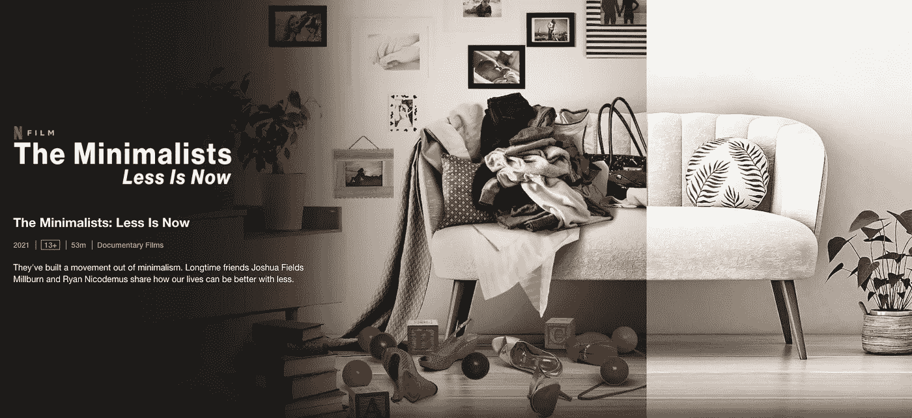

# 这个习惯帮助我增加了我的储蓄

> 原文：<https://medium.datadriveninvestor.com/this-one-habit-that-helped-me-to-boost-up-my-savings-9acd43a0a6e5?source=collection_archive---------29----------------------->

## 与前几年相比，我的净资产在去年大幅增长。回顾过去，我注意到了一个关键的习惯改变，它对实现这一结果至关重要。

Photo by [Tamanna Rumee](https://unsplash.com/@tamanna_rumee?utm_source=unsplash&utm_medium=referral&utm_content=creditCopyText) on [Unsplash](https://unsplash.com/s/photos/shopping?utm_source=unsplash&utm_medium=referral&utm_content=creditCopyText)

最重要的变化是从无意识消费到有意识消费。

你有没有经历过，当你经常上 Instagram 或 Zalando 或 ASOS 或任何其他网站时，你往往会“想要”买东西？有一次，我在 Kickstarter 上花了 250 美元买了一个耳机。从我打开网站付款的那一刻起，我用了不到 10 分钟。我不得不等待 5 个月，直到产品到达。而且穿起来也不舒服。所以大部分时间它都在我的抽屉里。去年，我捐赠了数吨衣服，其中许多甚至没有穿过超过 10 次。有几件衣服甚至没有穿过 3 次以上，有几件甚至一次也没有穿过。我是免费得到它们的吗？绝对不行。我在不知不觉中花钱买了那些。

无意识消费是没有真正考虑你要买什么的意外消费。毫无疑问，社交媒体在影响我们的决策和推动无意识消费行为方面发挥了重要作用。你在网上浏览别人的漂亮照片的时间越长，你就越想买他们的东西。在市场营销中，叫做‘创造欲望’。满足自己的欲望没有错，但是‘你真正想买的东西’和‘你认为你想买的东西’是有区别的。

**你能从无意识的消费中节省多少？**

你可以仔细检查你上个月或上个季度买的东西，把每一件都标上需要或想要的。“需要”意味着你需要它来维持你的生活，比如一个灯泡，一个键盘，或者一把椅子。没有这些，你就没有工作或学习的便利。也可能是其他物品。

“想要”的意思是你不需要这个东西，但你渴望拥有它。它可能是一套新的咖啡杯，你买它们是因为你觉得它们好看，而且你已经有了咖啡杯。也可能是一双你觉得很好看的新鞋，并且在 Instagram 上看过很多它的照片。一个典型的例子是黑色星期五购物，有多少东西是因为打折才买的，有多少是因为你真的需要它们才买的？你不必因为它打折或便宜就买它，那是错误的理由。你应该买，因为你需要它，而不是想要它。

我很好奇你在需求上花了多少钱。想象一下，通过减少“想要”的支出，你可以节省多少钱。

**如何从无意识消费切换到有意识消费？**

1.  **延迟采购**。给自己一周或更长的时间，然后再回来买东西。你还想要吗？是否给你带来了必要的刺激？很多时候，答案是否定的。
2.  **确定购买的真正原因:**问问自己，你为什么要买它？是因为你想给别人留下深刻印象吗？是不是因为别人有所以你也应该有？是因为一个冲动的想法吗？还是因为你需要它，并且它是执行你的日常任务所必需的？对自己诚实，你会决定购买的理由是否正当。

通过改变我的消费习惯，我已经减少了生活中的许多冗余。我家里没那么乱。我从许多相似的商品中挑选时压力较小。我有更少的浪费。我觉得精神上轻松了。我的消费减少了。这样一来，我就有了更多的积蓄。

我推荐你看的一部纪录片是来自网飞的 [<极简主义者:少现在>](https://www.netflix.com/ch-en/title/81074662) 。

source: netflix

这是一种心态的转变，从积累东西到保留真正让你快乐和满足的必需品。我们，作为人类，不需要很多东西来让我们快乐，我们需要关系，我们需要目的，我们需要健康，我们不需要东西。

通过采取极简主义的生活方式，我增加了我的储蓄率。通过谨慎的投资决策，我设法进一步提高了储蓄/净值。我会在另一篇文章中谈到投资。

这里的关键信息是，当你限制自己买东西时，那是暂时的。你可能有一天会破产，花很多钱来补偿你的“痛苦”。你应该理解无意识消费和有意识消费的区别，评估它们如何影响你的生活和幸福。通过真正理解什么对你重要，你将会改变行为。

现在你明白了这个概念，下一步就是树立一个信念，然后采取行动。有意识的消费会成为你前进的自然习惯。

要了解更多关于金钱的技巧，请关注我的账户或收听我的播客，我们在这里谈论金钱、职业和企业家精神:[https://www.fasttrack.life/](https://www.fasttrack.life/)

相关文章: [<为什么你的实际时薪只有你工资的 50%不到>](https://medium.com/datadriveninvestor/why-your-real-hourly-rate-is-only-less-than-50-of-what-you-are-paid-cf1c8801a69e)

[<低估拥有一辆汽车的成本>](https://www.fasttrack.life/blog/the-under-estimated-costs-of-owning-a-car)

[<为什么你可能会在住房上花费过多，如何降低住房成本>](https://www.fasttrack.life/blog/why-you-might-spend-too-much-on-housing-and-how-to-reduce-your-housing-cost)

**身家追踪工具:**这里 **下载一个免费的身家追踪工具[。](https://bit.ly/2WcaH5Y)**

**访问专家视图—** [**订阅 DDI 英特尔**](https://datadriveninvestor.com/ddi-intel)