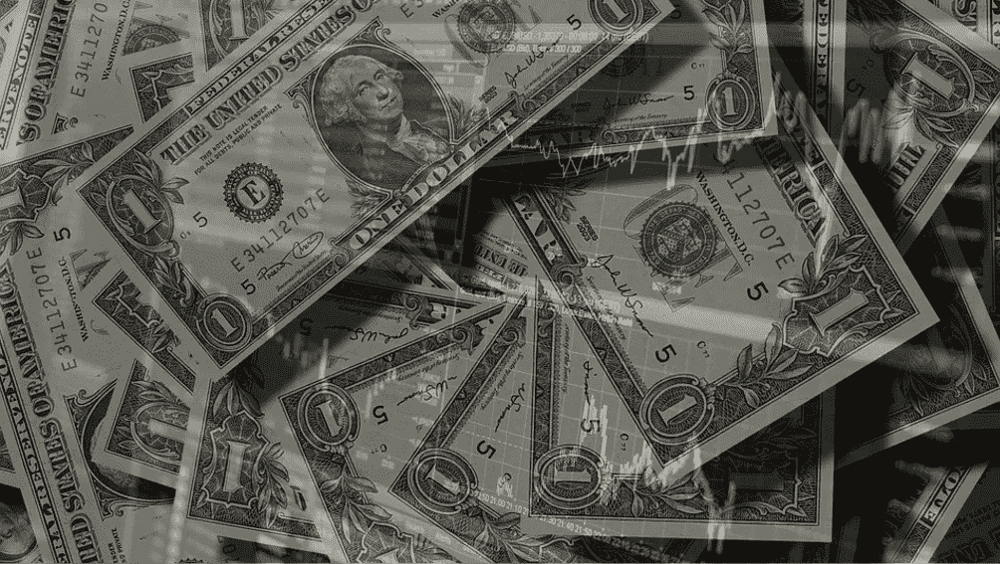
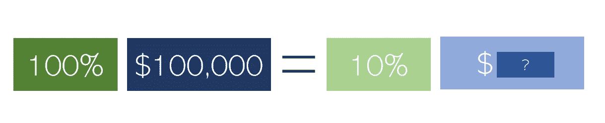
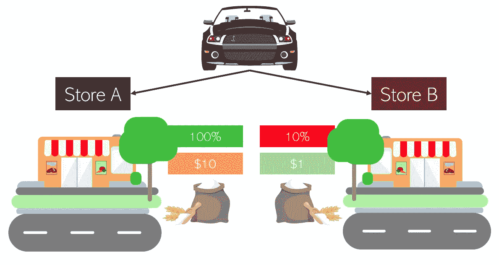
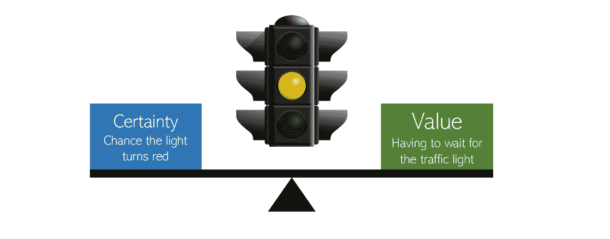

# 这一个问题揭示了你的投资策略

> 原文：<https://medium.datadriveninvestor.com/this-one-question-reveals-your-investment-strategy-c319cd080777?source=collection_archive---------16----------------------->

[Background Image 1](https://pixabay.com/photos/stock-trading-monitor-business-1863880/), [Background Image 2](https://pixabay.com/photos/dollar-currency-money-us-dollar-499481/)

## …以及你如何对待生活

有一个问题可以为你的投资策略提供丰富的见解，以及你愿意冒多大的风险来换取潜在的更大回报。

> 你愿意用 10 万美元的 100%的机会来换取 10%的机会吗？

统计学上显而易见的答案是 100 万美元——由于获得奖励的机会减少了 10 倍，你要求的金额应该增加 10 倍。Reddit 是互联网上非常受欢迎的文化中心，它的创建者对这个问题给出了著名的统计答案。看看 Reddit 充满争议的过去，以及它在绕过它方面的滑坡，这种冒险的心态是可以理解的。

然而，现实地说，你愿意用十万美元的保底来换取百万美元的十分之一的机会吗？这就是这个问题的有趣之处——它通常不能用纯粹的统计数据来回答。这取决于你的财务状况和你认为你应该如何积极地使用你的钱。

通常有两种类型的投资者:冒险型和保守型。风险投资者能够抓住带有风险的黄金机会。因为他们比那些采用更保守投资风格的人承担更多的风险，他们可能会获得保守投资者无法想象的回报。然而，如果他们不明智地选择承担哪些风险，他们也容易在金钱上遭受损失，损失的比例与他们潜在的回报相当。

 [## 投资区块链前要问的三个简单问题(也是一个困难的问题)|数据…

### 现在是了解区块链的最佳时机。不同货币之间的增长率，比如…

www.datadriveninvestor.com](https://www.datadriveninvestor.com/2020/03/12/three-simple-questions-and-one-difficult-one-to-ask-before-investing-in-a-blockchain/) 

风险投资者通常对他们的投资组合更积极，而风险投资策略不可避免地需要更多的时间和精力来维持。持续监控价格变化，并试图收集足够的信息以承担正确的风险，在没有进行这种详细研究的情况下，可能会导致不健康的投机行为。另一方面，保守的投资风格包括被证明是成功的“买入并持有”策略，这种策略不可避免地以稳定的速度增加投资组合的价值。虽然这种策略不会像高风险投资策略那样提供非凡的峰值，但它也会抛弃低点。

回到这个问题:一个常见的抱怨可能是这个问题似乎太脱离上下文而无法决定。关于这个场景的信息很少，有人可能会说这个前提太假了。考虑一个普通人常见场景中问题的变体:

> 你要去买杂货——特别是面粉。你知道 A 店有库存面粉，每袋 10 美元，但你只有 10%的把握 B 店有库存面粉。然而，商店 B 在有存货时提供 1 美元一袋的面粉。你去哪个商店？

假设/澄清:

*   商店 A 和商店 B 的距离相同。
*   你只需要面粉(没有替代品是合适的)。
*   只能去 A 店或者 B 店，不能两个都去。

问题归结为两个价值之间的平衡:确定性和回报。一个人如何平衡这两个概念与他们如何处理生活中的问题密切相关。在生活和商业的每个方面都存在着平衡确定性和回报的问题。

上面的变体处理了杂货店购物的常见任务，另一个变体可能详细描述了一个商人决定他们的业务是否应该经历一个可能获得巨大回报的变化。

生活中另一个常见的变化是当交通灯变成黄色时决定是否过马路。司机需要权衡价值——如果交通状况不好，就要无聊地等待几分钟——而不是确定性——当汽车穿过时红灯是否会变红，这将导致一张罚单或罚款。

如果你选择去 A 店，你更有可能是保守型的投资风格。你有一个相对稳定的投资组合，不要经常干预股票的买卖。在第一个问题上，你可能已经回答了一个很大的数字，也许是 500 万或者更多。尽管面粉在商店 A 的价格高得多，但产品的存在很好地补偿了它——确定无疑的保证。从我的观察来看，大多数人都是这样，也许是我们原始过去的残余。它有助于维持生活的稳定和平静，但当高风险高回报的情况出现时，它可能会把你排除在外。

如果你选择去 B 店，你更有可能有一种冒险的投资风格。当你认为股市中的许多风险之一具有潜在价值时，你更有可能积极投资你的投资组合，卖出和买入更多。在第一个问题上，你的答案可能更接近统计学上显而易见的答案——100 万美元。尽管面粉库存的可能性只有 10%,但这种不确定性被巨大的潜在回报很好地平衡了。价值比确定性更有说服力，所以你可能愿意做出更多高风险但潜在高回报的决定，比如为了一份工作而搬到不同的城市。然而，如果风险没有回报，你可能会自食其果。

在你的日常生活中，你可能会面临几十个价值确定性决策。试着识别它们，并注意你最终选择了哪种投资风格——也许有意识地选择不同的投资风格来接近价值确定性决策，这可能会有回报！