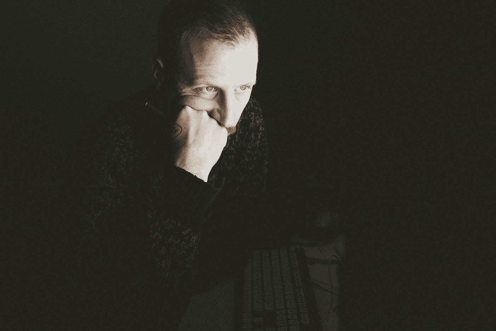

# 这句话改变了我的生活

> 原文：<https://medium.datadriveninvestor.com/this-quote-changed-my-life-17640f4c80ba?source=collection_archive---------15----------------------->

## 朝着你的目标采取大规模行动的 5 个步骤

Photo by [Alexandru Zdrobău](https://unsplash.com/@alexandruz?utm_source=medium&utm_medium=referral) on [Unsplash](https://unsplash.com?utm_source=medium&utm_medium=referral)

你是否曾经希望你能抛开所有的不安全感，开始为你的梦想采取行动？

但相反，你陷入了分析瘫痪。

你读了一篇又一篇文章，看了一段又一段视频，却从未开始。

你问自己，为什么我不能停止转动轮子并采取行动？

不一定要这样！

# 我采取行动的挣扎

我在瑞士一个注重安全的家庭长大。对于那些不知道的人来说，瑞士人是这个星球上最厌恶风险的人之一。每个人对每一个可能发生的事件都有不同的保险。如果你在某件事上失败了，他们会说你可能准备得不够。

 [## 成功人生的 25 种自我提升方式|数据驱动的投资者

### “我活得越久，学到的就越多。学的越多，体会的越多，知道的越少。”―米切尔·莱格兰德时间到…

www.datadriveninvestor.com](https://www.datadriveninvestor.com/2019/03/12/25-self-improvement-ways-for-a-successful-life/) 

最重要的是，我继续成为一名化学家。这是一个高度研究性的职业，如果你不想失去任何肢体或让实验室着火，你就必须合理规划你的实验。

*顺便提一下，一个比我大三岁的年轻化学家在一次爆炸中失去了一只手，那次爆炸是由一次未经授权且计划不周的实验引起的。所以我不是在开玩笑。*

如你所见，我没有受到任何影响去成为一个行动者。

## 当事情开始改变时

很长时间以来，这对我来说都不是问题。

我以前做的每件事都介于一般和优秀之间。

大约在 25 岁的时候，我陷入了一场生存危机。一切都准备好了。我有令人印象深刻的体格，有一份稳定的工作，有一辆好车，一个迷人的女朋友，住在一套昂贵的公寓里。我唯一剩下要做的事情就是部分关闭我的大脑，忘记我所有的梦想和灵感，一直工作到退休。

**这个想法吓死我了。**

这是我第一次意识到，我被困在一个金色的笼子里，这个笼子是由所有那些影响了我至今的决策的人的理想和局限所建造的。

那一刻，我知道我必须改变一些事情。

我开始像疯子一样学习。首先，我学习了关于心态和积极心理学的一切，把自己从我所处的精神整体中拉了出来。

然后我继续研究各种类型的成功人士。

我读到他们做什么或不做什么，他们的早晨和晚上是什么样子。我积累了大量关于顶尖战略和最新趋势的知识。

猜猜发生了什么——没什么。

Photo by [Julien-Pier Belanger](https://unsplash.com/@julienpier?utm_source=medium&utm_medium=referral) on [Unsplash](https://unsplash.com?utm_source=medium&utm_medium=referral)

直到我看到一句名言。我的同胞卡尔·古斯塔夫·荣格。

> 你是你所做的，而不是你说你会做的——c·g·荣格

这让我大开眼界。

*   **我喜欢谈论想法，但从未付诸行动**
*   **我喜欢研究和消费信息，但从未付诸行动**
*   **我陷入了分析瘫痪，寻找更多信息——但从未采取行动**

直到我成为一个行动者，我的生活才最终改变。我不在我想去的地方，但我在路上，每天都在进步。

让我与你分享帮助我朝着目标采取行动的五个步骤。

# 朝着你的目标采取大规模行动的 5 个步骤

**1。释放多巴胺**

你有没有通宵玩电子游戏或者狂看网飞的电视剧？你可以连续几个小时不吃不睡也不累。这就是多巴胺的力量。多巴胺是一种大脑化学物质，它会影响你的情绪、奖励感和动力。

当你做梦或者开始做某事时，新的多巴胺会像喷泉一样涌出。你觉得没有什么能阻止你。

在这个过程的几个星期后，多巴胺可能减少了很多。第一个问题出现了，并且不确定你是否应该坚持到底。

通过保持高兴奋水平，你可以对抗多巴胺的下降。

*   吃好，睡好，动动你的身体——基本的东西。
*   生活中所有艰难的事情都是由简单的步骤组成的。将一个大目标分解成可实现的日常目标。
*   每当你达到这样的目标时，都要庆祝。
*   将过程游戏化。努力变得更快或提供更好的质量。通过与你自己或你的同事竞争，你可以模仿视频游戏对你大脑的影响。

## 2.使用三的力量

人们通常更热衷于收集想法，而不是执行它们。列出庞大的待办事项清单感觉很棒。跟不上他们的节奏感觉很糟糕——糟糕的感觉会降低你的多巴胺水平。

相反，每天完成三件事。前一天晚上计划好你的一天，写下第二天最重要的三项任务。

先从最关键的任务开始，坚持下去，直到完成。

## 3.平静你的心

通过冥想，你可以让你的大脑得到精神上的休息。你将能更好地捕捉进入你头脑的恐惧或自我怀疑的想法。这样做，你可以阻止消极的想法变成消极的情绪。

我是这样做的:

我专注于我的呼吸，感觉空气从我的鼻子进出。每当我的思绪游走，我就把它们带回呼吸。

我开始每天这样做一分钟。我一感到舒服，就延长了疗程。目前，我每天做 10 分钟。

## 4.拥抱失败

不要误解我。我讨厌失败。

你不一定要失败才能成功。作为一个人，你有独特的能力从别人的错误中学习。这样就不用重复了。但是如果你失败了，那是一个学习的好机会。

有了这种心态，对失败的恐惧就失去了控制你的力量。

## 5.即时学习

过去，我错误地认为在开始之前我必须知道所有的事情。这种方法的问题是经常缺少上下文。

假设你是学市场营销的。销售漏斗的概念可能有点抽象和无聊。另一方面，如果你有一个产品，你必须让销售成为一个销售漏斗，这与你更相关。

如果你学了一些相关的东西，并且你能马上运用新知识，你的学习速度将会飞速提高。

# 外卖

你必须获得动力，每天都做些事情。每一小步都是向前的一步。有了正确的心态，你将能够开始并体验最终获得动力的感觉。

# 准备好变得无限吗？

如果你想变得无限并大大加快你的学习速度，看看我的小抄:

[点击此处立即获取备忘单！](https://roadtolimitless.com/cheatsheet/)