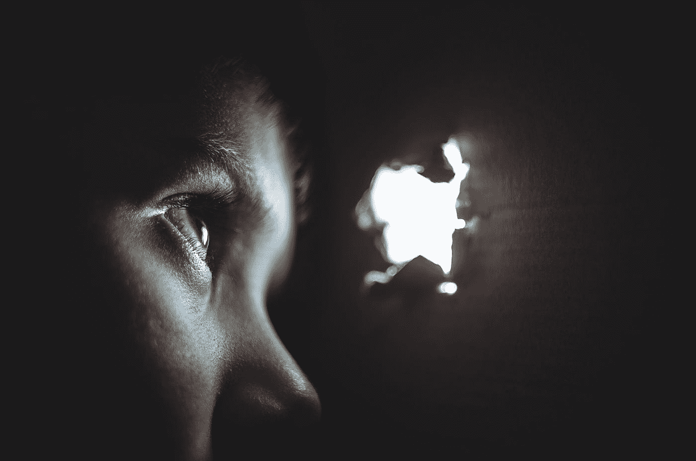
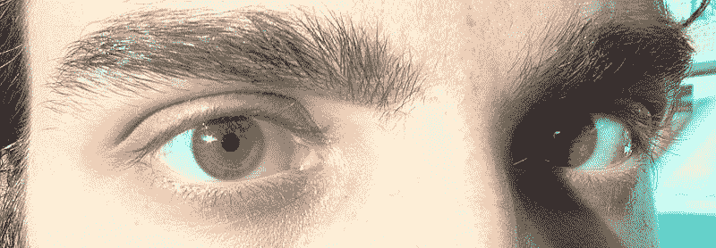
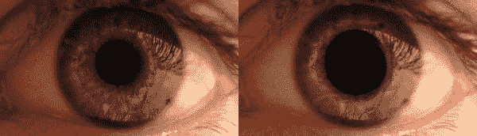

# 这个简单的生活帮可以帮助你在黑暗中看清东西！

> 原文：<https://medium.datadriveninvestor.com/this-simple-life-hack-helps-you-see-in-the-dark-3e516368e001?source=collection_archive---------11----------------------->

## 一个没人告诉过你的黑客…还有更多

Photo by [Dmitry Ratushny](https://unsplash.com/@ratushny?utm_source=medium&utm_medium=referral) on [Unsplash](https://unsplash.com?utm_source=medium&utm_medium=referral)

# 首先，让我们了解一些基本知识

正如你已经知道的，我们的眼睛有两种类型的细胞，即视杆细胞和视锥细胞。这些是光感受器，分别在昏暗的光线和明亮的光线下为眼睛提供容易的视觉。

现在让我们来谈谈眼睛的瞳孔，它根据进入我们眼睛的光线改变它的大小。当黑暗时，它变宽，让更多的光线进入眼睛，从而帮助我们看得更清楚。当它很亮的时候，为了安全的视觉，它会收缩以减少光线。瞳孔呈现黑色是因为它几乎不允许光线从中逃逸。

# 从黑暗走向光明:

出现这种情况:

*   当你的室友在午夜开灯时
*   醒来后刚出来的时候

Lacobrigo, CC BY-SA 3.0 <[https://creativecommons.org/licenses/by-sa/3.0](https://creativecommons.org/licenses/by-sa/3.0)>, via Wikimedia Commons

这绝对是一件不可取的事情。哈哈！

在这种情况下，你的瞳孔已经扩大了。当你马上出来的时候，大量的光线进入你的眼睛，让它无法承受。它开始收缩，同时你将不能完全睁开眼睛。那是身体的保护机制。

你可以通过戴太阳镜来保护眼睛，太阳镜可以减少进入你眼睛的光线。

# 从光明走向黑暗:

我们已经经历过很多次了:

*   当我们走进剧院时
*   当断电时
*   当我们关掉卧室的灯时

那次会发生什么？

你首先需要透过房间窥视，以确保你不会撞到任何物体。大约一分钟后，你会觉得你能以更好的方式看待事物。这是因为你的瞳孔需要时间来扩大，让更多的光线进入。

# 你期待已久的黑客攻击来了:

[Boy Icon](https://iconscout.com/icons/boy) by [Coquet Adrien](https://iconscout.com/contributors/adrien-coquet)

当你知道你需要进入一个黑暗的地方时，在一分钟之前，闭上你的一只眼睛并坚持下去。

当你进入黑暗的地方时，闭上另一只眼睛，打开闭着的眼睛。然后，你可以愉快地看到房间里的物品，像摇滚明星一样四处漫游！

# 一个有趣的小故事:

***一个男孩和他的父亲要出去看电影。这个男孩看起来很兴奋，因为他马上要表演一个科学魔术。***

***男孩*** *:爸爸，我要闭着眼睛走路。你带我进入剧院。*

***父亲*** *:为什么是儿子？*

***男孩*** *:爸爸..请..*

***父亲*** *:好的！我会照你说的做。*

他的父亲带着男孩走进剧院。男孩睁开眼睛。

父亲:让我们在这里等一会儿。天很黑。

***男孩*** *:爸爸，我们的座位号是多少？*

***父亲*** *: K47，48。*

***男孩*** *:跟我来爸爸。我能看见。我带你去。*

希望你发现了他玩的把戏。让我们花一分钟来欣赏一下这个小神童吧！

# 相关:

## 为什么海盗要戴眼罩？

*   **答**。*炫耀*
*   **B** 。*在人前吹牛*
*   **C** 。*以此来象征 3.14%的水手是海盗(圆周率；-D )*
*   **D** 。*以上都不是*

猜一猜…

好吧，这是选项 d。原因是

它们允许被遮盖的眼睛持续适应黑暗，而另一只眼睛在明亮的光线下提供视觉。

现在，当战斗或任何紧急情况出现时，海盗可能需要冲到下面的甲板上，那里很黑。那时，他将眼睑切换到另一只眼睛。

然后，他可以立即在下面的黑暗中看到。他甚至可以在适应黑暗的一分钟内击败敌人。

# 放大的瞳孔让我们更有吸引力

MikeRun, CC BY-SA 4.0 <[https://creativecommons.org/licenses/by-sa/4.0](https://creativecommons.org/licenses/by-sa/4.0)>, via Wikimedia Commons

这两幅图你觉得哪一幅更吸引人？

听说是第二部。

原因是——第二张图中瞳孔放大。

当你看到你爱的人或物时，你的瞳孔会不由自主地放大，以便看得更清楚。这也让我们看起来对其他人有吸引力。这意味着——我们被设计成对我们最喜欢的人有吸引力。

这可能是恐怖电影中的鬼魂被描绘成瞳孔很小的原因。因为它们不应该对我们有吸引力。

## 这么一个小小却非常重要的东西背后的科学是什么？

你知道火星探测器“机遇号”发出的最后一条信息是什么吗？可能与这篇文章有关——

My battery is low and it’s getting dark…