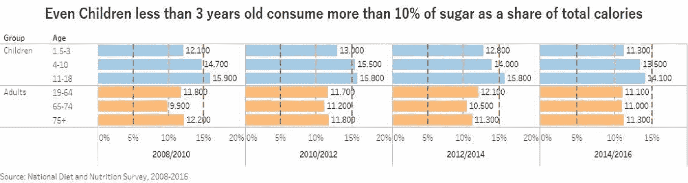

# 这项研究将使你改变与糖的关系

> 原文：<https://medium.datadriveninvestor.com/this-study-will-make-you-change-your-relationship-with-sugar-ac95adb82b97?source=collection_archive---------16----------------------->

## 2008-2016 年全国饮食和营养调查(NDNS)滚动方案研究

pexels.com

用于可视化的数据集来自周一的[改造。接下来是站点中的可视化。](https://data.world/makeovermonday/2020w3-is-it-time-to-treat-sugar-like-smoking)

我认为这种视觉化并不能说明全部情况。这张图表没有回答很多问题。性别呢？这些年来这是如何变化的？在这个可视化中代表了哪一年？

我将使用数据表示方法来回答更多问题，并深入研究数据集。

答根据世界卫生组织(世卫组织)的说法，摄入不到总能量摄入 10%的游离糖可以降低超重、肥胖和蛀牙的风险。因此，5%的游离糖摄入量是理想的，强烈推荐。哪一个群体(儿童、成人、男性、女性)在尊重历年来 5%的游离糖摄入量？

# 问题树

这个问题树只包含问题答案的假设。接下来，我基于这个问题树的可视化分析。

## 儿童与成人从游离糖中摄入的卡路里百分比

我们可以看到，这些年来，儿童平均比成人消耗更多的糖，但在去年，两组都略有下降。让我们深入每个年龄组，看看发生了什么。

 [## 将定义 2020 年就业前景的五大数据科学和机器学习趋势|数据驱动…

### 数据科学和 ML 是 2019 年最受关注的趋势之一，毫无疑问，它们将继续发展…

www.datadriveninvestor.com](https://www.datadriveninvestor.com/2020/02/19/five-data-science-and-machine-learning-trends-that-will-define-job-prospects-in-2020/) 

每组消耗超过 10%，我们离推荐的 5%还差得很远。

## 每个年龄组从游离糖摄入的卡路里百分比，儿童与成人

多年来，青少年(11-18 岁)消耗更多的糖，但即使不到 3 岁的儿童也比 19-64 岁的成人消耗更多的糖。

65-74 岁的成年人是消费较少的年龄组，但平均来说，所有成年人之间的消费在这些年里几乎是相同的。

我们来看看男女有没有区别。

## 男性与女性从游离糖中摄入的卡路里百分比

总体而言，男性的糖消费量略有增加，高于女性。

无论男女，我们都远远达不到建议的 5%。2016 年，这两个群体的消费量都超过了 10%。

现在让我们来看看这些年来各组糖消耗量的变化。

## 历年来所有组别从游离糖摄取的卡路里百分比

*   这些年来，儿童组的糖消费量有所下降，但仍保持在 10%以上。
*   成年人群体多年来保持不变，但在 10%以上。
*   在男性群体中，糖的消耗量在过去几年有所增加，超过了 10%。
*   女性群体的糖消费量有所下降，但仍超过 10%。

在结束这一分析之前，重要的是要注意到有一些限制和偏见。

## 限制

*   这项研究考虑到了英国的人口，其他国家的情况肯定会更糟。
*   这些数据是 2008 年至 2016 年之间的，但现在是 2020 年，情况可能会有所不同。
*   这项研究只考虑了 1000 人作为样本，他们真的能代表英国的人口吗？收入呢？低收入类别和高收入类别消耗的糖分是一样的吗？

## 结论

建议消耗大约 **5%** 的糖，作为总能量(游离糖摄入)的百分比，**然而在所有年龄组中，都有超过 10%的消耗。青少年的消费量是推荐量的 3 倍。**

我认为需要做些什么，人们可能没有意识到他们的糖消费量以及这可能对他们的健康造成的风险和后果。**也许是时候像对待吸烟一样对待糖了。**

不要只看到这些，从今天开始行动起来，想想你孩子的未来，想想你的未来，并与他人分享。谢谢你。

> *今天是开始的最佳时刻*