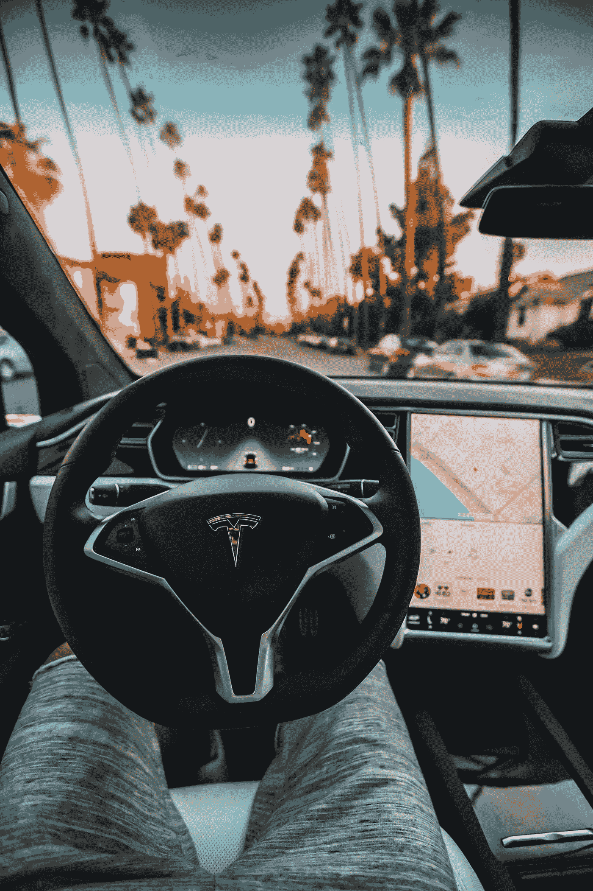

# 这一次，不一样了！

> 原文：<https://medium.datadriveninvestor.com/this-time-it-is-different-12aa7060a519?source=collection_archive---------13----------------------->

Photo by [Roberto Nickson](https://unsplash.com/@rpnickson?utm_source=medium&utm_medium=referral) on [Unsplash](https://unsplash.com?utm_source=medium&utm_medium=referral)

好了…我说了！我打破了金融行业的誓言，因此犯下了渎神罪，这可能导致我被驱逐出专业市场分析师的世界。然而，我似乎还站着。我反复强烈警告读者*不要加入卖空者的行列，押注特斯拉(TSLA)股票下跌。*

长期以来，作为美国最被做空的股票，如果没有别的，TSLA 可能已经教会了不少卖家，市场保持非理性的时间确实可以超过他们保持偿付能力的时间……甚至可能比*长得多！即使是现在，虽然我没有正式向第三方推荐这只股票，但我仍然强烈建议不要在目前的高位做空它。*

 [## 算法交易的机器学习|数据驱动的投资者

### 当你的一个朋友在脸书上传你的新海滩照，平台建议给你的脸加上标签，这是…

www.datadriveninvestor.com](https://www.datadriveninvestor.com/2019/01/30/machine-learning-for-stock-market-investing/) 

这家电动汽车领军企业的股价基本上呈“抛物线状”。我经常说，在股票价格或市场指数晴雨表中，平缓的上升比陡峭的上升更可取。坡度越平缓，其耐久性的前景就越好。这使得当前的经济扩张和美国股市牛市持续的时间比许多人预期的要长。

TSLA 的崛起，尤其是最近几周，以昨日近 20%的涨幅达到顶点，绝非一帆风顺。据我所知，这造成了有记录以来股市史上最痛苦的“空头挤压”。卖空者已经损失了数十亿美元——达到了两位数——他们押注特斯拉的股票会下跌而不是上涨。该股现在的陡坡确实让它更容易最终修正，但把握时机从来都不是我的强项。

我在各种文章和帖子中坚持认为，我不认为特斯拉或科技/成长股，更不用说更广泛的美国股市接近泡沫。现在，TSLA 看起来绝对“充满泡沫”它是在一个*实际的*泡沫中吗？只有时间能证明一切(因为真正的泡沫只有在事后才能被准确识别)，所以我肯定不知道。

基于抛物线增长的基本情况是，TSLA 现在处于典型的泡沫区域。也就是说，(a)即使在泡沫中，这种罕见的周期“失控”可能会膨胀得比大多数人预期的要大得多,( b)TSLA 甚至还没有处于泡沫区域的可能性很小。当然可以。以任何传统的标准来衡量，这一估值都相当高。它的市值现在已经超过了德国最大的汽车制造商大众，更不用说通用汽车了(这两家公司都是我的全球最佳选择名单的组成部分。

我为自己是反向投资者而自豪，从这个意义上说，我必须唱反调。专业人士的共识是，特别是如果你看看 TSLA 的价格表现，这*肯定*是一个泡沫。另一方面，这些专家中的大部分已经*很久*这样称呼它了(以及其他许多泡沫)。当然可以。TSLA 很可能仍然是一个泡沫，长期以来一直如此，只是越来越大。但如果不是呢？

我还想说，人们应该尽可能客观地解读市场传递给我们的信息。太多时候，我们大多数人听到我们想听到的，陶醉于确认偏见，不理解市场的语言。有效的沟通既包括发送的信息，也包括实际收到的信息。我们大多数人都不是特别擅长真正与市场沟通。我们将发出的信息解读为我们*希望*发出的信息，而不是市场真正*所说的信息。*

因此，大多数专业人士现在将市场信息解读为 TSLA 正处于投机泡沫之中。再说一次，这可能是一个合理的基本情况，但是我的逆向思维和试图解读市场可能真正在说什么也提供了另一种解释。

***特斯拉走自己的路***

特斯拉(TSLA)是终极逆势股吗？我认为是的。正如 Anthony Claudio Brocado 和我在我们为 Nuclo Independent CIO 撰写的年度报告中所指出的那样，人们可能会与共识情绪和/或价格走势背道而驰。根据这一理论，只要市场一致强烈反对，即使买入一只大幅上涨的股票，你也可以逆向操作。

事实上，如果我必须在反对价格波动和一致情绪之间做出选择，我总是倾向于反对后者。我要补充的是，它比这更微妙。不存在铁板一块的共识。市场参与者有不同的群体，一个特定的群体可能在另一个群体强烈看跌的同时看涨。对不同的市场参与者群体进行分类的几种方法包括机构投资者和散户投资者；在机构细分市场中，有买方投资者对卖方分析师，只做多的机构投资者对多空对冲基金等。

许多投资者，包括管理只做多基金、对冲基金和大量卖方分析师的投资者，都对特斯拉持负面看法。许多投资者不断将埃隆马斯克(Elon Musk)领导的公司的估值与“传统”汽车制造商的估值进行比较，以证明 TSLA 被高估的程度。这让我想起了多年前亚马逊(Amazon)与传统零售业的类似对比。当涉及到行业颠覆时，这些传统规则不再适用。

就像 AMZN 的情况一样，市场并没有真的说“泡沫”，而是告诉我们，这家公司不仅会扰乱图书销售商，也许(只是也许)市场可能会告诉我们，特斯拉的故事比我们大多数人想象的要大得多。在我最近在[发表的关于苹果和特斯拉](https://medium.com/datadriveninvestor/apple-and-tesla-the-two-most-heavily-shorted-stocks-are-still-poorly-understood-2aa17b214278)的报告中，我认为“简单地回到特斯拉，电动汽车冠军与‘传统’汽车制造商之间会出现类似的趋势吗？特斯拉最终能在它正在扰乱的行业的利润和现金流池中获得巨大份额吗(就像苹果之前在移动电话市场对诺基亚甚至三星等以前的主导者所做的那样)？”

亚马逊不仅颠覆了传统零售商，还开始以多种方式进行“垂直整合”，特别是创造了如今利润和现金流的巨头——AWS 或亚马逊网络服务。同样由埃隆马斯克(Elon Musk)领导的(当时)备受批评的收购 Solar City 的交易，确实提供了一个微小的相似之处。特斯拉正在成为一个行业中非常重要的参与者，这个行业将在新的 20 年代(储能)出现巨大增长。它的(越来越多的)巨型工厂，马斯克决定来柏林(建立一个设计中心)及其周围的汽车制造和巨型工厂，以及其他最近的举措，都表明这家电动汽车制造商在能源生产和存储(不仅仅是电池技术)方面有一个光明的未来。

能源行业有很多“可利用的市值”,就像亚马逊从来不满足于仅靠图书销售获得的现金流一样。亚马逊的时代不同了，也许——仅仅是也许——这次对特斯拉来说又不同了。只有时间能证明一切。