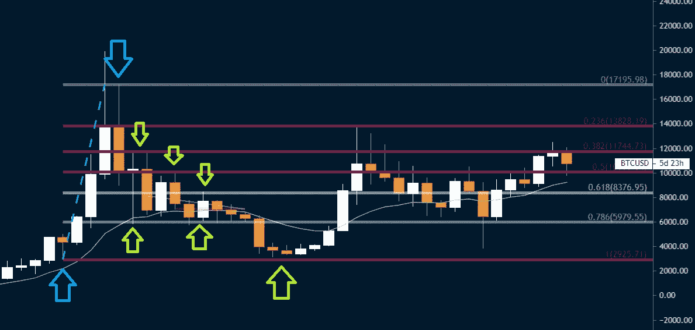
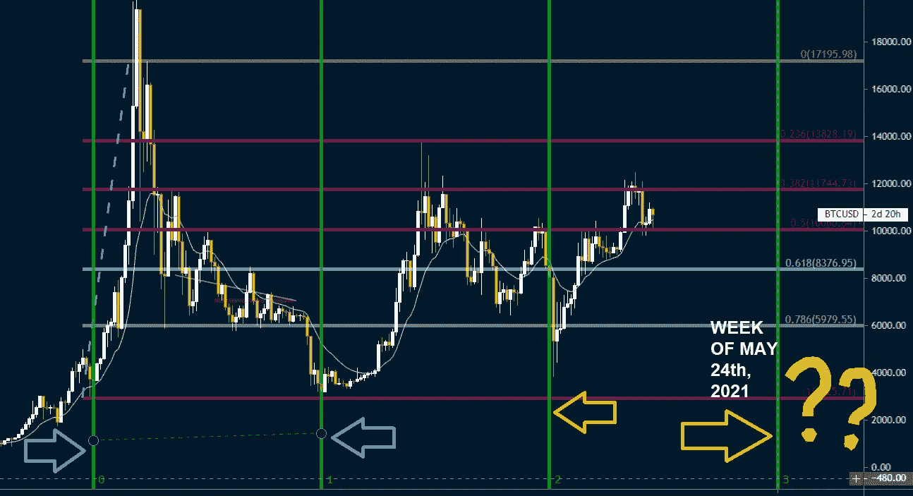
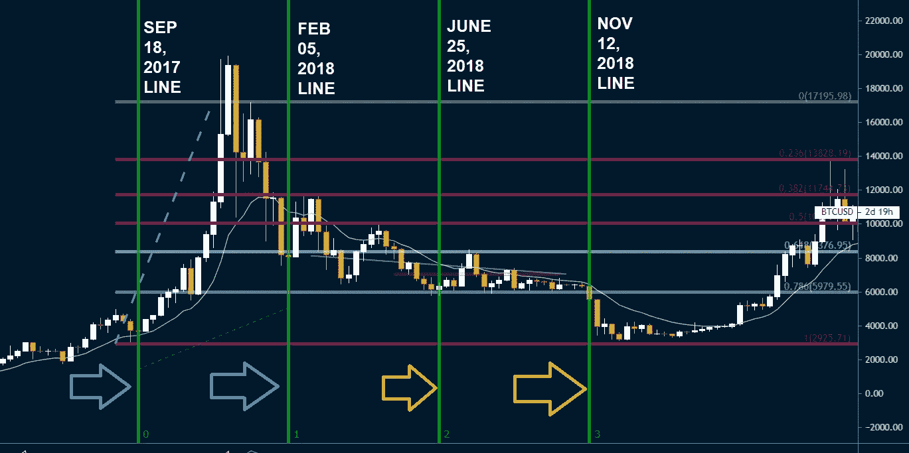
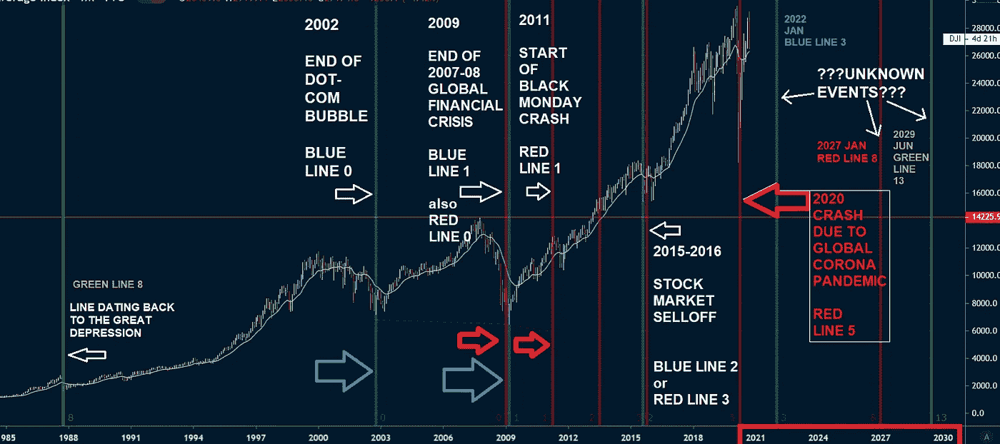
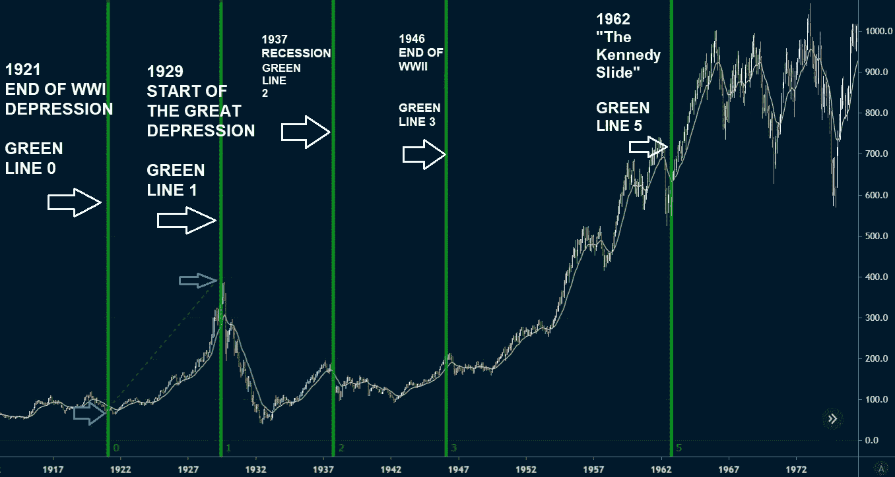
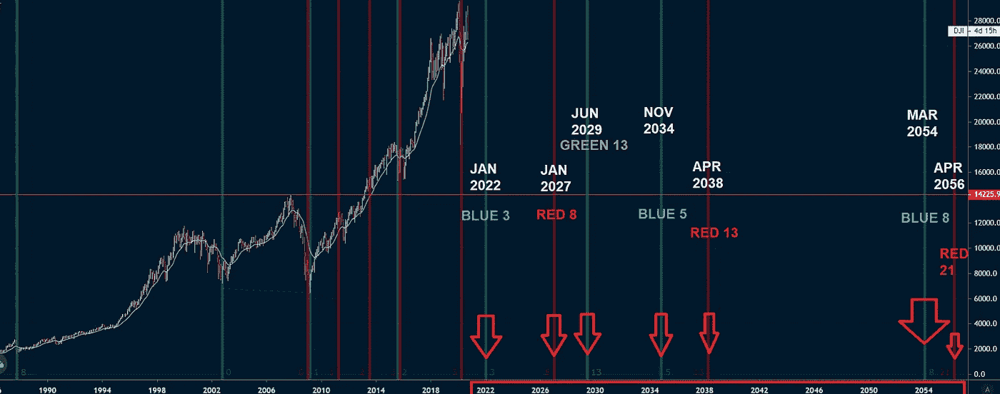

# 这种未被充分利用的股票分析工具可以预测经济何时崩溃

> 原文：<https://medium.datadriveninvestor.com/this-underutilized-stock-analysis-tool-could-predict-when-economies-crash-158d0711a32c?source=collection_archive---------9----------------------->

为什么我不喜欢触摸斐波纳契时区工具

Nautilus Shell Showing the Golden Ratio Photo from [Pexels](https://www.pexels.com/photo/orange-and-white-seashell-on-white-surface-33234/)

[***斐波那契数列***](https://www.livescience.com/37470-fibonacci-sequence.html) ，又称 ***黄金分割比例*** ，大概是我们能推断出的最接近整个宇宙的设计蓝图了。虽然有些人可能会说这只是我们的大脑在寻找不存在的模式，但它的存在是不可否认的。而且越找越往兔子洞里钻。自然界中众所周知的斐波那契数列的例子有:鹦鹉螺的壳(上图)；向日葵种子的排列，飓风的形状，我们自己的 DNA 复制，以及天空中星系的结构——不胜枚举。甚至整形外科医生也利用这一黄金比例来改善病人的容貌，让他们的脸更有吸引力。我喜欢认为这只是一套代码拷贝粘贴到每一个东西上，因为在[模拟](https://builtin.com/hardware/simulation-theory)中的某个高层太懒了，以至于不能手动编程所有东西。但事实是，它就在这里，不管你信不信。

斐波那契数列也进入了股票交易的世界。许多技术分析交易者已经使用 ***斐波纳契工具*** 很多年了。[斐波纳契回撤](https://www.investopedia.com/ask/answers/05/fibonacciretracement.asp#:~:text=Fibonacci%20retracements%20are%20popular%20among%20technical%20traders.&text=In%20technical%20analysis%2C%20a%20Fibonacci,61.8%25%2C%20and%20100%25.)是通过在股票图上取两个极值点(通常是一个波峰和一个波谷)并将垂直距离除以 23.6%、38.2%、50%、61.8%和 100%的关键斐波纳契比率而得到的。它们被用来画支撑线、确定阻力位、设置止损单和设定目标价。为了给你一个更清晰的描述，我将以比特币图表的形式给你一个例子。你也可以自己去一个叫 ***Tradingview*** 的网站做这件事。

Fig 1\. Fibonacci retracement on the price of bitcoin // chart customized and provided by henner // via Tradingview

如果你不知道你在看什么，这是 2017 年至 2020 年比特币的美元价格走势(图 1)，那些带有线条的芥末白色矩形被称为 [**蜡烛**](https://www.investopedia.com/terms/c/candlestick.asp)；在我们的例子中，我使用的是月蜡烛。这种蜡烛有一个**主体**，和一个**灯芯**——有点像真正的蜡烛。但是让我们继续，我使用的斐波纳契工具是**斐波纳契回撤工具**。我的起点是左边那个**蓝色箭头**上的芥末蜡烛芯，然后我在另一个芥末蜡烛芯上结束(**第二个蓝色箭头**)。我本来可以用那根长蜡烛芯在它左边的白色蜡烛来结束它，但是长蜡烛芯有点“碰运气”，这就是为什么我不那么信任它们。就在这样做之后，斐波纳契回撤出现了，**(红色粗线)。**那些水平线是基于斐波那契数列的。*横线*在股票行话中称为横向**阻力**和**支撑**。它们基本上给出了价格可能反弹的线索。绿色箭头显示价格在哪里遇到阻力或支撑，也就是反弹。这些点通常在前面提到的 38.2%、50%、78.6%等。

回想起来，如果你回到过去，按照我现在的方式做这张图表，你就能预测到价格反弹，并从中获利。

当然，总有出错的空间，尤其是在我的图表中(因为我是新手)，有真正的**神级交易者**比我做得更好——有些人甚至不需要斐波纳契线。他们可以仅通过蜡烛的形状来预测价格行为，但希望现在你明白了。至于为什么斐波那契数列会出现在图表中——根据推测，这可能只是人类贪婪在我们集体头脑中的表现，而我们的头脑才是它真正隐藏的地方。这就引出了这个故事的真正要点。

 [## 后疫情经济中的基本 GTM 变革策略|数据驱动的投资者

### 新冠肺炎以一种新的不可想象的方式开展业务。这个疫情甚至强迫…

www.datadriveninvestor.com](https://www.datadriveninvestor.com/2020/08/11/an-essential-gtm-change-strategies-in-the-post-pandemic-economy/) 

# **斐波那契时区**

所以在股票交易中有一个未被充分利用的工具。它被称为 [***斐波那契时区***](https://www.investopedia.com/terms/f/fibonaccitimezones.asp#:~:text=Fibonacci%20time%20zones%20are%20a,high%2C%20low%2C%20or%20reversal.) 工具，它基本上与前一个工具相同，它显示斐波那契数列，但它显示的不是水平的**垂直线**——就像“**时间**——垂直的一样。如果你还开着 *Tradingview* 的话，你甚至可以现在就玩它。这个工具通常从图表上的主要高点或低点开始。前三行的长度始终相等。回到我们之前的图表，让我们放大一点，转到**周视图**。每周一次将向我们展示更精确的蜡烛线，而不是我之前展示的月蜡烛线。此时，**忽略水平**行，**关注垂直**行。

Fig 2\. Fibonacci Time Zones (Green Vertical lines) on the price of bitcoin // chart customized and provided by henner // via Tradingview

对于这部分(图 2。)，我做了一些不同的事情——我主要只是专注于将纤维线放置在凹陷处。第一个点**第一个**第一个**蓝色箭头**向左与上一张图中的点相同(图 1。)，第二个蓝色箭头是我换的，又是一个 dip。但是你想把你的点放在哪里完全取决于你，如果你找到了一个更好的地方来放置它们，把所有的点连接起来，这意味着你比我好。所以，回到图中，一旦我放置了我的时区 Fib，所有其他的数字都出现了(**行 0，1，2，3** ...).好好看看**2 号线**(右边第一个黄色箭头)。在那一周，价格大幅下跌。现在，我讨厌听起来完全模糊，但斐波纳契时区序列不会告诉你价格走向，它只是给你一个线索，在那个时间范围内“有些事情”会发生，在我们的例子中，有些事情确实发生在 2018 年 11 月 12 日的那一周— **又名线号 2** 。不祥的是，另一个谎言出现在 2021 年 5 月 24 日的那一周——省省吧。

Fig 3\. Fibonacci Time Zones (Green Vertical lines) on the price of bitcoin // chart customized and provided by henner // via Tradingview

让我们用另一种蘸酱再试一次。这次我用的是 2018 . 02 . 05 那一周的价格跳水(1 线)。起点与之前相同(图 1，2)或**线 0** ，或左侧蓝色箭头。第二个点是第二个蓝色箭头或**线 1** 。

查看斐波纳契数列**第 2 行**和**第 3 行**在哪里。在那些日子里“有些事情”发生了，尤其是在 11 月那一天。还有其他技术分析工具被利用，如上升*楔形*和下降楔形*茶杯*，蝙蝠图案。也很有可能将它们与时区 fib 一起使用。尽管我不得不承认，我确实在一个电报交易小组上遇到过一个神秘的用户，他已经确定了 BTC 在 2019 年达到顶峰的确切日期，而且他确实做到了。

然而时区纤维并不完美。老实说，这个比特币图表还有另外 5 个版本，时区和 fib 位置完全不同。这主要是因为在那些日子里很有可能会发生一些事情。

现在，我们把同样的工具用在美国经济上怎么样。

# 美国股票指数

在美国，有两个主要的[股票指数](https://www.investopedia.com/ask/answers/difference-between-dow-jones-industrial-average-and-sp-500/)、道琼斯工业平均指数**(DJIA)和标准普尔 500 指数**(T21)这两个指数。他们有着相同的目的:提供美国股票价格运动的宏观视图，这就是分析师所说的“市场”，当市场上涨时，他们实际上意味着指数上涨。这些指数的价格行为通常是一致的，所以让我们只选择一个，并尝试做时区 Fib。在我们的例子中，让我们使用 DJIA。****

## **在这一部分，我感觉自己无意中遇到了令我害怕的事情**

感觉这是我不应该看到的东西。去吧，你可以自己测试。进入 ***交易视图*** 并打开 DJIA。你看，我在不同的日期和不同的市场崩溃中尝试时区谎言，我发现非常奇怪。图 4 中显示的蜡烛以月为单位。

Fig 4\. Fibonacci Time Zones (Vertical lines) on the DJIA from 1985 to 2030 // chart customized and provided by henner // via Tradingview

当我创建图 4 的图表时。我开始了第一个 fib 序列**(蓝线)**[***【网络泡沫】***](https://www.investopedia.com/terms/d/dotcom-bubble.asp) **(蓝线零)**[***2007-08 全球金融危机***](https://www.investopedia.com/articles/economics/09/financial-crisis-review.asp) **(蓝线 1)** 。我最后拿到的，是[*2015–2016 年股市抛售*](https://en.wikipedia.org/wiki/2015%E2%80%932016_stock_market_selloff) **(蓝线 2)** ，以及 2022 年**(蓝线 3)** 开始时多盖的一行。

奇怪的是，当我制作一个额外的 fib 序列**(红色)**时，从 2007-2008 年全球金融危机结束开始，一直到 [***黑色星期一崩盘***](https://en.wikipedia.org/wiki/Black_Monday_(2011)) **(红色线 1)** ，它们还生成了一条线，这条线位于 2015-16 年股市抛售**(红色线 3)** ，一条未来的 2027 线(线 8)，

还有一条线正好在 [**2020 年新冠肺炎疫情**](https://en.wikipedia.org/wiki/2020_stock_market_crash) **【红线 5】**之上，在我写这篇文章的时候，2020 年 9 月 25 日已经夺走了大约 986，000 人的生命。

再次查看图 4，序列中有可能具有重大意义的未来线:**蓝线 3** 将在 2022 年 1 月左右出现；**2027 年 1 月将发生的红线 8**；以及将于 2029 年 6 月发生的**绿线 13** 。这些线可能是另一个高峰，也可能是另一次崩溃，或者根本就什么都没有。

你可能想知道图 4 中那些绿色的斐波纳契线是什么。嗯，我在第一次世界大战**萧条结束时开始了这个谎言序列，并在 [***大萧条***](https://www.investopedia.com/terms/g/great_depression.asp)*开始时结束了它，如下图 5 所示。***

******

***Fig 5\. Fibonacci Time Zones (Vertical lines) on the DJIA from 1917 to 1972 // chart customized and provided by henner // via Tradingview***

***我在 **1921** 开始了 fib 时区，正好在[第一次世界大战后的萧条](https://en.wikipedia.org/wiki/Depression_of_1920%E2%80%931921)(绿色 0)结束，在 **1929** (绿色 1)的高峰期结束，在那里 ***大萧条*** 开始。随后生成的竖线，分别出现在 1937 年的****二战结束的****1946 年的*和 1962 年的 [***肯尼迪幻灯片***](https://www.money-zine.com/definitions/investing-dictionary/kennedy-slide-of-1962/) 上。****

****你们可以试着自己玩玩。如果你发现历史上有更多时间谎言击中的标志性时刻，试着坚持下去。在下面的图 6 中，我还提供了一张**到 2054 年的大图**。****

********

****Fig 6\. Fibonacci Time Zones (Vertical lines) on the DJIA from 1990 to 2054 // chart customized and provided by henner // via Tradingview****

****这些日期似乎很遥远，我打赌蓝色 8 号会有积极的结果，因为我认为那是 ITER 聚变反应堆完成的日期。“聚变能源总是在 30 年后出现”，这实际上是物理学界的一个流行笑话，不管今天是哪一天(2020 年)。或者可能是某种灾难，导致市场崩溃。****

****时区斐波纳契将标记放在未来的日期上。其中一些可能是市场的高峰或崩溃。市场上发生的任何事情通常都反映了现实世界中的情况，这就是为什么时区 fib 的使用可能会被添加到一个人的交易和生活中。也许斐波那契数列有着神圣的起源。也许交易之神在告诉我们一些事情。可能只是股市下意识的跟着这些线走。或者**也许根本没有模式**，也许这些崩溃发生得太频繁了，没有任何意义。也许——正如我之前提到的——只是我们的大脑在寻找不存在的模式。许多哲学家甚至将斐波那契数列与伪科学数字命理学联系在一起。我可能只是对自己的偏见产生错觉，就像数字 [23 谜](https://en.wikipedia.org/wiki/23_enigma)一样。不管是什么情况，看到宇宙中的这些图案确实让我感到敬畏。****

********

****spiral galaxy NGC 3583 // ESA/Hubble & NASA, A. Riess et al. // [NASA public photos](https://www.nasa.gov/image-feature/goddard/2020/hubble-views-a-galaxy-burning-bright)****

****星系周围的物质——当屈服于引力时，不会沿着直线进入它们的中心，星系，尤其是螺旋星系，有遵循斐波那契定律的臂。****

****你呢？你怎么想呢?这些信息是来自“更高层”的吗
你在交易中使用时区差价吗？
它们是真的吗？你认为在那些日子会发生什么？****

****以防万一，这又是日期。当几年后有大事发生时，再来找我。****

*   ****【2022 年 1 月，2027 年 1 月，2029 年 6 月，2034 年 11 月，2038 年 4 月，2054 年 3 月，2056 年 4 月****

****请记住，谎言总是会有的，但它们不一定会告诉你事情是上升还是下降，它们只是给你可能的重要日期的线索。它们有点像尺子。****

****我猜联系到现实生活，人类有各种各样的生命阶段。它们就像斐波纳契数列中永远存在的时间点。你出生了，你变成了一个蹒跚学步的孩子，一个小孩，一个青少年，一个年轻的成年人，一个成年人，然后最终成为一个老人。****

****你将不得不经历这些主要的人生阶段，但是你在中间做什么完全取决于你自己。****

> ****感谢阅读。注意安全。****

## ****访问专家视图— [订阅 DDI 英特尔](https://datadriveninvestor.com/ddi-intel)****