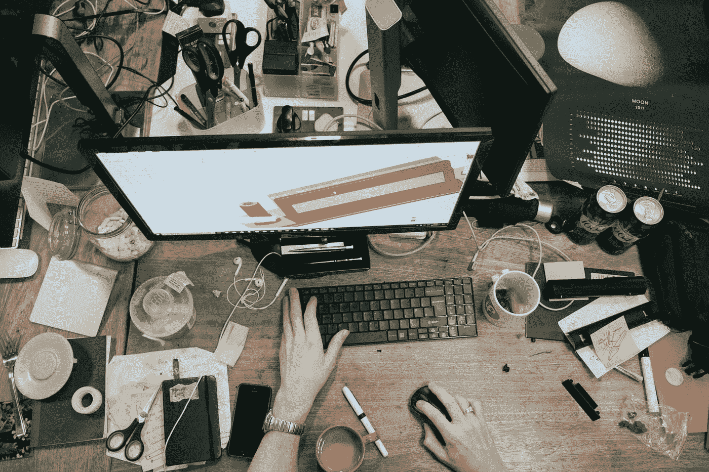

# 那些“如何远程工作”的文章在危机时期并不适用

> 原文：<https://medium.datadriveninvestor.com/those-how-to-work-remotely-articles-dont-apply-during-a-crisis-51f6b5e7f50a?source=collection_archive---------12----------------------->

## 前所未有的时代呼唤超越基本生产力技巧的现实建议

Photo by [Robert Bye](https://unsplash.com/@robertbye?utm_source=medium&utm_medium=referral) on [Unsplash](https://unsplash.com?utm_source=medium&utm_medium=referral)

我已经写了很多关于远程工作的文章。我已经写了它的好处，为什么它比在办公室工作更有意义。我已经吹捧了生产力技巧和日常习惯和惯例的重要性。

尽管在过去的几周里，我已经看到该内容的流量显著增加，但我给出的大多数建议并不适用于我们此时此刻的生活。

看到如此多的机会主义营销者利用这场危机作为理由，重新推出他们的“如何成为一名远程工作者”课程，或者打着做社会公益的幌子，提供他们的生产力工具的免费试用，这让我很恼火。

现实是，无论有多少关于目标设定、日常工作和生产力的建议，都无法让人们准备好面对在可预见的未来，他们的整个生活会自动改变的可能性。

 [## 艾预测:“颠覆，然后是生产力”|数据驱动的投资者

### 人们越来越担心，随着机器学习和互联网的普及，所有白领工作都将消失

www.datadriveninvestor.com](https://www.datadriveninvestor.com/2018/08/06/ai-forecast-disruption-then-productivity/) 

当然，这些建议在表面上是有帮助的，可以作为解决我们眼前问题的创可贴。但是，世界正在经历一场根本性的转变，使用过去的工具无法解决这个问题。

给员工发送一些新工具、技术和物品，并期望他们在家照常工作，这是不合理的。

## 远程工作有一个学习曲线

在我开始自由职业之前，我申请了近 200 份远程工作。通过这些申请，我参加了大约 15 次面试。在每一次面试中，我都被问到同样的问题。

“你有远程工作的经验吗？”

直到后来我开始与远程企业密切合作，我才明白远程工作需要一套独特的技能，而这些技能与你的职位或行业无关。远程工作需要一定程度的自主、服从和自给自足，这不是一朝一夕可以教会的。

你需要自主，但也需要能够彻底有效地沟通。你需要能够清楚地说出你所遇到的问题，而不能坐下来和别人分享你的经历。你需要有无懈可击的时间管理技巧，甚至更好的自律。它要求你异步工作，并在团队其他成员不在的时候自己解决问题。

这些技能不难学，但它们以新的方式挑战你，而你可能不会每天在办公室工作。

因此，当人们在从未有过远程工作经验的情况下被扔进远程工作环境时，你需要预见到前进道路上的一些障碍，这些障碍无法通过基本的生产力黑客来解决。适应这种全新的工作方式需要时间。

## 惯例已经过时了

你上一次在办公室和你的家人、孩子和宠物一起工作，同时强迫自己洗手，避免和外界接触是什么时候？

“形成一个惯例，”他们说。在任何其他情况下，是的，形成一个常规是在家工作时找到平衡的关键。他们没有说的是，你怎么也无法创造出一个套路，来控制你身边所有人的行动。如果你是一个家庭，现在都在家里，形成一个惯例可能是不可能的。现在，你的日常生活必须足够灵活，以围绕你生活中的人为中心，除非你想在我们的房子里采取同样严厉的措施，迫使人们呆在自己的房间里，而你却在客厅的一个良好的 wifi 角落里接你的 Zoom 电话。

在自我隔离的同时，我们没有控制环境的奢侈。我们必须适应形势，这说起来容易做起来难。

## 人们全神贯注

即使在“正常”时期，在家工作也伴随着相当多的干扰。有时候，你可以通过在咖啡店或共同工作空间工作，或者等到你的孩子去上学，来减少这些干扰。

除了不得不工作，人们的思想也在螺旋式上升。每个人都担心自己的家人，朋友，自己。每天都有更多的坏消息，不确定性空前高涨。

期望人们把办公室工作带回家，保持同样的生产力水平，同时又担心当前世界的混乱状态，这是不现实的。

我们所能做的最好的事情就是努力适应眼前的情况，但是要让这种情况变得正常，需要的不仅仅是几篇关于远程工作的文章。