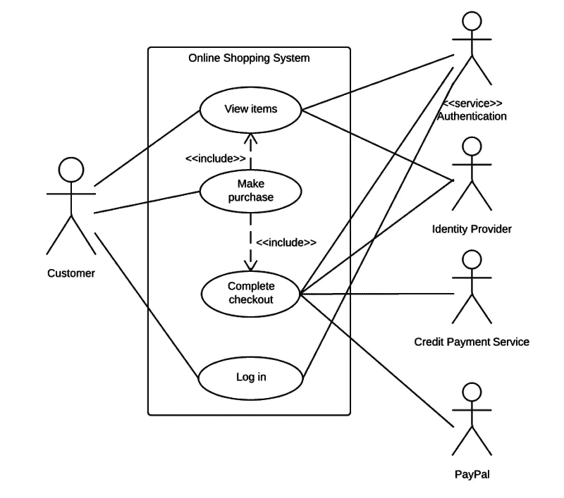
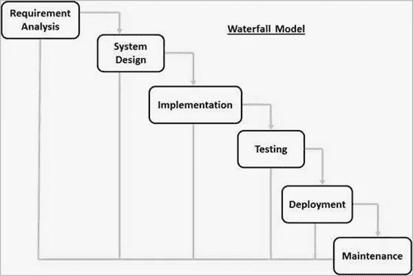

# 关于做软件项目经理的思考

> 原文：<https://medium.datadriveninvestor.com/thoughts-about-being-a-software-project-manager-3b753971cb42?source=collection_archive---------7----------------------->

## 关于软件领导力的思考。

Photo by [Austin Distel](https://unsplash.com/@austindistel?utm_source=medium&utm_medium=referral) on [Unsplash](https://unsplash.com?utm_source=medium&utm_medium=referral)

# 背景

## 该倡议

几个月前，我有了一个一直想实现的计划。在我一直工作的公司里，似乎缺少用于教学的文档，也没有用于团队间知识共享的媒介。我认为为了我们大家好，必须有一个。

所以我联系了 HR，提出了这个项目。帮助人们学习。因为我在一所大学校园工作，我想让学习管理系统(或简称为 *LMS* )也能为那里的学生所用可能是个好主意。

这是最初的计划。正如所有软件工程师都知道的，当需要收集需求时，需求并不是我真正想要的。这与其说是一个 LMS，不如说是一个 HR 信息系统。

嗯，我不介意。该系统的 LMS 部分仍然存在，我认为这是一个足够好的开始。

 [## 软件开发过程:如何选择正确的过程？数据驱动的投资者

### 软件是任何企业组织成功的生命线。没有软件的帮助，一个…

www.datadriveninvestor.com](https://www.datadriveninvestor.com/2020/01/16/software-development-process-how-to-pick-the-right-process/) 

因此，一个月后，用户接受了需求。也为我的项目分配了资源。

最初，我有一个 3 人团队。是我和另外两个人。当他们知道这个项目将使用他们从未使用过的新技术时，他们退出了。

*“嗯……”*，我想，*“又回到原点了”*。幸运的是，一年前，我是一些新学员的面试官之一。

## 召集船员

我和受训者的关系很好，这确实是一种幸运。

一年前，当我还是大学里的一名活跃分子时，我遇到了其中一位，我还采访了另一位。所以，我想他们希望有机会。

当该问的时候。他们说感兴趣后，我松了一口气。

> 有趣的是，第三个人从他的朋友那里听说了这个项目后也加入了。

我安排了我们四个人的第一次见面。在会议开始时，我说这将是他们学习新技能的机会。因为我想要一个相对现代的技术堆栈(2020 年)。一个 Vue 前端和一个. NET 核心后端。

就这样— *项目在*进行。

## 从此幸福地生活在一起——算是吧…

三个受训者的主要职责是代码，我的职责更多——更多*。*

*当然，我试着按常规做项目管理。我使用 Azure DevOps 上的虚拟板列出了所有的需求，我还安排了每周会议来计算项目的速度。*

*我以为这样就够了— *男孩我错了*。*

*首先，我可能有点太依赖培训生了，我需要比我想象的更多的支持他们。我没有责怪他们，是我没有充分考虑他们的技能。*

*第二，我认为我的需求收集技能还有很大的提升空间。我分析了一些错误的特性，得出了非常矛盾的结果——*最后我不得不清理这个，毕竟是我的错*。*

*因此，我现在是一名项目经理，指导培训生，确定我所有的需求，与公司的技术人员交谈，确保一切都是安全的、可靠的和最佳的实践。好家伙…那是一次经历。*

*老实说，我为我领导的人感到难过，因为他们可能比我更困惑。虽然我总是尽力帮助他们解决问题。我向他们保证他们会学到一些东西，我是认真的。*

# *我学到了什么*

## *犯的错误*

*我做程序员已经 3 年了，我想是时候领导我自己的团队了。我不会说这既不容易也不轻松。这是一次紧张的经历，一路上犯了很多错误。*

*我很幸运，我的团队是由渴望学习的受训者组成的，因此他们仍然继续通过我低于平均水平的项目管理技能。*

*虽然是个初学者。*

*当了项目经理后，我现在能理解项目领导或团队领导需要做什么。这就是为什么那些角色编程较少，需要更多的时间来*字面上*管理正在进行的项目。*

> *如果负责人专注于做好项目管理，就能做好项目管理。*

*那一刻我有点捉襟见肘。我需要帮助学员解决他们不能解决的问题，同时考虑项目和整个代码库的安全。*

*这真是一场争论。*

*我不想说我很忙，而是说我不能专注于我应该做的事情，管理项目。*

*明智的系统分析，我可以自信地说——我不擅长，还有很长的路要走。*

*我没有好的设计文档可以查阅，只有一些关于如何制作的笔记。所以我不得不*阅读*我想做的事情，可能用户图或者应用程序流程图会有帮助。*

*我知道这是软件项目 101，但我诚实地说，我错过了。**我真的搞砸了**。*

**

*An example of a use case diagram or UML on [Pinterest](https://id.pinterest.com/pin/554646510350923293/)*

*现在看看这个图表，你能想象当我们想要创建这个应用程序时需要多少个角色吗？它写在图上，一清二楚。*

*现在想象一下，没有图表，试图通过文字来理解这个系统。更好的是，试着把这个图表翻译成一个段落。祝你好运！我没有做这个，它让我无限期地忘记了我想做什么。这是一个很大的教训。*

*功能方面应该有一个清晰的应用流程来解释系统如何工作，用户如何注册，等等。*

*遗憾的是，我也没能成功。这导致了我手下的受训人员的混乱。它显示了一个意图良好的项目是如何变成一个复杂的项目的。*“要是”*，我对自己说，*“我就这么干了”*。*

**

*A waterfall model from [Tutorials Point](https://www.tutorialspoint.com/sdlc/sdlc_waterfall_model.htm)*

*我使用瀑布作为软件开发生命周期，因为需求是不变的，用户也不是很麻烦。*

*这进一步扩大了我的错误，因为— *瀑布绝对需要这种图表。**

*需求是不变的，最好从一开始就制作图表来帮助预先理解系统。*

*然而，如果我使用敏捷，我的巨大不幸可能会被原谅一点点。因为如果你要使用敏捷，即使最初的设计文档*非常重要*，需求是不固定的，因此你可能没有时间继续制作设计文档，必须继续编程以在截止日期前完成项目。*

*我不是说设计文档不重要，绝对不是。我只是想暗示，需求是不断变化的，你制作的设计文档与最终产品略有不同，这是可以原谅的。*

## *一种领悟*

*我意识到为什么项目管理角色不应该过多地陷入编程中是很重要的。有很多事情需要一个项目经理来安排，比如做设计文档，管理团队的工作量。*

****向所有做得好的项目经理致以深深的敬意。****

*当然，最终，这并不是项目的全部，而是与团队成员的互动非常重要。*

*关于这方面，我觉得我做得不错。我和我所带领的学员之间的关系得到了改善。我们交流得更多了，我们可以像朋友一样一起开玩笑。我能够教他们，并与他们清楚地交流我的想法。*

*在我看来，我认为在社交方面我已经足够可行了。与上级和其他团队的沟通也很好。*

*最终，该项目计划进入第二阶段的开发。我有其他项目，所以我不会继续我的角色。因此，项目经理的角色将落到其他人身上。*

# *结论*

*总之，我非常享受领导自己项目的机会。它真的帮助我了解了我在领导力方面的缺陷，并给了我一条进一步提升自己的道路。*

*该公司很好地接受了这个项目，因为他们计划进行第二阶段来进一步开发它，使它变得更好。*

*成为发起人真的是梦想成真。给所有相信的人。谢谢你。我们犯了错误，但从中我们学到了新的东西。关于这一点，这里有一个很好的引用来结束它。*

> *大师失败的次数比初学者尝试的次数还要多*

**原载于 2020 年 6 月 26 日 https://www.datadriveninvestor.com***。***

****访问专家视图—** [**订阅 DDI 英特尔**](https://datadriveninvestor.com/ddi-intel)**