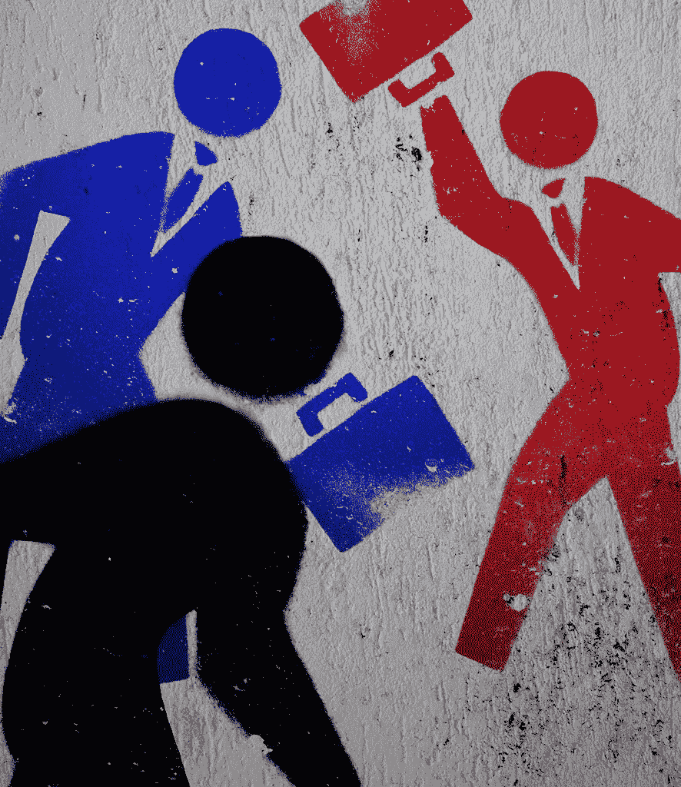
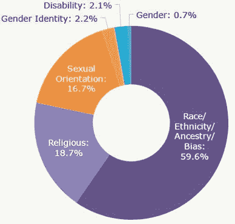

# 对第一场辩论的思考

> 原文：<https://medium.datadriveninvestor.com/thoughts-on-the-first-debate-54cc4aeb22ba?source=collection_archive---------25----------------------->

试图理解这一切。

[“Right-Wing Republicans vs. Corporate Democrats vs. Progressive Populists”](https://www.flickr.com/photos/42269094@N05/4995090651) by [Truthout.org](https://www.flickr.com/photos/42269094@N05) is licensed under [CC BY-NC-ND 2.0](https://creativecommons.org/licenses/by-nc-nd/2.0/?ref=ccsearch&atype=rich)

前几天晚上我有点离题了。2020 年的第一场总统辩论播出了，这让我很害怕。在一个角落里，奇托·墨索里尼(Cheetoh Mussolini)，我指的是唐纳德·特朗普(Donald Trump)，扮演了一个尖叫的蹒跚学步的孩子，他的午睡时间被过早地打断了。在蓝色角落，乔·拜登——宾夕法尼亚州斯克兰顿的儿子——毫无疑问，他更像华尔街，而不是工人阶级。

这场辩论是一场彻头彻尾的垃圾秀，应该既能吓住我们，又能激励我们。特朗普、拜登和主持人克里斯·华莱士(Chris Wallace)之间的三方大喊大叫比任何所谓的俄罗斯宣传努力都更能凸显美国立即变革的必要性。

对于一个公然冷酷无情、剥削成性的帝国来说，这是一件尴尬的事情。

太阳马戏团----大约 90 分钟，开场是两位候选人关于最高法院的声明，此前 Ruth Bader-Ginsburg 大法官刚刚去世。这是一个恰当的开球，因为它确立了当晚的总体水平。

特朗普代表他提名的最高法院候选人艾米·科尼·巴雷特(Amy Coney Barrett)主张。拜登解释说，美国人民应该在最高法院法官的任命上有发言权，等到选举结束后才是尊重这种想法的最公平的方式。

猪食。是的，一个亲企业的、九头蛇般的司法对居住在美国简陋围墙内的人们来说是一种威胁。然而，解释说多等几个月是更民主的过程是令人眼花缭乱的，是对民主本身的蔑视。

Biden calls a voter “a damn liar” and “fat” while on the campaign trail.

我最想做的就是推迟或放弃任命，但声称新总统任期的头几个月比另一个总统任期的最后几个月更合适，这是最大的机会主义和鹰派。这和认为两党制会产生竞争是一个层次的笑话。

那天晚上进行的问题是不负责任的浅薄。2020 年，困扰有线新闻频道的四五个主要标题让观众们大开眼界。主要是:种族和内乱、新冠肺炎、经济，当然还有川普的税收。

 [## 政客和 AI。国家战略能成功吗？数据驱动的投资者

### 政治家们越来越意识到与人工智能相关的技术发展的各种后果

www.datadriveninvestor.com](https://www.datadriveninvestor.com/2020/06/15/politicians-and-ai-can-national-strategies-succeed/) 

侮辱被投掷，但没有洞察力。国王式的自我评价盛行。这应该让你感到恐惧。

我很难想象 9 月的某个夜晚会让美国公众比现在更加被政府剥夺权利。但是，唐纳德·特朗普和乔·拜登成功做到了。除了几段令人难忘的引言之外，这些乱七八糟的东西基本上没什么实质内容。

这类声明中最值得注意的两个时刻是，拜登为他的儿子与毒瘾的斗争进行辩护，特朗普向一个白人至上主义团体“骄傲的男孩”下令“退后，袖手旁观”。

对许多美国人来说，这些精选的时刻可能是最大的收获。拜登为像他的儿子亨特·拜登这样已经或继续与毒瘾斗争的人辩护，是我在竞选中听到他说的最真诚和最人道的话。类似地，特朗普的《骄傲的男孩》大声疾呼，用粗体字表达了他明显的白人至上主义思想。华莱士迅速转移话题，避开了种族问题，真是锦上添花。

但是，将我们的外卖限制在这些时刻是一个危险的错误。

将我们对副总统拜登的儿子的看法局限于一个康复的瘾君子是短视的，这给了未来的乔·拜登类型的人公开从肮脏的政治游戏中获益的机会。我们可以尊重亨特的斗争，但不能忘记他和他的父亲在[乌克兰](https://theintercept.com/2019/12/07/joe-biden-iowa-voter-hunter-damn-liar/)、[中国](https://theintercept.com/2019/05/03/biden-son-china-business/)以及推而广之的俄国所签署的不道德的利益冲突。

Aaron Maté with Max Blumenthal on The Grayzone’s *Pushback program.*

同样，将川普对民族主义和反黑人的命也是命言论的持续推动斥为“法律和秩序”让无数美国人继续受到迫害。对极端暴力的国内恐怖组织的呼吁置若罔闻与常见的特朗普口号如“所有生命都很重要”和“支持蓝色”相对立。

虽然特朗普和其他右翼领导人声称 Antifa 和其他左翼团体是国内安全的最大威胁，但[数据证明了相反的情况](https://www.adl.org/news/press-releases/adl-report-white-supremacist-murders-more-than-doubled-in-2017)。

Bias Motivation Categories for Victims of Single-bias Incidents in 2018 via www.justice.gov

在这种无脑的洛基诉克里德奇观的表面之下，是一个两党的事实，即政府认为公众不值得谈论大多数话题。例如，拜登急于抨击特朗普每分钟 750 美元的联邦税收，但不会触及资助他的竞选活动和窃取穷人的华尔街大亨——正是他和奥巴马总统十年前救助的强盗大亨。今年早些时候，特朗普重复了这一灾难。

我们不需要听特朗普是否喜欢戴面具，但那是他们告诉我们的。面具，支持警察，语无伦次的左派诽谤。拜登从未说过“黑人的命也是命”这个词。他多次反对广受欢迎的民主党人伯尼·桑德斯(川普多次提到这一点)。双方都没有触及外交政策，也没有提出具体的行动计划，因为双方都在寻求实现同样的目标。

控制所有人和所有事。

对于拜登或特朗普的每一句俏皮话和每一记重拳，我都听到了选择性的沉默。没有对俄罗斯和中国等大国的核战争威胁发表评论。美国与伊朗的关系已经被遗忘。美国与实施种族隔离的以色列的联盟也是如此，美国通过朱利安·阿桑奇引渡审判干预拉丁美洲国家和联邦政府对媒体的攻击也是如此。[一词的制裁也没有出现](https://thegrayzone.com/2020/08/13/us-lebanon-sanctions-regime-change/)。

这些不应该被记为疏忽或健忘:相反，它们是战略性的计算。

如果对总统职位的争夺淡化为这个家伙对那个家伙的口头攻击，政府可以继续不受惩罚地走向全球独裁统治。当我们谈论的主要问题是辩论有多混乱时，政治领袖和寡头们一边吃着一百美元的牛排，一边维持现状。

2020 年的第一场总统辩论需要为所有美国人敲响警钟。如果我们继续袖手旁观，什么都不会改变——不管 11 月 3 日哪个袜子木偶赢了。对于像我一样反对特朗普法西斯统治的人来说，现在是推动拜登变得更好的时候了。

拜登的表现几乎没有激发亲民主党的动机。事实上，特朗普令人不安的骄傲男孩评论是投票给拜登的最大原因。如果这种不幸的趋势继续下去，我担心拜登可能会在 10 月结束前就已经死了。

## 获得专家观点— [订阅 DDI 英特尔](https://datadriveninvestor.com/ddi-intel)