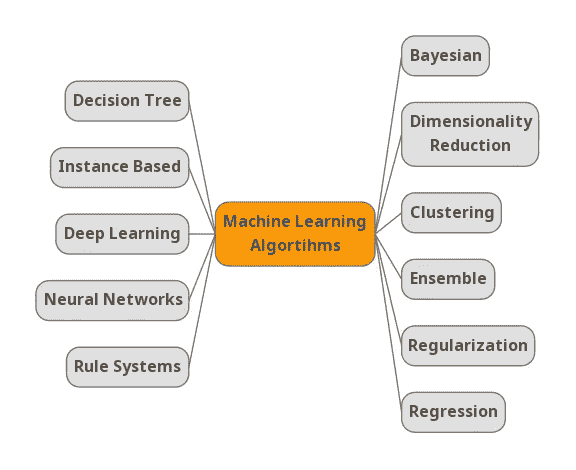

# 相关性和自动化如何用于主动网络防御？

> 原文：<https://medium.datadriveninvestor.com/threat-correlation-techniques-bcf62fd4467d?source=collection_archive---------5----------------------->

## 由于网络威胁形势日益复杂，来自世界各地和各种情报来源的信息量和威胁不断增加，组织还必须通过不断积累威胁情报来不断提高其网络防御能力

为了应对不断增长的威胁规模和复杂性及其带来的风险，组织需要一个有效的威胁关联体系结构。确保组织的安全基础架构覆盖所有可能的威胁入口是一回事，但确保主动保护则完全是另一回事。面对不断增加的威胁信息和对组织的威胁，他们必须通过积累威胁信息来不断提高网络防御能力。

关联日志对于改进安全入侵的检测、改进系统优化和网络取证中的连接点具有重要价值。事件关联技术已经被开发出来，用于识别事件、赋予事件意义以及分配适当的控制和措施。这是一种侧重于预防而非响应的策略，但是有许多不同类型的事件关联技术可用于威胁关联架构。

网络安全关联和自动化(CSCA)解决方案是集中和关联网络数据以改进威胁检测和分类的理想选择。它们使组织的攻击面完全可见，并在网络攻击对公司造成伤害之前阻止它们。了解哪些威胁是活跃的，可以帮助网络管理团队通过改善每个组织独特的安全环境，集中精力加强法律防御。

 [## 如何使用自动化从您的数据中获得更多价值？数据驱动的投资者

### 去年的新闻故事不停地谈论机器学习变得多么先进。电脑现在…

www.datadriveninvestor.com](https://www.datadriveninvestor.com/2020/02/27/how-to-use-automation-to-get-more-out-of-your-data/) 

关联和自动化工具可用于关联和识别趋势和模式，但也可用作补救工作流，尤其是用于验证。它们允许用户对结果进行评估和分类，并有助于发现已知的漏洞、问题和弱点。有必要利用它们来提高对网络安全威胁及其对本组织影响的认识

这些工具能够识别和发现各种组件(如 web 浏览器、web 服务器和 web 应用程序)中的漏洞。他们通常会建议您某个组件是否是最新的，是否有可用的补丁程序，或者它是否有已知或已记录的漏洞。

## 动态重构

关联和自动化工具的一个例子是动态重新配置。为了阻止攻击，组织必须对信息系统进行“动态重新配置”,以误导攻击者，隔离系统组件，从而限制违规或危害造成的损害程度。考虑到有效打击复杂的网络威胁，这一步是必要和重要的，因为网络罪犯只需要找到一个漏洞就可以发动攻击。因此，主动行动是成功防止数据泄露的关键。

## 威胁和事件关联

威胁关联技术的使用是将原始数据转化为可操作见解的强大工具。威胁关联工具对于实时识别组织内的威胁源非常有用。有效的威胁关联是防御已知威胁的最重要工具之一。那些监控已知和未知威胁(如勒索软件、网络钓鱼和网络攻击)的信息流的人，可以轻松地检测到黑客反复用来尝试访问资源的常见威胁。

## 通过机器学习进行威胁关联

用户不必手动分析大量数据、创建算法并在系统上运行它们，而是可以通过更精细、更规范的工作以及使用自动化和机器学习来提高效率。

不幸的是，机器学习算法通常无法为网络威胁管理提供为什么威胁被视为可疑的清晰画面。尽管您需要的威胁关联很简单，但是您将能够找到与您现有的网络风险管理能力很好地集成的解决方案。它模拟正常网络行为，检测网络异常，并检测与正常网络行为相比何时发生了异常情况(例如，网络流量、网络活动、流量模式等)。).

简而言之，对于人类分析师来说，在网络威胁环境中有效管理网络活动与威胁检测和响应活动之间的相关性通常是困难且耗时的。无论您是依赖内部还是外部提供商来满足您的安全需求，它们都有一个共同点。行业中的每个组织都必须证明威胁相关性的使用是其安全策略的关键组成部分。

**引用来源**

*   [https://www . gray log . org/post/importance-of-event-correlation-techniques-in-siem](https://www.graylog.org/post/importance-of-event-correlation-techniques-in-siem)
*   [https://digital guardian . com/blog/what-event-correlation-examples-benefits-more](https://digitalguardian.com/blog/what-event-correlation-examples-benefits-and-more)
*   [https://www . exa beam . com/siem/siem-threat-detection-rules-or-models/](https://www.exabeam.com/siem/siem-threat-detection-rules-or-models/)

## 获得专家视图— [订阅 DDI 英特尔](https://datadriveninvestor.com/ddi-intel)