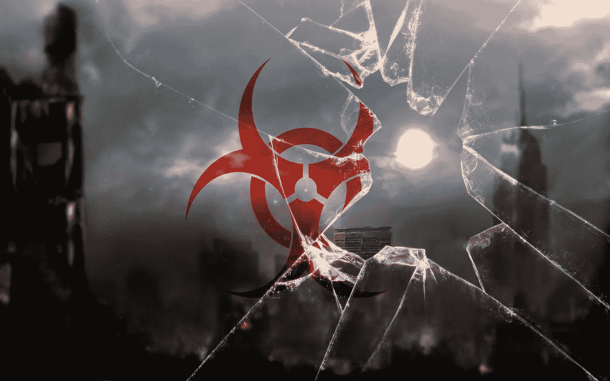
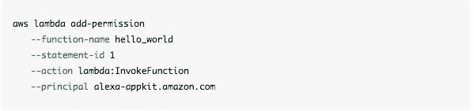

# 科技诊断冠状病毒的三种惊人方法

> 原文：<https://medium.datadriveninvestor.com/three-amazing-ways-technology-can-diagnose-coronavirus-aa7f750d5c40?source=collection_archive---------12----------------------->

Biohazard-Wallpaper Safari

生物学家所知的冠状病毒或病毒体直径只有约 200 纳米，它正在像野火一样蔓延全球。

但是你怎么知道你什么时候得了冠状病毒或者普通流感呢？

你可以去做测试？

然而，一个更有趣的问题是技术如何远程诊断你…有时甚至不需要你的同意。

**社交媒体挖掘**

最初，当我们生病时，我们不得不向家人抱怨。然后他们发明了钱和工作，这样我们终于可以向同事抱怨了。工作中的人们后来发明了电脑，随着时间的推移，互联网也发展了起来。人们厌倦了互联网，想要聊天，这导致了社交媒体的巨大胜利。

但是当局仍然想知道我们在说什么。首先，国土安全部指示社交媒体巨头关注网络上关于犯罪和恐怖威胁的聊天。然后流感来了。

 [## 认知计算——一套被广泛认为是……

### 作为它的用户，我们已经习惯了科技。这些天几乎没有什么是司空见惯的…

www.datadriveninvestor.com](https://www.datadriveninvestor.com/2020/02/19/cognitive-computing-a-skill-set-widely-considered-to-be-the-most-vital-manifestation-of-artificial-intelligence/) 

谷歌是第一个监测我们每年与流感斗争的公司，他们停止了流感趋势服务。五年前，谷歌宣布这些数据不稳定且不可靠后，取消了这项公共服务。然而，现在学院和大学仍然可以购买这些数据。流感趋势的下降为社交媒体进入流感监测业务打开了大门。四年前，斯坦福大学在推特上举办了一场关于健康数据挖掘状况的 T2 研讨会。他们发现，自然语言处理(NLP)擅长识别人们在推文中抱怨的特定医疗症状。通过分析人们的情绪，可以进一步了解他们对疾病的情绪。IBM 提供了用于分析用户情绪的[语气分析器](https://tone-analyzer-demo.ng.bluemix.net/?_ga=2.249899269.26845667.1586131175-1033102339.1586131175&cm_mc_uid=39181168031515861311730&cm_mc_sid_50200000=42021321586131173088&cm_mc_sid_52640000=61001061586131173138)工具，你可以用合适的专业知识构建一个社交媒体 API。科学家已经使用情绪分析来更好地了解人们对大麻等药物使用的反应，但情绪分析的有效性受到推文持续时间短的限制。

构建健康情感系统不需要高层次的工程知识。IBM 已经提供了工具。

**虚拟助手**

你不再孤单。总有人在听。你的亚马逊智能音箱在监听，或许你的谷歌音箱也在监听。我希望我可以说这是一个严格保密的秘密，但在一名前亚马逊工程师意外发现该设备重复了他早些时候输入的命令片段后，人们至少在四年前就知道了。人们还收到了从其他亚马逊客户的扬声器中错误发送的音频文件。

实现健康监视功能不需要高级编程技能。你只需要用一个自定义技能训练 Alexa。

首先，创造一项技能并训练它识别疾病，*“咳！咳！”*。跳过响应。您还可以为疾病添加额外的触发因素。

有了这个技能，你现在可以创建一个定制的 [Lambda](https://developer.amazon.com/en-US/docs/alexa/custom-skills/host-a-custom-skill-as-an-aws-lambda-function.html#configuring-the-alexa-skills-kit-trigger) 函数来将这个技能的责任推到云端。

Amazon Lambda function

Alexa 一直在听你说话。当你生病时，亚马逊很可能会第一时间知道。

**面部识别**

未经授权的监视通常会得到一个坏名声。你不希望你的政府或雇主一直盯着你。

但是如果监控可以远程诊断你的疾病并帮助你呢？

中国的人工智能初创公司 [SenseTime](https://qz.com/1803737/chinas-facial-recognition-tech-can-crack-masked-faces-amid-coronavirus/) 开创了使用监控摄像头检测公民合规性和总体健康状况的应用。中国目前的人口超过 10 亿，对任何人来说实时监控几乎是不可能的任务。AI 可以通过训练算法来识别人们戴口罩的合规性，从而增强这项任务。通过额外的训练，算法可以进一步识别你是否发烧，甚至你的个人身份。中国已经在利用这项技术逮捕和识别违反冠状病毒封锁的公民。

**最后的想法**

这些自动监控方案代表了未来健康诊断的一个非常奥威尔式的前景。当这些措施在没有得到客户同意的情况下实施时，它们可能会被视为一种比疾病更糟糕的治疗方法。然而，当这些工具被插入到有用的应用程序中时，它们可以在疾病严重之前通知人们，从而破坏医疗保健的实践。