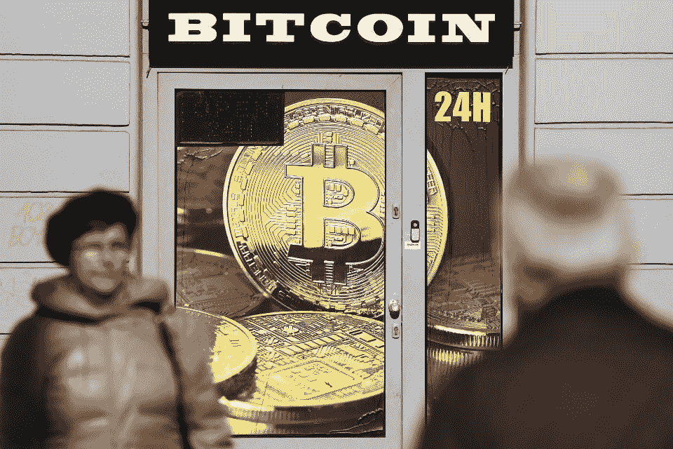
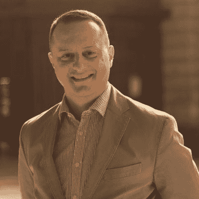

# 三箭资本在 B 轮融资后投资 BlockFi

> 原文：<https://medium.datadriveninvestor.com/three-arrows-capital-invests-in-blockfi-after-its-series-b-round-4d09cf713654?source=collection_archive---------22----------------------->

A Bitcoin exchange shop in Krakow, Poland on March 5, 2019\. (Photo by Jakub Porzycki/NurPhoto via Getty Images)

BlockFi 今天通过新闻稿宣布，它已将三箭资本作为公司的战略投资者。总部位于新加坡的三箭资本(Three Arrows Capital)是一家注册对冲基金和加密货币投资者。BlockFi 是一家专门从事加密贷款的金融服务公司，它积极地想要扩展到全球市场。

BlockFi 没有对投资规模发表评论。

BlockFi 的联合创始人兼运营副总裁 Flori Marquez 在接受采访时表示，“从短期来看，这将有助于我们接触更多的机构贷款人，但从长期来看，我们希望这将有助于我们在美国以外的零售扩张，”Marquez 女士还讨论了在区域合作伙伴的支持下向亚太地区扩张的机会。她接着说，“我们计划在新加坡开设一个办事处，专门为这些观众服务。”

 [## 数字货币、区块链和货币的未来|数据驱动的投资者

### “区块链”、“加密货币”、“令牌化”，以及现在的“央行数字货币”已经成为…

www.datadriveninvestor.com](https://www.datadriveninvestor.com/2020/02/18/digital-currencies-blockchain-and-the-future-of-money/) 

“作为 BlockFi 的机构客户，我们很快认识到，该公司帮助扩大加密货币生态系统的使命与我们的空间理念一致，”三箭资本联合创始人兼首席执行官苏竹表示。“我们与 BlockFi 有着良好的关系，当有机会更多地参与投资者层面时，答案是显而易见的。BlockFi 以令人印象深刻的速度增长，我们期待帮助推动该公司在全球市场上向前发展。”

BlockFi 首席执行官兼联合创始人扎克·普林斯(Zac Prince)表示，“让苏竹和三箭资本的团队加入进来，与我们专注于机构服务产品的国际扩张非常契合，这是我们今年的战略举措之一。”

在[推特](https://www.twitter.com/@robertanzalon15)或 [LinkedIn](https://www.linkedin.com/in/robertanzalonejr/) 上关注我。点击这里，查看我的其他作品[。](https://medium.com/@ranzalonejr)

*原载于*[*https://www.forbes.com*](https://www.forbes.com/sites/robertanzalone/2020/04/09/three-arrows-capital-invests-in-blockfi-after-its-series-b-round/)*。*