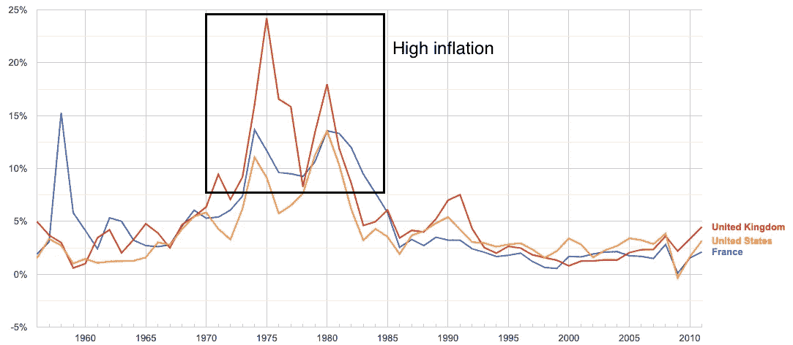
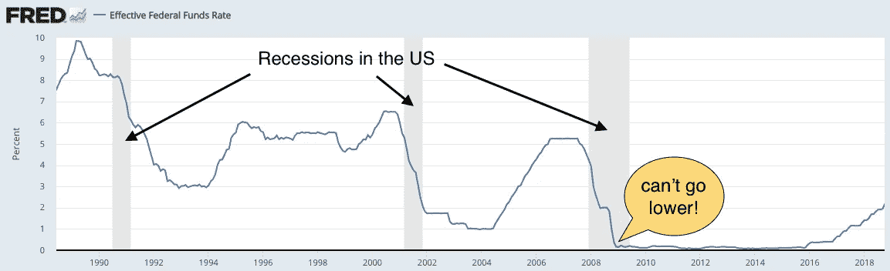
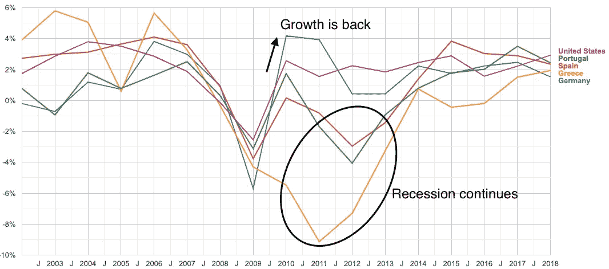

# 三个世纪的经济学

> 原文：<https://medium.datadriveninvestor.com/three-centuries-of-economics-66b8a1c3febf?source=collection_archive---------19----------------------->

如何对抗经济衰退？几个世纪以来经济学家的答案。

[*Voir aussi:version Fran aise(法语版)*](https://www.blog.almacha.org/post/trois-si%C3%A8cles-de-science-%C3%A9conomique)

# 第一批经济学家

18 世纪之前没有真正的经济学家。这就是我们所说的经济学的石器时代。政府使用天真的经济理念，比如:“我们必须阻止人们购买非本国商品。通过这样做，黄金将留在我们的边界内，使我们更加富有！”

但是经济学家将会改变一切。第一位著名的经济学家亚当·斯密仔细研究了他那个时代的经济。他注意到，许多事情在没有任何政府干预的情况下运转良好，有时甚至更好，只要让人们自由互动，交换商品和服务。

许多经济学家将遵循他的想法，并给出类似的建议。例如，固定最低或最高价格是一个坏主意，因为它妨碍了供求定律的正常运行。为了提高人民的生活水平，需要让经济行为者自由互动。今天，我们称这些观点为经典自由主义，但它们在当时是革命性的。在这些时候，政治家们确信他们在试图控制经济的同时做出了明智的决定。

这种向更自由经济的转变是成功的。接下来是一个漫长的增长时期，这极大地改善了整个人口的生活条件。

# 经济衰退

这种自由经济在全球范围内是好的，但也有暂时的挫折。经济衰退时有发生:增长停止，失业率突然上升。但这并没有持续很长时间，经济很快就回到了正轨。新的增长弥补了衰退的损失，就业回到了衰退前的水平。经济学家的反应是，我们需要接受这些更艰难的时期，等待增长的回归。一些经济学家甚至认为衰退实际上有助于摆脱效率低下的公司。当时，这些结论似乎在全球范围内令人满意。

# 大萧条

但是一切都将改变。1929 年，一场剧烈的经济衰退开始了。工业化国家的失业率达到 20%到 30%不等。正如我们后来所知道的，这种经济环境会助长希特勒的崛起。

这时，经济学家约翰·梅纳德·凯恩斯出现了。在这一点上，危机是如此严重，以至于许多知识分子开始认为我们应该放弃资本主义，转而采用像苏联那样的社会主义，这在当时吸引了许多知识分子。但对凯恩斯来说，资本主义经济就像一辆汽车，除了起动机坏了之外，所有部件都完好无损。我们不需要报废汽车，只需要修理损坏的部件。

凯恩斯理论认为，问题在于总需求不足**。需要明确的是:与经济生产能力相比，人们和公司没有购买足够的商品和服务。根据经典经济学家的说法，供求法则将自动解决这个问题:工资和价格将会下降，经济将会达到一个充分就业的新平衡。**

**但是这种现象是缓慢的，因为**工资粘性**。老板不能某一天说:“让我们把工资减少 30%！”。与员工的合同需要得到履行，商定的工资不能改变。另一方面，有可能解雇人，这就是发生的情况。当然，从长期来看，工资无论如何都会下降，因为害怕被解雇的员工会接受减薪，而新雇佣的员工会接受更低的工资。根据经典经济学家的说法，这些机制将在长期内摆脱衰退。但对凯恩斯来说，“从长远来看，我们都死了”，这是一种表示我们不能坐等情况好转的方式。我们需要现在就行动起来，走出这场危机。**

# **凯恩斯的策略**

**立即行动？但是我们该怎么办呢？凯恩斯建议使用两种工具:**

*   **货币政策:中央银行可以降低利率来鼓励企业家借更多的钱。然后他们会用它来建造新的工厂。建造这些建筑需要更多的劳动力，这就需要雇佣新的工人。**
*   **财政政策:政府可以通过启动基础设施工程(道路、桥梁、隧道……)来临时增加支出，以弥补“缺失”的总需求。建设这些也将增加就业。**

**在凯恩斯时代，利率已经很低了，所以凯恩斯认为使用财政政策会更有效率。重要的是引发一个良性循环:如果人们重返工作岗位，他们将有新的薪水可花，并将这笔钱花在商店里，商店可以雇佣新的工人，等等。**

**你可能会忍不住说:“我知道发生了什么:政府听取了凯恩斯的意见，这是一个巨大的成功，这也是他出名的原因。”事实上不是这样。政府并没有真正听取凯恩斯的意见。**

**时光流逝，衰退仍在继续。在接下来的几年里，希特勒在德国掌权，然后第二次世界大战开始。但美国也会参战，这需要大规模的公共支出。从经济角度来看，这在美国起到了财政刺激的作用。而且很管用！经济回到正轨，即使在战争结束后仍保持持续增长。凯恩斯的支持者，我们现在称之为凯恩斯主义经济学家，将此视为他们理论的证据。**

** [## 对有商业头脑的投资者有用的行为经济学概念|数据驱动的投资者

### 在美国企业界，高斯统计，对我们周围世界的确定性解释，以及理性…

www.datadriveninvestor.com](https://www.datadriveninvestor.com/2020/07/09/helpful-behavioral-economics-concepts-for-the-business-minded/) 

# 70 年代的通货膨胀

在接下来的几年里，凯恩斯主义的方法将被用来和滥用来对抗衰退。到了 70 年代，事情开始出错…

对政治家来说，凯恩斯经济学感觉像魔术一样:它允许仅仅通过降低利率来降低失业率。所以让我们全力以赴实现充分就业吧！但奇怪的是，失业率似乎无法低于某种不可理解的门槛(T2 约为 4%，美国约为 3%)。

还有一个新问题:非常高的通货膨胀率，在工业化国家约为 10%。**通货膨胀**是对一个经济体中价格上涨幅度的衡量，基于一组经常购买的商品的平均值。10%的通货膨胀意味着你放在银行账户上的钱一年后基本上会失去 10%的购买力。短短 8 年内，它将失去一半的价值。

Annual inflation. Source: [OECD Factbook 2013 on Google Public Data](https://www.google.com/publicdata/explore?ds=ltjib1m1uf3pf_&ctype=l&met_y=cpi_t1&hl=en#!ctype=l&strail=false&bcs=d&nselm=h&met_y=cpi_t1&scale_y=lin&ind_y=false&rdim=country_group&idim=country_group:non-oecd&idim=country:USA:FRA:GBR&ifdim=country_group&hl=en_US&dl=en_US&ind=false)

一些经济学家，包括现在著名的**米尔顿·弗里德曼**、**、**指责中央银行的低利率。他们的工作发现了一个惊人的事实:如果我们把利率降得太低，对就业的积极影响就会停止，相反通货膨胀会开始上升。

为什么？我们可以直观的解释。在一个完美的劳动力市场中，每个人都可以很容易地找到一份工作，仍然存在一些最低水平的失业，例如，一些人可能在两份工作之间。如果我们试图进一步降低失业率，我们实际上会造成工人短缺，这使他们在谈判更高工资时处于有利地位。为了支付这些更高的工资，大多数公司提高了价格:这就是通货膨胀。

更糟糕的是，一旦通胀率达到 10%左右，它就会一直保持在这个水平。公司开始预期他们的支出会有 10%的通货膨胀率，所以他们在预期中提高了自己的价格。工人们也这样做，要求每年根据通货膨胀指数加薪。因此，公司看到了工资和供应商成本的增加，从而提高了自己的价格，如此循环往复。

对于经济学家来说，唯一的出路是通过大幅提高利率来人为引发衰退。失业率将会上升，工人们最终将不得不放弃合同中系统性的 10%加薪和指数化条款。公司将习惯于低通胀，并停止时不时地提高价格。

引发衰退听起来可能是一件疯狂的事情，但它确实奏效了，通胀回到了低于 5%的正常水平。

# 经济学家的共识

经济学家对这场灾难的记忆是，扩张性(低利率)货币政策有利于对抗衰退，但如果被滥用，可能会很危险。此外，我们需要密切关注通货膨胀。这一新的使命被赋予了中央银行:

*   如果通货膨胀过高，他们就会提高利率。
*   如果经济衰退发生，失业率将会上升，通货膨胀将会下降，可能会变成负数(这被称为通货紧缩)。为了解决这一问题，中央银行降低了利率，从而刺激了经济，降低了失业率，并将通货膨胀率提高到正常值。

普遍接受的目标是将通货膨胀率控制在 2%左右。为什么不把完美的价格稳定目标定在 0%呢？原因之一是，低通胀对企业是有益的，因为它允许企业在必要时逐步下调工资。在通货膨胀率为 2%的一年中没有加薪实际上是“实际”工资减少了 2%,因为这一工资购买力低了 2%。

在接下来的几年里，对抗衰退和通胀成为中央银行的专属责任，这意味着只有**货币政策**(玩弄利率)被使用，**财政政策**(暂时增加政府支出)被搁置不用。

为什么不用财政政策？一个问题是它需要决定资助什么，这是一个非常政治化的问题。这可能会导致长时间的争论和利益冲突。启动项目也需要时间，这延迟了对经济的影响。

这就是为什么经济学家和政府关注货币政策，并将这一任务委托给中央银行，中央银行被赋予了独立于政治权力的权力。这是为了防止政客们出于政治机会主义而临时“刺激”经济，例如在选举前。

# 2008 年的大衰退

这一新的经济管理战略将在 2000 年之前一直有效，但新的困难将会出现。2007-2008 年，美国的次贷危机引发了一场被称为“大衰退”的非常严重的衰退。

面对这种情况，央行知道该做什么，并降低利率。但这一次经济衰退如此严重，以至于他们需要把它一直降到 0%。这还不够！失业率持续上升，在美国和欧洲高达 10% [。](https://fred.stlouisfed.org/series/UNRATE)

Interest rate set by the Federal Reserve (central bank) in the United States. Data source: [https://fred.stlouisfed.org/series/FEDFUNDS](https://fred.stlouisfed.org/series/FEDFUNDS)

那么我们能做什么呢？凯恩斯主义经济学家回答:“就像在凯恩斯的时代！**应该使用财政政策**！“他们认为，政府必须增加支出，以填补私人支出的缺口。(我推荐这个很好的视频[世纪之战:凯恩斯与哈耶克](https://www.youtube.com/watch?v=LA1-1DlhuXU)，它以说唱的形式展示了双方的对立观点)

面对这场危机，美国遵循凯恩斯主义政策，奥巴马推出了 2009 年*美国复苏和再投资法案*，利用**财政政策**刺激经济。

除此之外，他们尝试了一种叫做量化宽松的新工具。这个想法是用中央银行创造的货币购买股票或债券。这些新的资金最终落入了前股东和债权人的口袋。然后，他们可以用这笔钱来资助新的事情，这将需要雇用人员，从而减少失业。然而，经济学家对量化宽松的有效性仍有争议。

# 欧洲的复杂情况

特别有趣的是，欧盟和美国对此次衰退的政治反应非常不同。尽管美国在联邦层面采取了明确的凯恩斯主义政策，但欧洲的情况要复杂得多。

不同的是，在欧洲，央行是欧盟级别的，而能利用信贷刺激经济的政府是欧盟的各个国家。欧盟的联邦预算很低，无论如何欧盟都不允许有赤字。这实际上与美国完全相反，在美国，各州不允许有赤字，而刺激政策可以在联邦层面部署。

除此之外，欧洲国家还面临债务信任问题:债权人担心政府可能不会偿还，因此他们提高了利率。为什么这突然成了一个问题？因为债务在衰退期间“自动”增加，因为社会支出增加(因为失业)而收入减少(买东西少=政府收税少)。

这导致欧洲政府实施紧缩政策，这与 T2 的凯恩斯主义财政刺激正好相反。实际上，这意味着他们增加税收，减少公共支出。极端的例子是希腊，该国面临债务危机，最终实施了激进的紧缩政策。

结果是实施紧缩政策的国家重新陷入衰退，而实施凯恩斯主义刺激政策的国家恢复了正常增长。凯恩斯主义经济学家将这些事件视为他们观点的证据。

Annual GDP growth rate. The crisis was longer in countries which implemented austerity policies (Greece, Portugal, Spain). Source: [World Bank data on Google Public Data](https://www.google.com/publicdata/explore?ds=d5bncppjof8f9_&ctype=l&met_y=ny_gdp_mktp_kd_zg#!ctype=l&strail=false&bcs=d&nselm=h&met_y=ny_gdp_mktp_kd_zg&scale_y=lin&ind_y=false&rdim=world&idim=country:GRC:DEU:USA:ESP:PRT&ifdim=world&tstart=1031608800000&tend=1536530400000&hl=en_US&dl=en_US&ind=false)

# 新冠肺炎危机:凯恩斯主义的胜利？

随着新冠肺炎的蔓延，我们面临的衰退甚至比 2008 年的大衰退还要严重。

面对全球需求下降，所有发达国家似乎都确信有必要实施凯恩斯主义政策。和上次经济衰退时一样，大多数央行将利率下调至 0%。不同之处在于，这一次，大多数富裕国家也采用了大规模财政刺激措施。

但是在欧洲，事情总是更复杂。大多数国家都想实施财政刺激，但那些负债累累的国家不敢过度使用，担心再次陷入债务危机。不幸的是，这些面临风险的国家恰恰是那些受经济衰退影响最严重的国家，比如意大利。面对这种情况，欧盟做出了历史性的决定，首次在联邦层面开展贷款，并准备在欧洲实施大规模的财政刺激政策。

这一时期标志着凯恩斯主义者的永久胜利吗？如何防止财政政策被用作偏袒本国公司从而扭曲竞争的手段？政府债务的利息会保持低水平，还是会出现新的债务危机？央行会失去独立性吗？这个时期提出了许多未来将会回答的问题…

## 获得专家观点— [订阅 DDI 英特尔](https://datadriveninvestor.com/ddi-intel)**