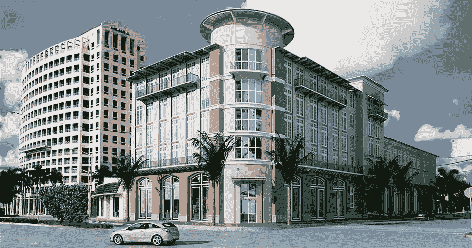
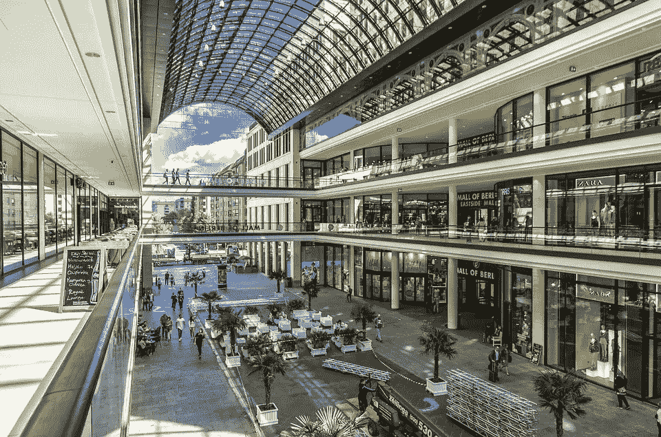

# 三种不同的商业模式，从相对简单到难以置信的复杂

> 原文：<https://medium.datadriveninvestor.com/three-different-business-models-from-the-relatively-simple-to-unbelievably-complex-4391843dae3c?source=collection_archive---------13----------------------->

## 我们中的许多人都想成为自己的老板，赚钱而不是用我们的时间来换取金钱，身边围绕着帮助我们成长的人。这是一个伟大的梦想，但如何把它变成现实呢？

今天，我们来看看三种不同的商业模式。第一个非常简单，投资于**创收房地产**。第二个**的**正在打造一个**传统商业**。第三个**项目**正在建设**高科技创业公司**。是什么让他们三个如此不同？我们来看看。

当谈到**房地产投资**时，大多数**要素都是众所周知的**和**可以用**合理的准确度**来预测**。风险仍然存在，但是与其他商业模式相比，这些风险更容易估计和准备。

衡量你是否成功的最重要的指标是你能否以低于价值的折扣价获得房产。如果你以 700，000 美元购买了 1，000，000 美元的房产，你将有足够的误差空间来获得所有你需要的专业帮助，以使投资获利。

房地产投资的挑战在于，新投资者开始购买利润微薄的资产，这使得他们无法获得评估、购买和管理房产所需的专业帮助。

如何估计房产价值？有一些公认的公式可以帮助你计算财产的价值。谁会是你的客户？每家酒店都是为特定租户设计的。他们愿意支付多少钱？有可用的样品。你的费用是多少？所有这些数据都是在你购买房产之前提供给你的。

是的，**存在风险**，我们将在以后的文章中谈到房地产投资时大量讨论这些风险，但**与其他商业模式相比，风险更可预测，因此也更易于管理**。

开始一项传统业务涉及到比房地产投资更难预测的**更多的活动部分**。

**企业主必须确定客户需要的产品**。必须正确计算**总生产和交付成本**。**开销**必须预测。必须创建分销渠道。必须招聘和培训员工。**营销**一定要做的有效果，有成本效益。

最终，**必须考虑所有成本，所有成本都必须低于客户愿意为您的产品支付的价格**。

大多数企业也必须适应不断变化的趋势、竞争和经济周期。90%的公司不到十年就倒闭了。也就是说，**一些企业可以用很少的钱启动，但每年可以产生数百万美元的收入**。

1945 年**萨姆·沃尔顿在岳父**两万美元贷款**的帮助下，加上他在部队时攒下的 5000 美元，在开始了他的事业**。今天，他收购的那家商店变成了价值 3366.9 亿美元的全球公司。****

**幸运的是，我们预测需求和费用所需的许多**数据点都是可用的**。虽然任何商业风险都有很大的风险，但我们可以承担可计算的风险，因为我们有**关于我们所在垂直行业和地区的其他企业表现如何的数据**。**

**在以后的文章中，我们将讨论**如何收购和发展业务**。在我们的私人社区小组中，我们将向您展示**我们如何逐步将我们的业务组合从 1 亿美元增长到 1000 多万美元的收入**。**

****

**创业是最难的商业模式之一。史蒂夫·布兰克将创业公司定义为一个“**临时组织，用来寻找可重复和可扩展的商业模式****

**创业公司的创始人想要改变今天的做事方式，这意味着他们没有可以模仿的业务。**不清楚**的**每个客户愿意为产品**支付多少，或者**客户是否愿意为产品支付**。**

****费用几乎无法预测**。唯一真实的是创始人**的**愿景**，随着公司检验其假设，这一愿景极有可能改变**。**

**为什么会有人创业？因为**改变世界的潜力**几乎**没有竞争**开始不仅为整个团队提供高潜力**金钱奖励，而且提供情感奖励**。**