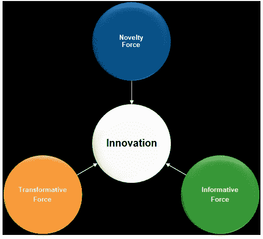

# 超越冲突和变革，塑造创新的三种力量

> 原文：<https://medium.datadriveninvestor.com/three-forces-that-shape-innovation-beyond-conflict-and-change-ed063519f25e?source=collection_archive---------8----------------------->

# 害怕丢掉工作？害怕被落下？学会通读数字革命以及如何在未来保住自己的位子！

Photo by [Luca Florio](https://unsplash.com/@elleflorio?utm_source=medium&utm_medium=referral) on [Unsplash](https://unsplash.com?utm_source=medium&utm_medium=referral)

不断创新将是在数字时代保持“生产者”角色的最有价值的人类技能。没什么可怕的，没有人会破产(在这篇“[文章](https://medium.com/datadriveninvestor/artificial-intelligence-and-human-awareness-1226aef2f111)”中我解释了原因)。经济仍然需要“消费者”,你有可能会因此得到报酬；但是，如果你想让**成为一个“生产者”**，**你需要理解是什么驱动了创新**，这样才能抓住我们这个时代唾手可得的果实，并因此对我们将要生活的变化感到更舒服。

 [## 数据驱动始于数据素养|数据驱动的投资者

### 光是听到“数据”这个词就令人生畏。老实说，只有 21%的全球员工对自己的工作充满信心

www.datadriveninvestor.com](https://www.datadriveninvestor.com/2020/03/22/data-driven-starts-with-data-literacy/) 

技术，尤其是当前的数字革命，为我们提供了一个完美的实验室来理解创新以及如何让创新可持续发展。

这篇文章也是对三类努力走在变革前列的“生产者”的创新呼吁:

> 首席信息官对降低成本甚至将他们自己也外包出去感到沮丧；
> 
> 企业家，在数字沙滩上建立公司，发现自己只有勺子、水桶和其他东西；
> 
> “社交媒体转轮”上的营销人员渴望下一个病毒式创意。

他们比以往任何时候都更需要掌握创新，因为他们需要应对与创新相关的财务挑战。深入挖掘问题的本质，本文提供了一个心智模型，以明智地投资和获得含有成本的新股。

这些年来，电视、手机、电脑、网络都在变得越来越便宜的同时带来了难以置信的功能。事实上，在摩尔定律的影响下，我们现在可以用一杯咖啡的价格买到 20 年前需要整个假期预算才能买到的东西。

**为什么我们的数字账单没有减少，我们不应该去寻找它？**

为了回答上面的问题，让我们看看创新的三种构成力量。

**新奇、信息和变革力量**的平衡决定了**的创新强度**，因此，产品、服务或你可能必须领先于变化的优势:根据金融、技术和商业周期，这些力量同步并放大其效果(相位正交)或以最小的创新成果相互补偿(相位相反)。我们在(商业和个人)生活中所经历的通常介于两者之间。

答虽然我们把我们的解释简化为数字，但这种方法适用于生活中的不同领域。让我们仔细看看这三者，以了解它们在创新中扮演的角色，以及如果得到控制，它们将如何改变我们的(商业或个人)生活。

## 信息力:“Repetita juvant”(重复帮助)。

“形式上”意味着进入“形状”，因此这种力量促进活动，导致主题的本质，自动化和标准化的结果。

Photo by [Jeremy Bishop](https://unsplash.com/@jeremybishop?utm_source=medium&utm_medium=referral) on [Unsplash](https://unsplash.com?utm_source=medium&utm_medium=referral)

正如在任何学习周期中一样，从学校到机器学习，重复一种现象有助于识别模式，发现执行任务的简化和有效方法。

信息力产生的效率随着时间而降低，在过程的开始时增益较大，接近结束时增益较小。

这意味着(从马拉松训练到开具发票)重复这些活动有助于提高效率，降低整体成本。虽然不可能有一场无能源成本的马拉松，但在数字世界中*成本可能会与使用*(成为固定费用)脱钩，在某些情况下，服务可能会完全“免费”。

非常明确的是，*这并不意味着数字交易没有成本*，而是指通过使用服务产生的一些数据的所有权创造了足以为服务提供商产生利润的价值。换句话说，如果你不为某样东西付钱，*你就是产品。*

最后，同样重要的是，**自动化降低了意识**。有点像随着时间的推移使用计算器降低了进行简单算术运算的能力，每次信息力量简化了对特定(商业或个人)主题的努力，这种意识就消失了，对环境的依赖性增加了。

总而言之，在使用信息力时，有三个重要方面需要牢记:

*   **随着时间的推移而失效**
*   主要**节约**发生**开始**(零附近增量最高，始终)
*   随着时间的推移，it **抵消了知名度**(隐性成本)

***首席信息官最容易受到这种力量产生的偏见*** *。尤其是在负面的商业周期中，公司通过将整个 IT 和业务流程外包来节省成本，* ***失去公司的身份和知识*** *。过一段时间后，组织将失去理解大型变革和商品之间的区别的能力，将开始把供应商视为供应商，而不是合作伙伴，整个部门将围绕可见的东西而不是对公司有价值的东西工作。*

## 变革的力量:对现状的持续挑战

“Trans-form”的意思是超越(Trans)“形”(从毛毛虫到蝴蝶)。

Photo by [Suzanne D. Williams](https://unsplash.com/@scw1217?utm_source=medium&utm_medium=referral) on [Unsplash](https://unsplash.com?utm_source=medium&utm_medium=referral)

理解这种力量如何应用于技术的一个好方法是从市场的角度来看。随着时间的推移，变革的力量使市场不断发展，创造新的机遇和新的挑战。你对一个主题了解得越多，你就越意识到你需要更多的时间、工具和知识来钻研它:因此，变革的力量不会随着时间的推移而减少努力，但它总是需要更多的投资。掌握这种力量可以在市场份额方面产生垄断(见 90 年代的微软)，但它永远不会产生壁垒，它需要持续的关注和投资才能在竞争中领先。

**那么如何“预算”会随着时间增加成本的力的效果呢？**

只有一个办法，老掉牙:**你需要创造收入**，建立一个自负盈亏的机制。

数字化转型就像创建一个企业本身，因为它需要在成本控制和收入扩张之间取得平衡。因此，在时间范围内，转型需要产生物质收入来为下一阶段提供资金。这种收入可以是有形的，也可以是无形的，但利益相关者显然很重视。**没有明确的商业利益，最好进行整合(使用信息力**)。

总而言之，在使用变革力量时，有三个重要方面需要记住:

*   It **随着时间的推移增加投资**(这意味着成本也会增加)
*   新的理解打开了新的缺口，需要时间来填补。
*   没有什么是一成不变的:它**随着时间的推移增强了人们对**(隐性收益)的认识，这种认识需要足够重要，以便在财务中加以考虑。

企业家通常很难掌握这股力量。爱上他们的创业想法，他们**不相信**理解失败的重要性的所有文献**，他们倾向于以错误的理由继续或停止他们的旅程。**成功是**韧性和成长**之间的恰当平衡**。**

## 新奇力量:创造[吸引力、兴趣、欲望、行动](https://en.wikipedia.org/wiki/AIDA_%28marketing%29)。

某种不熟悉的感觉，总是需要一个新的视角来感觉舒服(和有效)。

Photo by [Gursimrat Ganda](https://unsplash.com/@gurysimrat?utm_source=medium&utm_medium=referral) on [Unsplash](https://unsplash.com?utm_source=medium&utm_medium=referral)

新奇力量不会产生一种常规(从定义上来说，它不是一种商品)，但是当它与信息力量逐步升级时，它会产生一种依赖性。举个例子，如果你在高速公路上开了很长时间的车，在收音机里听到红牛的广告，新奇的力量会驱使你走进下一个加油站去买一个。

我们被新的、闪亮的、闪光的东西所吸引。新的很酷，我们很喜欢它，喜欢把它从过去带回来，只是为了“重新体验”那种征服感。“时尚”是最能利用这种力量的一个领域(我们都是这样，每次我们为一些嵌入了功能感觉的东西做品牌)。

力的例子:iPhone 11 PRO 以 1200 美元的价格进入市场，与一颗 0.9 克拉的小钻石价格相同。这两者中的一个在 10 年后将毫无价值。*猜猜新鲜感力量让价格在哪里？*

***这种力量是有一手的*** *。为什么一个“旋转者”会在几个月内风靡全球？什么时候“新”的东西会成为病毒？第一个将数学应用于病毒式营销的人将成为英雄。社交媒体的出现和我们所生活的世界的超连通性，围绕着(不成熟的)营销人员所称的有机增长产生了巨大的轰动:最重要的是新奇，不考虑其他因素，*

## 创新:新奇、信息和变革力量之间的平衡

总而言之，应用于商品的 ***信息力量*** 逐渐淡出意识，而我**增加了对环境的依赖**，为未来带来风险。

Photo by [Ameen Fahmy](https://unsplash.com/@ameenfahmy_?utm_source=medium&utm_medium=referral) on [Unsplash](https://unsplash.com?utm_source=medium&utm_medium=referral)

****信息力*** *，*在它的任何表达中，当它**简化为新的复杂层**(不是成本削减器)创建一个坚实的基础时，它是最好的。*

***变革的力量需要更大的能量，但可持续性存在风险。***

***虽然这是真的，但* ***的变革力量扩展了知识和认知*** ，将游戏推向新的高度，增加了新的维度。**

*****新奇的力量*** 蕴含着酷的效果，它 ***振奋*** 我们。**

**事实上，创新是从创新、变革和新奇的突破点触发的平衡力量。**

> *****s****可持续创新增长的解决方案* ***是所有三种力量的共存，这三种力量使创新超越对闪光事物的热爱(新奇力)，在不断寻求以更少提供更多(信息力)的持续变化(变革力)中稳定创新。*****
> 
> **最后，让我们看看这个镜头下的三个关键数字趋势:**

*   **[**区块链**](https://medium.com/illumination/building-a-blockchain-ecosystem-the-role-of-industry-leaders-51c7350e9242) **，**从现在起十年内，旨在将它的轨迹从“我如何才能削减成本？”到“谁能从我的生意中获利？”。 ***变革力量*** 推动整个生态系统的创建，解决方案、想法、整个架构围绕动荡的 BUSD 投资市场激增。当区块链解决方案超越宣传，开始有效地解决关键客户的需求时，创新力量将会发挥作用。只有在信息力量整合和标准化解决方案之后，这种情况才最有可能发生(Infosys [区块链测试框架](https://www.infosys.com/services/blockchain/offerings/blockchain-testing-framework.html)和埃森哲和富士通的[开源区块链集成框架](https://www.hyperledger.org/blog/2020/05/13/tsc-approves-hyperledger-cactus-as-new-project)是信息力量的明确表达)。**
*   **从创新的角度来看，RPA(机器人流程自动化)是另一个有趣的“被高估的现象”。受欢迎的影响者花费大量时间谈论 RPA 是组织的新圣杯。RPA 现阶段无非是自动化，我们知道*自动化是信息化力量*的衰落，有利于创造效率，但*本身不足以创新*。RPA 将成为真正的创新，当它们被用来打破组织的围墙，例如改善组织之间的通信和创造新的商业机会时。*仅举一个例子，RPA 的创新性使用可以是一种基于亚马逊产品排名的自动识别 OEM 产品的方式，在运行“自动”脸书活动后，可以自动在亚马逊上“贴牌”和销售。***
*   **看一下**云服务**，Information force 通过无缝促进对云的访问而发挥作用，但只有当转型围绕特定需求完全重构服务产品时，创新才会发生，就像在教育界发生的那样。**

## **结论**

**创新不是一个工业过程。创新是一种创造行为，它是关于使用现有的东西，将想法转化为新的、简单的、完全适合特定需求的东西。**

**创新蕴含着变化。在一家公司里，没有什么秘诀能让它一成不变，并一直从中赚钱；创新不是你如何通过人工智能算法创造其他收入，比如创作 Lady Gaga 的下一首歌或范高格的风格画作。**

**创新包含信息、变革和新奇的元素。**

**可持续创新是三种力量之间的平衡。换句话说，如果你想让你的事业(或你的生活)平稳地转变，对变化感到舒服，吃你那个时代唾手可得的果实，**你需要寻找新的东西，用更低的复杂性改变你现有的东西**。**

**只追求这些力量中的一种，最终的解决方案将是不可持续的。**

***只有信息力(首席信息官的主要限制):这种简化在开始时是有效的，但从长远来看，它会抵消知识和意识，而不会带来任何好处。* ***被落下的风险。*****

**只有变革的力量(企业家的主要限制):它总是痛苦的，并且随着时间的推移会增加成本，因此从长远来看，它具有不成功的风险。***面临破产的危险。*****

***只有新奇的力量(营销人员的主要限制):不是所有新的东西都可以被定义为创新。新奇力量本身很快就消失了，什么也没留下(有多少真正的产品是黑客马拉松的成果？*)。* ***迎风招展。******

**________________________________________________________________**

***免责声明:本文所代表的观点或意见是个人的，仅属于文章作者，不代表作者在专业或个人能力方面可能或可能不相关的人、机构或组织的观点或意见，除非明确声明。***

**_________________________________________________________________**

****访问专家视图—** [**订阅 DDI 英特尔**](https://datadriveninvestor.com/ddi-intel)**