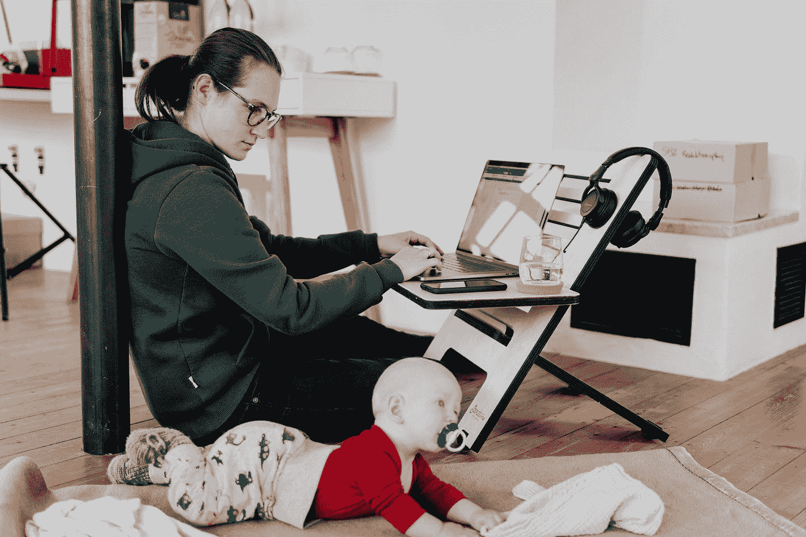

# X 世代快乐而富有成效生活的三个实践

> 原文：<https://medium.datadriveninvestor.com/three-practices-by-generation-x-for-happy-and-productive-life-7dd439d27d16?source=collection_archive---------24----------------------->

Photo by [Nick Karvounis](https://unsplash.com/@nickkarvounis?utm_source=medium&utm_medium=referral) on [Unsplash](https://unsplash.com?utm_source=medium&utm_medium=referral)

X 一代，是婴儿潮一代之后出生的一代人(大致从 20 世纪 60 年代初到 70 年代末)。

有没有想过，为什么我们的父母比我们更冷静，他们怎么比我们更满足，更快乐，即使朋友更少，资源更少，人缘更差。让我们检查所有的材料，并按照他们的方式烹饪，以获得想要的味道。

 [## 在家工作如何提高我的工作效率|数据驱动型投资者

### 在家工作确实激发了我最大的潜能，让我更有效率。因为在家工作给了我…

www.datadriveninvestor.com](https://www.datadriveninvestor.com/2020/07/29/how-working-from-home-increased-my-productivity/) 

# **1。烹饪**

Photo by [Maarten van den Heuvel](https://unsplash.com/@mvdheuvel?utm_source=medium&utm_medium=referral) on [Unsplash](https://unsplash.com?utm_source=medium&utm_medium=referral)

X 一代在他们年轻的时候没有像优步餐厅这样的服务，他们可以随时随地想吃什么就吃什么。餐馆相当豪华，价格昂贵。为了省钱和有更好的食物，自己做饭是你唯一的选择。但是它与快乐和生产力有什么关系呢？这是一件费时的麻烦事。

当你为自己做饭时，烹饪不再是一项工作或麻烦，它会让你**更加意识到你给你的身体，最终给你的思想和灵魂带来了什么。它减少了吃大量高热量食物的诱惑。如果你和家人或朋友一起吃饭，你就有更多的时间和他们在一起。这将有利于与家人和朋友建立更好的联系。**

如果你想要更多的事实和统计数据来接受这一点，查看这篇文章

 [## 外出就餐与在家做饭——你必须看到的 12 个数据

### 想开始吃得更健康吗？根据许多研究，解决方法很简单——开始多在家吃饭…

sliceofkitchen.com](https://sliceofkitchen.com/eating-out-vs-cooking-at-home-statistics/) 

# **2。投资与储蓄**

"俗话说，我们用青春获得财富，用财富获得青春."

― **道格拉斯·柯普兰，X 世代:加速文化的故事**

Photo by [Tierra Mallorca](https://unsplash.com/@tierramallorca?utm_source=medium&utm_medium=referral) on [Unsplash](https://unsplash.com?utm_source=medium&utm_medium=referral)

这一代人相信存钱的力量。这并不意味着他们没有投资，他们投资了，但总是有保证回报金额。他们相信固定回报。最受他们欢迎的金融工具是**公共公积金、邮局票据和银行定期存款**或**定期存款**。原因之一可能是他们看到他们的父母经历了世界大战和经济不稳定。

他们试图不惜一切代价避免贷款和奢侈消费，而不是购买豪宅、跑车和 T21。当重大责任完成后，他们在晚年做出如此重大的财务决定。

# **3。工作与生活的平衡**

Photo by [Standsome Worklifestyle](https://unsplash.com/@standsome?utm_source=medium&utm_medium=referral) on [Unsplash](https://unsplash.com?utm_source=medium&utm_medium=referral)

X 世代被认为是组织中最大的创收者。作为工作狂，他们更有精神，同样的精神，他们处理家庭责任。他们更直接地交流，并接受负面反馈来改进。55%的初创公司创始人来自 X 世代(福布斯)。

2018 年， [**31%的 X 一代人报告称**](https://www.ustravel.org/sites/default/files/media_root/document/Paid%20Time%20Off%20Trends%20Fact%20Sheet.pdf) 休了 10-19 天假，相比之下，千禧一代只有 21%。所以我们可以向他们学习，保持工作狂，保持快乐的社交生活。

## 获得专家观点— [订阅 DDI 英特尔](https://datadriveninvestor.com/ddi-intel)