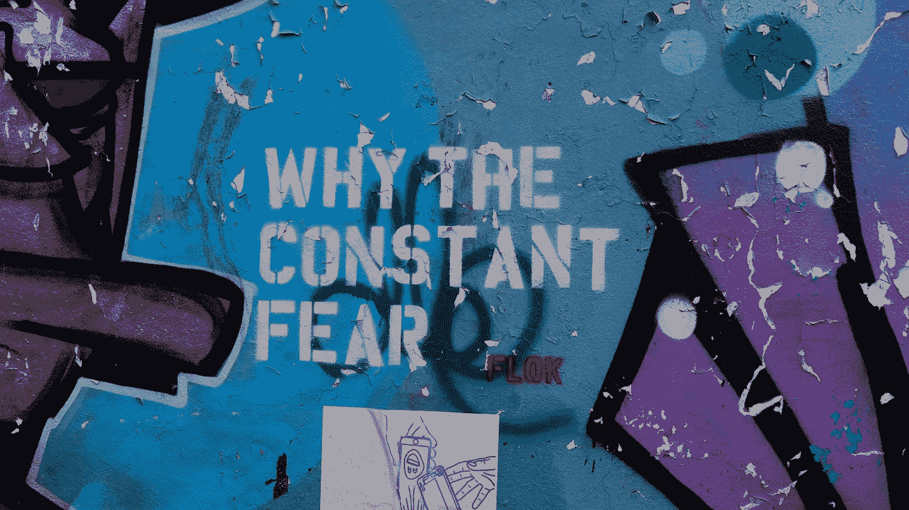
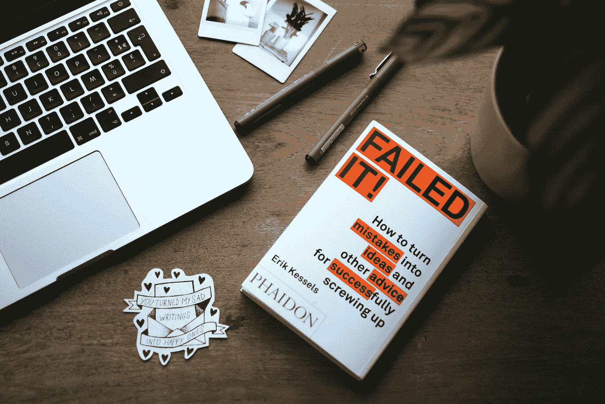

# 三句名言助你开启雄心

> 原文：<https://medium.datadriveninvestor.com/three-quotes-to-jump-start-your-ambition-e59dc4424e60?source=collection_archive---------14----------------------->

给你的激励电池充电(二手灵感项目)

Photo by [Daniel Korpai](https://unsplash.com/@danielkorpai?utm_source=unsplash&utm_medium=referral&utm_content=creditCopyText) on [Unsplash](https://unsplash.com/s/photos/charging?utm_source=unsplash&utm_medium=referral&utm_content=creditCopyText)

二手灵感项目从一句激励性的引语开始，在创造性道路蜿蜒的任何地方冒险。

有些日子你发现自己在场，但并不真的在那里，梦游般地度过工作日，和家人走过场。当你假装快乐时，你变得疲惫，淹没在悲观的海啸中。意志力本身不足以将你从这种恐惧中解救出来。

你已经失去了你的野心。我们每个人都会在某个时候遇到这种事。

每个人都有糟糕的日子。但是一句鼓舞人心的话有时可以给你的内心火上浇油。

让我分享三个我最喜欢的火花，它们有助于重新点燃我的动力之火。

Photo by [Simon Watkinson](https://unsplash.com/@simonwatkinson?utm_source=unsplash&utm_medium=referral&utm_content=creditCopyText) on [Unsplash](https://unsplash.com/s/photos/fear?utm_source=unsplash&utm_medium=referral&utm_content=creditCopyText)

> “我一定不害怕。恐惧是思维的杀手。恐惧是带来彻底毁灭的小小死亡。我会面对我的恐惧。我将允许它越过我，穿过我。”—弗兰克·赫伯特，沙丘

这句话引起了我的共鸣，因为当谈到培养雄心时，没有什么比恐惧更有害了。恐惧会助长自我怀疑，让你不愿承担实现目标所需的风险。

你能做些什么来克服这一点？从抛弃你的舒适区开始。

 [## 为什么创业公司上市的时间比以往任何时候都长？数据驱动的投资者

### 过去十年以来，科技创业公司保持私有状态的时间要长得多。在…的网络繁荣(和萧条)时期

www.datadriveninvestor.com](https://www.datadriveninvestor.com/2020/01/28/why-are-startups-taking-longer-than-ever-to-go-public/) 

人们喜欢坚持自己熟悉的东西。但是令人作呕地做同样的事情并不是最佳选择。回避挑战会放大你的恐惧，直到它们劫持你的生活。

如果你盲目地继续做你一直在做的事情，你将永远不会有发展的动力。你必须尝试新事物来培养足够的自信，超越你目前的个性和环境。

从每天尝试一些让你害怕，或者至少让你有点不安的事情开始。它甚至可以是微不足道的事情。重要的是走出你的舒适区，熟悉不确定性。这是对抗恐惧的一种方式，而不是让它欺负你。

没有比从不尝试更容易失败的方法了。在开始之前，不要让恐惧摧毁你的梦想。

Photo by [Heather Ford](https://unsplash.com/@the_modern_life_mrs?utm_source=unsplash&utm_medium=referral&utm_content=creditCopyText) on [Unsplash](https://unsplash.com/s/photos/strength?utm_source=unsplash&utm_medium=referral&utm_content=creditCopyText)

> “我的态度是，如果你把我推向你认为是弱点的东西，那么我会把这种感知到的弱点转化为优势。”―迈克尔·乔丹

这句话让我想起了我职业生涯早期的一段时间。我认识一位经理，他不知疲倦地帮助他的员工发展不同的技能。为了进步，他给了他们尝试创新方法的自由。

一天，另一个部门的人粗暴地要求他停止这样做，因为“你不能教老狗新把戏。”

经理回答说:“老狗学不了新把戏。但是我不和狗一起工作。我和人们一起工作，他们每天都在变化。”

好吧，我承认这个故事很老套。但是因为这件事和其他经历，我坚信个人成长的力量，人们应该不断寻求自我完善。

没有比慢慢地将一项不太擅长的技能转化为优势更好的发展方式了。

作为孩子，我们学习不健康的策略来应对弱点。棒球教练把他们最差的外野手藏在右外野和一垒。我们在学校被分成小组，但只有少数外向的人做公开演讲，告诉班上其他人讨论了什么。我们大多数人被训练去隐藏我们的弱点，而不是去解决它们。

然而，随着时间的推移、注意力的集中和责任心的增强，可以将察觉到的缺点转化为优势。

第一，专门拿出一块时间来学习。在那段时间里，优先处理你的弱点。

然后在你的教育和责任上投入资源，来改变你的表现。

如果你没有得到你想要的改善，不要害怕把事情搞砸，尝试新的策略。

最后，不要孤军奋战。找一个想做类似改进或者会让你对进步负责的朋友。

对于一个成功者来说，将弱点转化为优势是一场耐力赛。就像农民等待从生长缓慢的种子中收获庄稼一样，耐心是这个过程中至关重要的一部分。

Photo by [Estée Janssens](https://unsplash.com/@esteejanssens?utm_source=unsplash&utm_medium=referral&utm_content=creditCopyText) on [Unsplash](https://unsplash.com/s/photos/self-improvement?utm_source=unsplash&utm_medium=referral&utm_content=creditCopyText)

> “我总想第二天成为比前一天更好的人。”—西德尼·波蒂埃

这句话引起了我的共鸣，因为它呼应了我试图遵循的指导原则之一——日本的改善哲学。我认为 Kaizen 大致翻译为*改变* (Kai)和*变好*(Zen)——换句话说，变得更好。

我第一次接触改善是在我学习工程和 MBA 课程的时候。其根源在于二战后日本工业的重建，它是关于通过微小但可管理的步骤进行持续改进。

我过度简化了改善，但我不想深入到质量管理和工程流程的最深处。但在我的生活中，我试图重新定位这个概念，培养一种类似改善的心态。这种心态引发了个人层面的变革。

Kaizen 促使我接受我永远没有完成的想法。我是一个总是需要修改的草稿。因为没有完成的点，也没有最终的形式要实现，我对自己的缺点很满意，并且知道总会有一些我可以做的事情来提升自己。

改善心态也促使我现在就开始改善。我不能等待完美的环境开始——稳定的改善需要我行动起来，而不是拖延。

这也要求我朝着自己的理想迈出一小步。因此，我拒绝制定模糊或不切实际的目标。相反，我专注于努力实现小而现实的目标。如果我能在下一次把生活中的任何任务做得好 1%,那么我正在朝着一个更有意义的胜利前进。一次进步一点点让我更少失败的机会，更有可能建立一个积极的习惯，并长期坚持下去。

对我来说，改善不仅仅是一种哲学——它是我努力生活的一种生活方式。我希望明天比今天更好，而改善是推动我实现这一目标的工具。

引用并不是治疗你生活中所有疾病的良药。但是他们可以成为你的教练。

人们低估了一些明智选择的词语的激励力量。找到正确的引语，让你重新站起来，准备好以决心和精力面对挑战。

阿德里安·s·波特是一名作家、工程师、顾问和演说家。他写诗歌、短篇小说和各种主题的文章，包括创造力和个人成长。他是诗集[和散文集](https://www.amazon.com/Everything-Wrong-Feels-Adrian-Potter/dp/109519061X/ref=sr_1_4?qid=1560264651&refinements=p_27%3AAdrian+S.+Potter&s=books&sr=1-4&text=Adrian+S.+Potter)[的作者。在](https://e2857002-6118-41be-9746-64261e36cacb.filesusr.com/ugd/21d2c2_03522f10c7c84340a05a8d03a97e1642.pdf)[http://adrianspotter.com/](http://adrianspotter.com/)在线拜访他。

# 附加文字

[学会吞下硬道理](https://medium.com/datadriveninvestor/learn-to-swallow-hard-truths-1aa9c4c7b4dd?source=friends_link&sk=56bd2a28d4c76ce0122cb72ef6ad29d4)

[凡事皆有因(？)](https://medium.com/datadriveninvestor/everything-happens-for-a-reason-ecfef4d6e257?source=friends_link&sk=b2aac31713668602222e7dab4247dadc)

[灵感永远不来怎么办？](https://medium.com/@adrianpotter/what-if-inspiration-never-comes-8bf240c8f73d?source=friends_link&sk=21537fcb2ca9d7ff0af6a0d952df1ae6)