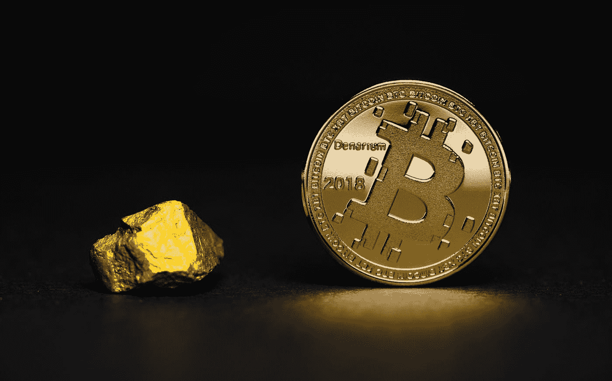

# 新一轮黄金禁令浪潮正在积聚的 3 个原因

> 原文：<https://medium.datadriveninvestor.com/three-reasons-why-signs-of-a-new-gold-prohibition-wave-are-accumulating-a044054730d5?source=collection_archive---------15----------------------->

无论是经济危机、通货膨胀还是货币改革，黄金都是应对紧急情况的终极避险工具。政府对私人持有黄金感到不安。已经多次对它们实施了禁令。

Photo by [Aleksi Räisä](https://unsplash.com/@denarium_bitcoin?utm_source=medium&utm_medium=referral) on [Unsplash](https://unsplash.com?utm_source=medium&utm_medium=referral)

安全部队和警察搜查私人住宅。储物柜和保险箱被撬了。国家渴望的对象:黄金。难以想象？私人拥有黄金的禁令屡禁不止。在全面禁止黄金的情况下，国家认为热爱自由的公民不会自愿放弃他们所有的硬币和金条。顺便说一下，这是上世纪 30 年代的一个教训。1933 年 3 月，美国总统富兰克林·罗斯福通过紧急银行法案禁止国内私人拥有黄金。注意:在 20 世纪 30 年代，美国一直是一个民主国家。

 [## 为什么比特币对彭博来说仍然被低估

### 比特币超越黄金！

medium.com](https://medium.com/datadriveninvestor/why-bitcoin-is-still-undervalued-for-bloomberg-a99f0da3ec1d) 

# 黄金作为飞行货币在世界范围内被禁止

这种强有力的干预有多成功仍在讨论之中。有人说，美国人估计只放弃了大约三分之一的黄金。但数据显示，1930 年至 1940 年间，美国黄金储备从 6358 吨增加到 19543 吨。其中很大一部分很可能来自公民对可怕的惩罚的恐惧。相比之下，德意志联邦银行的黄金宝藏有 3367 吨。因此，美国的行动对该州来说是成功的。

罗斯福只是一个追求私人黄金所有权的政治家。列宁、希特勒、墨索里尼、尼赫鲁也在过去 100 年的名单中。即使在 21 世纪的今天，欧洲公民也不能确定这种情况不会再次发生。毕竟，黄金不仅被认为是过去的野蛮遗迹，而且首先被认为是逃离的货币，是保存人们努力所得的价值的终极工具。当人们对纸币货币失去信心时，公民就会逃入黄金投资领域。

 [## 黄金交易所交易基金和黄金支持的加密货币的比较

### 黄金交易所交易基金(ETF)是一种商品交易所交易基金，只包含一种主要资产:黄金。ETF 也类似…

www.datadriveninvestor.com](https://www.datadriveninvestor.com/2019/09/11/a-comparison-of-gold-etfs-and-gold-backed-cryptocurrencies/) 

# 警告示例

当公民的自由不得不受到限制时——根据政治计算——或者当国库特别潮湿时，人们总是遵守黄金禁令、强制征税或交换。从公元前 12 世纪的埃及、希腊的斯巴达城邦、盖乌斯·尤利乌斯·凯撒统治下的罗马帝国、中世纪的中国，到 18 世纪的法国和 20 世纪的德国。黄金在那个时代的作用比现在大得多。通常，当试图创造一种没有坚实背景的货币，即仅仅作为国家的一种承诺，失败时，黄金就被禁止了——公民们希望通过使用黄金作为避险货币来拯救他们的资产。

 [## 股票交易的利润来源于和平

### 目前是经济非常动荡的时期。

medium.com](https://medium.com/datadriveninvestor/in-peace-lies-the-profit-on-the-stock-exchange-7bd5ef28b0bb) 

欧洲央行的政治化，加上世界范围的债务浪潮和地缘政治温床，增加了货币和经济危机的可能性。黄金仍将是公民的避险货币。另一方面，正如已经用德国的例子描述的那样，国家似乎已经有了内在的抑制阈值。对于投资者来说，这意味着他们已经在投资一个黄金宝藏作为预防措施。虽然小面额的硬币和金条更贵，但它们可以更有效、更秘密地运输。对于更可观的黄金资产，应考虑在瑞士和新加坡等国际地点储存；这是由大型黄金屋提供的。

# 背景:德国人和黄金

黄金比以往任何时候都更受德国人欢迎。根据 Steinbeis 大学的一项研究，德国私人目前拥有创纪录的 8918 吨黄金，其中一半(4925 吨)是金条和金币，不到 4000 吨是珠宝。自 2016 年最近一次此类调查以来，德国私人家庭的黄金财富因此增加了 246 吨。

根据 Steinbeis 的研究，几乎四分之三的德国人以珠宝、金条和硬币的形式或通过证券间接拥有黄金。从数学上来说，每个 18 岁以上的德国人都拥有 58 克黄金首饰和 71 克金条或金币形式的贵金属。如果将德国央行的黄金储备加入私人黄金资产，国家和公民总共拥有世界黄金储备的约 6.5%。这使得德国在欧洲的比较中处于领先地位。

# 各国央行的黄金储备:前 10 名

美国拥有世界上最大的黄金储备。库存量为 8133 吨。第二位是德国，数量为 3366 吨。国际货币基金组织紧随其后。其黄金储量达 2814 吨。排在第四位的是意大利，拥有 2451 吨黄金，仅领先于法国的 2436 吨。排在第六位的是第一个不属于西方工业化国家的国家:俄罗斯。该国拥有 2241 吨黄金储备。中国紧随其后，获得 1948 吨黄金。与第八名瑞士的差距已经很大了。国家只拥有中华人民共和国一半左右的国土面积。储量达 1040 吨。日本和印度的黄金储备也相对较低:排在第九位的日本有 765 吨，排在第十位的印度有 618 吨。

我在每月一期的 [**简讯中分享了更多私密的想法，你可以在这里**](https://mailchi.mp/bf8f8e8ed697/keep-in-touch-with-lukas) 查看。请在评论中告诉我，并在各种社交媒体平台上加入我:

[**推特**](https://twitter.com/WiesfleckerL)●[**insta gram**](https://www.instagram.com/lukaswiesflecker/)●[**脸书**](https://www.facebook.com/lukaswiesfleckerr)●[**Snapchat**](https://www.snapchat.com/add/luggooo)**●[**LinkedIn**](https://www.linkedin.com/in/lukas-wiesflecker-1b11251a5/)**

**无论你做什么，都要带着爱和激情去做！**

****访问专家视图—** [**订阅 DDI 英特尔**](https://datadriveninvestor.com/ddi-intel)**