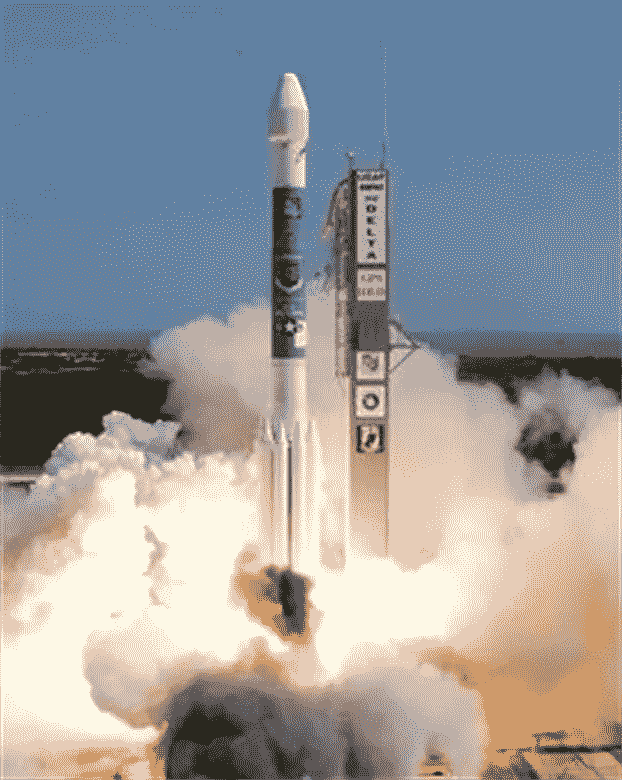

# 《星际迷航发现》中的三项可怕的真实技术

> 原文：<https://medium.datadriveninvestor.com/three-scary-real-technologies-from-the-show-star-trek-discovery-a77e974b66fd?source=collection_archive---------16----------------------->

不要读这个。

**剧透**

2017 年，随着《星际迷航:发现》的上映，星际迷航积极重返银幕。该节目围绕悲剧英雄迈克尔·伯纳姆的不幸遭遇展开。她的行为导致耻辱和战争。在第一季中,“发现号”由洛卡船长带领。伯纳姆之前被判在双星战役中叛变，当时她违抗了她的舰长，错误地试图避免一场战争。这场冲突摧毁了神舟号及其舰长。伯纳姆在被送往监狱的途中被发现号所救。后来，通过无懈可击的逻辑，她找到了克林贡防御中的一个关键弱点，从而化解了这场战争。这个故事是关于她努力把事情做好。

在下一季中，斯波克因涉嫌三起谋杀案而在逃。由于伯纳姆和迈克尔的关系，伯纳姆和他的手下卷入了搜捕行动。斯波克是她疏远的哥哥。后来发现一个先进的人工智能从一个异常点传送到发现号上。人工智能正领导着一场纳粹式的冲锋，从银河系中灭绝所有的有机生命，代之以纯粹的机器生命。人工智能随后劫持了对星际舰队自动指挥系统和发现号本身的控制。发现号船员进一步发现，开始这次旅行的红色天使是来自未来的旅行者。他们能够短暂地捕捉天使，并用时间水晶重现时间入口。门户被证明是在遥远的未来抛弃人工智能的关键。

**深度假货**

在《发现》中，斯波克被指控谋杀了医院的三名工作人员。这些谋杀引发了全联邦对正义的追捕，后来星舰“发现”号也卷入其中。在调查过程中发现，涉及斯波克的监控录像是假的，但这项技术是非常真实的。

你可能已经在 2016 年的《星球大战:星球大战外传：侠盗一号》电影中遇到过 deepfakes，在这部电影中，彼得·库欣再次扮演大星区总督塔金。彼得·库欣已经去世超过 25 年了。

深度伪造犯罪现在是一件事。他们不像诬陷斯波克谋杀那样引人注目，但人们已经被骗走了钱。去年 7 月的某个时候，一名英国能源公司的员工被骗，向一名在电话中模仿其首席执行官声音的罪犯汇去了大约 22 万美元。当罪犯第二次试图勒索时，这个骗局才被发现，这名工人打电话给首席执行官进行核实。Vox 表示，高质量 deepfakes 的发展有可能打破我们对[记忆](https://www.vox.com/science-and-health/2018/4/20/17109764/deepfake-ai-false-memory-psychology-mandela-effect)的概念。

你可以用你自己的 deepfakes 进一步操纵叙述。 [Github](https://github.com/iperov/DeepFaceLab) 提供工程视频平台。该应用程序与 Linux 和 PC 兼容。还建议你具备 Adobe After Effects 之类的视频编辑器知识。

**AI 主管**

在星际舰队中，指挥决策过于复杂，无法由一名军官决定。在改进策略的努力中，星际舰队开发了一个人工智能来分析情况并提供建议。这种控制是在星际舰队粗略的 31 部的监督下进行的。当来自异常点的纯人工智能出于其邪恶的目的劫持 31 区时，这只会导致进一步的问题。

控制已经在这里了。最近几年，亚马逊已经使用机器来监督被指派包装和运送订单的工人大军。这些算法持续监视员工的活动，并像教官一样记录他们的表现。快员工获得免费赠品。迟钝的员工会被解雇。有时候快节奏的员工会受伤。

**现代通信中的 GPS 时间膨胀**

在《星际迷航》中，红色天使从未来旅行，为发现号的船员留下线索。在整个赛季中，这些线索揭示了人工智能的存在和击败它的游戏。

你的手机是一种时间机器。每次你发信息或打电话，你的手机都会向手机信号塔发送信号。该信号是从手机微处理器中动态选择的微波频率组合，以获得最佳传输效果。信号只需几纳秒就能到达天线，在天线处被放大、解调、混频并转换回数字信号，以便在互联网上传输。

这种安排的唯一问题是需要完美的时钟同步来三角测量你在蜂窝塔之间的位置。不完善的位置信息会导致信息丢失。运行这些塔的时钟通常由来自全球定位系统(GPS)的信号同步。

GPS 系统是一个由 31 颗环绕地球运行的卫星组成的网络。每个航天器都是一个飞行的原子钟，在地球上方大约 12，600 英里的轨道上运行。飞船内部的时钟同步世界时间坐标(UTC)信号，该信号由你手机中的芯片进行三角定位。这个位置对于提供可靠的服务至关重要。

当涉及到爱因斯坦广义相对论中的时间膨胀时，这个计划就分崩离析了。时间膨胀会导致原子钟加快一个[毫秒](https://www.e-education.psu.edu/geog862/node/1714)。美国海军天文台管理着定期更新网络的主 GPS 时钟。

*原载于 2020 年 5 月 16 日 https://www.datadriveninvestor.com***。**