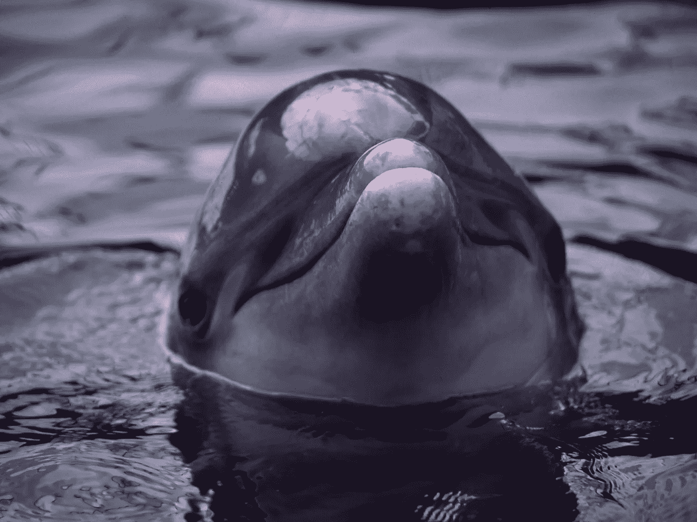
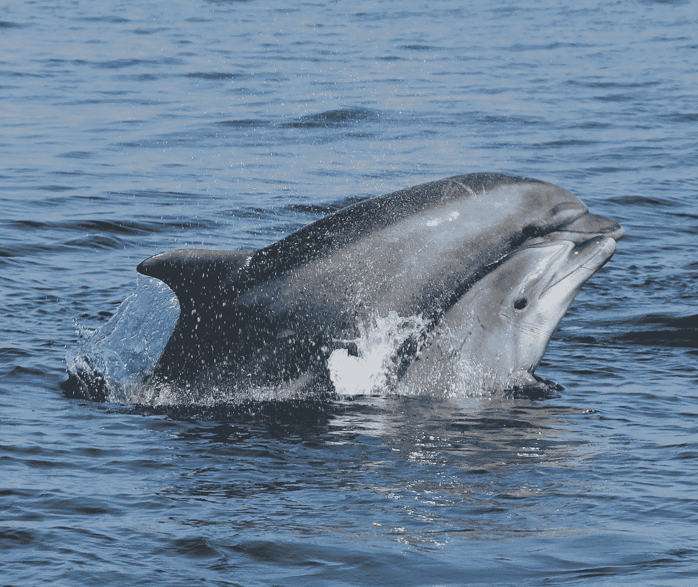
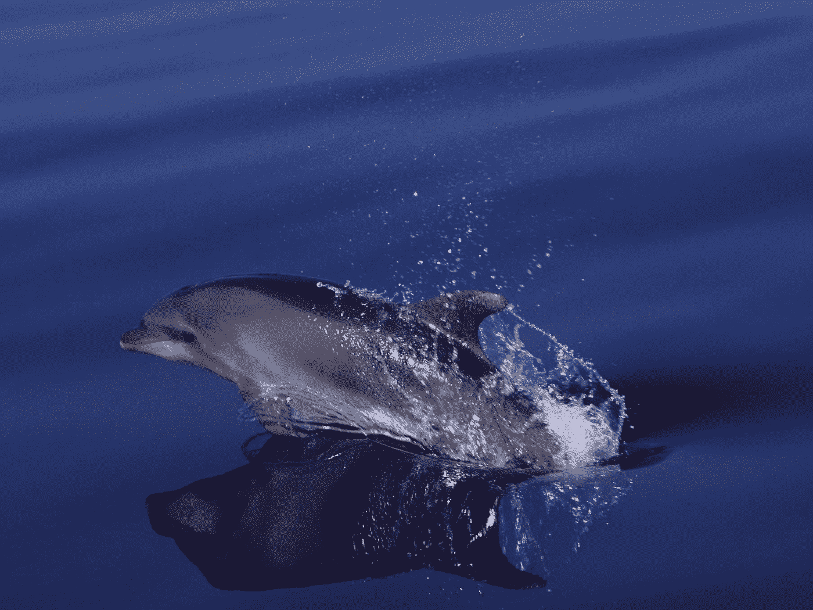

# 海豚属于野生环境的三个简单原因

> 原文：<https://medium.datadriveninvestor.com/three-simple-reasons-why-dolphins-belong-in-the-wild-e6d7f89962f2?source=collection_archive---------2----------------------->

圈养海豚不再被接受

We think of dolphins as happy animals. Let’s not forget that dolphins also die smiling — image:©maddalenabearzi

在过去的三十年里，我花了很多时间和野生海豚在一起。我的职业是跟踪它们的日常活动，从研究船上观察它们的行为。当我开始研究时，我知道这些生物主要是我的研究对象，但随着时间的推移，我逐渐认识到它们是单独的个体，不仅因为它们独特的背鳍切口，还因为它们的认知能力、个性和情感。

在海上度过了数千个小时，我开始通过视觉了解他们中的一些人，就像我的人类朋友一样，他们成为了我生活中不可或缺的一部分。我了解到他们不仅需要空间，也需要陪伴。我目睹了他们多变、复杂的社会，在许多方面与我们非常相似。

我还在水族馆和海洋公园里亲眼观察了这些动物非常不同的生活，我不禁想知道为什么要把这些如此壮观的动物关在笼子里。

在我的工作中，我听到过各种各样的理由来限制海豚，最常见的是教育、保护和研究。让我们考虑一下这些理由是否成立。让我们记住，我们是一个据称聪明而有爱心的物种，有能力思考和分析*我们目前对海豚*的了解，并根据这些评估做出明智的决定。

 [## 当科幻进入现实|数据驱动的投资者

### 科幻小说以其疯狂的技术故事统治了世界，充满了诸如读心术和人类的想法…

www.datadriveninvestor.com](https://www.datadriveninvestor.com/2020/04/17/when-science-fiction-enters-reality/) 

在几年前，当我们还不了解更多的时候，在一个受限制的环境中饲养鲸类动物(我个人认为包括任何动物)可能更容易被接受；当我们没有足够的信息来了解这些野生动物是谁以及它们需要什么来生存的时候。但是今天，我们知道的比那时多得多。

那么，我们对海豚了解多少？这里，简单来说，就是圈养和海豚不相容的三个重要原因。

1.*海豚是脑容量大、认知能力强的动物*

如果我们认为自己处于智力的顶峰，海豚会紧随其后，甚至比它们的类人猿兄弟得分更高。观察大脑化商，它代表了相对大脑大小的测量和动物智力的粗略估计，海豚拥有高情商，因为它们的大脑与身体大小的比例异常大。

在过去的二十年里，对鲸目动物的解剖学和形态学研究激增。对海豚大脑的神经解剖学研究表明，与包括人类在内的其他物种相比，海豚拥有复杂而发达的新皮层，以及独特的大脑皮层折叠，这在鲸目动物中甚至比灵长类动物更明显。为什么这很重要？因为，简单地说，这些结构都与复杂的信息处理有关。海豚也有纺锤形神经元，或称为 *Von Economo* 神经元，这是社会认知的关键，并被认为与人类“感知”他人想法的能力有关。

毫无疑问，智力很难定义，当我们观察动物世界时，几乎任何动物都可以被认为是聪明的，这取决于我们决定应用什么样的智力定义。我可以为我的任何一只狗做一个很好的例子…但是特别是在海豚、类人猿和人类身上，大脑的复杂性、社会的复杂性和生态的复杂性是紧密相连的。

2.*海豚生活在广阔的海洋中复杂的群体里*

我们已经确定海豚有大而复杂的大脑，但是这些脑容量有什么用呢？这个大脑使海豚能够发展复杂和流动的社会，在这种社会中，它们可以在具有挑战性的三维液体环境的背景下蓬勃发展。宽吻海豚(当今水族馆和海洋公园中最常见的物种)等鲸类动物具有灵活和卓越的社交和沟通技能。

他们生活在以高度分化的关系为特征的社交网络中，这种关系通常依赖于对谁欠谁人情以及谁是真正朋友的精确记忆。他们参与合作狩猎，他们分配资源，以便猎物在整个社会群体中分享。在一些海豚种群中，雄性形成联盟，以性胁迫雌性或击败其他雄性联盟。他们互相关心；母亲和幼仔有着长期牢固的社会纽带，幼仔可以在母亲身边呆上两年或更长时间来了解自己在海洋中的位置。海豚玩耍，结合，模仿，互相学习，代代传递信息。这种将学到的行为传递给后代的能力使他们成为像我们一样的文化动物。和我们一样，它们能认识到自己是个体，并且有自我意识，即使海豚的自我意识程度仍有待探索。

在海上，海豚总是在移动，通常移动数百英里，有时数千英里。它们巨大的大脑可能有助于它们在广泛分散和暂时可用的资源上成功觅食。海豚和其他一些动物一样，本质上是复杂的群居哺乳动物，需要广阔的生存空间。一辆坦克甚至不能满足这些需求。

a pair of dolphins off California — image:©maddalenabearzi/oceanconservationsociety

3.*海豚有情感(和个性)*

我们喜欢把海豚想象成快乐的动物，带着无处不在的微笑在海里嬉戏。我们倾向于将它们拟人化，将我们自己的属性投射到它们身上。但是我们认为海豚快乐的表情会掩盖动物的真实感受，尤其是当我们把它们关起来的时候。别忘了海豚也是笑着死去的！

海豚和我们一样，也有边缘系统，能够体验各种情绪，包括快乐、悲伤、沮丧、愤怒和爱。将海豚放入核磁共振扫描仪，你会看到一个巨大的大脑结构，可以容纳复杂的情感。仔细观察海豚的大脑，你会再次发现人类中与直觉和移情有关的特殊神经元。

但是，除了大脑和神经元之外，在野外与这些动物呆在一起的时间将真正证明它们是具有不同性格的情感生物。任何目睹过海豚妈妈照顾幼崽的同情心、帮助遇险同伴的个人或为至亲之死悲伤数小时甚至数天的海豚的人，都不能否认这些动物有情感。

像智力一样，这些海洋生物的意识情感很难理解、定义和测量。相比之下，只要反思一下在任何给定的时刻知道我们自己在想什么或感觉什么是多么困难…

A young bottlenose dolphin swimming free in the ocean — image:©maddalenabearzi/oceanconservationsociety

现在，让我们尝试一些不同的东西。让我们忽略所有的科学研究或*我们目前对海豚*的了解。让我们也忽略上面提到的为什么把这些动物关在笼子里是根本错误的三个断言，让我们转而集中精力揭穿最受欢迎的亲圈养论点:研究、教育&保护。

*研究*

每当有关于我们为什么要圈养海豚的问题时，海洋公园和海豚馆都倾向于打“研究牌”。的确，在过去，一些对海豚的圈养研究有助于加深我们对这些动物的基本了解；由于技术和后勤方面的障碍，那个时代的研究人员无法在海上获得这种理解。但是世界和科学已经改变了，我们现在有技术和手段在海豚自己的栖息地更有效地研究海豚。

一般来说，由于人工环境的原因，圈养研究提供的知识很少能应用于保护和管理这些海洋物种。事实上，这种研究甚至会产生误导。许多已发表的关于圈养动物的研究集中在训练技术和饲养实践的改进上，这与生活在野外的海豚无关。例如:对海豚疾病的圈养研究未能预测病毒在野生种群中的爆发，这种爆发可能经常导致大量死亡。

此外，在圈养海豚的设施出售的门票收入中，只有一小部分用于研究(如果有的话)，不到 10%的海豚馆或动物园参与了就地或野生的研究保护项目。

*教育&保护*

许多飞燕草最常见的说法是它们提供了很好的教育机会，他们认为这可能会引起公众对海豚保护的关注。但这不是真的。这里最大的意见分歧在于个人对教育价值的定义。想象一下带一个孩子去海洋公园。这不是一次教育经历，因为孩子看不到或不理解这些动物到底是什么。在表演过程中，按照指令跳跃、泼水或从驯兽师手里抓鱼都是老一套，*小丑式的*行为，几乎没有展现这些动物的日常生活。被剥夺了自然空间和社会结构，海豚会改变。圈养的海豚和我在野外认识的海豚没有任何共同之处。

相反，考虑一下带你的孩子出海进行一次著名的观鲸之旅(顺便说一下，这可能比一张海洋公园的门票便宜)。甚至在一次海洋之旅中，一个孩子也有机会一窥野生海豚的真实生活。在海上，人们可以更好地了解海豚是谁，以及它们在自己“家庭”的陪伴下如何表现。在海上，你会明白为什么我们不仅要保护它们，还要保护它们生活的环境。对一个孩子来说，这些是真正重要的环保课程！

第二种说法是，把它们养在鱼缸里，我们是在保护它们免受污染和过度捕捞，甚至灭绝，圈养繁殖计划是出于保护的目的。将海豚从它们的自然栖息地转移到鱼缸中生活并不能解决环境问题。这些项目帮助濒危或受威胁物种的说法是错误的，特别是考虑到濒危物种通常不是那些被圈养的物种。圈养繁殖项目确实提供了一件事:持续供应海豚供展示和人类娱乐。

还有许多其他原因表明圈养这些动物是错误的，例如可怜的、通常是可怕的条件，海豚仍然被圈养在世界各地的许多设施中，以及圈养动物的高发病率和死亡率。就这一点而言，没有一个最先进的圈养水族馆或海洋公园能够满足海豚或大多数其他动物复杂的生理和心理需求。我们还没有提到在捕获过程中死亡的个体数量，以及这些动物在与同伴和社会网络分离时经历的压力。由于这些原因，圈养虎鲸在几个国家已经被逐步淘汰，但是还有很长的路要走。

是时候我们认识到，我们仍然囚禁这些宏伟的、大脑容量的、社会复杂的生物的唯一的、真正的原因是为了我们的娱乐；以赚钱为目的的娱乐，而且很多。

海豚是*谁*，不是*什么*，它们理应得到一些权利。我们人类应该用我们的判断力和同情心对待这些(和其他)同类动物，不要再把它们像囚犯一样关在笼子里。

Maddalena Bearzi 研究海洋哺乳动物的生态和保护已经超过 30 年。她是[海洋保护协会](http://www.oceanconservation.org/)的主席和联合创始人，也是[美丽心灵:类人猿和海豚的平行生活](https://www.hup.harvard.edu/catalog.php?isbn=9780674046276)的合著者(哈佛大学出版社)。她也是几家出版物的摄影记者和博客作者，包括《国家地理》。她的新书是[海豚机密:一位野外生物学家的自白](https://press.uchicago.edu/ucp/books/book/chicago/D/bo10896892.html)(芝加哥大学出版社)。

她还是鲸鱼保护区项目的顾问，该项目的任务是建立一个模范海滨保护区，鲸鱼和海豚可以在那里康复或永久生活在一个最大限度地提高福祉和自主权的环境中，并尽可能接近它们的自然栖息地。

**访问专家视图—** [**订阅 DDI 英特尔**](https://datadriveninvestor.com/ddi-intel)