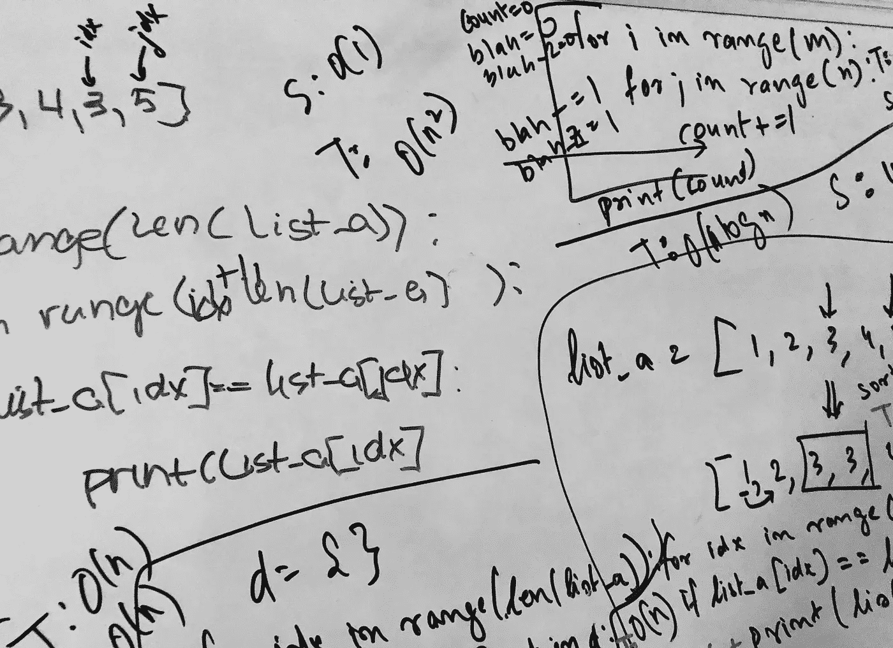

# 三种解决方案

> 原文：<https://medium.datadriveninvestor.com/three-solutions-a915d3679834?source=collection_archive---------12----------------------->

思考如何解决这个问题



上周，我参加了一个数据科学职位的技术面试。在统计问题、案例研究和一些关于我的项目的问题之后，最后一个问题是一个编程(算法)问题:G *给定一个整数列表，打印出任何重复的值。*

这里有一个例子:

```
(input) list_a = [1,2,3,4,3,5] 
(output) 3
```

有多种方法可以解决这个问题，我在这篇博文中给出了三种方法(使用 Python)。此外，我将讨论使用每种方法的成本，特别是时间和空间的复杂性。我以如何(一般地)解决问题的一些想法结束。

# 定义

首先，我介绍几个定义来比较不同算法的性能。

**时间复杂度** —这将算法运行所需的时间量化为输入长度的函数。

**空间复杂度** —这量化了算法运行所占用的空间或内存量，作为输入长度的函数。

**Big-O 符号** —空间和时间的复杂性可以被认为是一个函数。O 符号是函数，简而言之，是复杂度函数的上界。

回到解决方案。

# 解决方案 1 —强力方法

也许解决这个问题的最简单(当然也是最暴力的)方法是使用两个 for 循环。

```
for idx in range(len(list_a)):
    for jdx in range(idx+1, len(list_a)):
        if list_a[idx] == list_a[jdx]:
            print(list_a[idx])
```

就像这样，有一个解决问题的方法。该算法的空间复杂度是常数 O(1)。该算法使用不依赖于输入的固定(小)空间量。时间复杂度为 O(n)，取决于输入的大小 n。

不太好，我们可以做得更好。

# 解决方案 2 —对阵列进行排序

有几种方法可以帮助解决这类问题，一种是排序。首先，对数组进行排序，然后使用 for 循环遍历元素。

```
list_a = sorted(list_a)  #a simple ascending sortfor idx in range(len(list_a) - 1):
    if list_a[idx] == list_a[idx + 1]:
        print(list_a[idx])
```

排序有助于时间复杂度降低到 O(n log(n))。空间复杂度仍然是常数，O(1)。

# 解决方案 3——使用字典

第三种算法降低了时间复杂度，但是增加了空间复杂度。两者都是 O(n)。

```
d = {}
for idx in range(len(list_a)):
    if list_a[idx] not in d:
        d[list_a[idx]] = 0
    if d[list_a[idx]] == 1:
        print(list_a[idx])
    else:
        d[list_a[idx]] += 1
```

# 其他思考

当我第一次看到这个问题的时候，我最初想到的是第一种解决方案，之后，又学到了第二种和第三种。我有数学和物理的背景，这些学科的问题解决与计算机科学中的问题解决有一些共同的主题。在 G. Polya 的《如何解决》一书中，为读者展示了一个解决数学问题的基本方案。

1.  理解问题
2.  设计一个计划
3.  执行计划
4.  回顾

这些问题帮助我解决了许多评估和工作中的数学和物理问题。我教过很多学生用这种“算法”来看待问题并试图解决问题。问题——如何运用这些问题来解决这里提出的问题？

**理解问题。**在技术面试中遇到问题时，用自己的话重新表述。问问你自己— *我知道什么？输入是什么，输出是什么样的？*如果可以，把过程画下来。

*这里，我们知道了一个输入到解决方案的例子，以及输出应该是什么样子。*

想出一个计划。说说*你的算法是如何工作的。如果你在白板上解决问题，写一些伪代码。先不要急着编写算法。*

*下面是第一个代码的分步计划。*

```
*1\. Iterate over the list. (This will involve at least one for loop.)
2\. Compare the first element in the list with the second. (This will require an if statement.)
3\. Print equivalent elements.*
```

*执行计划。现在是你编写解决方案的时候了。*(回头看看解决方案 1 的代码。)**

***回首往事。**好了，你已经在白板上写下了解决方案，你完成了，对吗？还没有！后退一步，看看你的解决方案。你能举一个例子来说明解决方案吗？您能评论一下其他解决方案以及这些解决方案的好处吗？*

**查找错别字和错误后，记下空间和时间复杂度以及各自的优缺点。考虑采用降低复杂性的替代解决方案。**

*解决算法问题并不容易。我希望我已经概述了一些解决这些问题的技巧，让它们不那么令人生畏。*如有疑问，欢迎在下方评论中聊天！**