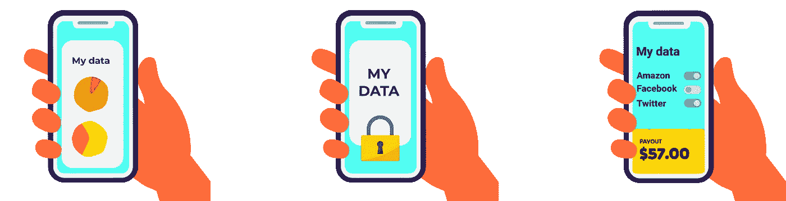
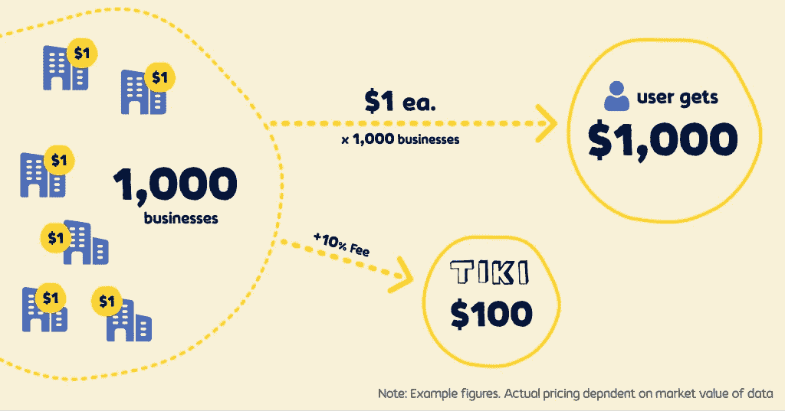
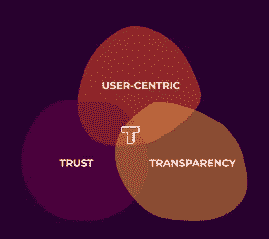
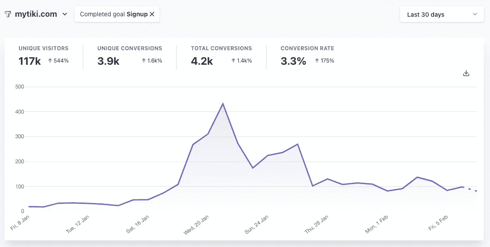
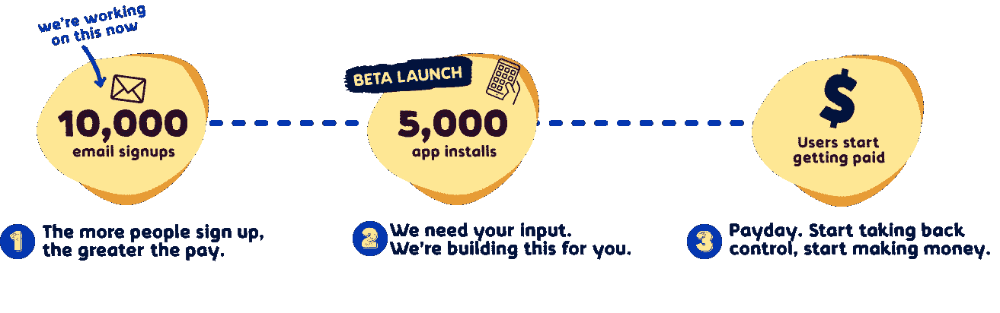

# TIKI 投资者简报—2 月 21 日

> 原文：<https://medium.datadriveninvestor.com/tiki-investor-brief-feb-21-f0b33ad851a2?source=collection_archive---------3----------------------->

## [mytiki.com](https://mytiki.com)

## 用户注册的速度远远超过预期。为了应对这种需求，我们制定了游戏计划，并解释了为什么要更快地行动。

在 TIKI，我们相信透明度。我们选择详细公布我们的整个游戏计划，而不是球场甲板。试一试；这是一个快速阅读，当然有些不同。

# 问题。机会。

这不会让任何人感到震惊。数据，尤其是用户数据被破坏。随着信任度的空前降低和隐私的不存在，我们的数据被用来操纵和利用…我们。

世界正在改变。越来越多的人意识到公司对他们的数据采取的看似粗心且经常掠夺性的行为，并对此感到不安。

这种日益加剧的紧张局势正促使企业和政府做出反应。你可能听说过像 GDPR、CCPA 或隐私保护这样的术语；那只是越来越多的[和越来越多的](https://www.abc.net.au/news/2021-01-25/google-may-pull-search-engine-from-australia-what-happens-next/13086712)的开始。苹果已经站出来强烈反对秘密跟踪个人数据的不幸的普遍做法，甚至有效地[杀死 idfa](https://www.forbes.com/sites/johnkoetsier/2020/06/29/apple-killed-the-idfa-what-else-dies)。对于那些不熟悉的人来说，IDFA 代表广告商的标识符。这是营销人员通过应用程序和网站跟踪你的主要方式之一，用你已经购买的产品的广告填充你的订阅源。谷歌将不得不效仿，对营销人员来说，这感觉就像数字移动广告的终结。对脸书(和许多其他公司)来说，这可能意味着收入和股价的重大损失。对用户来说，这意味着改变，一种倒退。

> 巨大的市场，比如 800 亿美元/年。移动数字广告市场，已经高端化。将谷歌、脸书和亚马逊等公司推向数万亿美元的商业模式受到质疑。在所有这些变化中，混乱，是的，最糟糕的词是所有的破坏。把用户放在第一位，让他们控制自己的数据，这是一个创造特殊事物的巨大机会。

# 解决方案。

我们得到的第一个问题是，这怎么可能？技术领域的人总是问，你如何让脸书或谷歌参与进来？不从事技术行业的人倾向于问，我能做什么？他们已经有了我所有的数据。这些问题也很有意义。要让这个行业采用一些新的隐私程序、软件、区块链等等，这是一条充满失败和妥协的漫长而艰难的道路。是的，“他们”已经有了你的数据，或者至少大型科技公司有。

> 我们正在创建一个数据市场，用户可以直接向公司出售他们的数据。

古语有云:“我们保留拒绝服务的权利。”当用户是卖家时，他们 a)得到公平的报酬，b)决定谁可以购买他们的数据。如果你是一家公司，获取关键数据变得越来越困难，成本也越来越高。你还受到大型科技公司的支配，对于那些不知道的人来说，他们把好东西留给了自己。取而代之的是，直接从用户那里购买道德的、干净的、更实惠的数据。甚至购买以前被认为无法访问的数据，比如竞争对手的数据。

如果你觉得有点🧐，不要担心。数据市场的概念是相当抽象的，而且有点离谱。很明显，用户不可能打开他们自己的小店，就像“嘿，来买我的数据吧！”我们的解决方案有 3 个部分。第一个也是最重要的:

## 1.用户体验

作为用户，我们想要一个简单的应用程序来轻松(快速)地对我们的数据做出决定。1 place to **查看**正在收集您的哪些数据。1 个地方**控制**你的隐私，没有挖掘通过 80 个应用程序与几十个设置。1 个地方**货币化**你的数据，获得你的公平份额。一个不可知的工具，将混乱的数据变成一个地方，你可以在几秒钟内做出明智的决定。这是你的数据。使用 TIKI，您可以决定如何使用它。

从你身上收集(和出售)的数据量令人震惊。2014 年(基本上是很久以前)，Acxiom 吹嘘为 7 亿人每人收集了[5000 个数据属性](https://privacyinternational.org/examples/2350/acxiom-builds-links-across-channels-devices-and-applications)。你认为现在是什么时候？我们每天创建 [2.5 万亿字节](https://techjury.net/blog/how-much-data-is-created-every-day/#gref) (18 个零)，预计在未来五年内保守增长 150 倍。从法律上讲，这些数据中有很多是属于你的，甚至更多的是关于你的。

虽然可能感觉不像，但作为用户，我们有权使用我们的数据。只是被埋没在复杂的法律、服务条款、设定里。不一定非要那样。我们希望让您能够轻松决定如何使用您的数据。花在 app 上的时间越少越好。设置一次，TIKI 会处理这些乱七八糟的事情。想完全匿名并关闭所有数据共享吗？我们可以帮忙。不喜欢应用程序使用你的照片进行面部识别训练或者使用你在 T2 的位置做广告？没问题，你的数据，你的选择。这很容易。

认为关闭所有数据共享和匿名互联网是非常不现实的？你不会被我们推回去的。数据共享是互联网成功的基础。我们只是相信用户有权决定如何使用他们的数据。

广告不会突然消失。一个相关的广告要比其他选择好得多。不公平的是，你的数据在你不知情或不同意的情况下被使用。有了 TIKI，你可以通过将数据直接卖给你选择的公司来赚钱。没有中间人和大型科技公司为了他们的利益而对你的数据做出决策。你得到了你应得的报酬。你决定谁可以使用你的数据。透明的市场会收拾残局。它让公司承担责任；否则，他们会被切断。它实现了真正安全的数据共享，100%匿名。

## 2.安全管道

每个用户在几十个不同的应用程序中都有大量的数据，这些数据本身充满了敏感信息。管道连接和组合来自各种来源的数据，为数据市场提供安全的实时洞察。一个关键的区别是我们不存储用户数据。这有 3 个原因，1)隐私、安全和最终的信任。没有就不会漏。2) TIKI 没有收集和倒卖用户数据。相反，我们让用户能够把他们的数据卖给公司。3)成本。不仅存在风险，而且托管、处理和存储所有这些数据的成本也非常高。相反，我们使用边缘计算(手机上的 TIKI 应用程序)来:

1.  从各种 API 收集数据，如脸书或谷歌
2.  匿名化并过滤收集的数据，例如，我上周狂吃《办公室》的每一集。
3.  删除我们所有原始敏感数据的记录。别担心。这只是我们的副本。这个过程永远不会影响原始应用程序中的数据。你的搞笑照片不会被我们删除。
4.  加密并将新的匿名见解传输到数据市场，附带谁可以或不能购买它的权限。

## 3.数据市场

成功的数据市场使公司能够以最适合其业务的格式购买所需的数据。对我们来说，这意味着 3 种基本格式:订阅、查询和报告。

订阅数据馈送意味着公司将通过 TIKI 连接数据，因为它可以用于他们自己的应用程序，可能是 ML 培训模型，CRM，甚至是他们自己的数据仓库。

查询数据意味着公司可以使用简单的搜索、查询、过滤和图表构建工具来配置自己的指标、KPI 和洞察力。

数据报告由预构建的仪表盘组成，这些仪表盘充满了对常见用例的洞察，类似于您与网站或社交媒体分析的交互方式。我们预计，凭借强大的用例，报告将成为公司进入 TIKI 生态系统的主要切入点。

# 商业模式。

我们的收入来自于促进向公司出售用户数据，如果你已经做到了这一点，那部分是非常明显和概念上简单的。相反，我们将关注模型的更独特的方面，用户数据价值，以及一些让公司非常兴奋的用例。

与典型的数据经纪人不同，我们不会收集用户的数据并转售。相反，我们根据用户的喜好，安全可靠地将用户数据出售给公司。为了提供这项服务，我们向购买数据的公司收取 10%的交易费。类似于支付处理器(Stripe)或信用卡公司(Visa)的工作方式。我们认为这种模式为我们提供了以下高度可扩展的优势。

1.  **最大的支付，最小的花费。**用户从他们的数据中获得最大金额的报酬(100%的销售额)，而公司则通过直接找到源头来最大限度地降低成本。
2.  **法律与合规。** TIKI 不拥有用户数据，不存储用户数据，不购买用户数据。TIKI 只是让用户很容易将他们的数据卖给他们选择的公司。
3.  **成本和利润。**因为我们没有汇总原始用户数据，所以没有任何典型的主要基础设施成本。结果是一个可扩展的，高利润的收入流。例如，如果促成一笔 10 美元的交易需要花费 1 美元，那么促成一笔 100 美元的交易需要花费 10 美元。

我们已经开始看到这种模式的早期好处。我们从第一天开始就走向全球，而不是在美国或欧洲推出并扩张的传统走向市场战略。当你读到这里的时候，全世界的用户都在注册 TIKI。

当你问，用户数据到底值多少钱？你往往会得到两个答案中的一个……“看情况”，或者“很多”是的，两者都是真的，但更重要的是有多少公司购买这些数据。尤其是社交媒体公司知道这一点。他们收集每个人的数据，并利用这些数据为数百万企业制作有针对性的广告。这是一个一对多的业务，一次广告点击的成本只有 0.01 美元。2020 年，仅脸书的 ARPU(每用户平均收入)就超过了 30 亿美元，整个数字广告支出超过了 T2 的 3300 亿美元。另一个[、300 亿+](https://burton-taylor.com/financial-market-data-analysis-global-demand-2020-2021-2/) 用于金融市场数据、[、120 亿](https://www.iab.com/insights/the-state-of-data-2020/)用于受众数据，这些只是数据驱动市场的一小部分。在美国有 3000 万家企业，仅 Salesforce 就拥有 15 万名客户。所有这一切的要点是…有几乎无数的公司依赖于用户数据。

> 让我们看一个简单的例子:
> 
> 假设你在 2020 年的所有数据价值 1 美元(显然，非常低)。
> 
> 在 3000 万企业中，有 1000 家愿意支付 1 美元+0.10 美元的交易费(10%)来购买你的数据吗？几乎可以肯定。
> 
> **$1 x 1，000 家公司=你这个用户的 1，000 美元收入**。
> $1，000 * $0.10 交易费 TIKI 的$100 收入。

1000 家公司购买数据听起来可能很多，直到你开始看一些用例。

超过 500 万家公司使用谷歌分析收集网站访问者的人口统计数据。它依赖于 cookies，这是一种由于恼人的弹出窗口、诉讼和更多监管而迅速消失的技术。有了用户数据，就不需要 cookies 了，你还能保持法律合规，但也有了更丰富的见解。

接下来是内容创作者和影响者。超过 500，000 名有影响力的人在 Instagram 上赚钱，所有人都依赖于脸书提供的极其简单的分析。这是一个如此迅速发展的市场，以至于有数百种服务使用高度受限的公共数据爬虫。有了用户数据，他们可以真正了解他们的受众。数据的这种用途也不是一个新概念。我们都听说过“尼尔森收视率”尼尔森是一家上市公司，通过收集人们观看和购买的数据，然后出售这些结果，去年为 T2 带来了 65 亿美元的收入。

依赖分销渠道和大型零售商的数百万企业怎么办？他们不知道他们的顾客是谁。大多数依靠昂贵的产品注册和保修卡，其中 [68%的消费者](https://www.globenewswire.com/news-release/2017/04/26/1450773/0/en/New-Study-Millennials-and-Affluent-Consumers-Want-to-Connect-with-Brands-Immediately-Post-Purchase-via-Mobile.html)说他们从未填写。通常，他们得到的最佳数据是一些按地理位置划分的基本销售数据。

这些只是影响数百万公司的几个现有用例。我将给你们留下一个由 TIKI 实现的新的、独特的用例。购买竞争对手的数据。我经常举的例子是，迪士尼会为用户的网飞观看历史支付一大笔钱，但网飞绝不会卖给他们。然而，作为一名网飞用户，我可以把我的数据卖给迪士尼。

不要读这篇文章，因为我们正在考虑任何事情，只是不久之后，将会有成千上万的公司通过 TIKI 购买数据。现在，我们需要保持专注于尽可能快地获得尽可能多的用户和简单的大范围用例。记住 1 美元/年。1，000 家公司= 1，000 美元/年。对于一个用户来说。

# 为什么是提基。

我们的做法不同。解决这种混乱的方法是和用户一起做。我说的是社区，是一场革命，我们可以一起夺回对数据的控制权。我们袖手旁观 3 个交织在一起的价值观，**以用户为中心的**，**信任**，以及**透明。**

“民有、民享”可能是老生常谈了，但它体现在我们所做的每一件事情中。在 TIKI，用户总是第一位的。我知道一家公司说用户高于利润听起来不真诚，但这是短期思维。以用户为中心的方法创造了可持续的长期增长。接下来是信任。要做到这一点，需要信任，很大程度上需要用户和公司的信任。信任不是你赢得的东西；每天都有赚有赔。当我们还在构思 TIKI 的时候，我和一些硅谷的人聊过。当被问及什么是我们的“护城河”(竞争进入壁垒的行话)时？我说信任。他们笑了，或者说窃笑。他们可能不相信信任是一个障碍，但那是因为他们破坏了每个人的信任。这就把我们带到了透明度，这是另一个不幸被商业界滥用的词。也许更好的说法是彻底的透明，因为我们是在一个完全不同的层面上做这件事。

当没有信任时，你如何建立信任？把一切都公开。所有代码都是[开源](https://github.com/tiki)。我们的[路线图](https://feedback.mytiki.com)、[分析](https://plausible.io/mytiki.com)、商业模式(向上滚动)、公有、公有、公有。你正在阅读的投资者简报，公开的。标准做法是闭门造车，进行 10 场幻灯片演示。没有人会把他们的整个游戏计划写在纸上，然后发布到互联网上。人们说我们疯了，我们明白。这是一种激进的方法，但如果我们想以用户为中心高于一切，我们就不能隐藏任何东西。他们是我们努力的伙伴。如果你想在一个没有任何信任的世界里建立信任，就要做到你所说的，并证明这一点。

所以我们是不同的，叛逆的，但是如果那些大家伙决定加入呢？他们会想加入的。但就像我们在流媒体战争中看到的那样，市场上有主要参与者(网飞、迪士尼、苹果、HBO 等)的空间。)汇聚成一个统一的以用户为中心的体验(Roku)。

> 成功的关键很简单，尽快获得尽可能多的用户，并坚持以用户为中心、信任和透明。

# 牵引力。成长。

如果很多人参与，TIKI 就能发挥作用。你的数据加上我的数据大多不值钱，再加上其他的 9998 个，现在已经很厉害了。清晰对快速增长很重要，单一 KPI(关键绩效指标)。对我们来说，是注册用户的数量。那些早期的硅谷人开玩笑地说，“当你有了成千上万的用户时，让我知道，”确切地知道这一部分有多难，尤其是没有任何钱可以花的时候。

你可能以前听说过“增长黑客”这个术语，听起来很讨厌，但概念很简单。而不是把你所有的时间和金钱花在一个完美的广告活动上。快速尝试各种不同的信息、媒介、渠道和策略。把有效的加倍，停止其他的，冲洗并重复。

> 从 1 月 21 日开始，注册人数达到了 4，000 人，我们预计到 2 月 21 日注册人数将超过 10，000 人。

## **试过*:***

**有机内容:** Subreddits、博客、Twitter、抖音、脸书、Instagram、直邮、LinkedIn、Discord、Telegram、Signal、SEO。
**付费广告:** LinkedIn、抖音、推特、脸书、Instagram、Reddit、Quora、谷歌、微软、Discord
**影响者营销:** Instagram、抖音、推特、脸书

## **有效:**

**有机内容:** Twitter、抖音、Instagram
**付费广告:**脸书、Quora
**影响者营销**:抖音

See our site analytics for yourself: [https://plausible.io/mytiki.com](https://plausible.io/mytiki.com?period=30d&goal=Signup)

我们从这些数据中获得了一些关键的见解。首先，两个大尖峰来自我们的第一个抖音影响者视频。在二月份，我们将集中精力做更多的工作。其次，我们发现 Quora 和脸书的付费广告带来了最高的转化率，所以我们将广告支出集中在这两个渠道。

在市场营销中，你会听到术语 CAC，意思是客户获取成本，但这并不意味着我们“购买了你的注册”😝."这是一种衡量营销和销售计划有效性的方法。它的计算方法很简单，就是用一家公司花在一个项目上的钱除以他们从中获得的新用户/客户的数量。这一指标对我们来说至关重要，因为我们个人为 TIKI 提供资金，并且每月的最高预算为 4，000 美元。我们的 CAC 越低，在同样的预算下，我们可以注册的用户就越多。

> 我们目前的 CAC 是 0.60 美元。这是一个非常低的价格，证明了全世界的用户是多么兴奋。我们获得用户的速度超出了我们的想象。

我们是预营收，专注于注册用户，而不是 LTV(终身价值)。对于感兴趣的人，请查看我们的商业模式部分。我们计划从 10 美元/用户/月开始，逐渐增加到 100 美元/用户/月。对于 TIKI，这是 10 美元，增加到 100 美元的 ARR(年度经常性收入)。

虽然我们的重点必须放在获取用户上，但用户确实希望为他们的数据付费。要做到这一点，我们必须与公司签约，购买他们的数据。我们在这个过程中处于非常早期的阶段，从一月底开始，第一批 10k 用户就在眼前。目前，我们正在测试价值主张并完善信息传递。

你可能会想，10k 用户，不需要几百万吗？不完全是，取决于用例。你可能听说过“统计显著”这个术语。有一个非常简单的[公式](https://www.surveymonkey.com/mp/sample-size-calculator/)来计算回答一个问题所需的人数，以准确预测一大群人的结果。小得惊人。

> 只有 1066 个回答，你就可以准确预测 100 万人(95%的置信度，3%的误差)。

鉴于此，我们正在提炼实时(接近实时)用户情绪的用例。简而言之，这意味着公司能够跨渠道了解客户喜欢什么、不喜欢什么、买了什么、没买什么、搜索了什么、纠结了什么，以及其他一切。作为一家企业，你最终会发现获得新客户和留住现有客户的关键驱动力。早期指标显示了公司的兴奋和需求，已经预先注册了我们的第一批。随着我们开始拨号，更多的将会到来。

> 该计划是在 2011 年 3 月底前预注册 100 家公司。

# 时间线。里程碑。

我们的网站上有一个简单的计划，上面有我们眼前的重要里程碑。这是一条清晰、积极的成功之路，我们希望我们的用户能让我们坚持下去。

Key milestone timeline ([mytiki.com](https://mytiki.com))

虽然这很好，并且从操作上表明我们知道下一步该怎么做才能成功，但您可能会想，这个东西有多大？你希望看到一些 3 年或 5 年的收入预测，包括投资、员工和全部 9 年。作为一家企业，我们还没有到那一步，也不应该到那一步。没有水晶球，也没有一张花哨的 excel 表格，上面有大量几乎肯定是错误的假设，这里是事实，以及我们如何看待我们已经令人兴奋的增长和长期潜力。你可以做出自己的预测。

市场机会简直是万亿。你有几十亿人，他们的用户数据平均每年价值几千美元。

在这种规模下，TAM、SAM、SOM(总目标市场、可服务目标市场、可服务可获得市场)有点失去了它们的目的。问题反而变成了你真正能获得多少用户？

这完全取决于我们的燃烧率和 CAC。凭借 0.60 美元的 CAC 和每月 4k 美元的自筹资金预算，我们每月增加 6k 新用户。

您会注意到两个不同之处，1)我们仍然专注于今年的增长。我们正在快速前进，速度是几周和几个月，而不是几年。今年的增长越大，明年的增长就越大。2)我们选择暂时不将收入与用户增长挂钩。总有一天会的，但是现在，增长比收入更重要。

如果你真的想计算一个大概的 MRR 和盈亏平衡，就拿用户数乘以每月 1 美元——5 万用户**≈**【MRR】5 万美元。假设我们的团队有 5 人，这使我们的现金流在大约相同的 50k 拐点处为正。

鉴于这一切，你可能会问，为什么我刚刚读了我所见过的最长的投资者简报，因为他们不需要我的钱？特别是，如果你很了解我们，你会知道我们一直在犹豫是否允许投资者进入 TIKI。即使是在最好的意图下，金钱也有一种有趣的方式将事情推向某些方向，尤其是当你试图找出什么有效的时候。你永远不会听到我们说我们已经想通了，但是我们已经想通了如何获得成千上万的用户。

> 我们应该加速。按照我们目前每月 4 万美元的烧钱速度，我们将在 9 月份达到 5 万用户。有了 3 万美元，我们可以在 3 月份达到目标，有了 60 万美元，我们可以在年底达到 100 万用户。

谢谢你一路赶来。我们有一个独特的机会去创造一些真正特别的东西。这就是他们所说的登月计划，但你必须知道风险非常高，即使是对一家科技初创公司来说。成功了，你就改变了世界。

有着花哨资历的简历很酷([mytiki.com/meet](https://mytiki.com/meet))，但如果 TIKI 真的让你兴奋，那就来见见我们([不和](https://discord.com/invite/evjYQq48Be)、[电报](https://t.me/mytikiapp)、[信号](https://signal.group/#CjQKIA66Eq2VHecpcCd-cu-dziozMRSH3EuQdcZJNyMOYNi5EhC0coWtjWzKQ1dDKEjMqhkP))。这个团队太棒了，我为我们在如此短的时间内取得的成就感到骄傲。

齐心协力，我们就能夺回对数据的控制权。
迈克奥迪
创始人@ TIKI
mike@mytiki.com