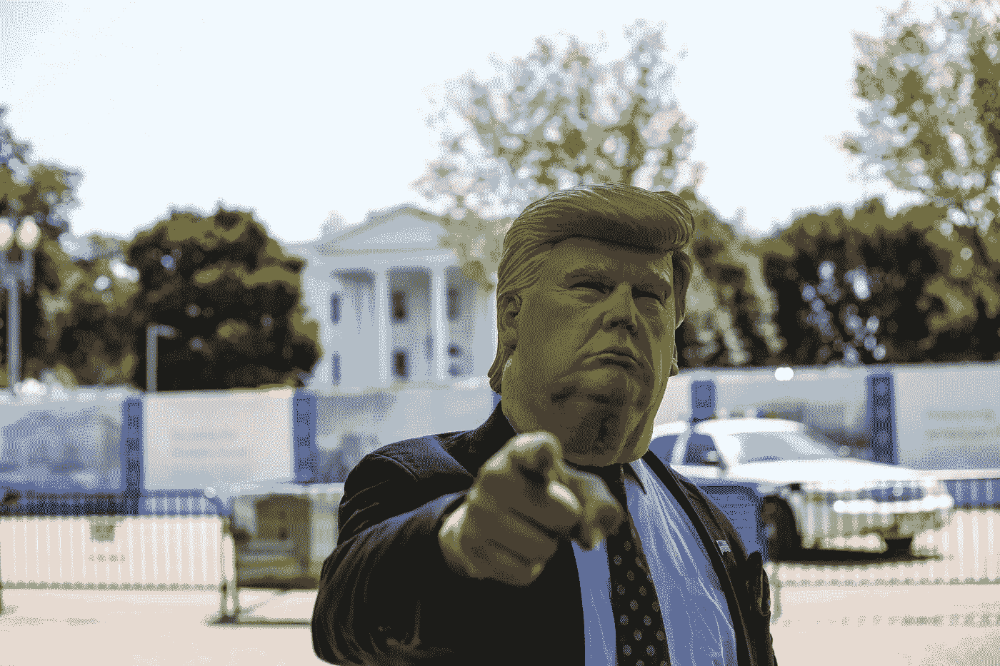
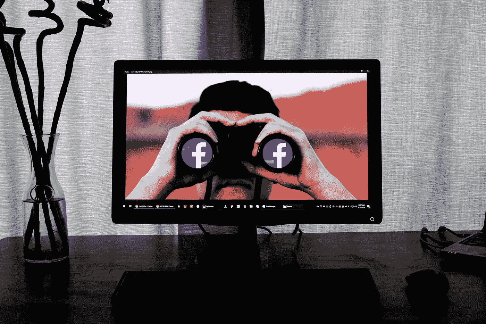
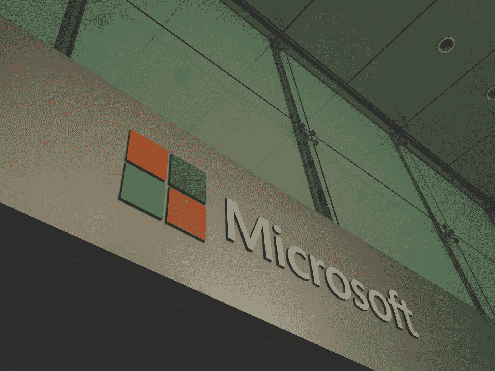

# 抖音:川普想禁止它，微软想买它

> 原文：<https://medium.datadriveninvestor.com/tiktok-trump-wants-to-ban-it-microsoft-wants-to-buy-it-89ae498c5e2d?source=collection_archive---------7----------------------->

## 美国政府会迫使抖音出手吗？

Photo by [Glen Carrie](https://unsplash.com/@glencarrie?utm_source=unsplash&utm_medium=referral&utm_content=creditCopyText) on [Unsplash](https://unsplash.com/s/photos/facebook?utm_source=unsplash&utm_medium=referral&utm_content=creditCopyText)

过去几个月，抖音因其中国所有权和随之而来的安全担忧而受到密切关注。自从印度政府[禁止该平台](https://pib.gov.in/PressReleseDetailm.aspx?PRID=1635206)进入该国以来，就有传言称特朗普政府会做出类似的裁决。现在，唐纳德·特朗普宣布他将禁止抖音进入美国。

最近，这个平台引起了美国政府的关注，而且不仅仅是安全问题。今年 6 月，特朗普的塔尔萨集会本应吸引多达 2 万人的支持。但是抖音的竞选活动帮助确定了事实并非如此。事实上，[只出现了不到 6200 只](https://www.forbes.com/sites/andrewsolender/2020/06/21/turnout-at-trumps-tulsa-rally-was-just-under-6200a-fraction-of-the-venues-19200-capacity/#23685cf31fed)。毫无疑问，这伤害了川普的竞选，至少在争取新冠肺炎疫情的支持方面。

这一声明是中美之间正在进行的政治贸易战的最新进展。过去几年，特朗普政府一直对“中国威胁”直言不讳。最值得注意的是，关于华为。政府已经多次以国家安全为由针对这家科技巨头。现在看来，该轮到抖音承受特朗普政府的压力了。

# 抖音应该被禁止吗？

这不是[抖音第一次受到审查。在印度的命令之前，抖音因色情和亵渎内容在 2018 年被短暂禁止进入印尼。当字节跳动同意在印尼部署审查小组时，这个决定被推翻了。](https://medium.com/digital-diplomacy/india-bans-tiktok-should-others-follow-c8fe0fc698e8)

目前，几个美国政府实体已经禁止抖音指出安全问题。目前，国土安全部、国务院和美国陆军的员工被禁止在政府发放的设备上使用抖音。

Photo by [History in HD](https://unsplash.com/@historyhd?utm_source=unsplash&utm_medium=referral&utm_content=creditCopyText) on [Unsplash](https://unsplash.com/s/photos/donald-trump?utm_source=unsplash&utm_medium=referral&utm_content=creditCopyText)

但该平台是否如美国所声称的那样构成安全威胁？这可能[听起来像是华为](https://medium.com/swlh/will-the-us-finally-take-down-huawei-534429061577)的翻版。但是抖音确实提出了安全问题。例如，网络安全公司 Check Point [在一月初发现了](https://research.checkpoint.com/2020/tik-or-tok-is-tiktok-secure-enough/)多个漏洞。不过应该注意的是，这些漏洞是根据 Check Point 报告修补的。

随后在 6 月下旬，iOS 14 的开发者测试版暴露了另一个安全漏洞。iOS 测试版显示，即使在后台运行，该应用程序也可以访问设备剪贴板数据。同样，该公司在后来的更新中修补了有问题的功能。

 [## 技术拯救雇佣关系第一天|数据驱动的投资者

### 面对困难的经济，有才华的人很难找到工作。在招聘过程中迷失…

www.datadriveninvestor.com](https://www.datadriveninvestor.com/2020/06/29/technology-rescues-relationships-from-hiring-day-1/) 

# 美国科技公司也需要做得更好

对抖音的关切肯定是有道理的。但安全和数据隐私问题不应仅限于在其他市场运营的中国公司。美国科技公司并不比中国科技公司更无辜。就在最近，iOS 14 开发者测试版已经[揭露了严重的隐私问题](https://medium.com/better-programming/the-new-ios-14-is-already-unmasking-serious-privacy-concerns-8601dacdf53b)。

但也许这里最大的罪魁祸首之一是脸书。这家科技巨头有侵犯数据隐私的历史，同时无意中[助长了世界上许多国家的仇恨言论和错误信息](https://medium.com/digital-diplomacy/how-big-a-problem-is-hate-speech-on-facebook-d3bf4b87f523)。

Photo by [Glen Carrie](https://unsplash.com/@glencarrie?utm_source=unsplash&utm_medium=referral&utm_content=creditCopyText) on [Unsplash](https://unsplash.com/s/photos/facebook?utm_source=unsplash&utm_medium=referral&utm_content=creditCopyText)

然后是亚马逊之类的。在最近的反垄断听证会上，亚马逊因其如何使用第三方卖家数据而受到关注。当被问及亚马逊在做出商业决策时是否曾访问和使用卖家数据时，贝佐斯指出，公司政策禁止这种做法。他接着说，“我不能向你保证这一政策从未被违反”。当然，对亚马逊侵犯数据隐私的担忧并不新鲜。

这些问题远远超出了美国的领土范围。去年，法国因谷歌违反 GDPR 规定对其罚款 5700 万美元。此次罚款是由于个性化在线广告的数据处理缺乏透明度和合法性。关键是，就像美国指责中国及其科技公司一样，硅谷的企业也应该受到同样程度的关注。

# 收购微软有意义吗？

在此期间，据报道，科技巨头微软一直在与字节跳动就收购其美国业务进行谈判。然而，特朗普已经对该协议表示反对。在此之后，双方都停止了讨论，等待白宫澄清对此事的立场。

Photo by [Franck V.](https://unsplash.com/@franckinjapan?utm_source=unsplash&utm_medium=referral&utm_content=creditCopyText) on [Unsplash](https://unsplash.com/s/photos/microsoft?utm_source=unsplash&utm_medium=referral&utm_content=creditCopyText)

然而，在周日的一篇博客文章中，微软声明公司将继续讨论在美国收购抖音。此外，邮报还指出，该公司正在探索收购抖音在美国，加拿大，澳大利亚和新西兰市场的可能性。不管怎样，微软希望在 9 月 15 日之前完成字节跳动之间的讨论。

但是，微软的潜在收购会如何改变这种局面呢？该公司已经拥有了 LinkedIn 形式的社交媒体平台。顺便说一下，这也是微软迄今为止最大的一笔收购。虽然与 LinkedIn 不同，但与这家科技巨头现有的产品和服务组合整合的机会较少。除非它着眼于一个全新的市场领域来长期发展。

此外，这也涉及到仇恨言论、错误信息和其他有争议的内容。该平台因[禁止亲 LGBT 内容](https://www.theguardian.com/technology/2019/sep/26/tiktoks-local-moderation-guidelines-ban-pro-lgbt-content)而受到抨击。去年，抖音向美国联邦贸易委员会支付了 570 万美元，因为该公司违反了“儿童在线隐私保护”规则。

# 即将实施的禁令

尚不清楚特朗普政府将如何着手彻底禁止抖音。与印度不同，美国不太可能在网络层面禁止抖音。政府可以颁布*国际紧急经济权力法案*来阻止外国产品进入美国应用商店。

抖音可能会步华为的后尘，被美国商务部列入实体名单。这可能会促使苹果和谷歌从其应用商店下架该应用。更重要的是，政府并不需要国会的批准来贯彻这一举措。

“We’re not going anywhere”

因此，如果微软决定接手抖音的美国业务，该公司未来将不得不在更棘手的水域里游泳。考虑到它的一些其他问题，这可能会带来麻烦。

无论如何，如果微软继续收购抖音的美国分公司，看看事情会有什么变化会是很有趣的。如果一家美国公司在美国收购抖音，指望一切在一夜之间转好是不现实的。但人们不禁要问，即使抖音归属于一家美国公司，它是否也会受到同等程度的审查。

不管怎样，如果你是美国的抖音用户，备份你所有的视频可能是明智的。

**进入专家视角—** [**订阅 DDI 英特尔**](https://datadriveninvestor.com/ddi-intel)