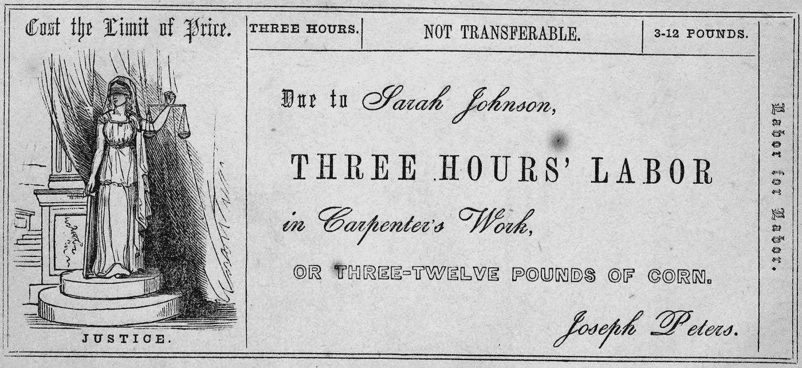
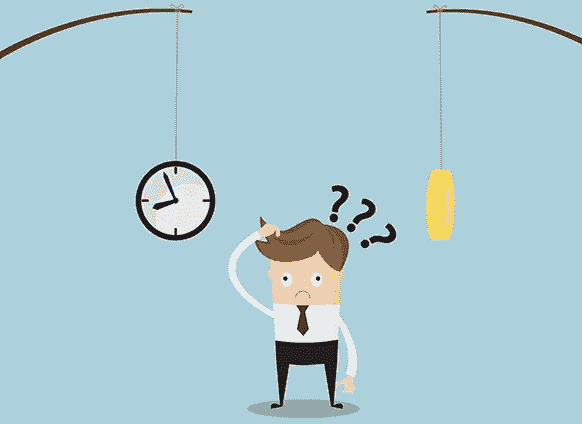
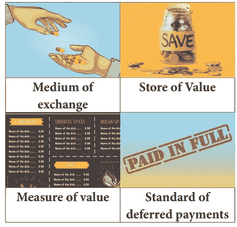

# 时间和金钱是一回事吗？

> 原文：<https://medium.datadriveninvestor.com/time-and-money-are-they-the-same-thing-7d48393bb704?source=collection_archive---------4----------------------->

## 钱是什么？可以用时间来解释吗？

*A sample labor note for the Cincinnati Time Store, which operated from 1827 to 1830.*

在电影*In Time(2011)*[***【1】***](#_ftn1)中，建立了一种新的通用货币:人的时间。每个人怀里都有一个计数时钟，在他们的时钟到期后死去。时间可以从一个人转移到另一个人，这样做减少了一个人的预期寿命，同时增加了另一个人的预期寿命。

Scene of the movie In Time

在电影中，穷人通常只有不到 24 个小时，而富人有无限的时间——或者说是不朽的时间。

从表面上看，钱是非常简单和不言自明的东西。现金(纸币)是人们每天看到和交换的真实和有形的东西。但是钱要复杂得多。我们知道它能做什么，但不知道它到底是什么。

 [## 在创业之旅中，拥抱学习|数据驱动的投资者

### 好像建立一个数百万美元的公司还不够困难，企业家必须额外照顾他们的…

www.datadriveninvestor.com](https://www.datadriveninvestor.com/2018/10/16/on-the-entrepreneurial-trek-embrace-the-learning/) 

许多学者、经济学家、哲学家试图解释货币是什么。我最喜欢的两本关于货币的书是路德维希·冯·米塞斯的*《货币信贷理论》*[***【2】***](#_ftn2)和大卫·格雷贝尔的*《债务:前五千年》*[***【3】***](#_ftn3)。这些书对货币的起源和演变采取了非常不同的立场。

What is the difference? Source: Success Magazine

虽然电影《时间中的*相当反乌托邦，但古训“时间就是金钱”在历史上一直被讨论。第一个有记录的句子是本杰明·富兰克林在 1748 年写下的“记住时间就是金钱”与此同时，早期的经济学家如亚当·斯密，以及后来的大卫·李嘉图和卡尔·马克思都在发展劳动价值论(LTV)。LTV 认为产品和服务的价值是生产这些东西的“社会必要劳动”的数量。换句话说，价值就是努力和工作。但是 LTV 的根源要古老得多，它可以追溯到亚里士多德和托马斯·阿奎那，他们在 1265 年写道:*

> “……价值能够、确实而且应该随着为改进商品所耗费的劳动量而增加。”[5]

劳动量可以用力量、灵巧、技能，更重要的是时间来衡量。因此，如果一件产品的价值被定义为生产它的时间，那么购买它所需要的金钱就可以是时间等价物。例如:如果建造一把椅子花费的**时间**是 3 天，那么这把椅子的**值**就是 3 天。因此，获得椅子的**价格**是 3 天。因此，根据 LTV，金钱也是时间(时间=价值=价格)。

然而，几十年后，当一种新的价值理论被提出时，LTV 被认为是过时的:稀缺和需求。当时价值被认为是供给和需求的函数。从供应的角度来看，产品越稀缺，价格越高。产品越丰富，价格越低。从需求角度来看，产品越受欢迎，价格就越高，反之亦然。

## 伟大的实验

1827 年，约书亚·沃伦将 LTV 付诸实践，在美国创建了第一家顾客可以用时间付款的商店。他把它命名为辛辛那提时间商店。他实施了所谓的劳工券，一种在时间上等价的货币形式。客户可以使用人工记录购买产品，例如“三个小时”购买一个室内装饰项目。

商店最初对生产该商品的成本收取 7%的加价，但后来降低到 4%。这个实验非常成功，这家商店成为辛辛那提最受欢迎的商店，其产品比传统商店便宜得多。

## 时间、金钱、货币、价值、成本和价格

本体很乱。语言和文字对我们没有帮助。时间、金钱、货币、价值、成本和价格有时可以互换使用，可以是数字等价物，但也可以表示完全不同的东西。

价格是产品标签上的数值，通常由卖方定义。

成本是获得产品的数值(会计成本和经济成本也有不同的含义)。

价值可以分为交换价值和使用价值。交换价值与价格密切相关，而使用价值是其使用的重要性。

货币是一种法定货币，如美元或欧元。

货币是交换产品或服务或积累它们的媒介。

最后，时间是对存在的一种度量。

## 钻石-水悖论

在发展价值理论时，亚当·斯密面临一个悖论。他问了自己一个简单的问题:水和钻石哪个更有价值？显而易见的答案是:水对人类更有价值，因为没有水就无法生存。如果是，为什么钻石比水更值钱(贵)？

他意识到英语词汇有限，而且“价值”一词实际上有两个意思:使用价值和交换价值。价值可以分为两种不同的含义，一种是可用性，另一种是与他人交换。水比钻石更有使用价值，但钻石比水更有交换价值。同样，时间比钻石更有使用价值。但是交换价值呢？

交换价值取决于他人的需求，即一个人愿意支付多少钱，而使用价值可以是内在的。交换——时间的价值是指你愿意放弃多少时间来换取其他东西。其他回报可以是金钱(薪水)、积极的情绪体验(与伴侣或家庭成员)、未来的期望(希望有一天有人会回报)，或者什么都不是，比如信仰、原则和价值观。

## 什么是金钱

经济学家将货币定义为被接受为支付手段的“任何东西”——这是一个非常宽泛的定义。冯·米塞斯把它们分为三类:商品货币、法定货币和信用货币。商品货币是实物产品，如金、银甚至烟草，它们都曾被用作货币。法定货币是一种公认的由权威机构(美国政府机构美元)发行的货币。最后，信用货币是一种可以作为交换媒介的债权。

根据“任何事情”的定义，时间就是金钱，因为一个人可以很容易地用他的时间“支付”另一个人来偿还债务。因此，时间可以被接受为一种支付手段。

The four functions of money. Source: brainkart.com

货币有四种功能:交易媒介(例如，代替物物交换)、价值衡量(例如，比较 1 公斤肉需要多少面包)、延期支付标准(例如，可以清偿债务)和价值储存(例如，投资是储存在金库中的价值)。

时间可以交换，可以衡量，可以还债。时间唯一没有完成的功能是储存价值。阿尔伯特·爱因斯坦可能会反对，他说我们可以通过回到过去来储存时间，利用他的相对论。但是如果我们相信时间是一系列不可逆转的事件，我们每天都在花费时间。

另一种看待储存时间的方式是如何以及何时使用它。20 多岁和 30 多岁的人可以选择尽可能多的工作，因为他们知道，随着年龄的增长，他们的体能会下降，他们的精力也可能会下降。年轻时花时间是一个明智的决定，因为它可以转化为现金，可以储存起来并乘以利息，增加收益。相反，其他人可能会选择日复一日地生活。不同的是，在后者中，没有相乘的余地。

最后，从稀缺性的角度来看，时间是有限的，因此是宝贵的。每个人将如何对待他们的生活完全取决于他们自己。任何想从他人的时间中获益的人都可能被要求以某种形式补偿他们。

## 时间=金钱

约书亚·沃伦证明了时间可以作为金钱和货币使用。因此，时间也是一种财富，可能是我们拥有的最有价值的资产。

当我们交换时间时，时间可以用不同的方式来衡量，但对每个人来说，它都有巨大的内在使用价值。

我们可以选择使用适合我们的时间，但是时间和金钱的主要区别是时间不会增长。时间是有限的，而金钱是无限的。有效利用你的时间，并将其转化为金钱是更好的策略。在以后的生活中，你在使用时间上的选择会更多，因为你的钱一直在增长，希望如此。

安德鲁·尼科尔。【及时 等。宽屏。由…编辑，20 世纪福克斯家庭娱乐，2012 年。

[【2】](#_ftnref2)冯·米塞斯·路德维希。*货币信贷理论*。天马出版社，2013 年。

[【3】](#_ftnref3)格雷贝尔，大卫。*债:前五千年*。梅尔维尔之家，2014。

[【4】](#_ftnref4)富兰克林，本杰明。给考虑结婚的年轻人的一封建议信。1926 年私人出版。

[5]托马斯。*神学大全*。玛丽雅蒂，1956 年。