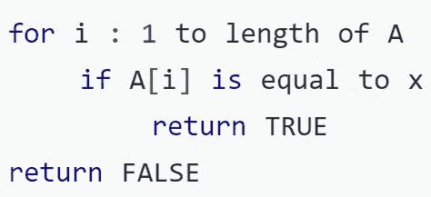
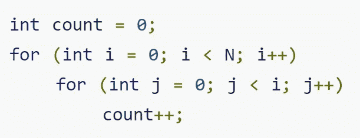
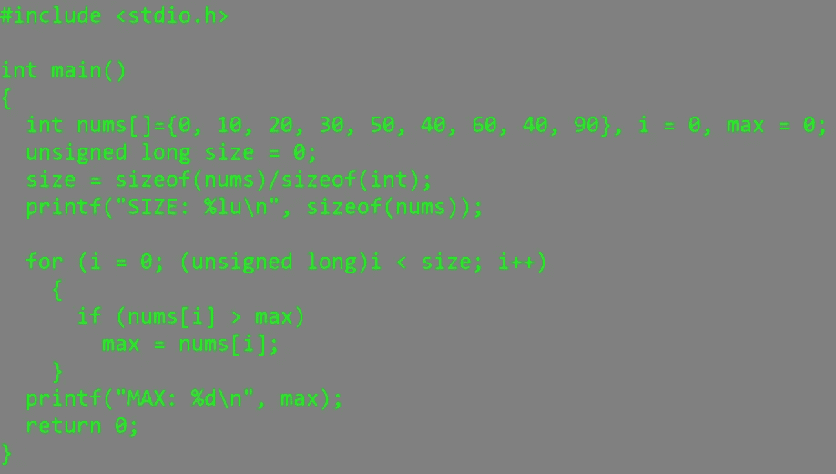
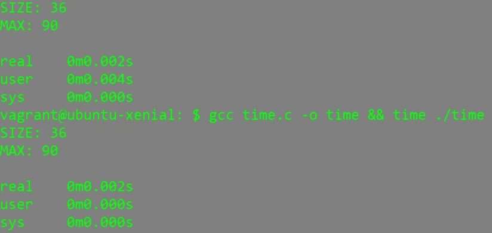
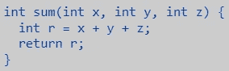
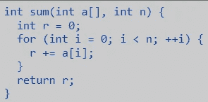

# 时空复杂性直觉

> 原文：<https://medium.datadriveninvestor.com/time-and-space-complexity-intuition-c51434507da?source=collection_archive---------12----------------------->

通常，可以解决一个问题的算法不止一个。因此，我们需要度量来帮助我们确定哪种算法更有效地解决手头的问题。时间和空间复杂度是我们最常用来比较算法的两个指标。这篇文章旨在为一个非常重要的概念提供一些直觉，这个概念有时看起来过于模糊或混乱。

算法的时间复杂度表示作为输入长度的函数的时间增长率。由于计算机完成的每一次运算都需要大约恒定的时间 c，所以我们最关心的是运算次数如何随着输入长度的增加而增加。

 [## 算法诱人的商业逻辑|数据驱动的投资者

### 某些机器行为总是让我感到惊讶。我对他们从自己的成就中学习的能力感到惊讶…

www.datadriveninvestor.com](https://www.datadriveninvestor.com/2019/03/22/the-seductive-business-logic-of-algorithms/) 

举个简单的例子，假设一个教室里有 100 个学生，你知道其中一个学生有一支笔。您希望尽快找到拥有该笔的学生(本示例由 geeks4geeks.org 提供)。让我们想象一下，问一个学生，代表了这个场景中的常数时间运算。O(N)的解决方案是询问班上的每个学生是否有笔，然后询问每个学生关于其他 99 个人的情况(这里学生代表 N)。一个 O(N)的解决方案是单独询问每个学生。O(log(N))解决方案是将学生分成两半，问“笔在右边还是左边”(假设每组有一个学生可以告诉你)，然后重复这个过程，直到剩下两个学生，其中一个拿着笔。

事实上，时间和空间的复杂性取决于程序员无法直接控制的几个因素:硬件、操作系统、处理器等。当我们提到时间和空间复杂性时，我们打算重点关注的是算法的执行时间(您可以想到代码需要的操作数量(因为每个操作需要恒定的时间))和代码在机器上需要的工作内存量。

假设我们有一个数组 A 和一个元素 x，我们被告知遍历 A 并确定 x 是否在 A 中。

假设我们编写了以下伪代码来解决这个问题:

Courtesy of Hackerearth.com

这个算法的运行时间将是 N*c+c，其中 N 是数组 A 的长度，而“+c”表示返回语句。

在这个例子中，算法的执行时间的增长顺序是线性的。也就是说，算法执行所需的时间将作为数组 a 长度的函数线性增加。在讨论增长顺序时，我们通常会忽略低阶项，因为当我们处理大量输入时，它们变得无关紧要。

例如，如果我们有一个算法，它的运算次数可以用下面的表达式来表示:N +5+N，我们会说这个算法就是 O(N)。

Courtesy of Hackerearth.com

这个例子是 O(N)。想想 count++会运行多少次。如果 N 是 5，我们知道外部循环将运行 5 次。对于外部循环的每次迭代，内部循环将运行 I 次。我们可以将这种增长顺序表示为 N*(N-1)/2。

算法的时间复杂度不等于执行特定代码所需的实际时间，而是一条语句执行的次数。通过使用时间实用程序执行代码，您可以看到这一点。下面是一个简单的程序，打印出一个整数数组中最大的整数。当我们用时间工具执行这个程序时，我们得到不同的时间:

这一切都是为了说明在同一台机器上运行的同一程序需要不同的执行时间。这可能很大程度上是由于资源的可用性——在任何给定的时间，您的机器可用于执行程序的资源可能更多/更少。这就是为什么时间复杂度不关注程序执行所花费的时间，而是关注一条语句必须执行的次数。上面的程序在时间复杂度上是 O(N )(并且可以在任何机器上运行),尽管它花费了不同的时间来执行。

空间复杂度是随着输入长度的增加“算法需要的工作存储量”(northwestern.edu)的度量。

让我们看一些空间复杂性的例子:

Courtesy of Northwestern.org

这个简单的程序需要三个内存单元。由于这个永远不变，所以这个程序的空间复杂度是 O(1)。

Courtesy of Northwestern.org

这个简单的程序(N 是数组 a 的长度)需要 N 个空间，或者空间复杂度为 O(N)。

最后要注意的几件事:

如果函数 A 占用 4 个单位的空间，并调用同样占用 4 个单位空间的函数 B，那么函数 A 的空间复杂度将为 O(N+M)或简单地为 O(N)。如果函数 A 调用函数 B 三次——并且函数 B 在每次调用后终止——空间复杂度仍然是 O(N ),因为空间可以重用。然而，如果函数 A 递归调用自身，那么空间复杂度将是 O(N ),因为每个递归调用都将增加调用堆栈。