# 时间平均还是系综平均？多重赌博的情况

> 原文：<https://medium.datadriveninvestor.com/time-average-or-ensemble-average-the-case-of-multiple-gambles-a01aa0da6f01?source=collection_archive---------5----------------------->

这是我正在进行的遍历经济学系列材料的第二篇文章。你可以在这里找到上一个:

[风险厌恶在非遍历系统中进化出现](https://medium.com/datadriveninvestor/risk-aversion-emerges-evolutionary-in-non-ergodic-systems-401a3e0b37c1)。

在这篇文章中，我不会定义和解释在之前的文章中已经开发的定义，如时间平均，风险中性概率，进化模拟等。所以，如果你有不明白的地方，我鼓励你去看看[的最后一篇文章](https://medium.com/datadriveninvestor/risk-aversion-emerges-evolutionary-in-non-ergodic-systems-401a3e0b37c1)。

 [## 为什么包容性财富指数比 GDP 更能衡量社会进步？|数据驱动…

### 你不需要成为一个经济奇才或金融大师就能知道 GDP 的定义。即使你从未拿过 ECON 奖…

www.datadriveninvestor.com](https://www.datadriveninvestor.com/2019/03/08/why-inclusive-wealth-index-is-a-better-measure-of-societal-progress-than-gdp/) 

此外，为了对主题和术语有一个总体的理解，我强烈推荐阅读 Ole Peters 的“[经济学中的遍历性问题](https://www.nature.com/articles/s41567-019-0732-0)”。

我将尝试回答这个问题:*如果我们同时进行多次赌博，时间平均增长率会发生什么变化？*

我们将看到，在试图回答这个问题时，我们将能够解释和证明长期研究风险行为的经济学家发现的一些模式。此外，我们会看到一些非遍历投资组合理论的线索。

我应该警告你，在我的研究中，我发现了一些规律和公式，我还不能完全解释或表达分析。我希望阅读这篇文章的人会发现进一步研究的潜力，并能够完成我已经开始的工作。这篇文章与其说是一个答案，不如说是一个问题，但仍然是一篇内容丰富的文章。

*为什么重要:*

1.练习:把简单的赌博看作资产，把这些赌博的集合(我们称之为复杂赌博)看作投资组合。我们将尝试找出，在给定投资组合中的资产数量和投资周期数的情况下，如何预测你的投资组合的平均增长率，假设乘法动态(这对大多数金融市场都是正确的)。

2.对于理论:我们将试图理解，风险厌恶究竟如何依赖于环境的具体条件:赌博的次数和周期的数量。通过遍历经济学的方法，我们将看到它是如何与主流经济学的模型相联系的，以及遍历经济学在解释现实世界方面的优势。我们将能够解释个体之间风险厌恶的差异(因此这是一个理性特征)，而无需假设不同的心理偏好甚至不同类型的增长动力——只需假设人们在不同时间拥有不同的资产并面临不同的选择。

我们开始吧。

我们已经研究了一个二项随机过程的玩具例子，发现时间平均是赌博结果的相关预测因子，而金融经济学中常用的总体平均给出了错误的结果。

但是我们需要记住，只有在非常精确的条件下，总体平均值和时间平均值(*定义为单次赌博*)才是对结果的完美衡量。真实世界在中间的某个地方。尽管时间平均公式绝不是遍历性的，但我们不能简单地将它应用于大多数现实世界的金融和经济问题。原因很简单:代理人经常同时进行不止一次赌博。

严格地说，时间平均，如果定义正确，对于任何类型的动态，如果周期数足够大，确实是赌博结果的一个很好的度量。但问题在于“正确定义”这几个字。这意味着，为了做出好的决策，我们应该计算我们进行的整套赌博的平均时间*，而不是单独进行的一次赌博。*

为了说明这一点，让我们回到我们的经典赌博。

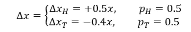

关于公式的详细解释，再次参见[经济学中的遍历性问题](https://www.nature.com/articles/s41567-019-0732-0)。

我们记得在一次赌博的情况下，风险中性的 q 概率的理论比率是 1，59，也就是 0.641/0，359。进化模拟给出了一个非常相似的结果。这意味着分子式

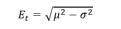

效果很好。

*图一。(1-q)/q 比率相对于一次赌博的进化周期*

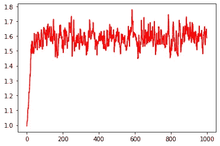

但是看看如果我们同时进行 10 次赌博会发生什么。q 概率的进化最优比率现在更低了。这意味着 10 次赌博的平均时间不再等于 1 次赌博的平均时间。对于一次赌博来说，现在处于时间平均值和总体平均值之间的某个位置。

所谓复杂的赌博“10 次同时赌博”，我的意思是财富平均分配在 10 次赌博中，这 10 次赌博各进行 d 次。因此，我们有 10 个结果(10 个时间平均值)。这些结果的算术平均值是这一复杂赌博的结果。可以表示为如下:

1.有一个复杂的赌博，由 n 个简单的赌博组成，如文章“[经济学中的遍历性问题](https://www.nature.com/articles/s41567-019-0732-0)”。有 d 个周期。

2.玩简单的赌博我，得到结果。

3.重复*步骤 2* n 次(每 I 次)。

4.求简单赌博所有结果的算术平均值。这是复杂博弈的结果。

*图二。10 次赌博的(1-q)/q 比率与进化周期的关系*

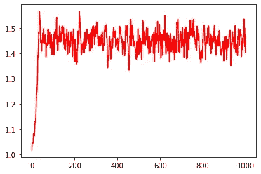

我们可以观察到，该比率现在已经稳定地小于 1.6。

但是让我们看看如果我们有 1000 个同时进行的游戏会发生什么。

*图三。(1-q)/q 比率相对于 1000 次赌博的进化周期*

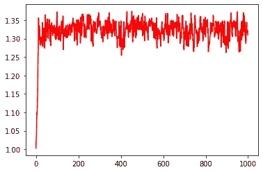

趋势很明显:我们赌得越多，q 概率与 p 概率的偏差越小，整体平均就越能成为衡量结果的恰当标准。但由于我们不能玩“无限”数量的游戏，q 概率将永远不同于 p 概率，在乘法动态下，在某种程度上厌恶风险永远是理性的。

例如，对于 100 000 次同时赌博，q 概率几乎等于 1/2:

*图 4。(1-q)/q 比率与 100000 次赌博的进化周期*

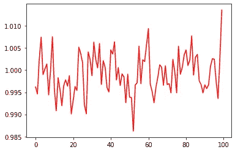

有一些分析或经验公式来表示赌博次数和平均时间之间的联系将是有帮助的。我们想要的不仅仅是“当赌博数量很大时，时间平均接近总体平均”。出于实践和研究的原因，我们需要定量的估计。

当然，人们可以尝试进行计算机模拟，就像我最初做的那样。我们可以编写一个代码，在给定赌博次数和每次赌博的赌博周期数(赌博在结束前重复多少周期)的情况下，传递一组赌博的结果。这很有用，因为这是任何试图预测赌博结果的模型的最终标准。原则上，它也允许我们评估任何给定数量的赌博和时期的结果。

然而，问题是，这种方法并没有给出这些值出现的确切原因。此外，大量周期和赌博的模拟可能会非常慢。这是一个纯粹的经验方法，但最终，我们想要一些公式。让我们试着找出一些。

从上一篇文章中，我们记得赌博的平均时间是:

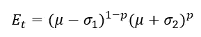

让我们以稍微不同的方式重写它:

在这个符号中，

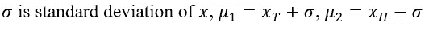

考虑许多同时赌博(n 次赌博)的情况。代理人在两次赌博中平均分配他的财富，因此每次赌博的投资份额是 1/n。

我们知道这些赌博总和的方差等于:

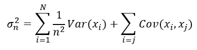

由于赌博是独立的，协方差项等于 0。所有赌博的方差是相同的。然后

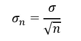

因此，赌博结果的近似值是

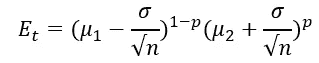

它表明，如果我们有许多同时赌博，时间平均将收敛到系综平均(遍历性特征):

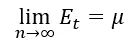

然而，问题是，这个公式仅适用于与赌博次数 n 相比周期数 d“足够小”的赌博。在计算机模拟中，它适用于 d=1、d=5 或 d=10。但是，如果我们有“足够大”的周期数，长乘法的“时间平均”影响将超过大量同时赌博的“整体平均”影响。

请注意:在这里和后面，我使用时间平均值的定义作为 d 个周期的平均值(并且 d 不一定接近无穷大)。数学上正确的时间平均定义应该包含 d 趋近于无穷大的假设。

试着这样看:一组 n 次赌博，每次赌博有 d 个周期的赌博的结果有一些公式 G。我们赌的越多，就越像这个系综平均值公式。我们的周期越多，就越像这个单次赌博的时间平均公式。

或者，换句话说:*许多同时进行的赌博意味着遍历性。很多时期的赌博意味着非遍历性*。

我在试图猜测这样一个公式。我们可以试着替换公式中的 n

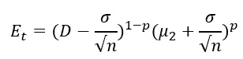

其中一些 k 具有我们需要的性质:

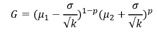

对于 G，我们试图找到一个复杂赌博的结果(某种近似)。

换句话说，我们需要调整标准偏差，这样我们的公式才有效。

意思是 k 应该是 d 个周期和 n 次赌博的函数。

我们知道 k 应该具有以下性质:

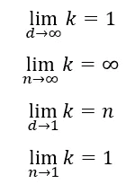

我们知道这一点，因为我们知道在给定的条件下，增长率应该收敛于总体平均值或简单赌博的时间平均值。

仅仅通过思考，我发现，例如，

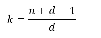

满足这些条件。

但是现在我们有了另一个问题:当 k 很大时，我们的公式等于

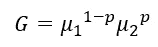

这显然不(总是)等于总体平均值。这样不好。

我们需要对于大的 k，G 收敛于一个简单赌博的总体平均值。我们可以通过应用一些术语 r:

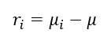

到这样的程度

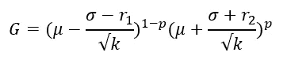

这就是我如何推导出 g 的公式，这个过程在数学上并不严格

但令人惊讶的是，它工作得相当好！当我运行模拟时，该公式提供的结果非常接近模拟的结果(偏差不超过 2%)。我还不知道为什么。

所以，免责声明:*k 的公式只是我的猜测。虽然它满足所有必要的限制条件，并且与模拟结果相当一致，但我不知道它为什么以及什么时候起作用，为什么看起来和它看起来一样。没有定理证明公式是正确的。我明确地不推荐使用这个公式，除非你完全理解，为什么和什么时候它是正确的，以及它的数学依据是什么。*

然而，很可能该公式至少接近现实。在讨论*现实世界*中的遍历性和风险规避时，这也是一个很好的起点(这里我们有一些有限数目的赌博和周期，但这些数目肯定大于 1)。理查德·费曼曾经说过，在发现新的自然规律的过程中，第一步是去猜测它。我将依赖这一陈述作为方法论指导。

我测试了各种 p(0.25；0.5;0.75)，n(10；100;1000)和 d(10；100;1000).总共有 3 =27 次模拟。为了评估配方的质量，我进行了回归分析，得到了决定系数，其值为 0.9935！几乎所有模拟结果的方差都可以用 g 的公式来解释。

*图五。模拟结果与 G 的相关性*

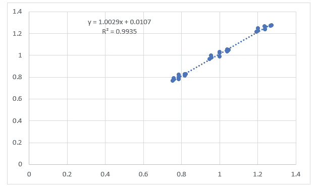

但是独立于回归的结果，这个公式仅仅通过它是如何被构造的就应该对极限情况起作用。这意味着当 n=1，或 d=1，或 p 和 d“足够大”时，它*肯定*起作用。

当然，我们现在可以推导出多重赌博情况下的风险中性 q 概率:

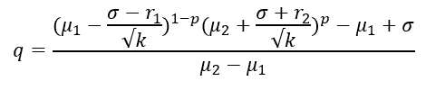

在这种情况下，理论预测与模拟结果并不完全一致，因为 q 的公式对参数的变化非常敏感。这意味着，即使我们评估的 G 与模拟结果有一点点偏差，q 也可能有很大变化。

*表 1。不同参数赌博的(1-q)/q 比率，p=0.5*

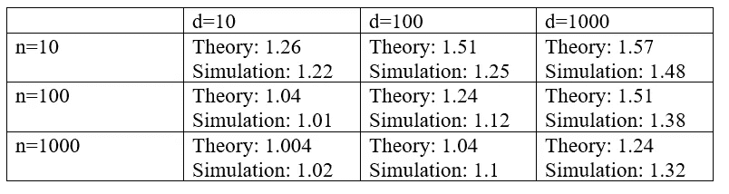

在所有这些考虑和公式中，我们可能已经看到一些非遍历投资组合理论的预期。我不会称之为第一步，但它可能是第一步的预演。

事实上，我们开始研究大量的资产，而不是单独的资产。我们已经看到了资产数量如何改变投资结果并影响投资模型。它仍然是我们可以想象的最简单的资产集合:赌博(资产)是绝对相同和独立的。

然而，投资组合理论应该解释如何选择和组合不同的资产。例如，它们的不同之处在于:

-结果的价值；

-结果的概率；

-结果的协方差。

当我们开始研究这些稍微复杂一点的案例时，我们已经可以根据经验来检验这个模型，而且，也许，我们会发现现实与这个模型相似。

但是，在给定的环境下，即使是可用的结果也能告诉我们很多关于多样化、理性和最优行为的信息。

我认为我们应该试试。

这一证据表明，遍历性经济学可以解释个体之间风险厌恶的差异，我们不需要给每个经济主体分配不同的效用函数。一些对遍历性经济学的批评依赖于这样一个事实，即在实验室实验中，人们倾向于具有不同的风险厌恶(可以解释为不同的效用函数)，但遍历性经济学预测了单次赌博的单次时间平均值，因此，看起来，当人们面临相同的赌博时，他们应该做出相同的反应。我们现在看到，如果我们考虑到每个赌博只是代理人做出的所有决策的一部分，遍历经济学完全可以很好地解释风险厌恶的变化。当然，很难证伪这种对不同风险厌恶的解释，因为我们需要跟踪人们做出的所有风险决策。然而，期望效用理论根本没有解释为什么人们会有各种各样的效用函数。人们认为这只是一种心理特征，仅此而已。这并不意味着期望效用理论是“坏的”。这只是意味着，遍历性经济学或许可以回答一些期望效用理论无法回答的重要问题。

尽管这对于遍历性经济学来说是一个明确的论点，但它也证明了一个事实，即预期效用理论和其他一些经济学的假设在经验上是正确的，至少在某些(可能相当普遍)条件下是正确的。事实上，我们看到风险厌恶取决于一个人赌博的次数(多样化，对财富数量的依赖)或对未来的信念(我将在未来进行多少次赌博)。效用函数凹度或边际效用模式(增加绝对风险厌恶)也适合我们的模型。我们调查的证据对经济学中的实验方法施加了一些限制:如果没有特定人的生活和经济决策背景，我们无法从观察风险下的行为中得出一般性结论。

但因此它解释了更多:经济主体在不同情况下不断变化的风险厌恶，即使他们的财富保持不变。

再一次，遍历性经济学只是解释了为什么以及何时经典和/或行为经济学是正确的。

这是我关于遍历经济学的第二篇文章，但这仅仅是个开始。很快，我将完成这个系列的下一篇文章。大概，会有这样的话题:

- *非遍历市场中的最优杠杆:进化模拟。*

- *赌博中“死亡”的概率及其对风险厌恶的影响。*

——*决策理论的进化模拟方法:生存作为合理性的标准。*

- *风险厌恶是如何出现的，即使是在具有加性动态的赌博中。*

- *托勒密和哥白尼:为什么遍历性经济学可能是更好的理论，即使它的预测能力与主流经济学相同？*

- *遍历经济学对投资组合理论的启示。*

通过这个系列，我打算实现两个目标:开发遍历经济学的新应用，并通过进化模拟来测试它的一些想法。

保持最新状态！

**参考文献**

费曼，理查德(1965)。物理规律的特征。现代图书馆。ISBN 978–0–679–60127–2。

时间贴现和时间偏好:一个批判性的回顾。*经济学博士。真实的* **40** ，351–401(2002)。

赫尔，J. (2009 年)。期权、期货和其他衍生品/约翰·C·赫尔。新泽西州上马鞍河:普伦蒂斯霍尔。

伊托，K. (1944)。109.随机积分。帝国学院学报，20(8)，519–524。

J.l .柯立芝，《数学概率导论》(牛津大学出版社，1925 年)。

K.在期望效用最大化中使用无界效用函数:反应。88, 136–138 (1974).

Lee，M. D. & Wagenmakers，E.-J. *贝叶斯认知建模*(剑桥大学出版社，2013 年)。

米（meter 的缩写））布坎南，“与时间赌博”，纳特。物理杂志第 9 卷第 3 期(2013 年)。[https://doi.org/10.1038/nphys2520](https://doi.org/10.1038/nphys2520)

遍历性打破揭示了人类的时间最优经济行为。预印本在[https://arxiv.org/abs/1906.04652](https://arxiv.org/abs/1906.04652)(2019)。

O.彼得斯，“圣彼得堡悖论的时间解析”，菲洛斯。反式。R. Soc。伦敦爵士。A 369，4913–4931(2011 年)。[https://doi.org/10.1098/rsta.2011.0065](https://doi.org/10.1098/rsta.2011.0065)

课堂讲稿。*遍历经济学*[https://ergodicityeconomics.com/lecture-notes/](https://ergodicityeconomics.com/lecture-notes/)(2018)。

预期效用理论的时间解释。https://arxiv.org/abs/1801.03680(2018)预印本。

用动力学评估赌博。*乱* **26** 、23103 (2016)。

经济学中的遍历性问题。纳特。物理 15，1216–1221(2019)。[https://doi.org/10.1038/s41567-019-0732-0](https://doi.org/10.1038/s41567-019-0732-0)