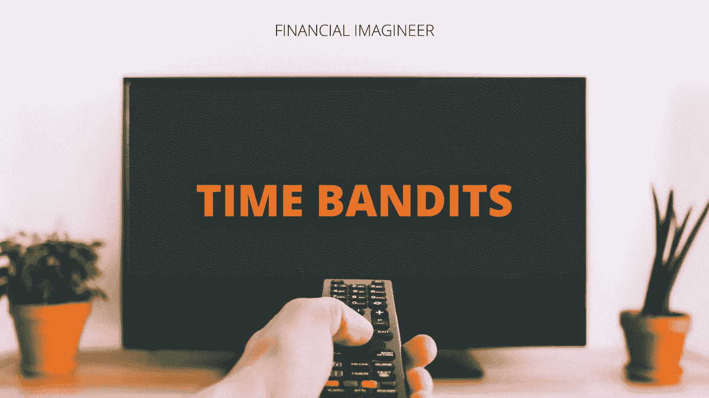

# 时间强盗——金融幻想家

> 原文：<https://medium.datadriveninvestor.com/time-bandits-financial-imagineer-b3b375580339?source=collection_archive---------24----------------------->

时间是你最宝贵的财富。不要让任何东西或任何人偷走或破坏它。在我们的现代世界，我们被时间强盗所包围。识别他们。把它们分类。[设计生活](https://www.financial-imagineer.com/2017/10/19/why-you-should-financially-imagineer-your-life/)。

不管你是乞丐还是亿万富翁，我们每天都有同样的 24 小时。前进或后退的区别仅仅在于我们如何利用和投资我们的时间。

Time Bandits — the Monty Python movie.

时间强盗没有创造历史——他们偷走了历史！

确保你和他们保持安全的距离，这样他们就不会窃取你的潜力，创造历史。

什么是时间强盗？

他们是那些耗尽你的精力和时间的事情、活动或人，最终让你效率更低、注意力更不集中；不太开心。对许多人来说，时间强盗可能是阻碍我们走出去追逐梦想的原因。

时间强盗有不同的形式。有些很难被发现。别人已经接管了你的习惯。这就是为什么这篇文章将详细介绍并试图展示一些方法来处理你的时间强盗，以增加你在经济上想象你的梦想生活的机会！

# 媒体

听说过“媒体迷”这个词吗？嗯，这些人永远和他们的媒体联系在一起，很难放下。他们已经沉迷于消费越来越多的内容。他们是否能用学到的东西做些什么是这里的大问题。

媒体时间强盗可能是:

*   看电视/网飞
*   看新闻
*   社会化媒体
*   油管（国外视频网站）
*   视频游戏

不要误解我，这些事情有时都是好的，有趣的。

这个问题伴随着无意的过度消费而来。与其让你的宝贵时间在从事上述任何一项活动时白白流逝，不如有目的地使用媒体。有目的或有目标的看某个节目。目标可以是简单地享受乐趣。通过社交媒体与你关心的人保持联系。观看 Youtube 以获得灵感、娱乐或学习一些东西。玩电子游戏来训练(而不是消耗)你的大脑。

关键是不要让以上任何一个成为你人生道路上不必要的干扰。

你能做的是忽略社交媒体上的通知，预先定义你允许自己沉迷于媒体消费的特定时间，或者积极利用这些渠道获得灵感，并学习如何创造而不是仅仅消费。

# 失去焦点

[什么对你来说很重要？](https://www.financial-imagineer.com/2020/07/24/ikigai/)你想实现什么目标？你给自己设定了本周的目标了吗？这个月？今年？你的生活？如果没有，那就去给自己设定一些目标。如果是，你相信你已经走上正轨了吗？如果不是，你的主要障碍是什么？一个关键的障碍是不够专注。

说“是”的次数太多会让你失去注意力。如果你答应任何人。任何事。每一个。他妈的。时间……那么你就间接地对其他事情说不。因此，小心你承诺的事情，确保这些事情与你的目标一致。

你可以做生活中的任何事情，但不是所有事情。

生活是一种交换。

你必须选择如何度过你的时间。

如果你很难说是或不是:想想要么说他妈的是或不是。

另一种失去注意力的方式是做太多的多重任务。这个特别可怕。这简直是浪费时间。它通常会破坏生产力和质量。多任务处理适用于注意力不集中的活动或消耗内容，如分层时间或听播客。

通过多重任务，你让自己忙碌起来。你做这个，做那个，但是最终什么真正重要的事情都没有完成。尽可能避免多次服用。不要再浪费你的生命了。

学会如何集中注意力。

# 至善论

第三次土匪是完美主义。完美主义经常被用来解释为什么有些事情还没有完成。不要追求完美主义，而是朝着正确的方向前进。有时候足够好就足够好了。建立势头。不开始或放慢太多会破坏增长并阻止失败，如果早点学会，这些失败会带来宝贵的教训。

了解如何开始。继续前进。继续前进。

 [## 金融行业如何受益于机器学习发展和人工智能|数据驱动的投资者

### 在快速变化的金融世界中做出正确的决定并抓住机会可以让你的…

www.datadriveninvestor.com](https://www.datadriveninvestor.com/2020/07/28/how-finance-sector-can-benefit-by-machine-learning-development-and-ai/) 

先满足于“足够好”。如果你想学习如何投掷飞镖，你不必阅读相关的手册，而是从投掷第一个飞镖开始，然后是下一个，再下一个，直到你完全知道如何去做。

别等了。现在就开始吧。边做边学。

# 拖延

等等？为了什么？如果你现在就能做，为什么要拖延呢？许多人养成了明天做某事的习惯。这样做，你实际上“允许”自己在开始之前浪费一整天的时间。通常的模式会延伸到这成为一个简单的“从不开始”的习惯。

一点也不。

与其梦想，不如开始行动。做自己想做的事，永远不会后悔。你的梦想和想法都被很好地储存在你的头脑中。但如果他们留在那里，对谁都没有好处。最不像你自己。

不管你在梦想什么或者在想什么，不要再拖延了，现在就开始吧。如果需要的话，可以一步一步来，但是要开始前进。

> 如果你不能飞，那就跑吧。
> 
> *如果你不能跑，那就走吧。*
> 
> *如果你走不动，那就爬吧。*
> 
> 无论你做什么，你都必须继续前进。
> 
> *小马丁·路德·金博士*

不确定你为什么不采取任何行动？写下你的梦想和想法。进行创造性的头脑风暴会议:[(按摩浴缸)](https://www.financial-imagineer.com/2020/07/21/the-art-of-jacuzzi-beerstorming/)如果需要的话——这对我很有效。

记下并规划出你的想法。一旦你变得更清晰，开始规划一条路，一条道路，朝着你梦想的生活前进。这个计划应该有足够的启发性和激励性，让你立即开始，而不是让这个时间强盗夺走你潜在的未来。

开始实现你的梦想。

告别拖延症。

# 否定性

在生活中，你会遇到带着某种消极情绪的人。有些人发现每个解决方案背后都有问题。

消极的人爱抱怨:是的，我们都有不知所措，不被理解的时候。但是不要陷入这个陷阱，试着寻找其他方法来发泄情绪，放松和消化你的生活。

抱怨本身就是消极的。如果你成为一个消极的人，你会吓跑积极的人，可能会错过他们所能提供的。

消极的另一种形式是令人担忧。

这是最难自我认同的事情之一。谨慎本身并没有什么不好。然而，担忧是无益的，会浪费你的时间和精力。一些“杞人忧天者”倾向于完全夸大想象中的危险。担忧和过度思考会导致压力，这反过来又会阻碍行动。压力大的人思考不清楚。

少操心，不要计划过度。

事情变了。你也会的。

不要让你周围都是消耗灵魂能量的吸血鬼，而是建立你自己的志趣相投的群体。学会如何远离消极的人。形成一个积极的避难所。

难做？

阅读[马克·曼森的《拒绝的微妙艺术》—变得不可抗拒。](https://amzn.to/2DC2S47)

# 小心时间强盗

时间强盗会出现在你的生活中。尽早识别他们。只允许他们暂时存在，让他们给你上永久的课。有时候不是时间偷走了什么，而是它留下了什么。

吸入好东西。吐气吧。

你的时间或“生命能量”是你的货币。不要让它白白浪费，也不要让别人偷走。明白你只活一次— [冬天来了](https://www.financial-imagineer.com/2020/09/02/winter-is-coming/)。小心时间强盗。它们吸取你的能量。

创造一个积极向上的环境。松开手刹。时间强盗大多是某种形式的生产力障碍。把你的生活转换成曲速引擎。开始测试你的引擎到它的最大潜能。

> *设计生活。*
> 
> 不要浪费时间。
> 
> *时间就是生命。*
> 
> *你的生活。*

不要让自己成为你无论追求什么都不成功的原因。

自己成为时光大盗，窃取自己的历史！

优化你的时间，为你自己设定一周工作 4 小时的目标。

控制你的注意力，选择你的生活，

马特(男子名ˌ等于 Matthew)

如果你喜欢阅读，请不要忘记关注[脸书](https://www.facebook.com/financialimagineer)、[推特](https://twitter.com/FI_imagineer)或者订阅财经幻想家。

免责声明:请注意，上面使用的一些链接可能是附属链接，Financial Imagineer 可能会收到补偿。

*原载于 2020 年 9 月 7 日 http://www.financial-imagineer.com**[*。*](https://www.financial-imagineer.com/2020/09/07/time-bandits/)*

***访问专家视图—** [**订阅 DDI 英特尔**](https://datadriveninvestor.com/ddi-intel)*