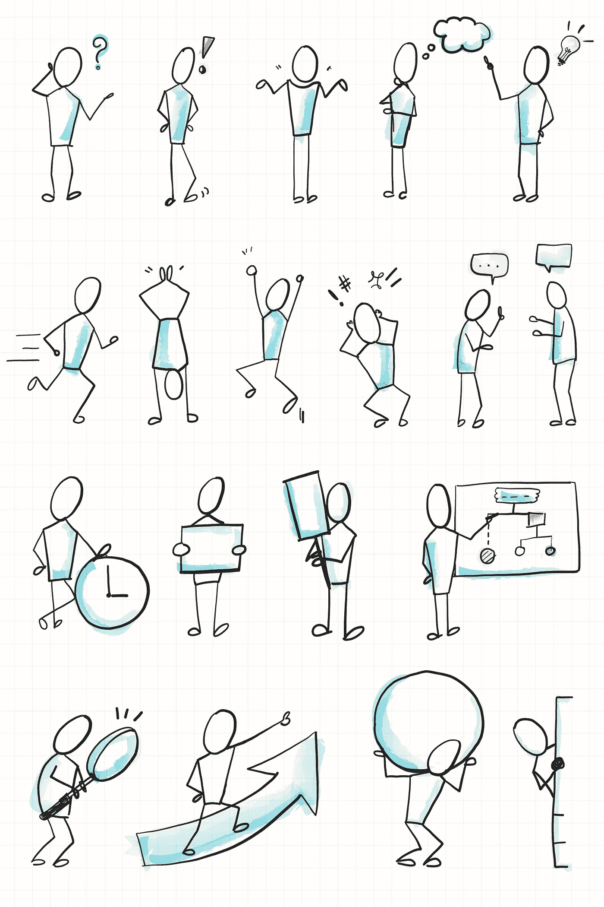

# 时光飞逝

> 原文：<https://medium.datadriveninvestor.com/time-flies-7f348ec647b8?source=collection_archive---------21----------------------->

我记得学校放假时夏天的味道。我在一个慵懒的下午爬芒果树，想象着即将到来的所有乐趣！它们很长，没有尽头。现在回想起来，每次这样的假期似乎都充满了好几世。

当我把它和现在相比时，生活在快车道上飞驰而过。我试着伸出我的手，试图抓住时间。唉，它溜走了，几天变成几周，几周变成几个月，几个月变成几年。

我上大学的时候感觉就像昨天一样，现在我已经工作很久了，时间过得真快啊。随着年龄的增长，是什么让时间过得如此之快？

# 物理时间:

我们测量的是物理时间。一分钟由六十秒组成，一天由二十四小时组成。按照公历，我们一年有 12 个月，是地球绕太阳一周的时间。

这一次，除了闰年和闰秒，在我们的一生中都是一样的。从我们出生到死亡，我们在地球上感知的物理时间保持一致。然而，我们对时间的感觉不同。为什么会这样？

# 对时间的感知:

我们对时间飞逝的感觉是心理上的。当我们还是孩子的时候，我们的整个人生都在前面。我们很少经历它；因此，每次经历对我们来说都是新奇的。

上学的第一天，第一次旅行，第一次夏令营，或者第一次参加比赛。所有这些经历充满了我们的童年，并使它成为现在的样子。

随着时间的推移，新鲜感减弱，事情变得平淡无奇。曾经激动人心的日子变得平淡无奇，一旦你见识了生活的大部分，惊喜就变得少之又少。

这就是为什么 2020 年，世界上大多数人都在家工作，感觉时间飞逝的原因之一。坐在家里，没有新奇的经历，过着一成不变的生活，日子过得很快。

# 预期时间知觉:

当你在一个实例中体验时间时，想想在学校的一个无聊的讲座，时间似乎永远没有尽头。每一分钟都感觉像是永恒，你唯一的希望就是尽快克服它。

相比之下，花时间在周日。一眨眼，就过去了。让你质疑，你的周日去哪了？

通过做一些吸引我们的事情，我们对当前时刻的感知发生了变化，从缓慢爬行到六十秒后消失。

# 回溯时间知觉:

我们记得生活事件的方式，想想你每天的生活，你起床，去工作，吃通常的午餐，看电视连续剧，然后睡觉。

在经历了几个月的运动后，你将没有什么可以回忆的，因为你的大脑已经习惯了同样的旧模式。

相比之下，去一个新地方的令人兴奋的旅行，尝试新的活动，结识新的朋友，吃美味的新鲜食物。这样的行为在你的大脑中制造回忆的钩子；这种模拟事件帮助你延长时间。

# 如何让时间变慢:

最后，把所有的理论放在一起，我们如何让时间变慢？有几种方法可以做到这一点，

1.  **追求新奇**:新的经历、爱好、尝试新事物可以延长我们对时间的感知。所以下一次，你应该试着学习如何烹饪或跳舞。
2.  **初学者心态:**用孩子的眼光看世界。不要期望它以某种方式运行，而是选择不时地用一套新的视角来看待它。毕竟在初学者的心目中，有很多种可能。在专家看来，很少。
3.  **打破常规:**不要每天做同样的事情，尝试新事物。可以是一些小事，比如在阳台上喝杯咖啡，或者和一个你有一段时间没联系的朋友聊聊天。小小的改变会累积起来，帮你留下美好的回忆。
4.  接受节奏:随着年龄的增长，时间确实会比你年轻时过得更快。接受这一点会帮助你做出必要的改变。记住，接受是改变的第一步。

做事不会让你成仙，但这是一个开始。你会越来越多地在你的几周内开始一些事情。代替模糊，你将有钩子来悬挂你的记忆，回忆过去的几个月。

有时候，我们需要休息一下，做些改变，在这个小小的蓝点上享受一点时间。