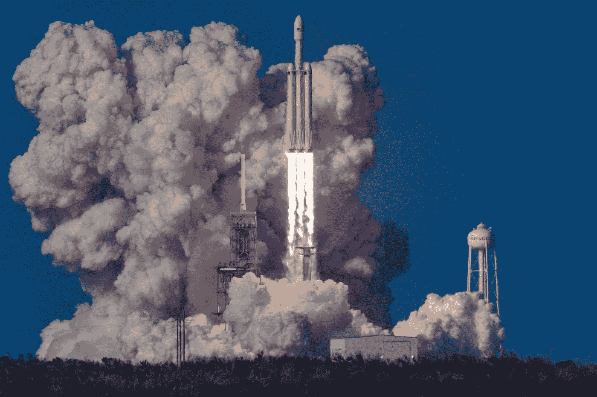
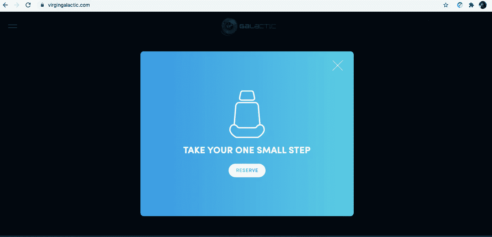
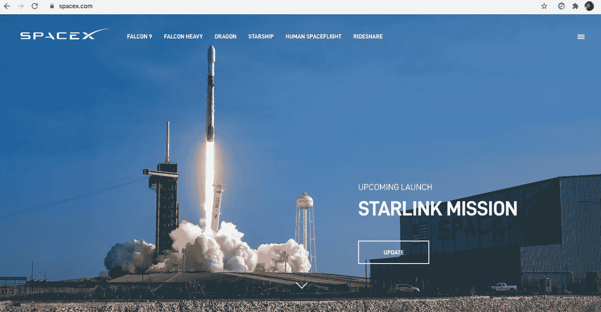
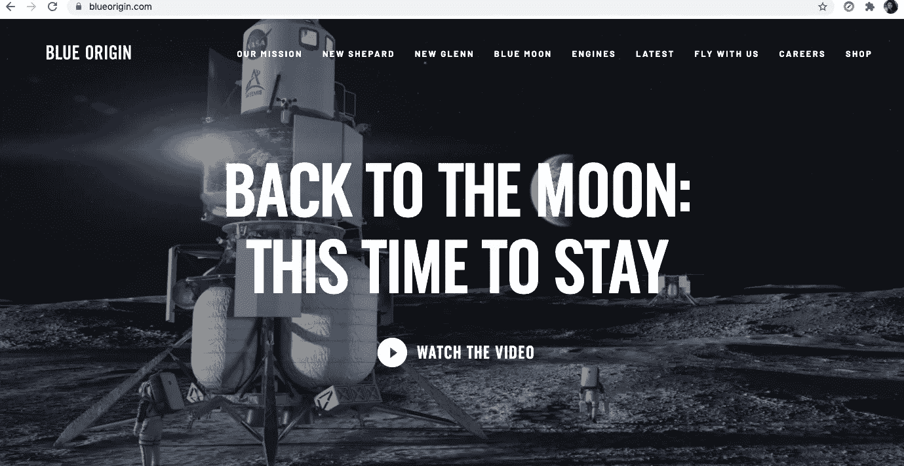

# 是时候投资太空了

> 原文：<https://medium.datadriveninvestor.com/time-now-to-invest-in-space-df727134ef68?source=collection_archive---------17----------------------->

受太空旅行启发的顶级投资理念

Photo by [Bill Jelen](https://unsplash.com/@billjelen?utm_source=medium&utm_medium=referral) on [Unsplash](https://unsplash.com?utm_source=medium&utm_medium=referral)

我昨天见了一个朋友喝咖啡，实际上是茶。喝着新鲜薄荷茶和樱桃蛋糕，他问我是否听说过加来道雄。

“不，不，”我说。

*‘你应该去看看他的书，书名是***’他谈到了太空旅行，这真的很有趣。*他说。*

*所以回到家后，我把书下载到 Audible 上，然后上床睡觉，太空旅行的想法仍在我脑海中萦绕。*

*第二天早上，我查看我的股票投资组合。*

*我的工作是[美元成本平均法](https://www.investopedia.com/terms/d/dollarcostaveraging.asp#:~:text=Dollar%2Dcost%20averaging%20(DCA)%20is%20an%20investment%20strategy%20in,volatility%20on%20the%20overall%20purchase.&text=Dollar%2Dcost%20averaging%20is%20also%20known%20as%20the%20constant%20dollar%20plan.)，在封锁前，我买了 Zoom Video ( [纳斯达克:ZM](https://consent.yahoo.com/v2/collectConsent?sessionId=3_cc-session_599cce7a-dc34-41c8-9c65-2c8f6c35075e) )和 DocuSign ( [纳斯达克:DOCU](https://finance.yahoo.com/quote/DOCU/) )等股票。*

*现在，随着锁定股票开始获得更多的区间，美国大选即将来临，我认为是时候改期洗牌了。*

*就在那时，我偶然发现太空旅行是一个投资主题。*

*通常，我可能不会追求这个主题，因为我对它了解不多，但鉴于我的朋友推荐了这本书，我下载了它，这是我在 24 小时内第三次与空间擦肩而过。*

*或许，星星正在排列。*

*因此，我查找了关键股票，并通过这篇文章，我希望能激发你的新想法。*

*请仅将我的文章用于教育，并记得做你自己的研究。我不是投资顾问，我只是分享我自己的研究。*

## *关键人物*

*如果我们直接看太空旅行，在这个*太空*有三个关键的企业家。*

*[理查德·布兰森的维珍银河](https://www.virgingalactic.com/)、[埃隆·马斯克的 SpaceX](https://www.spacex.com/) 和[杰夫·贝索斯的蓝色起源。](https://www.blueorigin.com/)*

*我们将看一看其中的每一项，主要是它们的使命以及我们如何对它们进行投资。*

## *维珍银河*

*我从维珍银河开始。*

*当你登陆网站时，维珍银河马上邀请你预订座位，让你迈出一小步。*

*它的操作基地在新墨西哥州，如果测试按计划进行，它将在 2021 年第一季度由理查德·布兰森爵士亲自驾驶。*

**

*A screenshot of virginatlantic.com taken on 20SEP20*

*它的任务是[利用空间做好事](https://www.virgingalactic.com/mission/)。*

> **“我们正处于太空探索的黄金时代，这将改变我们与地球和宇宙的关系”——*[*Richard Branson 爵士*](https://www.virgingalactic.com/mission/) *，创始人，维珍银河**

*从投资的角度来看，在撰写本文时，维珍银河([纽约证券交易所:SPCE](https://money.cnn.com/quote/forecast/forecast.html?symb=SPCE#:~:text=Stock%20Price%20Forecast,the%20last%20price%20of%2017.21.) )的交易价格低于 17.50 美元，最高估计为 28.00 美元，最低估计为 22.00 美元。*

* [## 9 月份你需要知道的 5 大投资方式|数据驱动型投资者

### 阿斯特拉和苹果上个月制造了新闻，他们的股票分割推动一些股票上涨，股市正在降温…

www.datadriveninvestor.com](https://www.datadriveninvestor.com/2020/09/21/5-great-ways-to-invest-in-september-you-need-to-know/) 

这支股票在很大程度上是未经证实的，但鉴于迄今为止取得的进展，你可能会觉得你想从这支相对便宜的股票中分得一杯羹。

或者，如果你更喜欢观察一段时间并获得更多确认，那么你可以点击[此处](https://investors.virgingalactic.com/overview/default.aspx)订阅投资者提醒。

## SpaceX

名单上的下一位是埃隆·马斯克的 [SpaceX](http://spacex.com) ，他是 SpaceX 的[创始人、首席执行官、首席技术官和首席设计师](https://en.wikipedia.org/wiki/Elon_Musk)。

SpaceX 的[任务](https://www.spacex.com/mission/)是让人类成为多星球的，它说的是完全可重复使用的运载火箭，能够将人类运送到火星和更远的地方。

> …我想不出还有什么比走出去成为明星更令人兴奋的了，”—埃隆[马斯克](https://www.spacex.com/mission/)

A screenshot of the SpaceX website on 20SEP20

将会有拼车，但是你现在还不能准确地预订一个座位。

就[投资](https://investormint.com/investing/how-to-buy-spacex-stock)SpaceX 而言，不幸的是你还不能投资 SpaceX。

这是因为 SpaceX 是一家私有公司，风险投资公司 [Founders Fund](https://foundersfund.com/) 和 [DFJ](https://www.dfj.com/) 共同投资了 5900 万美元。

然而，在 2015 年，[谷歌](https://investormint.com/investing/alphabet-stock)和[富达](https://investormint.com/investing/brokers/fidelity-review)共同出资 10 亿美元加入进来。

因此，如果你热衷于 SpaceX，那么唯一的选择就是去谷歌([纳斯达克:GOOG](https://finance.yahoo.com/quote/GOOG/) )，因为 [Fidelity](https://www.fidelity.com/) 也是一家私人公司。

## 蓝色起源

最后[蓝色起源](https://www.blueorigin.com/our-mission)由杰夫·贝索斯提出。

A screenshot of Blue Origin on 20SEP20

我只是喜欢他们建造太空之路的愿景，这样我们的孩子就可以建设未来。我喜欢这一点，除了让太空旅行变得负担得起之外，还有一个为后代建造东西的挂钩。

就投资蓝色起源而言，目前还不可能，因为它是由亚马逊(纳斯达克股票代码:AMZN)创始人兼首席执行官杰夫·贝索斯全额出资的。

2018 年，杰夫·贝索斯出售了近 20 亿美元的亚马逊股票，为蓝色起源提供资金，并计划每年再投资 10 亿美元。

然而，我认为即使你没有在这方面投资，也值得密切关注。

这是因为杰夫·贝索斯称蓝色起源是他正在做的最重要的工作——撇开财务不谈，如果那是他精神投入的地方，那么我很想看看它会有什么结果。

> “每次你买鞋，都是在帮助资助蓝色起源，所以谢谢你，我非常感激。”—杰夫·贝索斯

## 其他相关机会

虽然上述公司只专注于太空旅行，但还有其他相关的投资机会，如波音([纽约证券交易所:BA](https://finance.yahoo.com/quote/BA/) )和洛克希德·马丁([纽约证券交易所:LMT](https://stocknews.com/news/lmt-noc-hei-bah-ktos-5-top-rated-defense-stocks-to-buy-now/) )可能会引起你的兴趣。

虽然这些公司对太空飞行有所了解，但这不是他们的主要业务——所以如果你对太空旅行不确定，那么这样的股票可以帮助你获得一些曝光，同时限制你的直接曝光。

事实上，我在上周的帖子中也提到了[洛克希德·马丁公司(纽约证券交易所代码:LMT)](https://medium.com/the-innovation/how-to-rebalance-your-stocks-during-the-us-election-4567f4df1574) ，在那里我分享了一些与美国大选有关的投资想法，所以这是一种想法的融合。

 [## 如何在美国大选期间重新平衡你的股票？

### 从 2020 年美国大选中获利的有形投资理念

medium.com](https://medium.com/the-innovation/how-to-rebalance-your-stocks-during-the-us-election-4567f4df1574) 

## 你为什么要在乎？

太空旅游被许多人认为是华尔街的下一个[万亿美元](https://www.cnbc.com/2019/11/09/how-to-invest-in-space-companies-complete-guide-to-rockets-satellites-and-more.html)产业，所以对于那些寻找下一个大产业和下一批[十袋](https://corporatefinanceinstitute.com/resources/knowledge/trading-investing/10-ten-bagger/)的人来说，这肯定是一个有趣的探索领域。

虽然这有点牵强，难以想象，但它被认为是完全可行的，并且背后有一些非常强大的名字。

但更重要的是，这也与可持续性有关。在这里，让我们回到我们开始这篇文章的那本书。

虽然我还没有读完，但我已经读完了前十章，下面是一些要点。

Kaku 在他的书中解释说，就像恐龙面临灭绝一样，在接下来的一万年里，总有一天人类也会面临这种威胁——书中的事实解释了这是多么不可避免和显而易见。Kaku 解释说，这种情况以前发生过五次，没有理由不会再次发生。

然而，随着人类和当前技术的进步，我们可以为此做好准备，以便人类可以享受多行星的存在，并比地球本身长寿。

他继续解释说，对于许多人来说，这可能是可笑和不可思议的，作为人类，我们已经取得了超越我们祖先最疯狂想象的进步，后代也将如此。

也许这就是为什么我喜欢贝佐斯关于一步一步为未来做点什么的观点。

## 结论

太空旅行是一个关键的新兴产业。

尽管政府多年来一直对此感兴趣，并取得了巨大进展，但随着私人投资者的新动力、热情和资金投入，现在这比以往任何时候都更令人兴奋。

当然，我们在这个星球上仍然面临着挑战，有时我们甚至无法控制一个小病毒，但是当我们拨出一些努力来加强什么时，我们也必须继续投资于更长期的愿景。

如果没有我们祖先的远见卓识，他们远远超前于他们所处的环境，我们今天认为理所当然的几个基本要素，如航班和互联网，将远远超出我们的能力范围。

这些都是未经检验的投资，绝对不适合胆小的人，但对于那些敢于追求梦想的人来说，现在可能是系好安全带的时候了。

**访问专家视图—** [**订阅 DDI 英特尔**](https://datadriveninvestor.com/ddi-intel)*