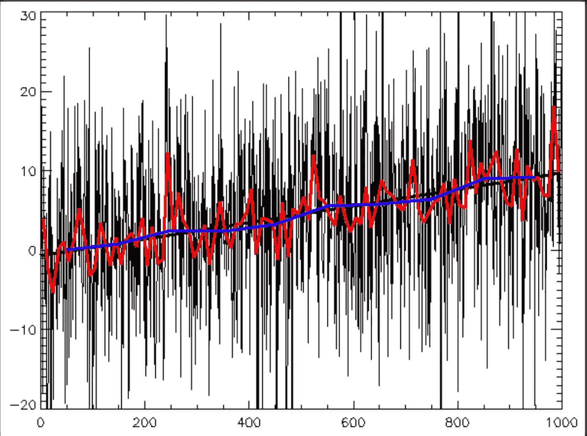
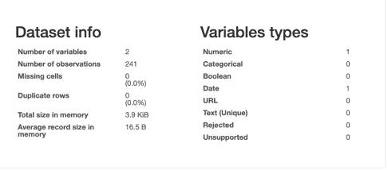
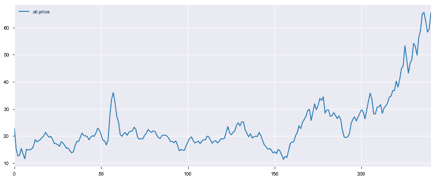
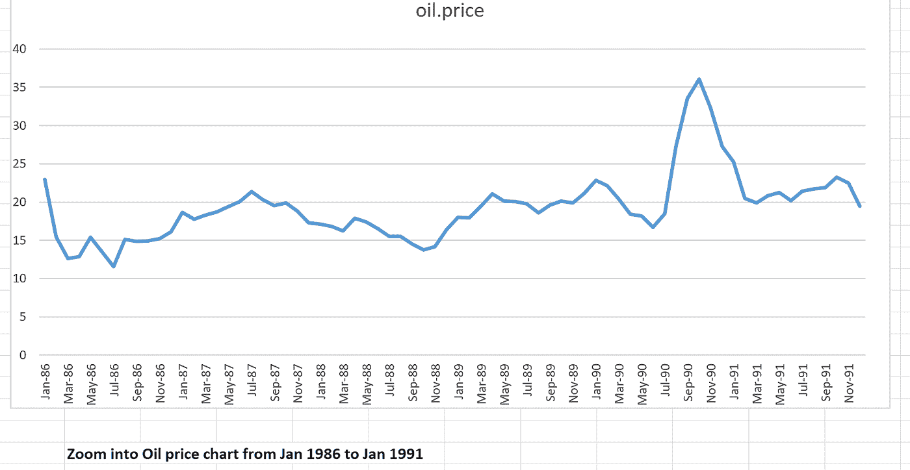
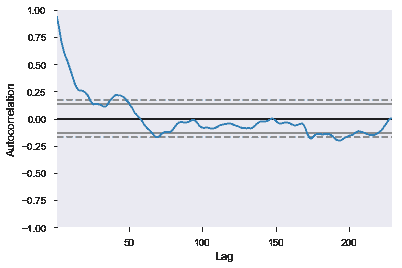
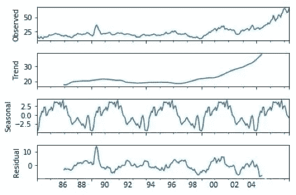
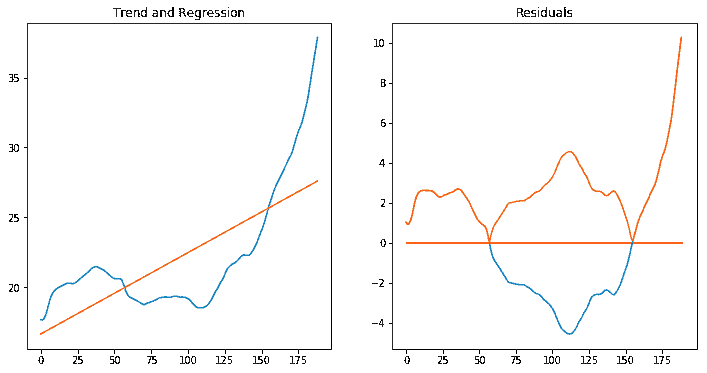
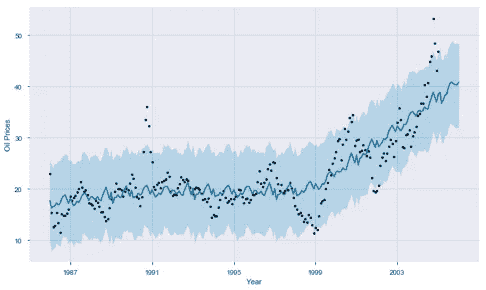
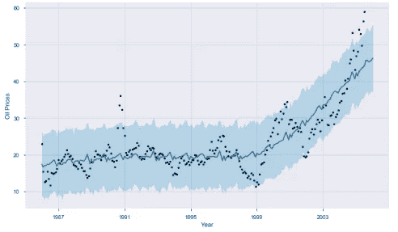

# 时间序列分析:必须学会成为数据科学家

> 原文：<https://medium.datadriveninvestor.com/time-series-analysis-c22fc9da8b63?source=collection_archive---------1----------------------->

## 任何数据科学家都需要学习的另一点

ime 系列是可以适用于任何与事务相关的问题陈述的例子之一。因此，时间序列分析是一个时髦的词，必须学习和挑战，以理解解决。总结时间序列问题已经成为 ML 工程师或数据科学家的主要任务。著名的用例有现金流分析&预测、股票市场、天气和电力需求预测等。简而言之，只要我们能发现季节性或随机变化，我们就可以肯定地把它作为时间序列分析来得出结论。在这里，我将通过四种技术来处理时间序列数据。第五，增加预测模型，区分不同的预测方法。这完全是关于问题陈述和所用方法的适当性。

> 时间序列:对特定变量按时间顺序排列的观察结果

Example of Data Set

# 介绍

在这里，我将举一个价格变化的例子来分析，然后预测未来的价格变化。理解很简单，学习给定的数据找到模式，并在此基础上，做出未来的预测。

> 简而言之，时间序列意味着按照日期组织的数据集序列。例如，每日交易和使用情况可以按时间进行分析，即每小时、每天、每周、每月。

时间序列数据在数据和时间上被索引。现有的预测方法有 ARIMA、指数平滑、分解、时间序列回归等。我们可以分别深入研究这些方法，因为一个博客不适合那些最常用和最受欢迎的方法。在预测方法中，ARIMA 模型和指数平滑模型被认为是预测时间序列最常用的选择。

有了目前为止的所有了解，我希望你能预测并关联这一点，以解决各自行业中的问题。

为了进行正确的分析和预测，通常，我们需要准备数据，包括:转换、寻找缺失值、离群值、可视化等。这将有助于直接分析数据质量。在这里，我将以石油价格数据集为例进行更好的理解。

> 使用案例:预测广泛的行业，如商品价格(石油)，股票价格，电力需求，天气状况等。

时间序列的组成部分有:趋势、周期、季节变化和不规则波动。

# **数据可视化**

可视化是最有吸引力的初始分析技术之一。在我看来，它应该是每个分析的一部分，作为理解数据的第一步。事实上，这将有助于在时间序列数据集方面为我们提供离散和清晰的数据模式。如果使用正确的可视化技术，可以很容易地判断趋势和模式。

## 数据概述

作为 pythonic 式的，我只是加载数据并对其进行描述，以便对数据有初步的了解:

Simplest dataset for Understanding

该数据具有一些季节性趋势/模式，这在时间序列数据中很常见。很明显，任何物品的价格在这段时间内都在上涨，我们应该会在数据中发现上涨的趋势。我在应该看得见的地方举了油的例子。如果没有上升趋势，那么我会说数据是不真实的。而且，可视化将有助于通过把你的数据放在图表上给你这个样子。更复杂的数据集可能需要更深入的分析，并更改可视化的时间范围。

毫无疑问，我们可以观察到数据中的一些起伏。如果再深入一点，搞清楚时间范围，就会意识到应该是经济衰退、突发状况或者一些全球性问题的时间段。数据的可视化能让你得出结论，并发现正在发生的其他情况的深度，这难道不是很有用吗？

## 对方法的基本理解

## **指数平滑**

指数平滑是一种单变量数据的时间序列预测方法。当趋势/季节因素随时间变化时，这是最有效的。这与下面描述的分解沉积方法相反。这类似于预测是过去观测值的加权和，但是模型明确地对过去的观测值使用指数递减的权重。

指数平滑有多种类型:单指数平滑、双指数平滑和三指数平滑。此外，还有多种平滑技术，如

## **ARIMA**

ARIMA 是时间序列预测最常用的方法之一。它代表自回归综合移动平均线。它高度依赖于数据中的*自相关*模式。ARIMA 使用的三个参数与分解方法相同:季节性、趋势和数据中的噪声。

> 由于误差序列中的移动平均，模型被定义为移动平均(MA)。

p(季节性):模型中包含的滞后观测值的数量，也称为滞后阶数。

d(噪声):原始观测值有差异的次数，也称为差异度。

q(趋势):均线窗口的大小，也叫均线的顺序**。**

## **分解方法**

这种方法用于根据没有特定趋势和季节影响的数据进行预测。它可以被称为*直观*方法，在描述参数不随时间变化时非常有用。为了理解，让我们使用分解方法来实现数据的可视化。它允许我们将时间序列数据分解为三个主要部分:趋势、季节性和噪声。

> 在我的例子中，使用了 python 中 statsmodels 库的季节性分解函数

根据分解，看起来趋势是向上移动。在缓慢增长之后，它以很快的速度增长并达到最高值。

为了稳定数据和去除趋势，我们应用了一种原始的方法，该方法在于回归由 STL 分解给出的趋势。

回归的 r 平方系数不是很好，即 0.511。与此同时，残差也呈现出方差。这似乎不是一个好的模型，而且这个模型中缺少了一些东西。

## 脸书的 FBprophet

脸书发布了“Prophet”，它利用基于贝叶斯的曲线拟合方法来预测时间序列数据。Prophet 很酷的一点是，它不需要太多预测时间序列数据的先验知识或经验，因为它会自动发现数据背后的季节性趋势，并提供一组“易于理解”的参数。

> Fbprophet 是一个加法回归模型，针对非线性时间序列预测，由脸书开发[Sean J 和 Benjamin，2017]。Fbprophet 通过将给定的时间序列分解成三个不同的部分来运行，这三个部分被称为“趋势”、“季节性”和“假日”，并且包括如下式所示的误差项，

y(t) = g(t) + s(t) + h(t) +ε t

其中 g(t)是趋势，s(t)是周期性变化，h(t)是季节性效应，ε是参数假设。结果是一个模型，是稳健的短期时间序列和观察点的随机性。

上图说明了未来 12 个月的预测。根据图表，看起来它很好地代表了数据，并且在所有应用的方法中具有最好的准确性。

分解模型有助于理解时间序列的各个组成部分。正如我们所看到的，在 1999 年之前的几年中，这一趋势显示出非常缓慢的增长，然后价格开始呈现出急剧上升的趋势。此外，季节性因素清楚地表明数据具有季节性模式。这种方法有助于我们理解时间序列数据中的趋势和季节性。

总结:对于本例中的石油数据，FBprophet 模型给出了模型与数据的更好拟合。从 FB propfet 模型中可以看到一些不规则的数据点，这些数据点超出了上下置信范围。这些异常数据点很可能是由于各种不可预测的情况导致的数据的不规则波动。FB Prohet 将是最优选的，其次是分解方法，因为数据具有显著的不规则性和季节性成分。通过分解可以去除不规则成分，结合趋势和季节成分可以做出更好的预测。

## **结论**

首要目标应该是理解、分析和可视化数据流。其次，数据可以表示为时间序列数据。其他目标应该是应用这些数据来生成预测模型。这里，我们理解了 4 种方法，任何方法都可以应用于时间序列数据。我们必须根据给定的数据集来判断哪种方法有效。最后，首要目标应该是分析每种方法的预测和性能，并提出最佳方法。借助可视化和 MSE(均方误差)方法来评估模型及其预测，有办法找到最佳方法。

这不像只有时间序列特定模型可以用于时间序列数据。如果你看到，数据看起来很适合应用回归模型和 RNN。这取决于问题陈述和应用效果更好的方法。

总的来说，所有方法都能够预测和确定给定数据的移动趋势。目标应该始终是理解数据和改进预测。神经网络模型可以应用于数据，以比较预测，并与现有的时间序列预测方法一起改进结果。希望对编码同样有帮助。**快乐学习编码！**