# 时间序列与预测(上)

> 原文：<https://medium.datadriveninvestor.com/time-series-and-prediction-part-1-4a9b55c85276?source=collection_archive---------6----------------------->

## 有无深度学习算法的时间序列和预测综合研究。

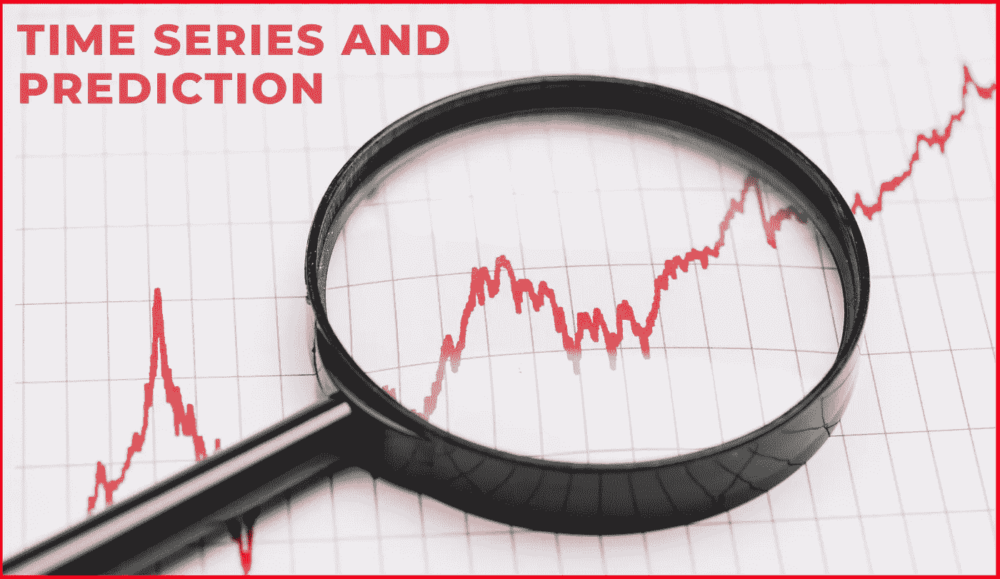

Source — [freepik](https://www.freepik.com/free-photo/magnifying-glass-red-stock-market-graph-paper_3095565.htm#page=1&query=stock%20market%20graph&position=35)

# 什么是时间序列？

如果一个数据点序列有时间作为其维度之一，那么它们可以说是时间序列。通常使用折线图来绘制。时间序列的例子有太阳黑子活动、股票市场行为、海洋潮汐、疾病传播、军事规划、营销和销售预测、库存管理、预算分析等。

 [## 将定义 2020 年就业前景的五大数据科学和机器学习趋势|数据驱动…

### 数据科学和 ML 是 2019 年最受关注的趋势之一，毫无疑问，它们将继续发展…

www.datadriveninvestor.com](https://www.datadriveninvestor.com/2020/02/19/five-data-science-and-machine-learning-trends-that-will-define-job-prospects-in-2020/) 

**时间序列数据**是在特定时间记录的数据点的集合，例如小时、月或年。它可以在任何涉及基于时间的测量的应用科学和工程领域中找到。

# 时间序列分析

它包括用于分析时间序列数据以提取时间序列数据的有意义的特征和其他统计的方法。现在，这些只是可以用时间序列分析的事物类型的几个例子。

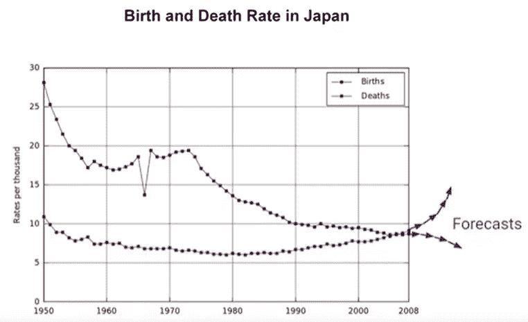

Source — [Coursera](https://www.coursera.org/learn/tensorflow-sequences-time-series-and-prediction)

1.  **预测** —首先也是最明显的是基于数据的预测的预测。例如我们之前展示的日本的出生率和死亡率图表。预测未来的价值是非常有用的，这样政府机构可以为退休、移民和这些趋势的其他社会影响制定计划。

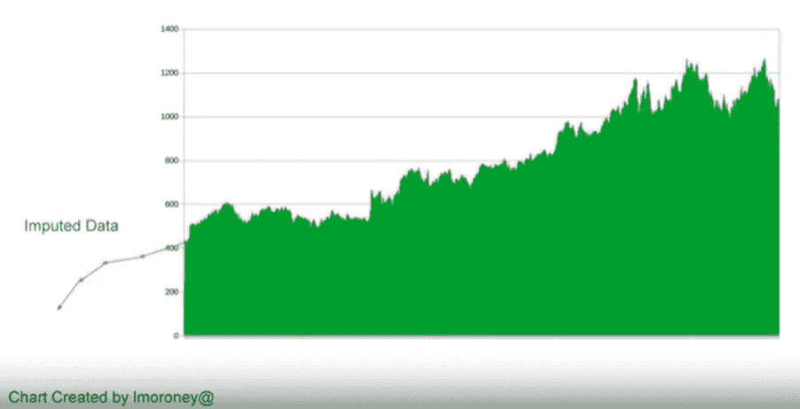

Source — [Coursera](https://www.coursera.org/learn/tensorflow-sequences-time-series-and-prediction)

**2。插补**——在某些情况下，你可能还想回溯到过去，看看我们是如何走到现在的。这个过程叫做插补。因此，通过分析过去的数据，我们可以估计我们现在所处的位置以及如何进一步改进。

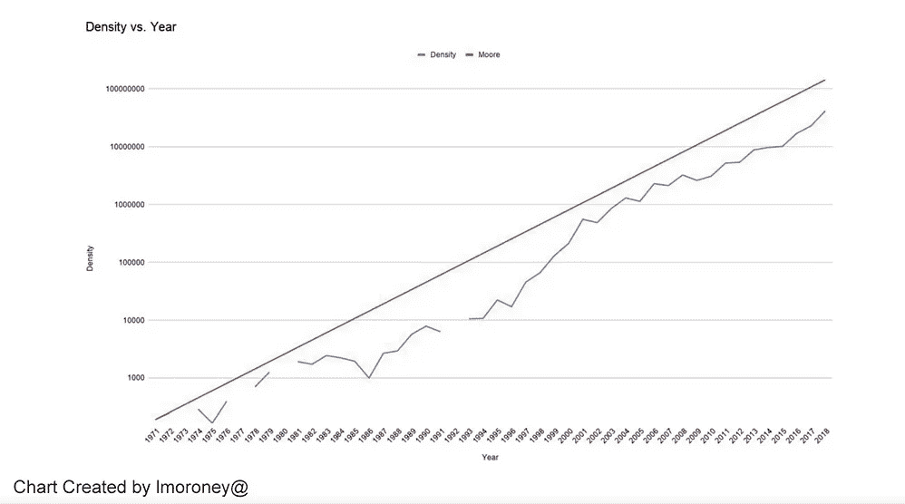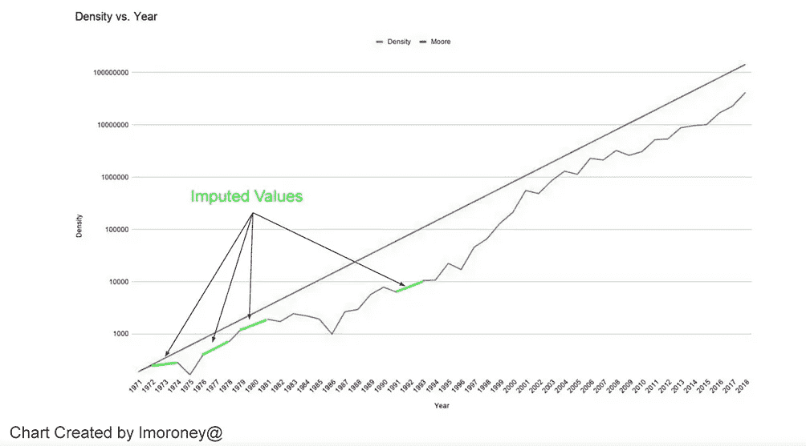

Source — [Coursera](https://www.coursera.org/learn/tensorflow-sequences-time-series-and-prediction)

或者，您可能只是想填补数据中尚不存在的空白。比如摩尔定律图，有些年份没有数据是因为那几年没有芯片发布，这里可以看到差距。但是有了归罪，我们可以把它们填满。

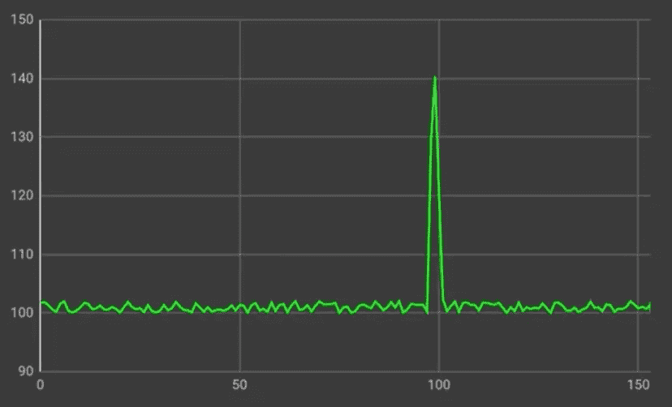

Source — [Coursera](https://www.coursera.org/learn/tensorflow-sequences-time-series-and-prediction)

**3。检测—** 时间序列预测可用于检测异常。例如，在网站日志中，这样您就可以看到潜在的拒绝服务攻击在时间序列上显示为峰值，就像这样。

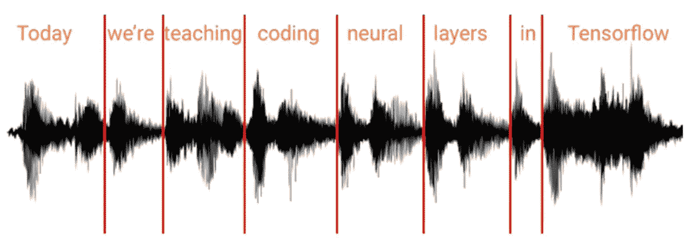

Source — [Coursera](https://www.coursera.org/learn/tensorflow-sequences-time-series-and-prediction)

**4。模式匹配** —另一个选项是分析时间序列，找出决定序列本身的模式。这方面的一个经典例子是分析声波以找出其中的单词，这可以用作语音识别的神经网络。例如，在这里，你可以看到声波是如何分解成单词的。使用机器学习，可以根据时间序列训练神经网络来识别单词或子单词。

要了解更多信息，请参考此[链接](https://www.itl.nist.gov/div898/handbook/pmc/section4/pmc4.htm)。

# 时间序列的组成部分

1.  **趋势**

时间序列显示的长期模式称为趋势。趋势可以是负的，也可以是正的，这取决于时间序列是呈现递减模式还是递增模式。同样，我们可以说一个时间序列有一个下降的趋势，如果它有一个整体的负增长，对于一个上升的趋势，它显示整体的负增长。如果一个时间序列没有显示出一个减少或增加的模式，那么这个序列是平稳的。

**2。季节性**

许多产生时间序列数据的现象都具有季节性。它是时间序列的一个组成部分，在时间序列中，数据会定期发生可预测的变化，这些变化会定期发生，例如几个月、一年或每年的同一个季度。例如，在汽车公司的销售数据的情况下，通常，汽车公司在节日时给予巨大的折扣，因此他们的销售在那段时间增加。这种情况每年都会发生。

**3。循环**

当数据呈现非固定周期的上升和下降时，称其具有循环分量。一个周期的寿命取决于被考察的行业或企业的类型。

**4。不规则性**

这部分是不可预测的。每个事件都有一些不可预测的部分，使其成为随机变量。它是由一系列不一致的短期变化造成的，在某些情况下是不可预测的。这一部分不遵循任何趋势或季节性。

额外知识参考这些文章:[第 1 条](https://www.abs.gov.au/websitedbs/d3310114.nsf/home/time+series+analysis:+the+basics#:~:text=An%20observed%20time%20series%20can,unsystematic%2C%20short%20term%20fluctuations).)，[第 2 条](https://www.toppr.com/guides/business-mathematics-and-statistics/time-series-analysis/components-of-time-series/)。

# 生成合成时间序列数据

**首先导入必要的库:**

**其次，定义生成合成时序数据所需的必要函数。**

**趋势** () —用于设置时间序列的趋势。
**【季节性模式()** —包含用于获取时间序列合成值的混合表达式。
**季节性()** —用于为我们的数据赋予季节性(定期发生的定期和可预测的变化)。
**【noise()**—向我们的季节性数据添加随机噪声。
**plot_series() —** 使用 matplotlib 库在图形上绘制合成生成的数据。

**第三，声明并向函数传递适当的值，以绘制所需的合成时间序列。**

随机生成 4 年的 NumPy 数组，季节性为 1 年。同样，将基线设置为 10，振幅设置为 40，噪声级别为 5 个单位。然后，最后绘制我的合成时间序列数据。更改这些变量的值，并尝试生成您自己的合成时间序列数据。下面是我生成的时间序列数据。

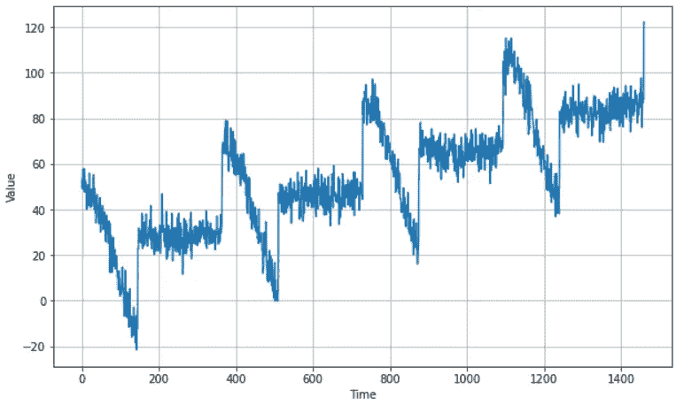

My synthetically generated time series

# 训练集、验证集和测试集

任何预测最重要的部分是你如何衡量绩效？

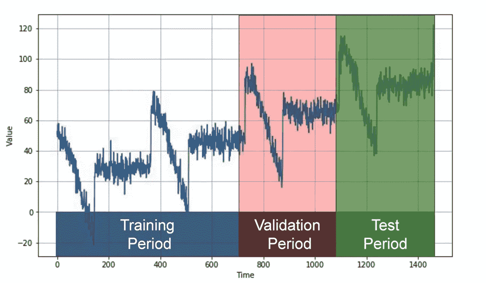

Source — [Coursera](https://www.coursera.org/learn/tensorflow-sequences-time-series-and-prediction)

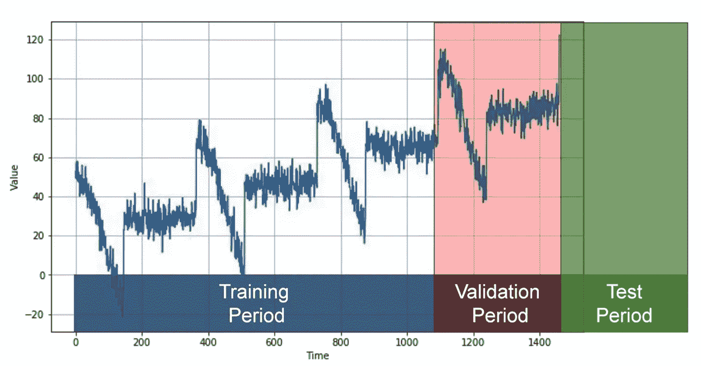

Source — [Coursera](https://www.coursera.org/learn/tensorflow-sequences-time-series-and-prediction)

1.  **固定分区** —为了测量我们的预测模型的性能，我们通常希望将时间序列分为训练期、验证期和测试期。如果时间序列具有一定的季节性，您通常希望确保每个周期都包含整数个季节。例如，如果时间序列具有年度季节性，则为一年、两年或三年。接下来，您将在培训阶段培训您的模型，并在验证阶段对其进行评估。您可以在这里进行试验，找到合适的培训架构，并使用它和您的超参数进行工作，直到您获得所需的性能，使用验证集进行测量。通常，一旦你这样做了，你就可以使用训练和验证数据进行再训练。然后在测试阶段进行测试，看看你的模型是否也能表现得一样好。如果是这样的话，那么你可以采取不同寻常的步骤，再次训练，也使用测试数据。但你为什么要这么做？这是因为测试数据是最接近当前时间点的数据，因此它通常是决定未来价值的最强信号。如果您的模型也没有使用该数据进行训练，那么它可能不是最佳的。

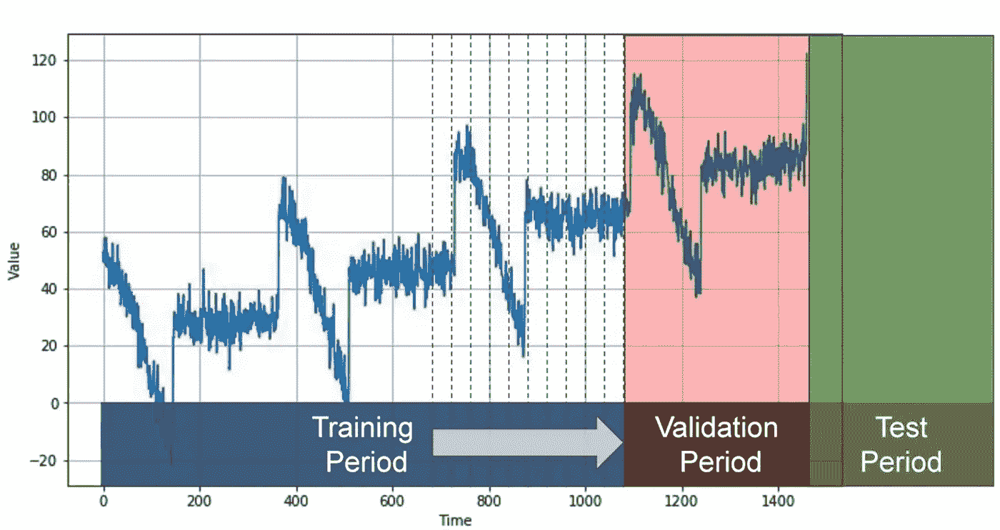

Source — [Coursera](https://www.coursera.org/learn/tensorflow-sequences-time-series-and-prediction)

**2。前滚分区—** 在这种情况下，我们从一个短的培训期开始，然后逐渐增加，比如一次增加一天，或者一次增加一周。在每次迭代中，我们在一个训练周期内训练模型。在验证阶段，我们用它来预测第二天或下一周的天气。您可以将它看作是多次进行固定分区，然后像这样不断地改进模型。

下面是将数据分为训练、验证和测试的代码。我把我的数据从 1000 天开始划分。因此，我的测试集包含 1000 天，验证集包含剩余的几天。您还可以在下面看到训练和验证数据。

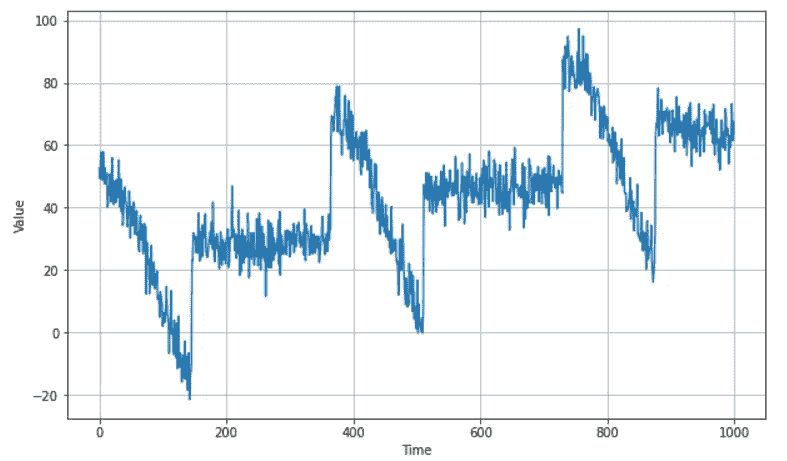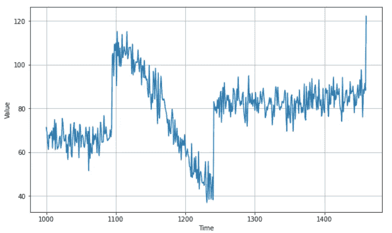

Left Image: Training set and Right Image: Validation set.

# 评估绩效的标准

一旦我们有了一个模型和一个周期，那么我们就可以对它进行评估，我们需要一个度量来计算它们的性能。

1.  **误差=预测值—实际值** 让我们简单地从计算误差开始，即我们的模型预测值与评估期间实际值之间的差异。
2.  **均方误差(mse) = np.square(误差)。mean()** 这是评估模型预测性能的最常见指标，我们对误差进行平方，然后计算它们的平均值。为什么我们要把它弄成方形？好吧，这样做的原因是为了摆脱负值。举个例子，如果我们的误差比数值高 2，那么它就是 2，但是如果它比数值低 2，那么它就是负 2。这些误差可以有效地相互抵消，这是错误的，因为我们有两个误差，而不是没有。但是如果我们在分析之前计算误差值的平方，那么这两个误差的平方就是 4，不会互相抵消，实际上是相等的。
3.  **均方根误差(rmse) = np.sqrt(mse)** 如果我们希望误差计算的平均值与原始误差具有相同的比例，那么我们只需得到它的平方根，从而得到均方根误差或 rmse。
4.  **平均绝对误差(mae) = np.abs(误差)。mean()** 另一个常见的指标也是我最喜欢的指标之一是平均绝对误差(mae)，它也被称为主绝对偏差(mad)。在这种情况下，不是平方来去掉负数，而是使用它们的绝对值。这不会像 mse 那样惩罚大错误。根据您的任务，您可能更喜欢 mae 或 mse。例如，如果大错误有潜在的危险，并且比小错误花费更多，那么你可能更喜欢 mse。但是如果你的收益或损失与误差大小成正比，那么 mae 可能更好。
5.  **平均绝对百分比误差(mape) = np.abs(误差/x _ 有效)。mean()** 这是绝对误差和绝对值之间的平均比率，这给出了相对于值的误差大小的概念。

要探索更多方法，请参考此[链接](https://scikit-learn.org/stable/modules/model_evaluation.html#median-absolute-error)。

# 正常预测方法(不应用 ML)

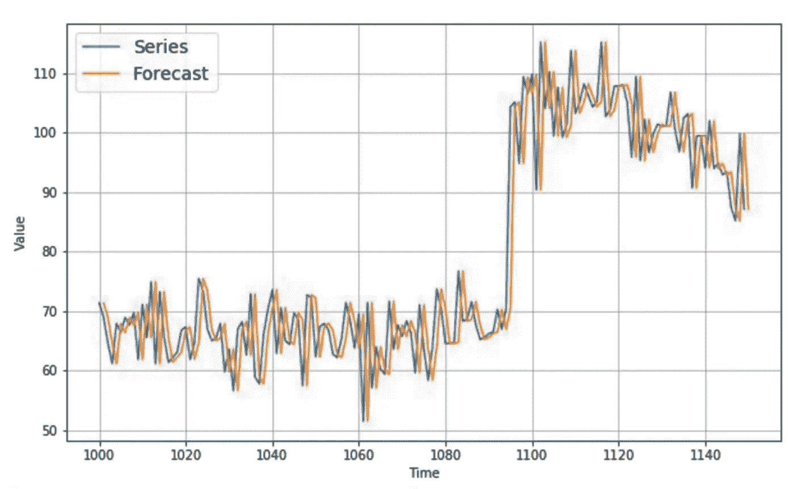

1.  **基于天真的方法—** 在这种方法中，我们采用上一个值，并假设下一个值将是同一个值，这称为天真预测。我放大了这里的一部分数据集来展示这一点。该基线可被视为基线，并用于比较不同的方法。借助 Keras 函数，我得到**平均绝对误差(MAE)** 为 **5.9379086。**

Code to do naive forecasting and plotting it

Using Keras, finding MAE and MSE for Naive Forecasting

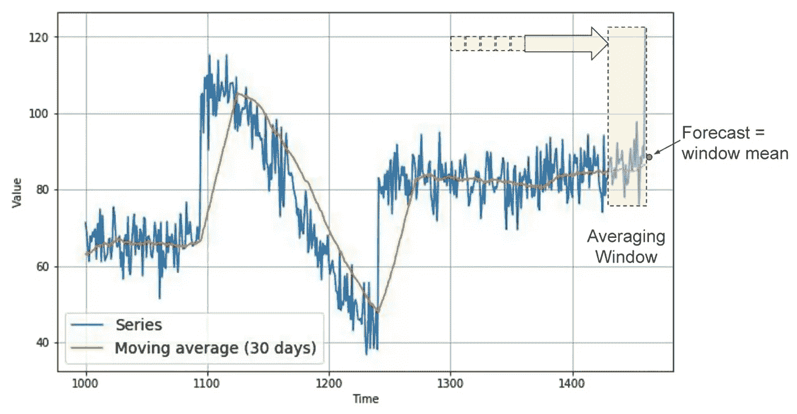

Source — [Coursera](https://www.coursera.org/learn/tensorflow-sequences-time-series-and-prediction)

**2。移动平均线** 一种常见且非常简单的预测方法是计算移动平均线。这里的想法是，黄线是一段固定时间内蓝色值的平均值图，称为平均窗口，例如 30 天。现在，这很好地消除了许多噪声，给了我们一条大致模拟原始序列的曲线，但它没有预测趋势或季节性。根据当前时间，也就是你想要预测未来的时间段，它实际上会比一个天真的预测更糟糕。在这种情况下，我得到的**平均绝对误差**约为 **7.14** 。

code for moving average forecasting

**3。移动平均和差异**

避免这种情况的一种方法是用一种叫做差分的技术从时间序列中去除趋势和季节性。因此，我们不是研究时间序列本身，而是研究时间 T 的值和更早时期的值之间的差异。根据数据的时间不同，这段时间可能是一年、一天、一个月或其他任何时间。

code for differencing

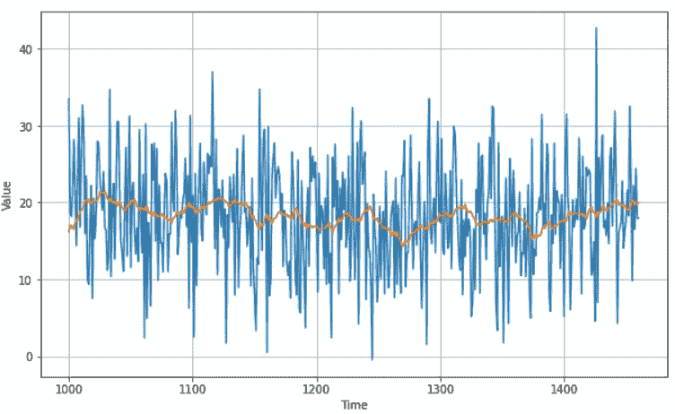

Subtracting past year value from current and then applying moving average.

让我们看看一年前的情况。所以对于这个数据，在时间 365，我们会得到这个差异时间序列，它没有趋势也没有季节性。然后，我们可以使用移动平均线来预测这个时间序列，从而得到这些预测。但这些只是对差分时间序列的预测，而不是原始时间序列。

code for adding

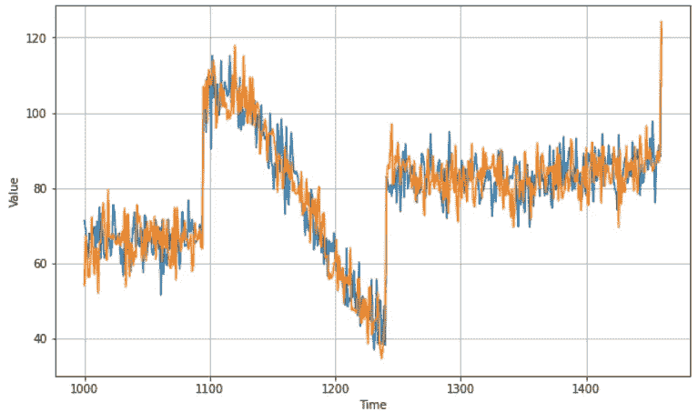

prediction using **Moving Average and differencing**

为了获得原始时间序列的最终预测，我们只需要将时间 T 减 365 时的值加回去，我们将获得这些预测。他们看起来好多了，不是吗？如果我们在验证期间测量**平均绝对误差**，我们得到大约 **5.9032416 误差。**

**显然，通过这种方法，我们离最佳状态并不太远。在我这篇文章的第二部分中，在我们匆忙进入深度学习之前，请记住这一点，正常的方法有时也可以工作得很好。**

# tirth Patel——Nirma 大学计算机科学与工程专业学生。

[LinkedIn](https://www.linkedin.com/in/tirth-patel-861303171/)|[insta gram](https://www.instagram.com/__txrth__/)|[Github](https://github.com/Tirth1306/)

**进入专家视角—** [**订阅 DDI 英特尔**](https://datadriveninvestor.com/ddi-intel)