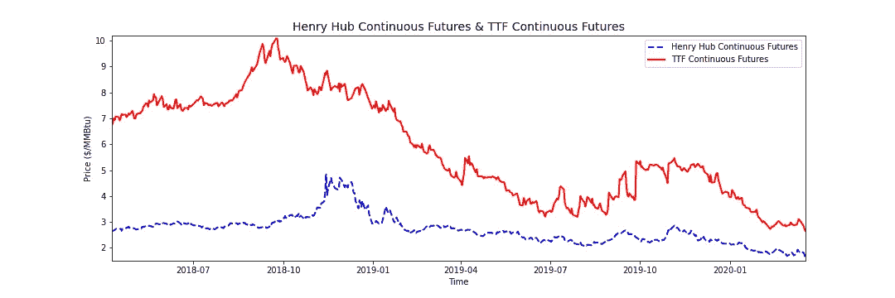

# Matplotlib 中的时序动画

> 原文：<https://medium.datadriveninvestor.com/time-series-animation-in-matplotlib-de023655a197?source=collection_archive---------0----------------------->

使用 Matplotlib 库制作时序数据的动画。

*TL DR:* [*GitHub 代码*](https://github.com/David-Woroniuk/Medium-Articles/blob/master/Time_Series_Animation_in_Matplotlib.ipynb) *。*

动画是展示金融产品、气候变化、季节性销售模式和社交媒体趋势等时间序列数据的一种有趣方式，因为我们可以观察数据如何随着时间的推移而演变。

本文将提供一个如何动画时序数据的演练，演示 Henry Hub(美国)和 TTF(荷兰)的价格趋同。

 [## 成为数据科学家所需的 8 项技能|数据驱动型投资者

### 数字吓不倒你？没有什么比一张漂亮的 excel 表更令人满意的了？你会说几种语言…

www.datadriveninvestor.com](https://www.datadriveninvestor.com/2019/02/07/8-skills-you-need-to-become-a-data-scientist/) 

因此，让我们继续安装所需的软件包:

我们现在已经导入了 Quandl 包，它允许访问由[Quandl.com](https://www.quandl.com)提供的数据集。我们可以导入更多的包来处理数据并开发动画:

现在，我们将定义我们希望使用的采样周期。对于这个项目，我选择了 712 天的样本:

我们现在需要从 Quandl 收集数据。值得注意的是，Henry Hub 价格以美元/MMBTu 表示，而 TTF 价格以€/MWh 表示。因此，我们必须转换要用相同单位表示的数据:

现在我们有了数据，让我们生成一个快速静态图来可视化数据集:

很好，我们绘制了一个包含我们的数据系列的静态图表:

Static chart of Henry Hub vs TTF data downloaded from Quandl.

现在，让我们来看动画。首先，我们需要为动态图表设置轴:

接下来，我们定义一个函数`animate`，它需要输入参数`i`。可以多次调用该函数来构建动画。

我们可以调用`matplotlib.animation.FuncAnimation`函数，提供一个图形的输入参数，我们刚刚定义的动画函数，以及帧，它指定动画函数应该被调用多少次。Interval 提供帧之间的延迟，以毫秒为单位。

当我在 Google Colab 工作时，我选择将动画作者定义为`[‘ffmpeg’]`，然而，许多 IPython shells 与 ImageMagick 配合得很好。

瞧啊。我们现在有一个保存在 root_dir 中的时间序列动画！