# 时间序列:新冠肺炎你应该担心吗？机器学习所说的。

> 原文：<https://medium.datadriveninvestor.com/time-series-covid-19-should-you-be-worried-what-machine-learning-says-d9e0dd0010c?source=collection_archive---------4----------------------->

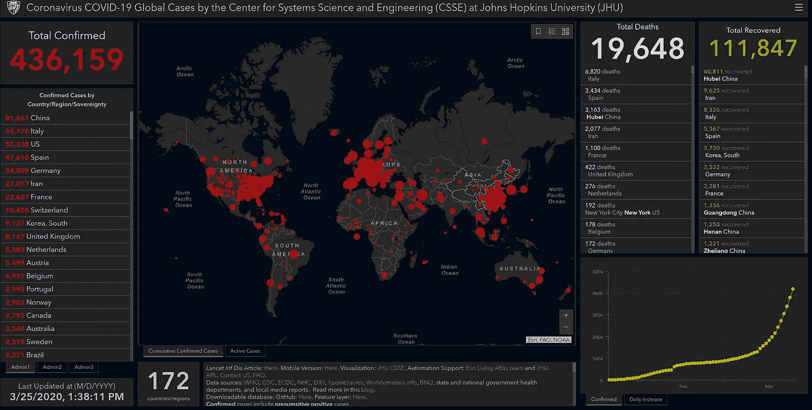

(rights: [source](https://gisanddata.maps.arcgis.com/apps/opsdashboard/index.html#/bda7594740fd40299423467b48e9ecf6))

> 根据数据，您可能应该是…

这篇文章的目的是让读者安心，同时也提高他们对当前形势严重性的认识。我们将简单地分析数据，并通过时间序列对如果不采取新措施的潜在病例数进行预测。

## 一些大概的数字

截至目前(本文撰写时)，已有 **437 043** 人感染或仍在感染冠状病毒，其中 **19 645** 人死亡，还有 **111 861** 人完全康复。下面是这种情况的概述(图 1)。

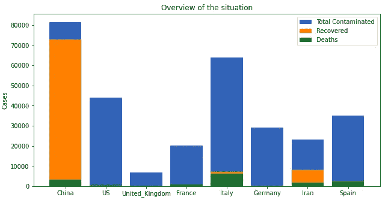

fig.1 from 25 March (rights: own image)

在这里，我们展示了冠状病毒地图的较高视图(图 2):

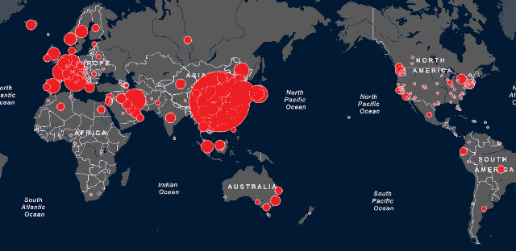

fig.2 from late February (rights: [source](https://www.tunisienumerique.com/le-point-sur-lepidemie-du-coronavirus-mise-a-jour-du-08-mars-a-11h00/))

正如你所看到的，威胁来自疫情，而且在许多大陆已经很严重了。

快速分析:

*   人们通常计算死亡率的方法是计算死亡人数与病例数之比，这给出了一个接近 2%的数字。然而，当你计算死亡人数与已结案件数之比时，你会得到一个粗略的 **4%** 比率(这构成了一个上限)
*   与其他病毒不同，新冠肺炎病毒是全新的，这意味着我们研究的人群是一个相对较小的样本。任何一种比率都有很大的差异。这意味着一个抽样的 **4%** 比率实际上很可能是 **5%或 3%。**

## 让我们研究一下迄今为止大多数病毒国家的病例演变情况。(图 3)

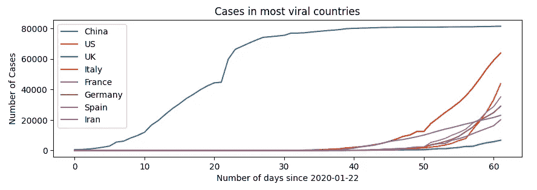

fig.3 (rights: own image)

如你所见(图 3)，各国处于病毒的不同阶段。事实上，与似乎刚刚步入危机的英国相比，中国处于一个稳定的局面。请注意，例如，美国是过去几天里增长最快的国家。

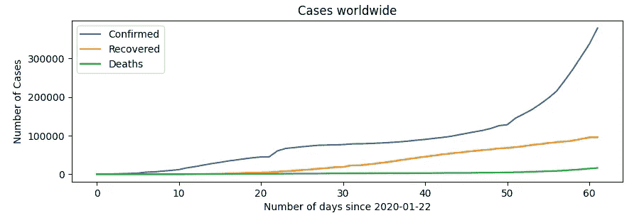

fig.4 (rights: own image)

从世界范围来看，这场危机似乎刚刚开始。但是，现在世界已经得到警告，曲线可能会更快变得平滑。

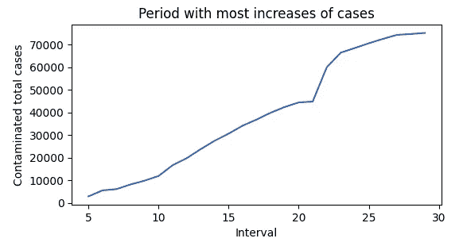

Interval is taken from days where daily increase greater than 1k fig.5 (rights: own image)

尽管这只是一个例子，而且这个数值在不同的国家可能有很大的差异，但中国经历最剧烈的增长大约花了 25 天(图 5)。考虑到那里采取的措施非常严格，我们可以认为 25 天是一种下限。

 [## 金融中的机器学习|数据驱动的投资者

### 在我们讲述一些机器学习金融应用之前，我们先来了解一下什么是机器学习。机器…

www.datadriveninvestor.com](https://www.datadriveninvestor.com/2019/02/08/machine-learning-in-finance/) 

## 预测(对此有所保留)

我们将使用 ARIMA 模型(图 6)来预测近期的病例数。

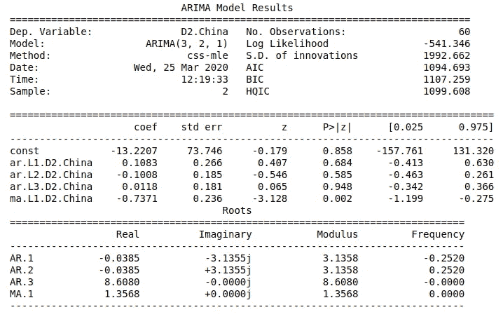

fig.6 (rights: own image)

这里(图 7)是我们在前 52 天使用中国的数据集进行训练时得到的结果。

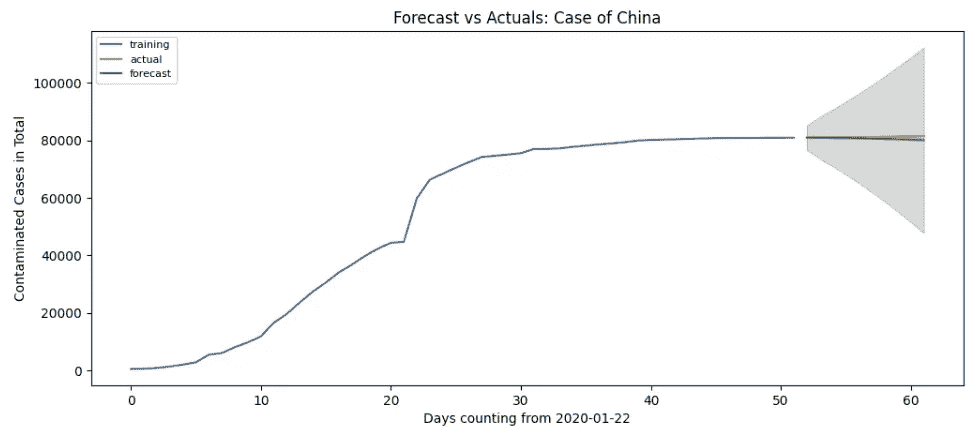

fig.7 (rights: own image)

下面是我们对中国、美国、英国和法国的短期预测:

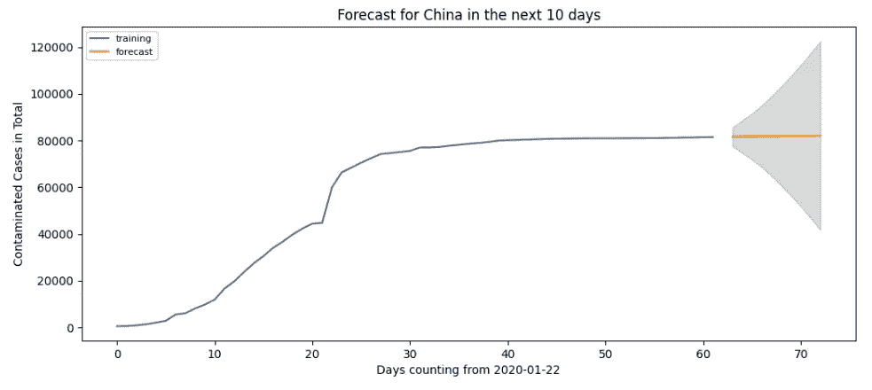

(rights: own image)

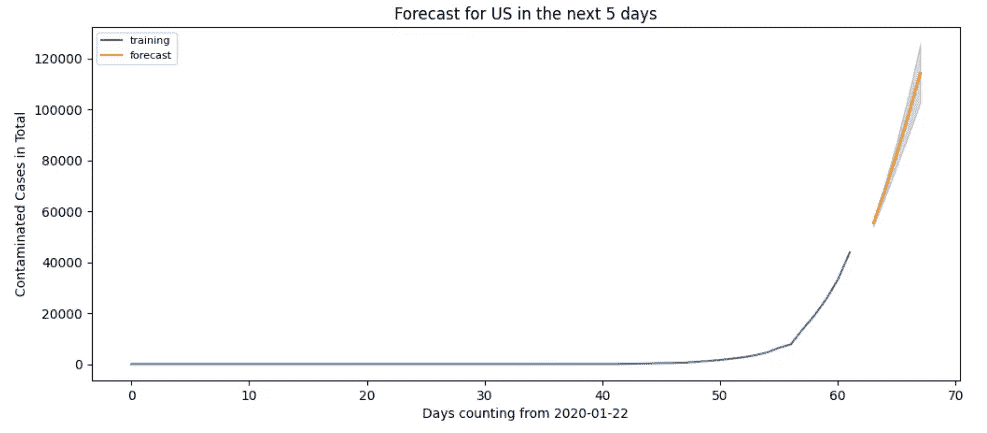

(rights: own image)

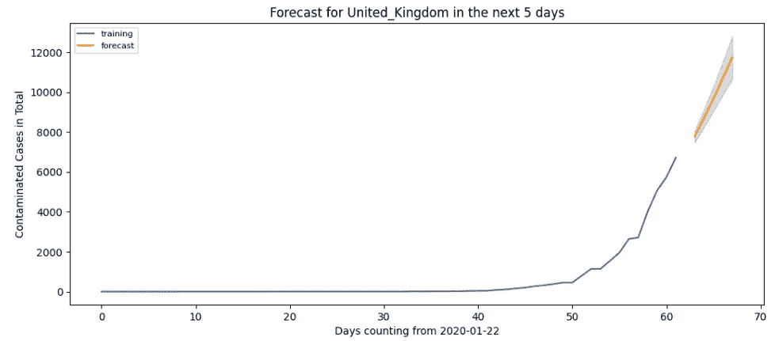

(rights: own image)

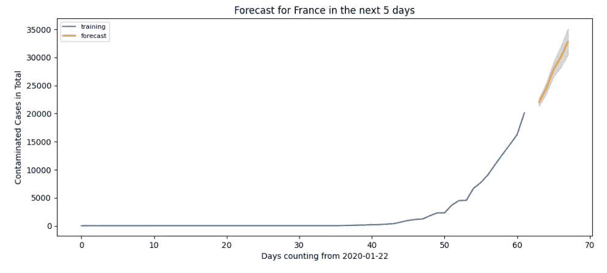

(rights: own image)

> 免责声明:
> 
> 我绝不是说这些增加会真的发生(我真的希望病例数没有增加)。

**注意(对于地块):**

只有当我们试图预测的时间段在特定阶段内时，才应该使用预测。这意味着，你不应该试图预测 100 天内病例的演变，并期望在该国仍处于上升阶段时病例会减少。此外，我们提醒，增长阶段(定义为每天至少 1000 个新病例)大约需要 25 天。

## 结论

我们在欧洲国家和美国看到一些非常警告的数字，预计 5 天后数字会翻倍。此外，由于医院超负荷运转，青少年死亡率上升。有足够多的理由感到担忧，但现在还不是恐慌的时候，因为一些国家(如中国、日本、韩国)的形势正在稳定，我们确实有希望缓和危机。我们确实希望一个正常的即将到来的夏天，我们会管理。请坚持住！尽你所能为之做出贡献！通过练习社交距离或志愿活动！

感谢阅读！请查看[我的网站](https://aitechfordummies.com/home/)并关注我！对于数据集，你可以在这个[链接](https://aitechfordummies.com/home/blog-post/time-series-covid-19-should-you-be-worried-what-machine-learning-says/)(下文)找到，评论我的[网站](https://aitechfordummies.com/home/blog-post/time-series-covid-19-should-you-be-worried-what-machine-learning-says/)获取源代码！

我们还创建了一个 facebook 页面和一个 insta gram！跟随它不要错过任何有趣或好玩的文章！此外，点击这个[链接](https://direct-link.net/91830/aitechfordummies)(指向联盟计划)真的会帮我解决问题！您只需完成一些快速任务(只需等待和激活通知)，所有这些将真正帮助我了解更多未来的硬件相关内容！