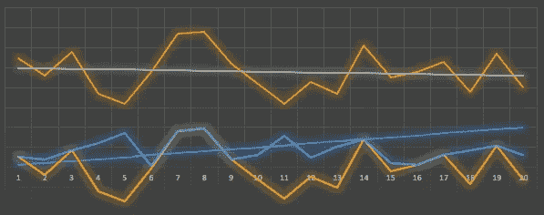
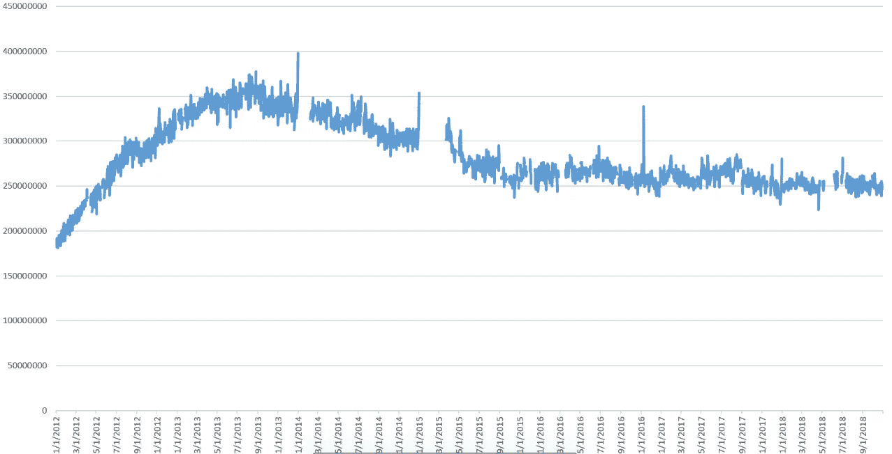

# 时序图

> 原文：<https://medium.datadriveninvestor.com/time-series-graphs-1d4ac0c2d955?source=collection_archive---------10----------------------->

**有哪些图表&为什么数据可视化至关重要？**

图表是一个或多个变量之间关系的图形表示，以可视化的形式综合了数据集的所有信息。它使趋势和模式更容易被看到。我发现图表是一种与数据交流的迷人方式。

**时间序列图—**

在浏览 R graph gallery 时，我惊奇地发现了一些令人兴奋和独特的图表形式的数据可视化，经过深思熟虑，我选择了时间序列，因为它似乎是我感兴趣的东西。时序图代表**一个或多个变量随时间的变化**；它有助于理解关于数据的精彩故事，并使可视化变得有趣。使用包 **ggplot2:使用 Graphics** 和 **xts: eXtensible Time Series 的语法创建优雅的数据可视化，可以很容易地在 R 中绘制时序图。**

**我为什么选择时序图&它擅长什么？**

选择时间序列图的首要原因是它看起来很熟悉，因为它在日常生活中被广泛使用。时序图在许多现实生活场景中扮演着至关重要的角色**绘制随时间变化的趋势**、跟踪温度数据**随时间变化的经济指标**、监测选举结果**、预测**等等。其次，从时间序列图可以直接得出结论，因为这些图**非常容易理解**。也很容易用任何编程语言创建。它被认为是最好的图表，可以帮助极大地提高演示效率。

任何表示一个或多个变量随时间变化的图形都属于时间序列图**线图**、**堆积面积图**、**条形图、**和**格兰特图**都被认为是时间序列图。

我最喜欢的时间序列图的例子是“**可视化七年 twitter 演变 2012:2018** ”，这是福布斯的一篇文章，显示了每个季度的几个 Twitter 用户。它显示了经过验证的推文和经过验证的用户随时间的变化，来自 1%流的估计每日推文总量，团队中来自 Twitter 1%流的每个用户的平均推文。

怎样才能把时序图做得更好？

*   添加了**三维或动画组件后，图形将变得更加互动和令人兴奋；它也会看起来更有希望。**
*   随着时序图被用于绘制趋势，**结合趋势线**用于未来预测将使该图更具实时功能。
*   当我们形象地使用时间序列图进行预测时，在一些参数下，应该考虑与几个因素超时相关的**波动。**