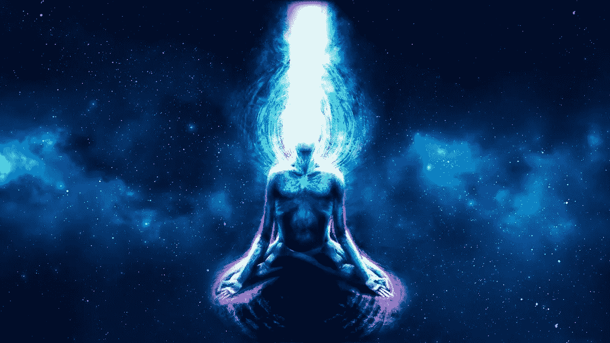
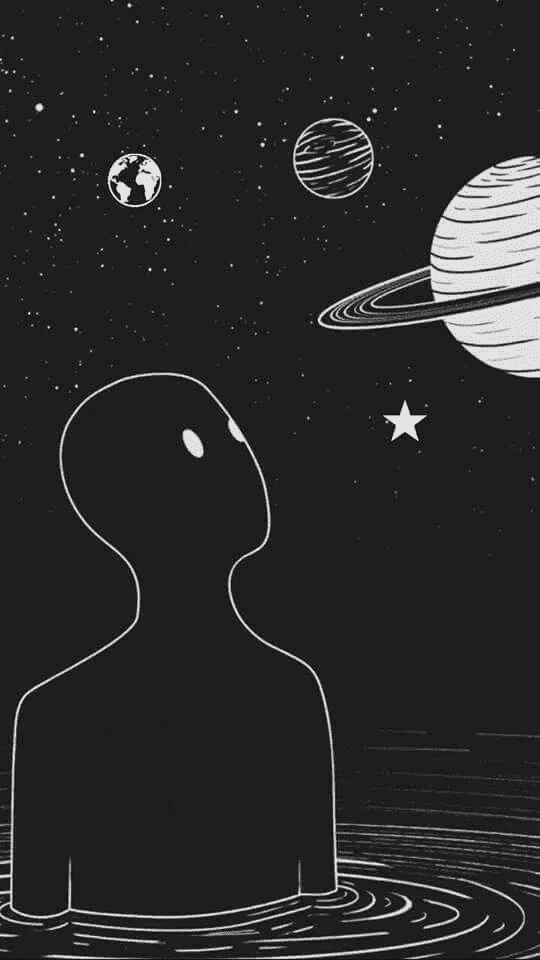
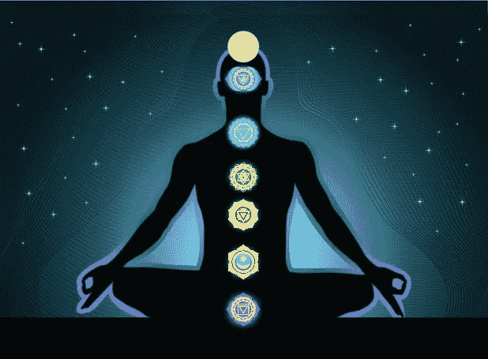
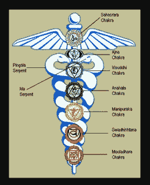
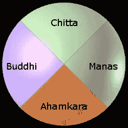

# 时间旅行——瑜伽的壮举

> 原文：<https://medium.datadriveninvestor.com/time-travel-a-yogic-feat-7df67bbf4bd1?source=collection_archive---------2----------------------->

简要描述时间旅行如何在瑜伽中成为一种存在的现实。

[Source](https://i.ytimg.com/vi/Kejc7tOGznI/maxresdefault.jpg)

你一定见过或至少听说过瑜伽修行者连续几个月或几年坐在一个地方不动。你可能听说过其他的故事，他们说一些瑜伽修行者使用心灵感应来交流，即使他们相距几千英里。所有这些都是纯粹的民间小说故事，还是它们可能与时间旅行有某种关联？

让我们来了解一下！

时间旅行的概念一直是世界各地理论物理学家的热门话题。多年来，它还被改编成各种科幻电影剧本。然而，现代科学还不能用真正的经验术语来证明它。只有理论写在纸上，外行人无法理解科学术语和方程式。

瑜伽，宇宙存在的永恒科学，以任何人都可以实际体验的方式，提供了对时间旅行的极其令人信服的理解。这篇文章简要地阐明了这一点。

# 瑜伽视角下的“时间”

[Source](https://i.pinimg.com/564x/5a/f4/04/5af404ff6b14dda117871f5a9665ab7c.jpg)

在瑜伽中，时间被定义为我们对宇宙循环性质的体验。无论是月球绕轴自转和绕地球公转，还是地球绕轴自转和绕太阳公转，或是宇宙中任何其他天体的运动。我们对秒、分、小时、日、月、年、季等的所有计算。都是基于这些周期性的运动。这些周期在非常基础的层面上影响着地球上的生命。这在间隔 27 天经历月经期的女性中最为明显，这正好是月亮绕轴自转一周的时间。如果一个人足够敏感，他/她可以根据更多的天体运动来感觉身体的起伏。

即使在原子层面也是如此。如果你把原子核看作太阳，把质子、中子和电子看作行星，你可以描绘出一幅与太阳系中所见非常相似的画面。毕竟，宇宙是从一个原子中诞生的。因此，单个原子表现出的特性，与整个宇宙表现出的特性非常相似。

正是因为这种复杂的理解，所有的印度文化总是以一种与整个宇宙相一致的方式促进生活。

 [## 押注旅游公司|数据驱动型投资者

### 秘密度假被搁置已经不是什么秘密了。航空公司和旅游公司实际上已经处于停滞状态…

www.datadriveninvestor.com](https://www.datadriveninvestor.com/2020/08/18/taking-a-bet-on-travel-companies/) 

尽管如此，这里要注意的一点是，所有这些周期本质上都是物理的。瑜伽科学一直都知道，与非物质宇宙相比，物质宇宙占据的空间不到百分之一。今天的现代科学也同意这一事实。事实也证明，非物质的宇宙在能量方面比物质的宇宙更加强大。因此，瑜伽的最终目的是使一个人能够坚持超越他/她的物质身份，并更深地潜入现实的非物质领域。当这一点实现时，我们所知的“时间”的感觉，就不再与人类的经历相关了。

> " ksana-prati yogi parinamaparanta nirgrahyah kramah "
> 
> -只有当一个人超越了那些时刻并处于另一端时，变化的连续性(不间断的时刻序列)才被认为是独特的时刻。
> 
> 帕坦伽利的瑜伽经典 IV.33

如果没有时间感，就没有空间。如果没有空间，就没有旅行的距离。因为旅行没有距离，每一个目的地都在非二元性的点上。

就在那时，我们通常说一个人已经变得“开悟”，“时间旅行”可以被认为是这种开悟的结果。

> 有趣的事实:
> 
> 在梵语中，时间和空间都指的是同一个词——“kāla”。有趣的是，Kāla 也是指“黑色”的单词。

# 如何切实实现？

进入非物质现实的途径是通过人体，以 7 个*脉轮*的形式。

[Source](https://miro.medium.com/max/618/1*v31nqUACdSb3Vnk0G7BSHw.jpeg)

如果一个人能够以向上的运动从最低的脉轮(mlāDHāra)汲取人类的能量，并有意识地进入最高的脉轮(Sahasrāra)，他/她将从人体中获得解放，并将能够进入整个宇宙未开发的潜力——物质的和非物质的。

**现代医学 vs 瑜伽科学**

Medical caduceus ([Source](http://catalystmagazine.net/wp-content/uploads/2009/12/caduceus.jpg))

Chakras in the form of Kundalini serpent ([Source](https://kathleenkarlsen.com/wp-content/uploads/2019/07/Kundalini-Dance.jpg))

卡德鲁斯(通常被称为医学符号)，其中心杖，缠绕的蛇和顶端的羽毛翅膀，看起来与古代印度人描述的微妙能量系统惊人地相似。在这个系统中，七个脉轮或能量中心沿着平行于脊柱的垂直柱排列。两个更微妙的能量流在每个脉轮处形成螺旋状交叉，并在以一朵有 1000 片花瓣的莲花为象征的皇冠处结束。通过这个系统，昆达里尼，或者盘绕的蛇的能量，据说随着一个人走向开悟而上升。

> 来源:[https://catalyst magazine . net/chakra-series-reclaving-the-caduceus-east-meets-west-in-medical-symbology/](https://catalystmagazine.net/chakra-series-reclaiming-the-caduceus-east-meets-west-in-medical-symbology/)

稍后我会写另一篇文章来探索这些脉轮是如何被用作打开“其他世界”的钥匙的。现在，让我们单独看看人类思维在这一过程中的作用。

# 瑜伽视角下的“心灵”

英语单词“mind”传达的信息不多。这就是为什么从瑜伽的角度理解心灵变得很重要。

在瑜伽科学中，头脑是一个四维平面结构，有四个轴或维度:

[Source](https://4.bp.blogspot.com/-IEbUsAjRcYI/XF_RcBnBE6I/AAAAAAAAJfw/1bnkBrlbtns_gfqNW6ye73DPiOTCB24BwCLcBGAs/s1600/manas-buddhi-chitta-ahamkara.jpg)

1.  **布迪**

布迪是梵语中智力的意思。这是人类思维中最原始的维度。布迪是基本的生存工具，这个星球上的所有生物都有不同的能力，不只是人类。它采用了一个重要的歧视过程，告诉我们什么对生存有益，什么不好。它是头脑的**逻辑维度**。

然而，智慧并不是一个独立和绝对的维度。它需要一定的内存来运行。它是记忆的奴隶，因此不能超越记忆所拥有的。记忆越多，拥有更敏锐智力的机会就越多。

2.**玛纳斯**

玛纳斯是头脑的第二维度，也就是记忆的第二维度。马纳斯不仅存在于头脑中，而且实际上贯穿于身体的每一个细胞。这叫*马诺玛雅科萨*。每个人基本上都是一堆巨大的记忆筒仓。

有 8 种类型的内存:

*   基本的
*   原子的
*   进化的
*   遗传的
*   因果报应
*   感觉的
*   说不出话的
*   有关节的

玛纳斯构成了人类存在的基础。如果玛纳斯变得没有功能，这个存在将不复存在。这就是所谓的*因果报应*。

3.**阿汉卡拉**

头脑的第三维度，阿汉卡拉，可以最接近地翻译成英语单词“**身份**”。从身体、家庭、社会、种族、宗教、国籍到宇宙(无限)，人们总是在不同的层面上认同自己。无论人们强烈认同什么，他们的布迪(智慧)总是努力维护和满足这种认同。这就是为什么在灵性道路上的人们首先练习的是将真实自我与任何身份分离的艺术。

4.**奇塔**

这是只有人类才拥有的心灵的最终维度。正是这个维度是纯粹的智慧，没有被记忆和身份所玷污。它是唯一独立的维度，因此以不偏不倚的方式发挥作用。这就是“魔法”发生的地方，人类似乎变成了超人。

当有意识地进入这个维度时，开悟就发生了。而这正是瑜伽要达到的目的。

> "约加什-奇塔-威瑞提-尼罗达"
> 
> -瑜伽是对思想改变的抑制。
> 
> 帕坦伽利的瑜伽经典 I.2

人类时不时无意识地进入这个维度。但是，如果一个人能够有意识地做到这一点，他/她就进入了一个全新的可能性世界，并真正从自然的强迫循环中获得解放。

**访问专家视图—** [**订阅 DDI 英特尔**](https://datadriveninvestor.com/ddi-intel)