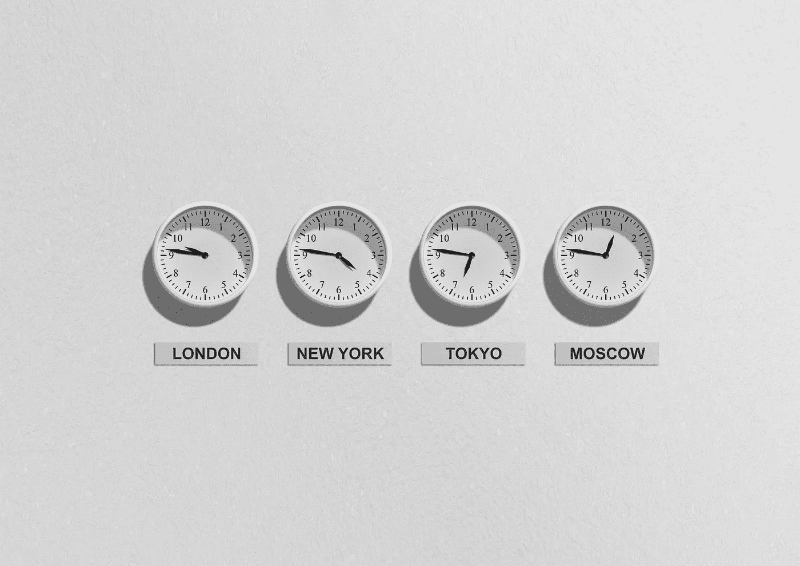

# 时区:新的隐藏敌人

> 原文：<https://medium.datadriveninvestor.com/time-zones-the-new-hidden-enemy-d2289d891af0?source=collection_archive---------22----------------------->

## 现在，它们比以往任何时候都更成为一个问题

*Photo by Pixabay on* [*Pexels.com*](https://www.pexels.com/photo/london-new-york-tokyo-and-moscow-clocks-48770/)

我们生活在一个全球化的世界，这是无法回避的事实。

现在，人们比以往任何时候都更加频繁地与世界另一端的人做生意和交往。

尽管这是一件很棒的事情，它把我们团结在一起，让我们意识到真的没有边界，我们都只是普通人，但我们遇到了一个隐藏的敌人。

一个使这个惊人的全球化陷入危险的因素是:**时区**。

因为尽管我们比以往任何时候都更加紧密地联系在一起，但还是有局限性。

 [## 良好的生活是习惯的形成|数据驱动的投资者

### 过度思考是过度紧张。仅仅几个简单的习惯就会在一天中产生巨大的影响。那是…

www.datadriveninvestor.com](https://www.datadriveninvestor.com/2020/01/17/a-good-life-is-habit-forming/) 

**非常现实的局限性**。

举几个例子:

我最近证明自己是一名瑜伽老师，在印度的时候，我遇到了很多来自世界各地的瑜伽师。

随着疫情接手，我们都开始在网上教授瑜伽，通过 Zoom，Google Hangouts，Instagram，甚至脸书直播。

很好，对吧？我可以和他们一起练习。看看我们是如何在实践中进化的。

嗯，**没发生**。

时区剥夺了这种可能性。

有些我们已经做到了，但并不总是。

另一个例子是工作面试。

在接下来的几天里，我将对我申请的一份工作进行在线评估。

欧洲时间上午 9 点到下午 2 点。这似乎是一个合理的时间，对不对？

嗯，不完全是，这意味着在哥伦比亚是凌晨 2 点到 7 点。

*伟大的*。

我非常期待这份工作，但是我不得不睡不着，用僵尸般的大脑去做最重要的面试。

时区是不可改变的，它们向我们证明，尽管通讯技术有了巨大的进步，我们仍然只是人类，需要睡眠。

那么，除了发牢骚和写帖子之外，我们还能做些什么呢？

我们也可以利用科技来帮助我们。

Instagram 有这个东西，你可以在你的个人资料上保存你的直播视频 24 小时。

脸书和 Youtube 的生活也作为普通视频保存在您的个人资料中(没有 24 小时的时间限制)。

甚至像 Fiverr 这样的平台也让你知道你的自由职业者当时是否在睡觉。

这些小小的帮助可能无法阻止时区的阻碍，但它们确实帮助我们充分利用时区。

另一方面，能够不是一直都有空也不错。很高兴说，我很乐意去，但是我会在我准备好的时候看你的直播，而不是在你能看的时候。

它给了我们一点自由，否则在这个超级互联的世界里将很难获得。

那么，你呢？时区已经成为你的 Zoom 和 Google Hangouts 的一个问题了吗，或者谢天谢地还没有？