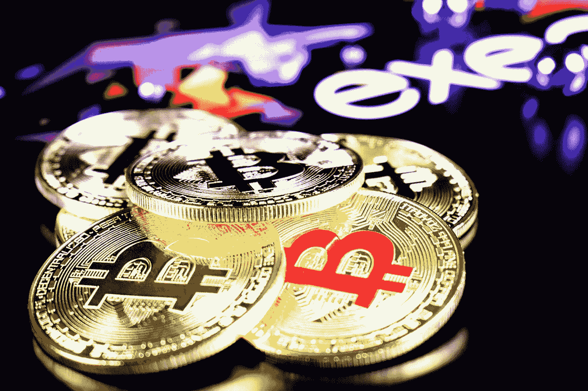

# 蒂娜·特纳:埃隆·马斯克最喜欢的坏蛋节拍

> 原文：<https://medium.datadriveninvestor.com/tina-turner-elon-musks-favorite-badass-beat-f9db62805a7f?source=collection_archive---------8----------------------->

## 除了特斯拉维多利亚时代的胜利，别无选择

Photo by [Artem Bryzgalov](https://unsplash.com/@abrizgalov?utm_source=medium&utm_medium=referral) on [Unsplash](https://unsplash.com?utm_source=medium&utm_medium=referral)

首字母缩略词 [TINA](https://bit.ly/39TtxXR) ，代表*没有选择*，经常被投资者用来解释不理想的投资组合分配。

关于蒂娜的无聊部分？

这个短语起源于维多利亚时代的哲学家赫伯特·斯潘塞，后来成为 20 世纪 80 年代英国首相玛格丽特·撒切尔的口号。

> 蒂娜最棒的地方是什么？

对于特斯拉的股东来说，这是一场伴随着蒂娜·特纳“简直是最好的”声音的聚会。

像[罗恩·巴伦](https://bit.ly/2K0LeK5)这样的人，特斯拉最大和最早的投资者之一，必须为他相信埃隆·马斯克和他的梦想的能力而自豪。

2014 年，巴伦的基金以 219 美元的均价买入了 1，006，000 股。这是预分割的。

所以，我会让你做数学，让你感受到当你投资在正确的马上时对数字的真正影响。

7 个月前，在美国消费者新闻与商业频道的一次采访中，[查马斯·帕里哈皮蒂亚](https://bit.ly/2JHckGu)面对着一张特斯拉股票的图片，当天该股下跌了 27%。拆分前的价格是 270 美元。

那个记者正在寻找证据，他问了一个问题，把他逼进了死胡同。查马斯稍作停顿，分享了自己对埃隆和特斯拉的感受。

> 如果你想退一步，从 3 到 5 年的角度来看，并说**我在哪里可以收回我的钱？**特别是对于转换者来说，最美妙的是他们受到下行保护，因为它建立在所有股权和其他部门之上。因此，如果你对流动性问题有任何担忧，他们会首先获得支付。对我来说，这是我们这一代爱迪生的无风险选择。

让我再强调一下这个短语，因为它很特别。

> 对于我们这一代人来说，这是一个无风险的选择

特斯拉目前的估值为 6500 亿美元。是 18.5 倍的性价比。78 倍价格/毛利。和 203 倍价格/EBIT。

好吧，我知道你在想什么。如果沃伦·巴菲特在几十年前看到这些数字，他一定会大吃一惊。我明白了。

但这就是蒂娜的由来。忘了那个派对吧，它不是“最好的”蒂娜。

是关于*没有替代的*蒂娜。如果你仔细想想，蒂娜和金钱本身有一个深刻的哲学问题。

今天的钱是什么？

随着时间的推移，金钱可以被解释为价值的技术存储。埃隆·马斯克称之为劳动力分配系统。

如果在未来的 10 到 20 年里，劳动力都依赖于技术，那么技术可以而且很可能会成为一种价值储存手段。我说的甚至不是比特币。让比特币安静一秒。

Photo by [Markus Spiske](https://unsplash.com/@markusspiske?utm_source=medium&utm_medium=referral) on [Unsplash](https://unsplash.com?utm_source=medium&utm_medium=referral)

# 纽带就像规则，注定要被打破

美元被用作劳动力的分配。

简单地说，每个人都把它当作纸币储存起来，而同时像雷伊·达里奥这样的人却说*现金是垃圾*。

然而，人们对纸币已经有所觉醒。人们开始相信，实际上，他们不会给你任何收益。

10 年期债券的收益率以前是给你 5%的收益率，现在利率基本上是零。

在德国等一些国家，你实际上必须付钱给他们来存放你的钱。

当你权衡公司的价值并试图分析标准普尔 500 时，看看最有价值的前 5 家公司，它们的市盈率是 20 到 30 倍。

你说太高了，对吗？

然而，当你想到 10 年期国债的收益率为 1%时，你可以将它与苹果股票进行比较。如果苹果公司的市盈率为 30 倍，那么我们假设市盈率为 1/30，那么这项资产的收益率为 3.33%。

如果你是一个投资者，你正在拼命寻找 10 年内最低投资的收益，你可能会开始有这种推理。

为什么我要把钱投在债券上？

Photo by [Clifford Photography](https://unsplash.com/@cliffordgatewood?utm_source=medium&utm_medium=referral) on [Unsplash](https://unsplash.com?utm_source=medium&utm_medium=referral)

# 比特币问题

> 软件正从你的办公桌下，超越你的笔记本电脑，转移到移动设备上。它会从固态变成液态，再从液态变成气态。这意味着整个软件世界正在网络化——迈克尔·塞勒

被称为 FAANG、脸书、苹果、亚马逊、网飞和谷歌的五大巨头的力量在于他们将整个地球非物质化了。正如迈克尔·塞勒所说，它们现在处于蒸汽状态。

 [## 蓝色起源能摧毁 SpaceX 的垄断吗？数据驱动的投资者

### 争夺太空主导权的战争即将升级吗？距离第一枚 SpaceX 猎鹰 9 号火箭升空已经过去 7 年了…

www.datadriveninvestor.com](https://www.datadriveninvestor.com/2020/11/26/could-blue-origin-demolish-the-spacex-monopoly/) 

2013 年，当苹果开始上升到月球时，华尔街的名人试图说服塞勒重组他的投资组合。他们建议他卖掉一些苹果股票，分散投资于惠普或 IBM。他做出了反应。

> 伙计们，你们没意识到最终苹果会把它们都吃掉吗？不再需要成为惠普或 IBM 了？迈克尔·塞勒

关于比特币，迈克尔·塞勒已经投资了 2.5 亿美元。

他相信，并且是正确的，关于苹果非物质化了所有的移动部门，脸书非物质化了整个社交网络，谷歌非物质化了所有的图书馆和视频，他可能对比特币也是正确的。

他认为比特币会让整个货币系统非物质化。

比特币可以将其自身转变为一种用于定价的通缩资产，但对于我们的财富来说，它是一种通胀资产。

比特币能成为他的创造者中本聪想要的解决方案吗？

> 社会会周期性地经历 Scheidel 所说的“拉平”,收入分配被压缩，贫富差距大大缩小。这是好消息。坏消息是，拉平只能通过大规模动员战争、极端革命、疫情瘟疫或系统性崩溃导致的死亡和暴力来实现。没有人支持这些结果，但没有人应该期待收入不平等的减少——詹姆斯·里卡德在《余波》中说

如果你继续印美元，到某个时候就没有黄金来支撑了。

如果像区块链这样的新结构倾向于用新的协议和原则来重组整个系统，这也许没问题。

我们只希望詹姆斯·里卡德的历史知识这次是错误的。

# 结论

TINA 应该叫 TIAAA，因为总有另一个选择。

我更了解 TINA 的脚来做一个有趣的标题。

然而，比特币已经在改变金融格局。替代方案已经存在。

你让 IMF(国际货币基金组织)预见并公开分享银行业的终结和加密货币的胜利。

就连摩根大通，通过其魅力四射的首席执行官杰米·戴蒙的手，也表达了对数字代币的喜爱，他过去曾抨击比特币是一种欺诈。

世界上最大的银行之一准备推出自己的比特币:

> JPM 币是美国一家主要银行创造的第一种加密货币，将用于结算客户之间的支付，然后贷方将致力于将跨境支付或公司债务发行服务转移到区块链，这可能对金融科技或金融科技行业产生重大影响。——马德维·马瓦迪亚在《福布斯》

变化已经在发生。

我们还不知道代价是什么。

埃隆·马斯克的特斯拉是第一家将汽车行业非物质化的公司。在能源领域也将如此。

就像迈克尔·塞勒说的，*特斯拉会吃掉汽车和能源行业*。*它们会从固态变成液态，又从液态变成气态。*

从资产的角度来看，正如 Chamath 解释的那样，特斯拉将有可能转变为一种长期资产，取代 10 年期国债，就像苹果股票一样。

这些只是假设，因为权力将受到最终的考验。

我们会看到商业银行、中央银行和强大的机构试图控制区块链来控制货币体系。

然而，中本聪创造了不受监管的比特币。

那么，我们要停留在什么地方？

对我来说，这不是一个大问题。

> 这就是问题所在。

谢谢

努诺

## 访问专家视图— [订阅 DDI 英特尔](https://datadriveninvestor.com/ddi-intel)