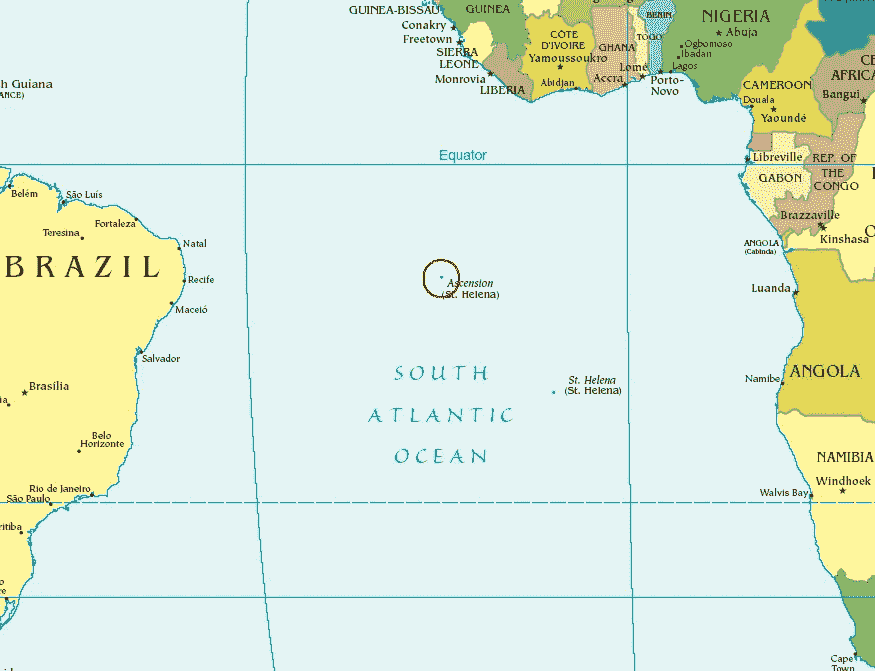
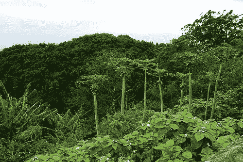

# 小小的阿森松岛:未来的关键？

> 原文：<https://medium.datadriveninvestor.com/tiny-ascension-island-key-to-the-future-a10b2371082d?source=collection_archive---------15----------------------->

Ascension Island

阿森松岛是南大西洋中部赤道以南的一个小火山石。它几乎位于巴西和非洲的中间，可能提供了改变我们冒险去其他世界时会遇到的敌对环境的关键。也可能是恢复地球的关键。

阿森松岛是一个只有 34 平方英里(88 平方公里)的岛屿。当查尔斯·达尔文在 1836 年第二次登上英国皇家海军舰艇贝格尔号结束他的航行时，英国的海外领土基本上是一个光秃秃的岩石堆。

西班牙探险家若昂·达·诺瓦于 1501 年发现了阿森松岛。由于气候干燥，淡水少，它没有引起人们的兴趣。过往船只继续停下来，这样水手们可以捕捉海鸟和海龟来改变饮食，但没有永久的住所。

直到 1815 年英国海军部署了一支卫戍部队，以防备被放逐到圣赫勒拿东南约 800 英里企图逃跑的拿破仑，阿森松岛才有人定居。它成了帝国的前哨基地，也成了像达尔文和他的朋友植物学家约瑟夫·道尔顿·胡克这样的科学探险家的休息站。

1836 年，达尔文乘坐英国皇家海军舰艇贝格尔号完成了为期五年的探索任务，在回家的路上，贝格尔号停靠在阿森松岛。他首先访问了圣赫勒拿，出于好奇和比较两个岛屿的愿望来到阿森松岛。他发现阿森松岛没什么值得兴奋的。这是一个干旱的岛屿，受到来自南部非洲的干燥信风的冲击，植被稀疏，几乎没有动物或昆虫。没有树，下的一点点雨水很快就蒸发了。淡水的缺乏阻碍了帝国前哨的发展或扩张。

尽管有缺点，达尔文还是对这个岛很感兴趣。几年后，约瑟夫·胡克开始了他的科学探险，在回家的路上，他在这个荒芜的小岛上停了下来。1843 年回到伦敦后，在达尔文的鼓励下，植物学家胡克设计了一个改变环境的计划。

胡克的父亲是皇家植物园邱园的主任。胡克在父亲的帮助下，安排将树木运到阿森松岛，用它们来收集雨水。他们希望利用树木从雨水中吸收水分有助于土壤肥沃，将贫瘠的岛屿变成一个郁郁葱葱的花园。这是希望，没有任何证据或例子表明该计划可能会工作。

在接下来的几年里，每年都有新的各种树木从欧洲、南非和阿根廷的植物园运来。到 19 世纪最后 25 年，该岛是诺福克松树、桉树、竹子和香蕉树的家园。岛上最高的 2817 英尺的绿山变成了云雾森林，其特点是持续的低云层覆盖。

树木从云中吸收水分，丰富土壤，让其他植物如预期般茁壮成长。达尔文和胡克在皇家海军的协助下，将贫瘠的岛屿景观变成了郁郁葱葱的绿洲。这个实验的成功远远超出了他们的预料。

Ascension Island Cloud Forest

达尔文、胡克和皇家海军创造了第一个自我维持和自我繁殖的生态系统。我们可以从第一次改造地球的尝试中学到什么？他们创造的环境是人造的。它是自然界中不属于一起的植物和树木的混合物，但是它们是并排生长的。像这样的生态系统通过缓慢的共同进化过程，需要 100 多万年才能形成。这个生态系统是由皇家海军用几十年时间建立起来的。这里学到的教训对未来有着巨大的重要性。它告诉我们，我们可以通过精心规划、反复试验，并借助一些偶然事件，创造一个功能齐全的生态系统。

这个过程现在被称为生态拟合。阿森松岛上的植物是从世界各地收集来的，并且已经自我组织成一个欣欣向荣的人工系统。达尔文、胡克和皇家海军在阿森松岛上取得的成功仍然相对不为人知，并且在很大程度上被科学界所忽视。它的含义对我们恢复地球的需要和未来我们试图重塑其他世界的环境都有巨大的潜在重要性。

应对气候变化和减缓全球变暖，我们必须改变我们的思维和行为。我们必须投资于恢复环境和生态系统以保护其健康和福祉，而不是通过钻探、提取、剥离和抽取地球资源来获取资源。通过种植大面积的规划林来创造人工生态系统，可能不是我们的首选，但可能会成为唯一的选择。我们获得的知识和专业技能对我们以后在地球上和外层空间的所作所为有影响。我们可能会学会如何将沙漠和其他贫瘠的地区变成绿色，这些地区是我们为了支持我们的贪婪和欲望而匆忙开采、钻探和抽取地球的慷慨所创造的。

绿山向我们展示了生态系统是如何以我们从未想象过的方式形成和运作的。它可能有助于我们理解生态系统是如何构建的，以及如何利用碳封存来对抗全球变暖和气候变化。规划的森林可能缺乏我们在自然界中发现的多样性和区域特性，但考虑到我们在当前变暖的世界中所失去的东西，这是一个很小的代价。

历史和经验表明，人类不想面对严酷的现实。我们尽最大努力避免艰难的选择和痛苦的决定，即使我们的生存处于危险之中。我们似乎不能推迟快乐，即使知道继续一种行为会导致死亡。因此，承认我们必须学会在地球再生能力的可持续限度内生活是成为太空物种的一个要求，而不是一个选择。

为什么？因为无论我们去宇宙的哪个地方，我们都会带着地球。但是在我们去其他地方之前，我们必须有一个健康的地球来汲取和返回。无论我们去哪里，我们都必须再造地球。我们在别处发现的任何生命无疑对我们都是有毒的。无论我们去哪里，都带着地球不是一个选择。这是必须的。

全球变暖和气候变化使得研究阿森松岛发生的事情成为帮助我们恢复地球的当务之急。这是给我们的礼物，藏在一个无人知晓的被遗忘的小岛上。我们只需要看到并利用我们所继承的东西。它可能会提供我们可能很快需要如何拯救自己。

一如既往，瓦比-萨比

同样在[www.jerrymlawson.com](http://www.jerrymlawson.com)