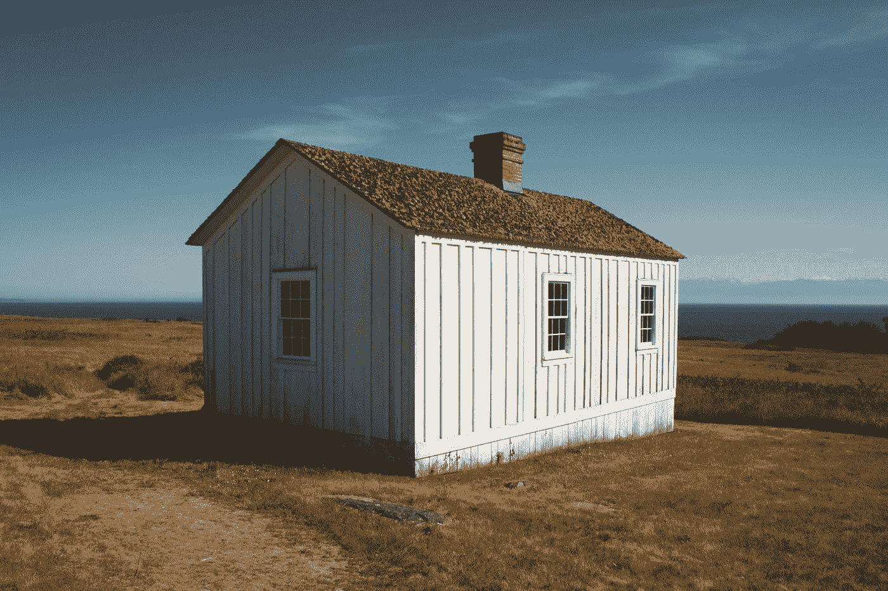

# 小房子解决不了住房危机

> 原文：<https://medium.datadriveninvestor.com/tiny-houses-wont-solve-the-housing-crisis-fee3ba15e583?source=collection_archive---------4----------------------->

## 我们不能通过裁员来摆脱困境。

Photo by [Ryan Stone](https://unsplash.com/@rstone_design?utm_source=medium&utm_medium=referral) on [Unsplash](https://unsplash.com?utm_source=medium&utm_medium=referral)

我的男朋友有一些相当小众的 YouTube 偏好，这是我在我们一起坐在电视前吃饭时了解到的。他最喜欢的一个频道是关于小房子的，每一集主持人都会拜访不同的小房子并采访房主。每一个都是美丽而巧妙的设计，重新想象了我们的生活方式，以及我们与所居住的四面墙的关系。对我们来说，它代表着绕过英国住房阶梯的苦难，真正稳定和独立的梦想，而其他人都在靠薪水生活，但每个月仍将一半的收入交给房东。

但是，尽管这些微型杰作令人瞩目，但它们并不是英国住房危机所需要的创新解决方案。很容易理解为什么人们对珠宝生活如此感兴趣，因为在这里拥有一个自己的家是多么困难，但事情没那么简单。我的男朋友今天说，当主持人介绍一个“绝对令人惊叹”的住所时，“他们从来没有任何狗屎小房子，这很有趣，不是吗？”但是一个“狗屎”小房子会是什么样子呢？

嗯，我在我住的城市里见过很多该死的小房子。他们往往是铁路拱门下的帐篷，或者商店门口的纸箱——没有人做任何事情来帮助他们的居民。你不会在电视上看到以同情的眼光描绘他们。我怀疑小房子频道的中产阶级观众想关注这些，就像你不会看到英国广播公司(BBC)的任何令人向往的房地产节目进入一个由帮派和流浪狗漫游的庄园一样。你可能会在*福利街*上看到，或者在无数围绕工人阶级推动全国对话的贫困色情节目中看到。我想他们会把去议会庄园的旅行当成狩猎旅行:锁好车门，不要和任何动物有眼神接触，抱歉，是当地人。

 [## 大迁徙:寻找更好的地方|数据驱动的投资者

### 2020 年将是值得纪念的一年。在过去的几个月里，许多人的生活轨迹发生了变化。在我的…

www.datadriveninvestor.com](https://www.datadriveninvestor.com/2020/07/16/the-great-exodus-searching-for-the-better-place/) 

自 20 世纪 80 年代开始以折扣价大量抛售并持续至今，英国的社会住房所剩无几。我最近租的一套“豪华”公寓，实际上是房东在有大量廉价房产时购买的一套市政公寓，并以远高于他们作为市政租户所支付的价格租回给我。议会地产很快就会成为过去，尽管仍会有大量的狗屎住房。现在唯一的不同是私人房东压榨他们的房客，让他们的房产失修。房子曾经是生活的机器；现在是印钞机了。

我们希望能够买得起自己的房子，任何房子，但英国的住房存量是根据市场分配的，市场发展得很好，价格高于大多数人的承受能力。英国房屋所有权的细分相当复杂，但总的来说，太多的房屋由一小部分拥有房产的阶层(其中许多人居住在海外)拥有，几乎没有真正负担得起的住房，而且那些寻求高于当前市场回报的人囤积了过多的房屋和土地。

我们之前的一代人痴迷于他们主要房屋的价值，通过第二套房产积累财富，并出租给不如他们富裕的人，以追求更多的财富。**我们这一代人只想有地方住。**我们没有战后一代的领先优势，没有廉价的战后租赁房屋，也没有在他们几乎不花一分钱就买了房子后突然爆发的疲软的房地产市场。我们生活在危机的余波中，安全网已经被移除，我们受到婴儿潮一代房东、零工时合同和强大的房地产开发商的摆布。游戏被操纵了，我们别无选择，只能玩下去。

我们首先考虑建造我们自己的(小)房子，因为我们认为这可能提供一条更简单、更实惠的通往房产阶梯的道路。大约在我们提出这个计划的同时，英国政府宣布，它正在建立一个登记册，如果人们有兴趣获得一块有服务设施的土地供他们建造房屋，就可以注册。这听起来很棒，除了没有关于土地将从哪里来或者要花多少钱的消息。任何有资格利用它的人都已经有了一个家。**那些最需要帮助的人却无法获得帮助。**

私下购买一块土地出人意料地困难，不是因为这块土地不存在——英国只有 6%的土地有建筑，所以有很多可用的土地——而是因为实际进入市场的东西并不合适。尽管房地产市场目前很活跃——因此首次购房者很难真正买得起任何东西——但仍有许多空置的房产和闲置土地，它们只是在那里积累金融价值，但没有为社区增加价值。我们有大量的空置房屋和土地，可以在一夜之间解决我们的住房短缺，但供应受到严重限制。

但是，这仍然是我们的一个梦想，得到一块土地，在上面建一些便宜的东西——然后我们所有的问题都会得到解决。我们会有一个安全的家，不用付房租，我们可以自由支配这个家，因为它是我们的*。除了……第一个障碍是获得一块土地。在英国，土地很贵。英国的房地产市场有一个奇怪的现象，无论有没有房子，一块土地的价值都差不多。但矛盾的是，拥有一栋房子而不是它所在的土地是可能的，但你仍然要支付类似的价格来购买一栋同样的房子，它确实有土地的永久产权。那么房子到底值不值？*

*你的第二个问题是你实际上可以用这些土地做什么。与谚语所说的相反，英国人的家(或土地)不是他的城堡。仅仅因为你拥有一小块土地，并不意味着你可以为所欲为。你需要得到当地议会的许可，可能还需要得到与一个地区的使用和外观有关的所有其他机构的许可。你猜怎么着？适合建房的土地比其他类型的土地要贵得多。像旧工厂或磨坊这样有可能被批准改变用途的大型场地，对于一个家庭来说太大太贵了，无法利用，但一些大型开发商可以低价抢购，然后在上面建造一整片价格过高、又小又差的房屋。*

*如果你足够幸运地得到一块可以利用的土地，你需要获得规划许可，以便在你的土地上建造任何类型的房子。除了建筑法规设定的最低建筑标准之外，没有任何委员会用于规划决策的标准规则——但对允许建造的建筑会有看似任意的限制。正如我上面提到的，其他人可能对你使用土地的目的感兴趣，特别是如果它在保护区、国家公园或绿化带。在一个以前曾经有过东西的地方进行建设更容易获得许可，自然，这些地块只会偶尔出现，它们的价值更高，因为它们通常位于更受欢迎的位置。如果上面有房子，你可以住在里面。*

*但是，假设你有一块地，你有一个想法，你想在上面建什么样的房子。你需要申请规划许可，这是一个障碍，不是每个人都有能力驾驭。我非常了解规划部门的工作方式，以及为了获得规划许可，需要提交哪些信息、采用何种格式、使用何种表格以及处理哪些变量。大多数人需要聘请规划顾问，或者他们的建筑商可能会提供这项服务。这要花钱，申请的提交费也是一样，而且对于不习惯这个过程的人来说，这可能看起来不透明和令人生畏。即使你雇佣了其他人来帮你做这件事，这也是一个陌生的步骤，会让潜在的自我建立者受到那些知道自己在做什么并且比他们拥有更多权力的人的摆布。*

*一个有趣的规则是，小房子的梦想者可能没有意识到国家描述的空间标准。它并不在任何地方都具有法律约束力，但它终结了拥有一个比任意同意的“足够”小的房子的想法。这项立法的通过有一个很好的原因(尽管它是一个可选的额外条款，议会可以选择强制执行或不强制执行)，这是因为普通的英国家庭，嗯，很小。**我们是世界上全国平均住房面积最小的国家之一，我们知道这一点。***

*在 20 世纪初，即使是贫民窟也有相当大的房间，尽管他们会比今天的家庭挤进更多的人，而且他们没有内部管道。直到大约 20 世纪 30 年代，房子仍然很大，二战后，即使是为了弥补长期住房短缺而建造的预制房屋也很宽敞。其中一些仍然存在。但是从那以后，房子变得越来越小。*

*那些宏伟的维多利亚式露台大多被分割成小公寓，从内部来看，它们与充斥我们城市的闪亮塔楼群中的“豪华”公寓没有什么区别。尽管它们很丰富，但仍然比一般购买者所能承受的要贵。**他们住得越小，公寓的价格似乎越高。**这也有一定的道理。以平方米计算，房产越大，你就越物有所值。遗憾的是，这些家庭在经济上也遥不可及。*

*无论如何，我们买不起自己的房子或公寓，数百万其他英国人也买不起，所以现有英国房屋的内部尺寸是一个有点争议的问题。回到小房子，而不是小房子。*

*你的房子计划，你可能会也可能不会聘请建筑师为你设计(更多的费用)，可能会被当地议会拒绝批准。规划部门通常会给出非常全面的拒绝申请的理由，但即使有了这些知识，你仍然不得不从头开始，再次支付相关费用。在这一过程中的这一点上，知识、耐心、时间和金钱就是力量，一小部分英国人具备参与这一过程所需的水平——当然不是那些对住房需求最大的人。*

*让我们想象一下，你有一个合适的地块，可以容纳正确的公用设施连接(希望你有现有的基础设施，因为在一些地方新连接的成本高得离谱——我说的是市中心每项服务数万英镑*)，议会已经批准了你的计划。现在你必须构建它。一些自建者实际上非常亲力亲为，亲自参与建设。但是如果你选择这样做，你最好知道你在做什么。即使是最马虎的建筑公司也会让自己看起来做得很好，并且可能比新手做得更好。**

*委员会的建筑控制检查员将在建造期间多次访问您的现场，一旦完成，确保符合正确的建筑材料、方法和建筑性能。要完全靠自己建造它，你需要对几项复杂的立法有广泛的了解，再加上建造方法的培训，这可能需要几年时间。你不能就这么把旧东西扔在一起。或者你可以雇一个建筑商，除了材料的价格之外，这要多花你几千英镑。如果土地有任何问题，例如污染或洪水风险，你也需要花钱找人来解决。*

*猜猜还有什么？在建筑工程进行期间，你需要一个住的地方，因为房子还没有完工。如果你能负担得起这类项目，很可能你已经拥有一处房产，或者至少你在某个地方有一大笔钱。你的住房需求可能会得到满足。但是那些能够从建造自己的房子的机会中受益最多的人可能会打三份工来支付他们的房租。*

*这就是整个问题所在。我们看着小房子作为我们无力购买房子的一种出路，但实际上首先买房子更便宜。自建房屋不会创造经济适用房，也不会压低房价，更不会给那些被困在私人租房中的人带来任何好处。他们将继续支付超额租金，但仍无法说服银行，他们可以以低于房东收取的月还款额获得抵押贷款。*

*我认识一些人，他们住在一个大篷车里，在房子建造的时候，这个大篷车将成为他们梦想中的家的前花园。但是你猜怎么着？你也需要规划许可！有真实生活和真实工作的人，以及要求他们不要住在行李箱里的真实家庭，对在施工期间住在拖车里一年或更长时间的忍受力非常低。*

*我听到的最后一件事是，大型开发商盯上了政府的自建登记册，并计划在网站上提供一系列“定制”(实际上是从目录中选择几个模板之一)新房，他们将大量购买，然后作为“自建”服务地块提供。我不敢想象他们会对这些公然利用漏洞的资本主义纪念碑收取多少费用。*

*自建房屋、小房子、模块化房屋和改装的集装箱都被吹捧为下一个生活时尚。这就是他们最终的归宿，因为只有那些有钱购买现代建筑的人才能拥有这样的房子。从表面上看，这些选择看起来像是为越来越多买不起房的人提供经济适用房的一种手段。但随着英国以往住房创新的趋势，它们被证明是富人和房地产开发商获利的方式，而牺牲了这些计划本应帮助的人的利益。*

*英国的住房情况如此糟糕，以至于房东们对停在路边的货车、棚子里的床、T4 和楼梯下的橱柜收取租金。但是对许多人来说，另一种选择是无家可归。英国房价或租金的上涨似乎没有限制，寻求利用我们的住房存量作为投资计划的投标人数量也没有限制。实际上，总会有一个市场饱和的时候，但到了那个时候，各种各样的社会问题都会累积起来。房地产市场的突然崩溃将导致更多的灾难。*

*一小部分英国人有能力居住并拥有他们真正想要的房子。我们其余的人都在凑合着受剥削，因为这些规则是为了让已经很富有的人受益而制定的。事情并不是这样开始的——当房地产市场首次解除管制时，这是普通人拥有自己住房的机会。但是那些普通人变得贪婪了，我们发明了越来越多的计划来帮助下一代，下一代，而且…每一次迭代都只是为有一点钱的人提供了滥用系统的新方法。*

*在目前的情况下，我们的小房子将永远是一个梦想。除了一场革命，我不知道我们将如何解决它。当房租变得太贵，房东找不到房客时，我们已经走得太远了——但如果经济继续提供仅够人们生活的钱，而不是更多，财富榨取的旋转木马将继续转动。我们的房子会变得越来越小，越来越贵，却无法缩小到更小。一个满是鞋盒的国家，它们都太大了。*

*如果你想看看英国房地产市场的真实情况，可以看看 VICE 的本周伦敦租房机会，感谢你不住在这里。除非你有，在这种情况下，我表示最诚挚的哀悼。*

* [## 本周伦敦租赁机会

### 乔尔·高尔比的《地狱指南》正在伦敦出租。

www.vice.com](https://www.vice.com/en_uk/topic/london-rental-opportunity-of-the-week) 

**进入专家视角—** [**订阅 DDI 英特尔**](https://datadriveninvestor.com/ddi-intel)*