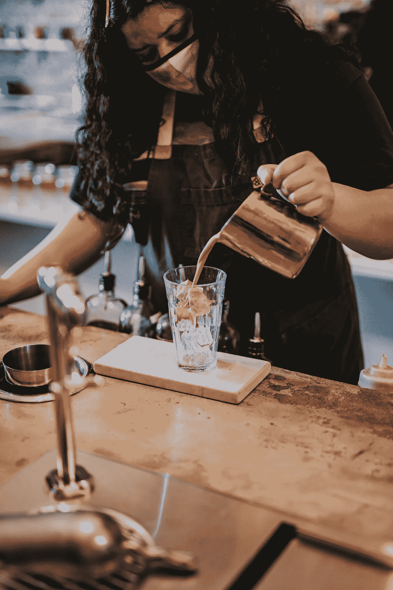

# 冠状病毒时代的小费

> 原文：<https://medium.datadriveninvestor.com/tipping-in-the-times-of-coronavirus-f6cf9c2266b4?source=collection_archive---------27----------------------->

为了支持陷入困境的餐饮业，社交媒体上出现了“小费挑战”。

Photo by Andrew ‘“Donavan” Valdvia on Unsplash

我不知道谁会读这篇文章，也不知道谁会读你关于如何对待你的人类同胞的哲学，或者你在金钱问题上的复杂程度。你可能是亿万富翁、百万富翁、千人富翁，或者有一大堆学生贷款要还的人。如果你是这个世界上的一个人，你一生中至少会有一次关于小费的问题。问 100 个人多少钱，多少钱，给谁——你会得到 100 个答案。

你可以购买这方面的书籍，当然也可以求助于谷歌。你会从各种渠道得到同样多样的建议。

你的问题是:如何调整你的小费习惯，以反映今天许多人正在经历的艰难时期？在这个冠状病毒肆虐的时代，以小费为经济引擎的酒店业尤其受到重创。

让我们试着定义这个问题。根据 Dictionary.com 的说法，小费这个词的定义是:直接给提供服务或做粗活的人的一小笔钱；小费。

在 Julie Vadnal 为《Real Simple》杂志和美国退休人员协会撰写的一篇文章的帮助下，我编制了以下可能有所帮助的列表:

你在餐馆的服务员:优质服务仍要给 15%——优质服务要给 20%。*在《吃货》杂志进行的一项民意调查中，40%的受访者不知道通常给服务员的小费是 15-20%*

在酒吧:一杯啤酒 1 美元，一杯鸡尾酒 2 美元。

出租车:15%到 20%

优步或 Lyft:每次至少 2.00 美元

酒店客房服务:每天 2 美元或 3 美元。每天提示，以考虑到工作人员的变化

美甲和美发沙龙:15%

衣帽间:每件外套 1.00 美元，每个大包 2.00 美元

送餐 app: 15%到 20%——给送餐员 2 美元到 3 美元。

邮政工作人员:根据法律规定，他们不能接受现金，但可以接受价值低于 20 美元的“礼物”。

家庭保健工作者:如果独立，没有限制，但检查，许多机构雇用不允许任何形式的小费。

如果可能的话，最好直接给为你提供服务的人现金小费

冠状病毒爆发后，许多以前雇佣了大量员工的企业都关门了。有一份新的开业企业名单。颠覆议程正在被改写。

为了支持陷入困境的餐饮业，社交媒体上出现了“小费挑战”。最具挑战性的部分是在你的餐馆账单上给服务员留下 100%的小费。考虑到大多数机构被迫遵守的社交距离限制，这是一个令人深思和赞赏的惊喜。

我听说许多接受“挑战”的人都在酒店行业。

同理心？

我对大多数人类同胞在这场危机中的慷慨大方感到惊讶和欣慰。

作为一个国家，我们展示了自己的伟大和慷慨。