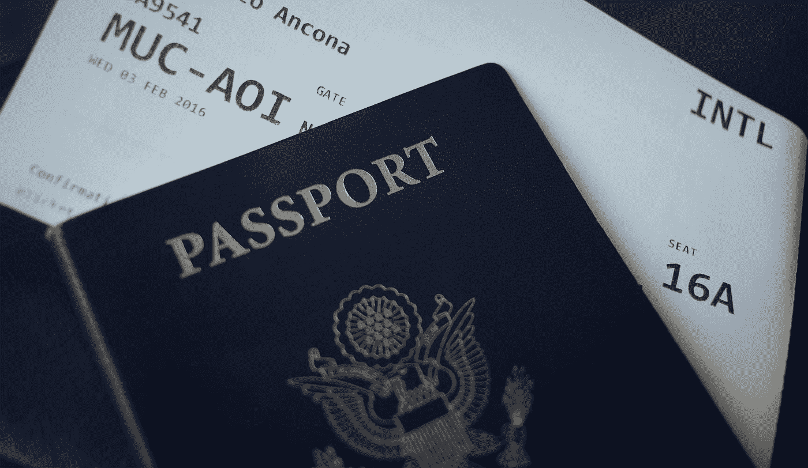
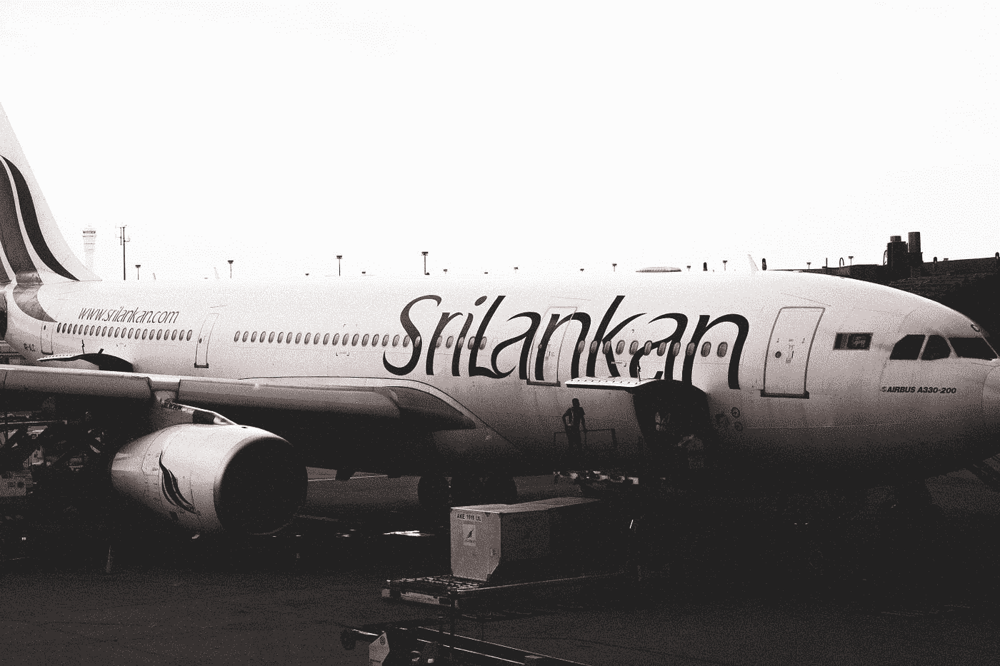
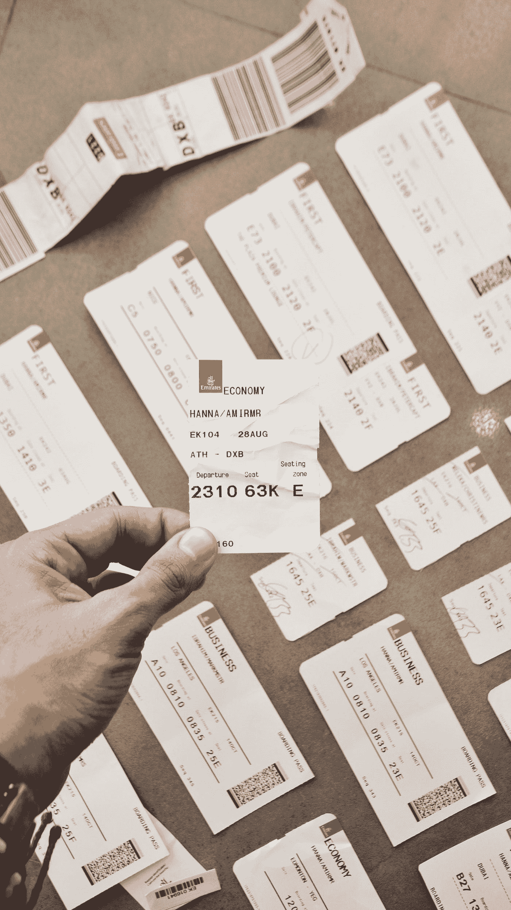

# 获得廉价机票的技巧和诀窍

> 原文：<https://medium.datadriveninvestor.com/tips-and-tricks-to-get-cheap-flight-tickets-c6be60318db?source=collection_archive---------8----------------------->

Photo by [Nicole Geri](https://unsplash.com/@nicolegeri?utm_source=medium&utm_medium=referral) on [Unsplash](https://unsplash.com?utm_source=medium&utm_medium=referral)

如今，人们对机票感到如此紧张和烦恼。即使他们想去旅行，他们也只是计划取消，因为机票太贵了。最重要的是，新冠肺炎改变了航空经济的整个礼仪。

航空公司遭受了巨大的损失，因为所有国家都因病毒而处于完全封锁状态。几个月后，封锁被解除，人们被允许使用空气作为旅行的媒介。航空公司的价格飞涨。所以，如果你想预订便宜的机票去旅行。这篇文章会给你很大帮助:

**文章亮点**

1.为什么机票一直很贵？

2.如何预订廉价机票的惊人技巧？

3.如何预订廉价航班的技巧

4.所解释的方法完全合法且易于使用。

5.了解一些提供廉价机票的不可思议的网站

**为什么航空公司价格普遍贵？**

Photo by [Ken Yam](https://unsplash.com/@starocker?utm_source=medium&utm_medium=referral) on [Unsplash](https://unsplash.com?utm_source=medium&utm_medium=referral)

嗯，说实话，是因为驱动飞机的燃料。你可以看到飞机内部的涡轮需要一种特殊的燃料来旋转，这种燃料被称为飞机涡轮燃料。这些燃料很贵。此外，每次飞行后，飞机的轮胎需要更换。 ***所以燃料+燃料的进口成本+新轮胎*** 之后e *非常 fligh* t 使得价格昂贵

> **获得廉价机票的技巧**

1.  不断的探索和灵活性

Photo by [Benjamin Dada](https://unsplash.com/@dadaben_?utm_source=medium&utm_medium=referral) on [Unsplash](https://unsplash.com?utm_source=medium&utm_medium=referral)

如果你不断正确地寻找，没有什么是你找不到的。当你在网上敏锐地搜索时，你会遇到一些提供预订廉价机票的网站。为了买到便宜的机票，不要马上开始投资。

相反，好好看看网站，看看网站是否是欺诈性的。有许多人设法得到便宜的机票，因为他们有灵活的旅行计划。表明他们不会很快预订飞往某个目的地的航班。取而代之的是，他们会查看整个日历，查看哪几个月的机票价格较低，然后据此决定目的地。

**2。选择当地航空公司**

Photo by [Shavin Peiries](https://unsplash.com/@shavin47?utm_source=medium&utm_medium=referral) on [Unsplash](https://unsplash.com?utm_source=medium&utm_medium=referral)

当你决定去一个目的地时，通过当地的航空公司，你会惊讶地看到与国际航空公司的航班票价差异。在当地航空公司买到便宜的机票是可能的。所以在去一个目的地旅行之前，先看看当地航空公司的票价。

**3。使用隐姓埋名模式**

Photo by [Ilya Pavlov](https://unsplash.com/@ilyapavlov?utm_source=medium&utm_medium=referral) on [Unsplash](https://unsplash.com?utm_source=medium&utm_medium=referral)

这个我亲身经历过。有几次看到一百块钱的机票。几分钟后，当我再次访问该网站时，我看到航班价格已经上涨，现在是 200 美元。

这是因为网站上有 cookies。所以，IT 专业人士建议你在匿名模式下使用网站。使用这种模式，cookies 不会影响航班价格，您可以获得实惠的航班价格。

**4。货币和提醒**

Photo by [Pepi Stojanovski](https://unsplash.com/@timbatec?utm_source=medium&utm_medium=referral) on [Unsplash](https://unsplash.com?utm_source=medium&utm_medium=referral)

网站显示不同货币的不同价格。假设一个人想从美国旅行到斯里兰卡，机票价格显示为 1200 美元。当同一个人用印度卢比兑换货币并支付机票时，机票价格显示为 40000 卢比。如果我们将 1200 印度卢比兑换成 90k。所以，你可以看到价格差异。

所以，通过兑换货币支付机票可以获得便宜的机票**。**如果您想预订**的廉价机票，请前往提醒提醒。**这些提醒会让你知道哪些航空公司正在以可承受的价格提供机票。

> **招数**

U **se 电话比较**:如果你是认真的想得到便宜的机票**，**那就通过几个网站比较一下航班票价再决定。

利用夜晚:这是一个已经被证实的事实，如果你在凌晨 12 点以后订机票。航班价格很低。所以，如果你是一个夜猫子，这一招会帮到你很多。

利用航空积分:如果你是一名常客，那么你一定知道那些添加到你个人资料中的航空积分。确保您在这些航空点预订廉价机票。

想象一个场景，一个男人需要从他的家乡飞往伦敦。如果这个人乘坐直达航班，票价会很高。相反，如果这个人乘飞机去阿姆斯特丹，然后去伦敦。价格会相当便宜。所以，转机会有很大帮助。

**底线**

Photo by [Amir Hanna](https://unsplash.com/@amirhanna?utm_source=medium&utm_medium=referral) on [Unsplash](https://unsplash.com?utm_source=medium&utm_medium=referral)

上面提到的提示和技巧将帮助你获得便宜的机票，并从知名网站预订便宜的机票。市场上一些最好的机票预订网站有[**【维基百科】**](https://wikibuy.com/instant?utm_source=Dolphin&utm_campaign=104788407768&utm_term=426189719404&gclid=CjwKCAjw_-D3BRBIEiwAjVMy7NS7knJjYMA4HmCHLsRYYQ2rxfR__wGJ7HnE1s8c5yljjro2VCDu5xoCXGUQAvD_BwE)**[**just fly**](https://www.justfly.com/cheap-flights-2/?campaign=166&adgroupid=37823100239&rc=&dc=&gclid=CjwKCAjw_-D3BRBIEiwAjVMy7MSYB6nvXGNc64Nr-dpqnRcLTPSwLHNee6nVBLE1ZALnIYyTLIy85xoCz_oQAvD_BwE)**和**[**Travelocity**](https://www.travelocity.com/)。******