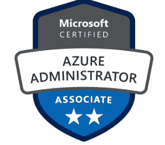

# 微软 Azure 管理认证(AZ-104)

> 原文：<https://medium.datadriveninvestor.com/tips-for-az-104-microsoft-azure-administration-certification-9689c5925cc8?source=collection_archive---------3----------------------->

最近微软对 Azure 认证做了很少的改动。之前你需要通过 2 门考试 Az-100 和 AZ-101 才能成为 Azure 认证管理员。微软将这两种技能结合到一个考试中，即 AZ-103。

AZ-104 是 AZ-103 的新版本。这将测试候选人在实施、管理和监控组织的 Microsoft Azure 环境方面的知识。

**考试几乎涵盖了 Azure 管理员的所有职责:**

1.  实施、管理和监控身份、治理、存储、计算和虚拟网络
2.  资源的供应、规模、监控和调整
3.  对核心 Azure 服务、Azure 工作负载、安全性和治理有深刻的理解。
4.  PowerShell、Azure CLI、Azure 门户和 ARM 模板
5.  请注意，他们将在真实环境中测试您并完成任务，因此，请花时间使用门户并进行设置。
6.  许多基于大场景的截图和实用的东西(似乎是从 AWS Solution Arch-Professional 获得的灵感)
7.  我在加密和安全中心没有找到太多
8.  网络应用和应用计划到处都是。
9.  您可能会被要求创建站点到站点的混合环境，以及 Azure 迁移以进行评估。

我的建议是确保在 Azure 中，首先关注基础。了解 OSI 级别的实际工作方式，然后建立供应商特定的知识。(这没有捷径，但从长远来看，它会给你带来回报)。

> **对我来说，在多云供应商认证方面行之有效的方法是按系统顺序了解产品:IAM &安全>网络>高级硬件，如 LB、DNS >计算 IaaS >计算 PaaS >存储**

# 资源:

1.  最近考试更新，请务必查看此[链接](https://docs.microsoft.com/en-us/learn/certifications/exams/az-104)
2.  在[门户](https://portal.azure.com/)上花费 25%的准备时间
3.  如果你能负担得起，[官方实践测试](https://eu1.mindhub.com/az-104-microsoft-azure-administrator-microsoft-official-practice-test/p/MU-AZ-104?utm_source=microsoft&utm_medium=certpage&utm_campaign=msofficialpractice)肯定有帮助。
4.  免费资源可用[此处](https://docs.microsoft.com/en-us/learn/browse/?roles=administrator&products=azure&resource_type=learning%20path)
5.  以下播放列表

我祝愿你的职业生涯和成功的 Azure 之旅。

你可以在这个[链接](https://medium.com/@satyenkumar/it-cloud-certification-is-greed-the-1-of-the-7-deadly-sins-f50366643138?source=friends_link&sk=6a6816734ca57831b9119e5254885ec5)上找到我的认证列表

# 不要忘记给予👏

