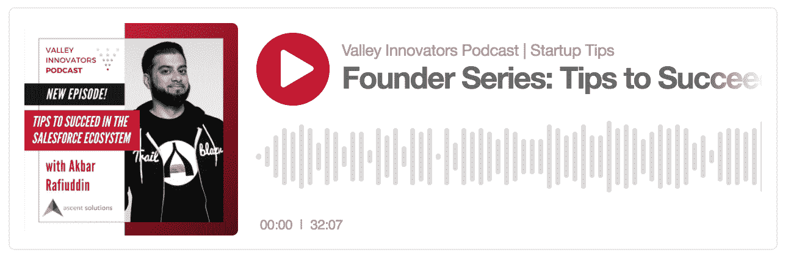
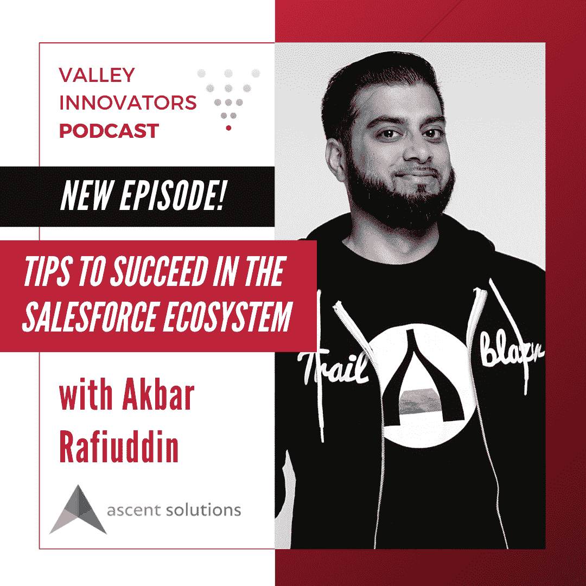

# 在 Salesforce 生态系统中取得成功的技巧:创始人系列

> 原文：<https://medium.datadriveninvestor.com/tips-to-succeed-in-the-salesforce-ecosystem-founder-series-52ae9da6ac95?source=collection_archive---------22----------------------->

对于不知道的读者来说， [Valley Innovators](https://www.valleyinnovators.com/) 为更多的创始人/初创公司提供了成功的工具。我们特别关注加州中央谷的创业场景，这需要促进当地经济(就业、工资、利用本土人才等)。)但是我们的目标是帮助所有的创业者，不管你在哪里。

Listen Here: [https://www.valleyinnovators.com/podcast-episodes/episode/4c7a38bd/founder-series-tips-to-succeed-in-the-salesforce-ecosystem](https://www.valleyinnovators.com/podcast-episodes/episode/4c7a38bd/founder-series-tips-to-succeed-in-the-salesforce-ecosystem)

今年，我们改变了模式，提供更多在线工具和内容来帮助创始人取得成功。为了我们的播客,我采访了更多的创始人[,努力分享经验教训和最佳实践，避免在创业之旅中遇到大问题。](https://www.valleyinnovators.com/podcast-episodes)

 [## 将统治生态系统的 8 大移动商务趋势|数据驱动的投资者

### 你认为 Zara、Depop 和 Lush 有什么共同点？不要给自己太多压力。很简单。所有三个和一个…

www.datadriveninvestor.com](https://www.datadriveninvestor.com/2020/03/05/8-mobile-commerce-trends-that-will-rule-the-ecosystem/) 

我很高兴与[分享这个关于在 Salesforce 生态系统中取得成功的最新播客](https://www.valleyinnovators.com/podcast-episodes/episode/4c7a38bd/founder-series-tips-to-succeed-in-the-salesforce-ecosystem)。Salesforce 创建了一个庞大、强大的技术相关公司和工作社区，为企业家、CRM 管理员、实施合作伙伴(如系统集成商)和许多其他重要的高薪工作提供了坚实的道路，正如您可以从本文中看到的[。](https://www.salesforceben.com/salesforce-admin-average-salary-guide/)今年工资涨得更多，你可以在[最近的这篇文章](https://www.businessinsider.com/how-to-get-hired-salesforce-admin-developer-experts-salaries-2020-10)中看到(注:工资门控内容)。

Ascent Solutions Co-Founder & COO Akbar Rafiuddin

如果你对了解在 Salesforce 生态系统中建立一家初创公司的好处有一点兴趣，请听听我与 Ascent Solutions 的联合创始人首席运营官的最新播客。Ascent Solutions 是 Salesforce ISV 合作伙伴，拥有十多年构建应用和解决方案的经验，为 Salesforce 扩展了后台、库存和订单管理的价值。

在 pod 上，Akbar 分享了关于如何在 Salesforce 生态系统中成为一名成功的新创始人的实用技巧、陷阱和经验教训。在[https://ascenterp.com/](https://ascenterp.com/)了解更多关于 Akbar 和 Ascent Solutions 的信息。

如果你是一个有着有趣故事的创始人或有抱负的创始人，我想听听你的看法！在 [LinkedIn](https://www.linkedin.com/in/brandonclopez/) 或 [Twitter](https://twitter.com/Brandon_Lopez) 上与我联系，我们一起聊天。

## 获得专家观点— [订阅 DDI 英特尔](https://datadriveninvestor.com/ddi-intel)