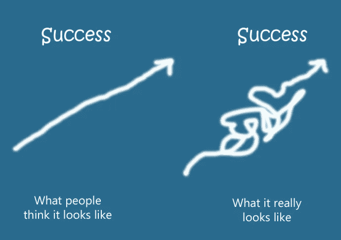
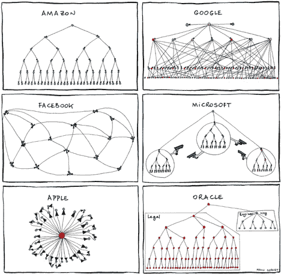
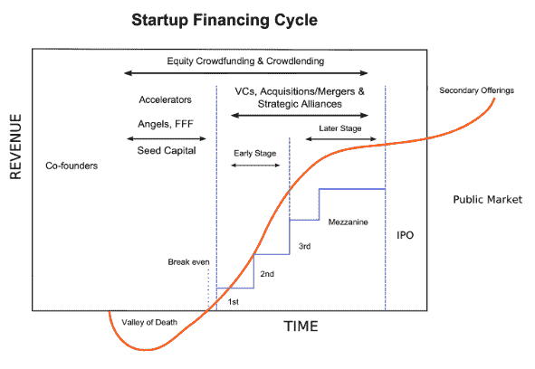
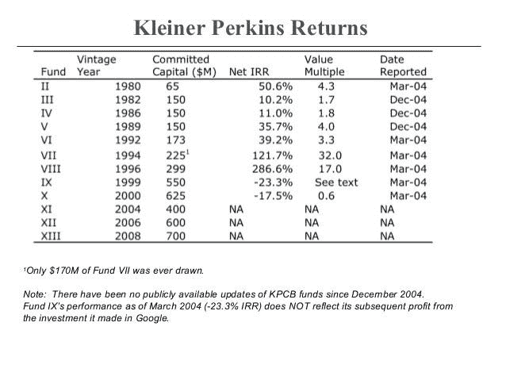
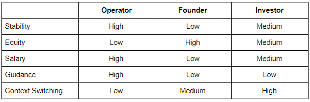

# 生存还是毁灭:经营者 Vs 创始人 Vs 投资人？

> 原文：<https://medium.datadriveninvestor.com/to-be-or-not-to-be-operator-vs-founder-vs-investor-b0a14b4f37e7?source=collection_archive---------2----------------------->

作为一名从经营者转型为创始人、再转型为投资者的人，我经常被问到这两者的利弊。我经常用一个体育类比来回应——这并不相互排斥，但是你喜欢当球员、得分手还是教练？因为在一场比赛中你需要他们所有人。虽然概括几乎是不可能的，但这篇文章专注于提供一个框架，特别是为科技行业和那些考虑转行的人。在硅谷这样的不稳定环境中，做出选择是很常见的，事实上，一些最成功的企业家首先在一个或两个职业领域都有丰富的经验。说到“企业家”这个词，就本文的目的而言，它是“创始人”的同义词，“投资者”是“风险资本家”，而不是天使投资者等其他类型。

**1)操作员**

*   稳定性——作为一家大公司的经营者，你应该最大限度地保持稳定性，也就是说，你明天将继续拥有一份工作。如果你有疑问，那么一定要寻找选择。
*   股权——除非你是一名早期雇员或者在公司高层，否则你的股权很可能很低。
*   工资——最大化薪酬的方式通常是通过工资，如果不是这样，那么考虑使用其他手段，包括奖金和福利。
*   指导——一个企业框架几乎从定义上提供了大量的指导。诚然，具体的框架可能会非常不同，正如下面对公司结构的拙劣模仿所示。
*   背景转换——你的公司越大，你可能就越专注，即更少的背景转换，更多的是深度而不是广度。

**2)创始人**

*   稳定——什么稳定？下面的创业融资周期提供了一个观察过山车的窗口。
*   公平——是的，这就是你最大化的东西。开始冒险是延迟满足的终极练习。
*   薪水——众所周知，创始人在早期阶段会放弃薪水，尤其是在获得第一笔机构投资之前。一个很好的经验法则是，你在初创公司的总工资是你做运营的一半。
*   指导——你当然可以从其他初创公司、你的投资者+顾问+董事会成员那里寻求指导，但初创公司本质上是无组织的。
*   背景转换——很明显，每天都有背景转换，但最终所有活动都聚焦于公司的成功。

**3)投资方**

*   稳定性——作为一名风险投资人，你要将风险分散到多个赌注上，但要记住幂定律，即只有少数非常成功的创业公司才能推动回报。一家公司的声誉是一个自我实现的预言是一个神话，下表举例说明了同一家公司随着时间的推移表现不均衡的规范。
*   股权——风投将在种子期、A 期和 B 期各占 20 %- 30 %,在后续轮次中占 10 %- 15%。规模较小的风投会寻找一种方式，通过确保按比例甚至超按比例的权利来实现股权最大化，规模较大的风投会通过大量现金和高估值来强行通过。
*   薪酬——风险投资公司本身就是权力法则，即最顶尖的公司获得不成比例的薪酬。因此，相对于整个科技行业的薪酬而言，平均值、中值和众数实际上是相当清醒的。
*   指导——和做创始人一样，很低。
*   上下文切换—非常非常高。作为一名风险投资人，你在广度上得到优化，因此不断学习+遗忘，无论是识别好公司还是有意义地帮助他们。

总结下面的讨论——显然所有规则都有例外，这是我的经验形成的观点，也是我们 Tau Ventures 的观点:

*原载于* [*数据驱动投资人*](https://www.datadriveninvestor.com/2020/08/02/to-be-or-not-to-be-operator-vs-founder-vs-investor) *，“我很乐意在其他平台上辛迪加。我是*[*Tau Ventures*](https://www.linkedin.com/pulse/announcing-tau-ventures-amit-garg/)*的管理合伙人和联合创始人，在硅谷工作了 20 年，涉足企业、创业公司和风险投资基金。这些都是专注于实践见解的有目的的短文(我称之为 GL；dr —良好的长度；确实读过)。我的许多文章都在*[*https://www . LinkedIn . com/in/am garg/detail/recent-activity/posts*](https://www.linkedin.com/in/amgarg/detail/recent-activity/posts/)*上，如果它们能让人们对某个话题产生足够的兴趣，从而进行更深入的探讨，我会感到非常兴奋。如果这篇文章有对你有用的见解，请对这篇文章和 Tau Ventures 的 LinkedIn 页面***发表评论和/或给予赞，感谢你对我们工作的支持。这里表达的所有观点都是我自己的。**